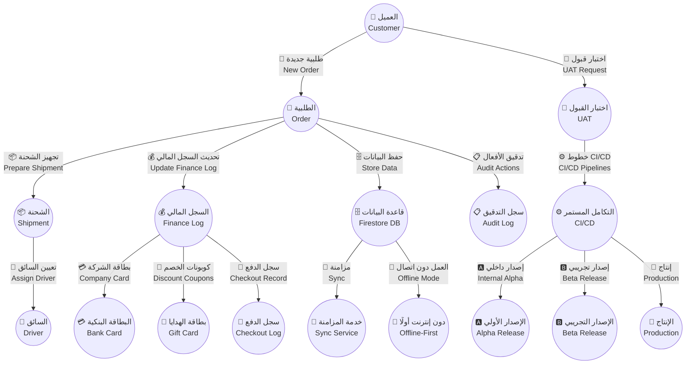
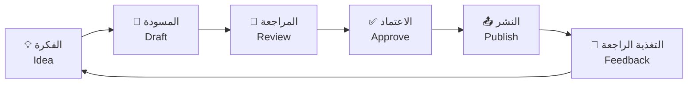

# 📚 توثيق CA Admin DmG

CA Admin DmG Documentation

| الرمز Icon | البيان Details              | المعلومات Information |
| ------------- | ------------------------------ | ------------------------ |
| 🧾            | المؤسسة Organization        | CA Admin DmG             |
| 🧑‍💼            | مالك الوثيقة Document Owner | Abdullah Alshaif         |
| 🏷️            | الإصدار Version             | v0.1                     |
| 📅            | آخر تحديث Last Updated      | 2025-09-08               |

الملخص التنفيذي: ينظم هذا المستودع رؤية CA Admin، حالات الاستخدام، النماذج، الاختبارات، والإطلاق لضمان وضوح العمل بين الفرق.
Executive summary: This repository aligns CA Admin’s vision, use cases, models, testing, and release to keep teams coordinated.

---

## 🌟 عن المشروع

About The Project

- نظام متكامل لإدارة العملاء، الطلبات، الشحن، والمالية في الوساطة عبر الإنترنت.
  Integrated platform covering customers, orders, shipping, and finance for online mediation.
- يعزز تجربة المستخدم، يقلل الأخطاء التشغيلية، ويرفع شفافية المعاملات.
  Improves user experience, reduces operational mistakes, and increases transaction transparency.
- يخدم أصحاب المصلحة، المطورين، محللي الأعمال، وفرق DevOps.
  Serves stakeholders, developers, business analysts, and DevOps teams.

---

## 🗺️ نظرة بصرية شاملة

System Visual Overview

- يربط المخطط بين البيانات، الاختبار، والإطلاق لمنح رؤية متكاملة للتدفقات.
  The diagram links data, testing, and release to provide an integrated flow view.
- يساعد المحلل والمطور على تحديد نقاط الاعتماد والتفاعل بسرعة.
  Helps analysts and developers quickly spot dependencies and touchpoints.

---

## 🧭 خريطة التوثيق

Documentation Roadmap

| المجلد Folder       | المحتوى التفصيلي Detailed Content                     | الملاحظات المختصرة Concise Notes |
| ---------------------- | -------------------------------------------------------- | ----------------------------------- |
| 01-vision              | الرؤية والأهداف Vision and objectives                 | Vision & Goals                      |
| 02-stakeholders        | أصحاب المصلحة والأدوار Stakeholder roles              | Stakeholders                        |
| 03-stories             | قصص المستخدم وسيناريوهات القيمة User value stories    | User Stories                        |
| 04-use-cases           | حالات الاستخدام وأولويات العمل Operational priorities | Use Cases                           |
| 05-data-model          | نماذج البيانات وكياناتها Data entities                | Data Models                         |
| 06-architecture        | العمارة التقنية والطبقات Technical layering           | Architecture                        |
| 07-process-flows       | تدفقات العمليات والرسومات Process diagrams            | Process Flows                       |
| 08-security-and-roles  | الأمان والصلاحيات Security policies                   | Security & Roles                    |
| 09-indexes-and-queries | الفهارس والاستعلامات Performance queries              | Indexes & Queries                   |
| 10-nfr-and-quality     | المتطلبات غير الوظيفية والجودة Quality metrics        | NFR & Quality                       |
| 11-test-plan           | خطة الاختبار وتغطية السيناريوهات Testing roadmaps     | Test Plan                           |
| 12-release-and-devops  | الإطلاق وعمليات DevOps Delivery pipelines             | Release & DevOps                    |
| 99-glossary            | القاموس وتوحيد المصطلحات Terminology alignment        | Glossary                            |

> استخدم الخريطة لتحديد الملف المناسب والتأكد من اكتمال الروابط المتقاطعة.
> Use this map to locate the right file and verify cross-links are in place.

---

## 🔗 روابط سريعة

Quick Links

- خطة الاختبار الرئيسية في docs/11-test-plan/11-test-plan.md.
  Primary test plan in docs/11-test-plan/11-test-plan.md.
- خطة الإطلاق وعمليات DevOps في docs/12-release-and-devops/12-release-and-devops.md.
  Release & DevOps handbook in docs/12-release-and-devops/12-release-and-devops.md.
- معايير الجودة والمتطلبات غير الوظيفية في docs/10-nfr-and-quality/10-nfr-and-quality.md.
  Quality and NFR standards in docs/10-nfr-and-quality/10-nfr-and-quality.md.
- القاموس الموحد للمصطلحات في docs/99-glossary/99-glossary.md.
  Central terminology glossary in docs/99-glossary/99-glossary.md.
- حالات الاستخدام التفصيلية في docs/04-use-cases/04-use-cases.md.
  Detailed use cases in docs/04-use-cases/04-use-cases.md.

---

## 🔄 دورة حياة التوثيق

Documentation Lifecycle

- اتبع الدورة لضمان تحديث المستندات باستمرار.
  Follow the loop to keep documents continually updated.
- مشاركة المراجعة مع أصحاب المصلحة تقلل من إعادة العمل.
  Sharing reviews with stakeholders reduces rework.

---

## 🤝 كيفية المساهمة

How To Contribute

- راجع الملف المرتبط قبل التعديل لضمان فهم السياق.
  Review the relevant file before editing to keep context.
- استخدم الصياغة الثنائية مع الأيقونات الملائمة لكل نقطة.
  Apply bilingual phrasing and fitting icons for each point.
- تحقق من صحة مخططات Mermaid عبر Mermaid Live Editor.
  Validate Mermaid diagrams using the Mermaid Live Editor.
- افتح Pull Request موثقًا سبب التعديل والملفات المتأثرة.
  Open a Pull Request describing why the change matters and which files are affected.
- انتظر موافقة مالك الوثيقة قبل الدمج النهائي.
  Wait for the document owner’s approval before merging.

---

## 🛠️ أدوات مساعدة

Helper Tools

| الأداة Tool      | الغرض الأول Primary Purpose | الغرض التكميلي Complementary Purpose |
| ------------------- | ------------------------------ | --------------------------------------- |
| Mermaid Live Editor | معاينة وتعديل رسومات Mermaid   | Preview and adjust Mermaid diagrams     |
| Draw.io             | إنشاء مخططات تفصيلية خارجية    | Build richer external visuals           |
| Markdown Guide      | مرجع قواعد Markdown            | Markdown rules reference                |

---

## ❓ الأسئلة الشائعة

Frequently Asked Questions

### س: هل يمكنني تعديل أي جزء من التوثيق؟

Q: Can I edit any part of the documentation?

- نعم، جميع أعضاء الفريق مرحب بهم بالمساهمة بشرط توثيق التغيير.
  Yes, every team member may contribute as long as changes are documented.

### س: ما أفضل طريقة لإضافة الرسومات؟

Q: What is the best way to add diagrams?

- استخدم Mermaid للرسومات السريعة وDraw.io للمخططات المعقدة.
  Use Mermaid for quick visuals and Draw.io for complex diagrams.

### س: كيف أضمن توحيد المصطلحات؟

Q: How do I ensure consistent terminology?

- راجع القاموس في docs/99-glossary/99-glossary.md قبل الكتابة أو التحديث.
  Check the glossary at docs/99-glossary/99-glossary.md before writing or updating content.

---

## 📝 أفضل ممارسات التوثيق

Documentation Best Practices

- استخدم لغة واضحة ومباشرة باللغتين في كل فقرة.
  Write clearly and directly in both languages for each paragraph.
- حدّث التوثيق مع كل تغيير في النظام أو المتطلبات.
  Update documentation whenever systems or requirements change.
- راجع الروابط والمخططات دوريًا لضمان صلاحيتها.
  Review links and diagrams regularly for accuracy.
- التزم بالهيكل الموحد للأقسام المعتمدة في المستودع.
  Adhere to the unified structure used across the repository.
- أضف أمثلة عملية أو سيناريوهات حين يفيد ذلك الفهم.
  Add practical examples or scenarios when they aid understanding.

---

## 📜 الترخيص

License

- حاليًا للاستخدام الداخلي فقط بدون رخصة عمومية.
  Currently internal use only with no public license.

---
