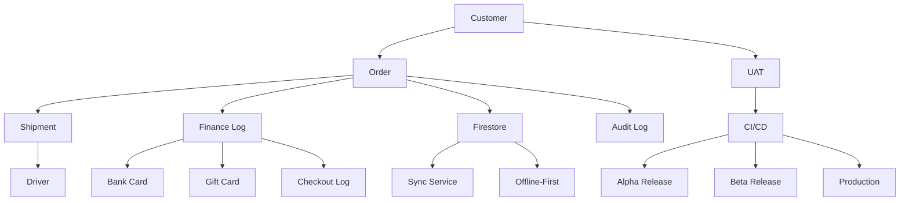

# 📚 CA Admin Documentation DmG


---

## 📖 About the Project / عن المشروع

**EN:**
CA Admin is a modern, integrated system for managing customers, orders, shipments, and financial operations for online purchasing intermediaries. This documentation provides a comprehensive, bilingual (EN/AR) reference for all stakeholders, developers, and analysts.

**AR:**
CA Admin هو نظام متكامل وحديث لإدارة العملاء والطلبات والشحن والعمليات المالية لمشاريع الوساطة في الشراء عبر الإنترنت. هذا التوثيق يوفر مرجعًا شاملاً ثنائي اللغة (عربي/إنجليزي) لكل من أصحاب المصلحة والمطورين والمحللين.

---

## 🗺️ Visual Overview / نظرة بصرية سريعة



---

## 📂 Documentation Structure / هيكل التوثيق

```text
docs/
 01-vision/
 02-stakeholders/
 03-stories/
 04-use-cases/
 05-data-model/
 06-architecture/
 07-process-flows/
 08-security-and-roles/
 09-indexes-and-queries/
 10-nfr-and-quality/
 11-test-plan/
 12-release-and-devops/
 99-glossary/
README.md
```

## ⚡ Quick Start / البداية السريعة

1. [Vision / الرؤية](/docs/01-vision/01-vision.md)
2. [Stakeholders / أصحاب المصلحة](/docs/02-stakeholders/02-stakeholders.md)
3. [User Stories / قصص المستخدم](/docs/03-stories/03-stories.md)
4. [Use Cases / حالات الاستخدام](/docs/04-use-cases/04-use-cases.md)
5. [Data Model (ERD & Firestore Schema) / نموذج البيانات](/docs/05-data-model/05-data-model.md)
6. [Architecture & ADRs / العمارة وقرارات التصميم](/docs/06-architecture/06-architecture.md)
7. [Process Flows (BPMN & DFD) / تدفقات العمليات](/docs/07-process-flows/07-process-flows.md)
8. [Security & Roles (RBAC + Rules) / الأمان والأدوار](/docs/08-security-and-roles/08-security-and-roles.md)
9. [Indexes & Queries (Firestore) / الفهارس والاستعلامات](/docs/09-indexes-and-queries/09-indexes-and-queries.md)
10. [Non-Functional Requirements & Quality (ISO/IEC 25010) / المتطلبات غير الوظيفية والجودة](/docs/10-nfr-and-quality/10-nfr-and-quality.md)
11. [Test Plan & Environments / خطة الاختبار والبيئات](/docs/11-test-plan/11-test-plan.md)
12. [Release & DevOps (CI/CD & App Distribution) / خطة الإطلاق و DevOps](/docs/12-release-and-devops/12-release-and-devops.md)
13. [Glossary / القاموس](/docs/99-glossary/99-glossary.md)

---

**EN:**

1. Start with the [Vision](docs/01-vision/01-vision.md) and follow the documentation order.
2. Use and update diagrams with **Mermaid** in Markdown, or **Draw.io** for external diagrams.
3. Treat this as **living documentation**: update as requirements and architecture evolve.

**AR:**

1. ابدأ من [الرؤية](docs/01-vision/01-vision.md) واتبع ترتيب التوثيق.
2. استخدم أو حدّث الرسومات باستخدام **Mermaid** أو **Draw.io**.
3. اعتبر هذا المستودع **توثيقًا حيًا** يتم تحديثه باستمرار مع تغيّر المتطلبات أو التصميم.

---

## 🛠️ Contribution & Workflow / المساهمة وسير العمل

**EN:**

- All team members are encouraged to contribute improvements and keep documentation up to date.
- Use clear commit messages and reference the section or file being updated.
- Review the [Glossary](docs/99-glossary/99-glossary.md) for consistent terminology.

**AR:**

- يُشجَّع جميع أعضاء الفريق على المساهمة في تحسين التوثيق وتحديثه باستمرار.
- استخدم رسائل التزام واضحة وحدد القسم أو الملف الذي تم تحديثه.
- راجع [القاموس](docs/99-glossary/99-glossary.md) لتوحيد المصطلحات.

---

## 📚 Resources & Tools / مصادر وأدوات مفيدة

- [Mermaid Live Editor](https://mermaid-js.github.io/mermaid-live-editor/) — رسم المخططات مباشرة وتصديرها إلى Markdown.
- [Draw.io (diagrams.net)](https://app.diagrams.net/) — لرسم المخططات الخارجية.
- [Markdown Guide](https://www.markdownguide.org/) — مرجع تنسيقات Markdown.

---

## ❓ FAQ / الأسئلة الشائعة

### Q: هل يمكنني إضافة أو تعديل أي جزء من التوثيق؟

**نعم!** التوثيق مفتوح لجميع أعضاء الفريق للمساهمة والتحسين.

### Q: ما هي أفضل طريقة لإضافة الرسومات؟

يفضل استخدام Mermaid داخل ملفات Markdown أو Draw.io للرسومات المعقدة.

### Q: كيف أضمن توحيد المصطلحات؟

راجع دائمًا [القاموس](/docs/99-glossary/99-glossary.md) قبل كتابة أو تحديث أي مستند.

---

## 📝 Documentation Best Practices / أفضل ممارسات التوثيق

1. استخدم لغة واضحة ومباشرة (بالعربية والإنجليزية).
2. حدّث التوثيق مع كل تغيير في النظام أو المتطلبات.
3. راجع المخططات والروابط بشكل دوري.
4. التزم بهيكل التوثيق الموحد.
5. أضف أمثلة عملية أو سيناريوهات عند الحاجة.

---

## 📜 License / الرخصة

- **Current:** Private use only (no license).
- **حاليًا:** للاستخدام الخاص فقط (بدون رخصة).

---
