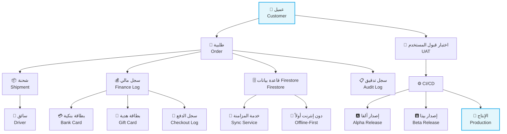

# 📚 توثيق CA Admin DmG


---

## 📖 عن المشروع

CA Admin هو نظام متكامل وحديث لإدارة العملاء والطلبات والشحن والعمليات المالية لمشاريع الوساطة في الشراء عبر الإنترنت. هذا التوثيق يوفر مرجعًا شاملاً ثنائي اللغة لكل من أصحاب المصلحة والمطورين والمحللين.
**شرح مختصر:** يسهل المشروع إدارة عمليات الوساطة التجارية، ويعزز تجربة المستخدم، ويضمن الشفافية المالية.

CA Admin is a modern, integrated system for managing customers, orders, shipments, and financial operations for online purchasing intermediaries. This documentation provides a comprehensive, bilingual reference for all stakeholders, developers, and analysts.
**Summary:** The project facilitates commercial mediation management, enhances user experience, and ensures financial transparency.

---

## 🗺️ نظرة بصرية سريعة

المخطط التالي يوضح تدفق البيانات بين مكونات النظام الرئيسية، من العميل حتى الإطلاق، مع إبراز نقاط التكامل والاختبار.
**شرح مختصر:** يوضح المخطط كيف تتكامل مكونات النظام من العميل حتى الإطلاق، مع إبراز نقاط المزامنة والاختبار.

The following diagram shows the data flow between main system components, from customer to release, highlighting integration and testing points.
**Summary:** The diagram shows how system components integrate from customer to release, highlighting sync and testing points.



---

## 🗂️ هيكل التوثيق

يوضح الجدول التالي هيكل مجلدات التوثيق، حيث يحتوي كل مجلد على ملفات تفصيلية لكل مرحلة من مراحل المشروع.
**شرح مختصر:** يوضح الهيكل ترتيب الملفات والمجلدات لتسهيل الوصول للمعلومات.

The following table shows the documentation folder structure, with each folder containing detailed files for each project phase.
**Summary:** The structure clarifies file and folder order for easy information access.

| 📁 المجلد              | الوظيفة (شرح مختصر)            | Folder                 | Purpose (Summary) |
| ---------------------- | ------------------------------ | ---------------------- | ----------------- |
| 01-vision              | الرؤية والأهداف                | 01-vision              | Vision & Goals    |
| 02-stakeholders        | أصحاب المصلحة                  | 02-stakeholders        | Stakeholders      |
| 03-stories             | قصص المستخدم                   | 03-stories             | User Stories      |
| 04-use-cases           | حالات الاستخدام                | 04-use-cases           | Use Cases         |
| 05-data-model          | نماذج البيانات                 | 05-data-model          | Data Models       |
| 06-architecture        | العمارة التقنية                | 06-architecture        | Architecture      |
| 07-process-flows       | تدفقات العمليات                | 07-process-flows       | Process Flows     |
| 08-security-and-roles  | الأمان والأدوار                | 08-security-and-roles  | Security & Roles  |
| 09-indexes-and-queries | الفهارس والاستعلامات           | 09-indexes-and-queries | Indexes & Queries |
| 10-nfr-and-quality     | المتطلبات غير الوظيفية والجودة | 10-nfr-and-quality     | NFR & Quality     |
| 11-test-plan           | خطة الاختبار                   | 11-test-plan           | Test Plan         |
| 12-release-and-devops  | الإطلاق و DevOps               | 12-release-and-devops  | Release & DevOps  |
| 99-glossary            | القاموس                        | 99-glossary            | Glossary          |

---

## 💡 نقاط إضافية

- التوثيق يدعم التطوير السريع، ويقلل الأخطاء، ويسهل التواصل بين الفرق.
- كل قسم يحتوي على أمثلة عملية ورسومات توضيحية.
  **شرح مختصر:** يدعم التوثيق التعاون ويقلل الأخطاء ويوضح المفاهيم.

Documentation supports rapid development, reduces errors, and facilitates team communication.
Each section includes practical examples and visual diagrams.
**Summary:** Documentation supports collaboration, reduces errors, and clarifies concepts.

---

## ⚡ البداية السريعة

1. [الرؤية](/docs/01-vision/01-vision.md)
2. [أصحاب المصلحة](/docs/02-stakeholders/02-stakeholders.md)
3. [قصص المستخدم](/docs/03-stories/03-stories.md)
4. [حالات الاستخدام](/docs/04-use-cases/04-use-cases.md)
5. [نموذج البيانات (ERD & Firestore)](/docs/05-data-model/05-data-model.md)
6. [العمارة وقرارات التصميم](/docs/06-architecture/06-architecture.md)
7. [تدفقات العمليات (BPMN & DFD)](/docs/07-process-flows/07-process-flows.md)
8. [الأمان والأدوار (RBAC + قواعد)](/docs/08-security-and-roles/08-security-and-roles.md)
9. [الفهارس والاستعلامات (Firestore)](/docs/09-indexes-and-queries/09-indexes-and-queries.md)
10. [المتطلبات غير الوظيفية والجودة (ISO/IEC 25010)](/docs/10-nfr-and-quality/10-nfr-and-quality.md)
11. [خطة الاختبار والبيئات](/docs/11-test-plan/11-test-plan.md)
12. [خطة الإطلاق و DevOps (CI/CD & توزيع التطبيق)](/docs/12-release-and-devops/12-release-and-devops.md)
13. [القاموس](/docs/99-glossary/99-glossary.md)

**شرح مختصر:** تسلسل الروابط يساعد القارئ على التنقل بين أجزاء التوثيق بسهولة.

The link sequence helps readers navigate documentation sections easily.
**Summary:** The link sequence helps readers navigate documentation sections easily.

---

## 🛠️ المساهمة وسير العمل

- يُشجَّع جميع أعضاء الفريق على المساهمة في تحسين التوثيق وتحديثه باستمرار.
- استخدم رسائل التزام واضحة وحدد القسم أو الملف الذي تم تحديثه.
- راجع [القاموس](/docs/99-glossary/99-glossary.md) لتوحيد المصطلحات.

**شرح مختصر:** يضمن هذا القسم جودة التوثيق وتوحيد المصطلحات بين أعضاء الفريق.

All team members are encouraged to contribute improvements and keep documentation up to date.
Use clear commit messages and reference the section or file being updated.
Review the [Glossary](/docs/99-glossary/99-glossary.md) for consistent terminology.

**Summary:** This section ensures documentation quality and terminology consistency among team members.

---

## 📚 مصادر وأدوات مفيدة

- [Mermaid Live Editor](https://mermaid-js.github.io/mermaid-live-editor/) — رسم المخططات مباشرة وتصديرها إلى Markdown.
- [Draw.io (diagrams.net)](https://app.diagrams.net/) — لرسم المخططات الخارجية.
- [Markdown Guide](https://www.markdownguide.org/) — مرجع تنسيقات Markdown.

**شرح مختصر:** أدوات تساعد في رسم المخططات وتنسيق التوثيق.

Resources & Tools:

- [Mermaid Live Editor](https://mermaid-js.github.io/mermaid-live-editor/) — Draw diagrams directly and export to Markdown.
- [Draw.io (diagrams.net)](https://app.diagrams.net/) — For external diagrams.
- [Markdown Guide](https://www.markdownguide.org/) — Markdown formatting reference.

**Summary:** Tools to help with diagramming and documentation formatting.

---

## ❓ الأسئلة الشائعة

### س: هل يمكنني إضافة أو تعديل أي جزء من التوثيق؟

**نعم!** التوثيق مفتوح لجميع أعضاء الفريق للمساهمة والتحسين.

### س: ما هي أفضل طريقة لإضافة الرسومات؟

يفضل استخدام Mermaid داخل ملفات Markdown أو Draw.io للرسومات المعقدة.

### س: كيف أضمن توحيد المصطلحات؟

راجع دائمًا [القاموس](/docs/99-glossary/99-glossary.md) قبل كتابة أو تحديث أي مستند.

**شرح مختصر:** الأسئلة الشائعة تساعد في توضيح سياسات التوثيق.

FAQ:

### Q: Can I add or edit any part of the documentation?

**Yes!** Documentation is open for all team members to contribute and improve.

### Q: What is the best way to add diagrams?

Prefer using Mermaid inside Markdown files or Draw.io for complex diagrams.

### Q: How do I ensure terminology consistency?

Always review the [Glossary](/docs/99-glossary/99-glossary.md) before writing or updating any document.

**Summary:** FAQ clarifies documentation policies.

---

## 📝 أفضل ممارسات التوثيق

1. استخدم لغة واضحة ومباشرة (بالعربية والإنجليزية).
2. حدّث التوثيق مع كل تغيير في النظام أو المتطلبات.
3. راجع المخططات والروابط بشكل دوري.
4. التزم بهيكل التوثيق الموحد.
5. أضف أمثلة عملية أو سيناريوهات عند الحاجة.

**شرح مختصر:** هذه الممارسات تضمن جودة التوثيق وسهولة استخدامه.

Documentation Best Practices:

1. Use clear and direct language (Arabic and English).
2. Update documentation with every system or requirement change.
3. Review diagrams and links regularly.
4. Stick to the unified documentation structure.
5. Add practical examples or scenarios when needed.

**Summary:** These practices ensure documentation quality and usability.

---

## 📜 الرخصة

- **حاليًا:** للاستخدام الخاص فقط (بدون رخصة).

**شرح مختصر:** التوثيق للاستخدام الداخلي فقط.

License

- **Current:** Private use only (no license).

**Summary:** Documentation is for internal use only.

---

```markdown

```
