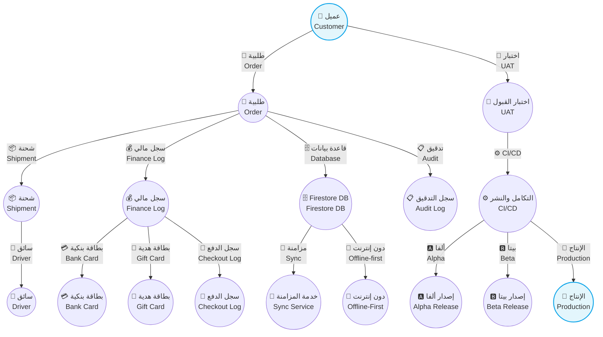
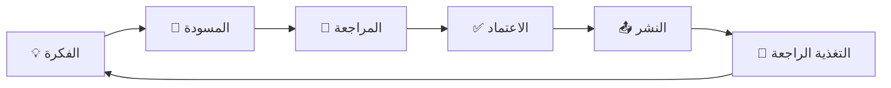

# 📚 CA Admin DmG Documentation

> | 🔖  | البيان                       | Details          |
> | --- | ---------------------------- | ---------------- |
> | 🧾  | **المشروع / Project**        | CA Admin DmG     |
> | 🧑‍💼  | **مالك التوثيق / Owner**     | Abdullah Alshaif |
> | 🏷️  | **الإصدار / Version**        | v0.1             |
> | 📅  | **آخر تحديث / Last Updated** | 2025-09-08       |

**الملخص التنفيذي | Executive Summary:**  
يوفر هذا المستودع مرجعًا ثنائي اللغة ينظم رؤية نظام CA Admin، حالات الاستخدام، النماذج، الاختبارات، وعمليات الإطلاق لضمان فهم موحد وتسليم عالي الجودة.  
**Summary (EN):** This repository is a bilingual reference covering CA Admin's vision, use cases, models, testing, and release operations to keep teams aligned and delivery consistent.

---

## 🌟 عن المشروع | About The Project

- 🧠 **المفهوم / Concept:** نظام متكامل لإدارة العملاء، الطلبات، الشحن، والمالية في مشاريع الوساطة بالشراء عبر الإنترنت.  
  **Concept (EN):** Integrated platform for managing customers, orders, shipping, and finance for online purchasing mediation.
- 🎯 **الأثر / Value:** يسهّل عمليات الوساطة، يعزز تجربة المستخدم، ويضمن الشفافية المالية.  
  **Value (EN):** Streamlines mediation flows, improves user experience, and enforces financial transparency.
- 🤝 **الجمهور / Audience:** أصحاب المصلحة، المطورون، محللو الأعمال، فرق الاختبار وDevOps.  
  **Audience (EN):** Stakeholders, developers, business analysts, QA, and DevOps teams.

---

## 🗺️ نظرة بصرية شاملة | System Visual Overview

- 🔗 يوضح المخطط تدفق البيانات من العميل حتى الإطلاق مع إبراز نقاط التكامل.
- 🧩 يساعد المطورين والمحللين على فهم الاعتماديات قبل إجراء أي تغييرات.
- 📊 دليل سريع للفرق التشغيلية لمعرفة أماكن الاختبار والمراقبة.

---

## 🧭 خريطة الوثائق | Documentation Roadmap

| 📁 مجلد                | الوظيفة (AR)                   | Folder                 | Purpose (EN)      |
| ---------------------- | ------------------------------ | ---------------------- | ----------------- |
| 01-vision              | الرؤية والأهداف                | 01-vision              | Vision & Goals    |
| 02-stakeholders        | أصحاب المصلحة                  | 02-stakeholders        | Stakeholders      |
| 03-stories             | قصص المستخدم                   | 03-stories             | User Stories      |
| 04-use-cases           | حالات الاستخدام                | 04-use-cases           | Use Cases         |
| 05-data-model          | نماذج البيانات                 | 05-data-model          | Data Models       |
| 06-architecture        | العمارة التقنية                | 06-architecture        | Architecture      |
| 07-process-flows       | تدفقات العمليات                | 07-process-flows       | Process Flows     |
| 08-security-and-roles  | الأمان والأدوار                | 08-security-and-roles  | Security & Roles  |
| 09-indexes-and-queries | الفهارس والاستعلامات           | 09-indexes-and-queries | Indexes & Queries |
| 10-nfr-and-quality     | المتطلبات غير الوظيفية والجودة | 10-nfr-and-quality     | NFR & Quality     |
| 11-test-plan           | خطة الاختبار                   | 11-test-plan           | Test Plan         |
| 12-release-and-devops  | الإطلاق وDevOps                | 12-release-and-devops  | Release & DevOps  |
| 99-glossary            | القاموس                        | 99-glossary            | Glossary          |

> 💡 استخدم هذه الخريطة للعثور على الملف المناسب بسرعة، وراجع الروابط المتقاطعة داخل كل مستند للتنقل بين الأقسام.

---

## 🔗 روابط سريعة | Quick Links

- 📌 [خطة الاختبار | Test Plan](docs/11-test-plan/11-test-plan.md)
- 🚀 [خطة الإطلاق وDevOps | Release & DevOps](docs/12-release-and-devops/12-release-and-devops.md)
- 📊 [المتطلبات غير الوظيفية والجودة | NFR & Quality](docs/10-nfr-and-quality/10-nfr-and-quality.md)
- 📚 [القاموس | Glossary](docs/99-glossary/99-glossary.md)
- 🧠 [حالات الاستخدام | Use Cases](docs/04-use-cases/04-use-cases.md)

**شرح مختصر:** تساعد هذه الروابط الفرق في الوصول مباشرة إلى المستندات الأكثر استخدامًا.  
**Summary:** Quick access for frequently referenced documentation assets.

---

## 🔄 سير دورة التوثيق | Documentation Lifecycle

- 🔁 اعتمد هذا المسار لضمان بقاء المستندات محدثة ومتسقة.
- 👥 تضمين أصحاب المصلحة في مرحلة المراجعة يحسن الجودة ويقلل إعادة العمل.

---

## 🤝 كيفية المساهمة | How To Contribute

1. 🔍 راجع ملف القسم المرتبط قبل إجراء أي تعديل للتأكد من السياق.
2. 🧾 استخدم بنية ثنائية اللغة (عربي/إنجليزي) مع أيقونات تدعم الفهم.
3. 🧪 تحقق من مخططات Mermaid باستخدام [Mermaid Live Editor](https://mermaid-js.github.io/mermaid-live-editor/).
4. 🔄 افتح Pull Request مع شرح مختصر للتغييرات وروابط للملفات المتأثرة.
5. ✅ انتظر الموافقة من مالك التوثيق قبل الدمج.

**Summary (EN):** Review the relevant doc, keep bilingual formatting, validate diagrams, open a PR describing your changes, and wait for approval.

---

## 🛠️ أدوات مساعدة | Helper Tools

| الأداة                 | الوظيفة (AR)          | Tool                | Purpose (EN)                  |
| ---------------------- | --------------------- | ------------------- | ----------------------------- |
| Mermaid Live Editor    | معاينة مخططات Mermaid | Mermaid Live Editor | Preview Mermaid diagrams      |
| Draw.io (diagrams.net) | رسم مخططات إضافية     | Draw.io             | External diagramming          |
| Markdown Guide         | مرجع تنسيق Markdown   | Markdown Guide      | Markdown formatting reference |

---

## ❓ الأسئلة الشائعة | FAQ

### س: هل يمكنني إضافة أو تعديل أي جزء من التوثيق؟

**نعم!** التوثيق مفتوح لجميع أعضاء الفريق للمساهمة والتحسين.

### س: ما هي أفضل طريقة لإضافة الرسومات؟

يفضل استخدام Mermaid داخل Markdown أو Draw.io للرسومات المعقدة.

### س: كيف أضمن توحيد المصطلحات؟

راجع دائمًا [القاموس](docs/99-glossary/99-glossary.md) قبل كتابة أو تحديث أي مستند.

---

### Q: Can I add or edit any part of the documentation?

**Yes!** Documentation is open for all team members to contribute and improve.

### Q: What is the best way to add diagrams?

Prefer Mermaid inside Markdown files or Draw.io for complex diagrams.

### Q: How do I ensure terminology consistency?

Always review the [Glossary](docs/99-glossary/99-glossary.md) before writing or updating any document.

---

## 📝 أفضل ممارسات التوثيق | Documentation Best Practices

1. ✍️ استخدم لغة واضحة ومباشرة (عربي + EN).  
   Use clear, direct bilingual language.
2. 🔄 حدّث التوثيق مع كل تغيير في النظام أو المتطلبات.  
   Update docs whenever system or requirements change.
3. 🧭 راجع الروابط والمخططات بانتظام لضمان صحتها.  
   Review links/diagrams regularly for accuracy.
4. 📐 التزم بالهيكل الموحد للأقسام.  
   Stick to the unified documentation layout.
5. 🧪 أضف أمثلة عملية أو سيناريوهات عند الحاجة.  
   Add practical examples or scenarios when useful.

---

## 📜 الترخيص | License

- **حاليًا / Current:** استخدام داخلي فقط (بدون رخصة).  
  **Summary:** Documentation is for internal use only.

---
