# 🗺️ Learning Roadmap for Documentation & Diagrams

## خارطة طريق لتعلّم التوثيق والرسومات

> **Goal:** Master the skills to create professional documentation and diagrams for the CA Admin project (Vision → Stakeholders → Stories → Use Cases → Data Models → Architecture → Flows → Security → Testing → Release).

---

## 🏁 Visual Summary / ملخص بصري

```mermaid
flowchart LR
    V([Vision]) --> S([Stakeholders]) --> ST([Stories]) --> UC([Use Cases])
    UC --> DM([Data Models]) --> AR([Architecture])
    AR --> PF([Process Flows]) --> SE([Security])
    SE --> IQ([Indexes & Queries]) --> NFR([NFR & Quality])
    NFR --> TP([Test Plan]) --> RD([Release & DevOps])
    RD --> GL([Glossary])
    classDef phase fill:#e3f6fc,stroke:#0ea5e9,stroke-width:2px;
    class V,S,ST,UC,DM,AR,PF,SE,IQ,NFR,TP,RD,GL phase;
```

---

## 🎯 Phase 1: Foundations / الأساسيات

### 1. Markdown Documentation

- **What to Learn:** Writing clear and structured docs using Markdown.
- **Resources:**
  - [Markdown Crash Course - Traversy Media](https://www.youtube.com/watch?v=HUBNt18RFbo)
  - [Mastering Markdown - FreeCodeCamp](https://www.youtube.com/watch?v=2JE66WFpaII)
- **Practice:** Document a small app idea in `/docs` folder.

### 2. Software Documentation Basics

- **What to Learn:** Vision, Stakeholders, Stories, Use Cases.
- **Resources:**
  - [Software Documentation Course - FreeCodeCamp](https://www.youtube.com/watch?v=qJqAXjz-Rh4)
  - Book: _Software Requirements by Karl Wiegers_.
- **Practice:** Fill `/01-vision`, `/02-stakeholders`, `/03-stories`.

---

## 🎯 Phase 2: Modeling & Diagrams / النمذجة والرسومات

### 3. UML & Use Case Diagrams

- **What to Learn:** Use Case diagrams, Sequence diagrams.
- **Tools:** Mermaid (Markdown), Draw.io.
- **Resources:**
  - [UML Diagrams Full Course - FreeCodeCamp](https://www.youtube.com/watch?v=WnMQ8HlmeXc)
- **Practice:** Create `/04-use-cases` diagrams.

### 4. ERD & Data Modeling

- **What to Learn:** Entities, attributes, relationships. Convert to Firestore schema.
- **Resources:**
  - [Database Design Full Course - FreeCodeCamp](https://www.youtube.com/watch?v=ztHopE5Wnpc)
  - [ERD Basics - Lucidchart](https://www.youtube.com/watch?v=QpdhBUYk7Kk)
- **Practice:** Complete `/05-data-model`.

### 5. Architecture & Clean Architecture

- **What to Learn:** Layers (Presentation, Domain, Data), Firebase integration.
- **Resources:**
  - [Clean Architecture in Flutter - ResoCoder](https://www.youtube.com/watch?v=KjE2IDphA_U)
  - [System Design Basics - FreeCodeCamp](https://www.youtube.com/watch?v=F7AX1g0Y4Fw)
- **Practice:** Fill `/06-architecture`.

### 6. BPMN & DFD

- **What to Learn:** Business flows (BPMN) vs Data flows (DFD).
- **Resources:**
  - [BPMN Tutorial - Camunda](https://www.youtube.com/watch?v=Jl2CWBj0vSQ)
  - [Data Flow Diagram Tutorial](https://www.youtube.com/watch?v=R0kTTlJv8rE)
- **Practice:** Create `/07-process-flows`.

---

## 🎯 Phase 3: Security, Testing & Quality / الأمان والاختبار والجودة

### 7. Security & Roles

- **What to Learn:** RBAC, Firebase Security Rules, Custom Claims.
- **Resources:**
  - [Firebase Security Rules - Fireship.io](https://www.youtube.com/watch?v=qKfkCY7cmwI)
  - [Authentication & RBAC Basics](https://www.youtube.com/watch?v=VdNNxU2bXlU)
- **Practice:** Document `/08-security-and-roles`.

### 8. Indexes & Queries

- **What to Learn:** Firestore queries & composite indexes.
- **Resources:**
  - [Firestore Querying - Academind](https://www.youtube.com/watch?v=2Vf1D-rUMwE)
- **Practice:** Build `/09-indexes-and-queries`.

### 9. Non-Functional Requirements (NFRs) & Quality

- **What to Learn:** ISO/IEC 25010, system quality attributes.
- **Resources:**
  - [Non-functional Requirements Explained](https://www.youtube.com/watch?v=i3AqkKdtOxE)
- **Practice:** Document `/10-nfr-and-quality`.

### 10. Test Planning

- **What to Learn:** Unit tests, integration tests, UAT.
- **Resources:**
  - [Flutter Testing Tutorial](https://www.youtube.com/watch?v=OwgH3Vh2dAs)
  - [Software Testing Course - FreeCodeCamp](https://www.youtube.com/watch?v=Fj0sf0x5a4A)
- **Practice:** Create `/11-test-plan`.

---

## 🎯 Phase 4: Release & Maintenance / الإطلاق والصيانة

### 11. Release & DevOps

- **What to Learn:** CI/CD pipelines (GitHub Actions, Firebase App Distribution).
- **Resources:**
  - [GitHub Actions for Beginners](https://www.youtube.com/watch?v=R8_veQiYBjI)
  - [Firebase App Distribution - Google](https://www.youtube.com/watch?v=qhnN8eZmgxQ)
- **Practice:** Write `/12-release-and-devops`.

### 12. Glossary

- **What to Learn:** Importance of terminology alignment.
- **Practice:** Complete `/99-glossary`.

---

## 🎯 Phase 5: Continuous Improvement / التحسين المستمر

- Review documentation quarterly.
- Update diagrams when data model or processes change.
- Improve diagrams with BPMN/DFD tools if Mermaid isn’t enough.
- Expand roadmap with **advanced topics**:
  - System Design (Caching, Scaling, APIs).
  - Advanced Security (Zero Trust, Audit Compliance).
  - Data Analytics & Reporting.

---

## 📌 Tips for Success / نصائح للنجاح

- Follow the **order of docs** (Vision → Stakeholders → Stories → Use Cases → Data Model …).
- Practice small examples in parallel with CA Admin docs.
- Use **Mermaid** for quick diagrams and **Draw.io** for complex flows.
- Treat documentation as a **living artifact**: keep it updated with every project change.

---
