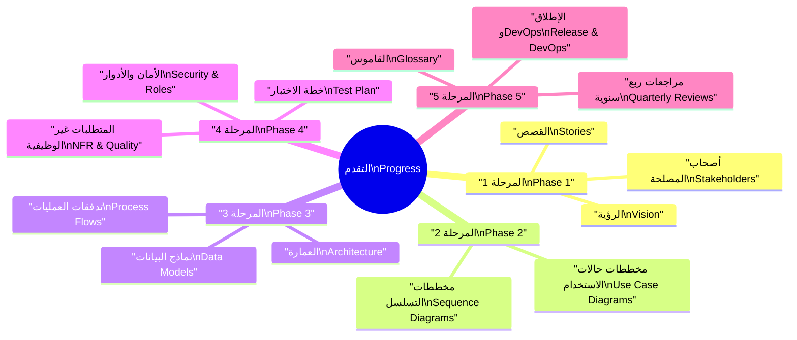

# 🗺️ خارطة طريق التوثيق والرسومات

Documentation & Diagrams Roadmap

> | 🔖  | البيان Details                                                                                                | القيمة Value                                                                  |
> | --- | ---------------------------------------------------------------------------------------------------------------- | -------------------------------------------------------------------------------- |
> | 🧾  | المؤسسة: CA Admin DmG Organization: CA Admin DmG                                                              | إطار تعلم موحد Unified learning framework                                     |
> | 🧑‍💼  | مالك الوثيقة: Abdullah Alshaif Document owner: Abdullah Alshaif                                               | توجيه وتحديث المحتوى Guides and updates content                               |
> | 🎯  | الغرض: تطوير مهارات التوثيق والرسومات الاحترافية Purpose: Develop professional documentation & diagram skills | تمكين الفريق من التوثيق المتكامل Enables the team to document comprehensively |
> | 📅  | آخر تحديث: 2025-09-08 Last updated: 2025-09-08                                                                | يعكس أحدث النسخ المعتمدة Reflects latest approved version                     |

**الملخص التنفيذي:** خارطة تعلم متدرجة تصف بناء توثيق CA Admin من الرؤية وحتى الإطلاق مع التركيز على المخططات.
**Executive summary:** A staged learning path covering CA Admin documentation from vision to launch with an emphasis on diagrams.

---

## 🎯 الهدف

Goal

- 🧠 الانتقال من فهم الرؤية إلى إنتاج ملفات جاهزة للمراجعة والإطلاق.
  Move from understanding the vision to producing review-ready deliverables.
- 🖼️ إتقان Mermaid، Draw.io، وBPMN/DFD لشرح الأفكار بصريًا.
  Master Mermaid, Draw.io, and BPMN/DFD to communicate ideas visually.
- 🔄 تقسيم التعلم إلى مراحل قصيرة مع تطبيق عملي لكل خطوة.
  Break learning into short phases with hands-on practice for each step.

---

## 🧭 نظرة بصرية شاملة

Visual Documentation Flow

```mermaid
flowchart LR
  V([🔭 الرؤية
Vision]) --> S([👥 أصحاب المصلحة
Stakeholders]) --> ST([📖 القصص
Stories]) --> UC([🎬 حالات الاستخدام
Use Cases])
  UC --> DM([🗂️ نماذج البيانات
Data Models]) --> AR([🏗️ العمارة
Architecture])
  AR --> PF([🔄 تدفقات العمليات
Process Flows]) --> SE([🔒 الأمان والأدوار
Security & Roles])
  SE --> IQ([📊 الفهارس والاستعلامات
Indexes & Queries]) --> NFR([⚙️ المتطلبات غير الوظيفية والجودة
NFR & Quality])
  NFR --> TP([🧪 خطة الاختبار
Test Plan]) --> RD([🚀 الإطلاق وDevOps
Release & DevOps])
  RD --> GL([📚 القاموس
Glossary])
  classDef phase fill:#e3f6fc,stroke:#0ea5e9,stroke-width:2px;
  class V,S,ST,UC,DM,AR,PF,SE,IQ,NFR,TP,RD,GL phase;
```

- يوضح المخطط تسلسل الملفات وعلاقات الاعتماد بينها لضمان رؤية موحدة.
  The diagram clarifies the file sequence and dependencies to maintain shared context.
- يساعد الفريق على تحديد نقطة البداية المناسبة وتسلسل التحديثات المطلوبة.
  It helps the team identify starting points and the order of updates needed.

---

## 🗂️ مخطط المراحل التعليمية

Phase Overview

| المرحلة Phase                                        | التركيز Focus                                                                   | المخرجات الأساسية Key Deliverables                                                                                         |
| ------------------------------------------------------- | ---------------------------------------------------------------------------------- | ----------------------------------------------------------------------------------------------------------------------------- |
| 1. الأساسيات Foundations                             | Markdown، الرؤية، أصحاب المصلحة، القصص Markdown, vision, stakeholders, stories  | مجلدات 01-vision، 02-stakeholders، 03-stories مكتملة Completed 01-vision, 02-stakeholders, 03-stories                      |
| 2. النمذجة والرسومات Modeling & Diagrams             | UML، حالات الاستخدام، أدوات الرسم UML, use cases, diagramming tools             | مخططات استخدام وتسلسل مع ملفات 04-use-cases جاهزة Use case and sequence diagrams with 04-use-cases ready                   |
| 3. العمارة والتدفقات Architecture & Flows            | ERD، نماذج البيانات، العمارة، BPMN/DFD ERD, data models, architecture, BPMN/DFD | مستندات 05-data-model، 06-architecture، 07-process-flows مكتملة Completed 05-data-model, 06-architecture, 07-process-flows |
| 4. الأمان والجودة Security, Testing & Quality        | RBAC، الاستعلامات، NFR، خطة الاختبار RBAC, queries, NFR, test planning          | ملفات 08→11 محدثة بمخططات داعمة Updated files 08→11 with supporting diagrams                                               |
| 5. الإطلاق والتحسين Release & Continuous Improvement | CI/CD، القاموس، مراجعات ربع سنوية CI/CD, glossary, quarterly reviews            | 12-release-and-devops، 99-glossary، خطة تحسين مستمرة 12-release-and-devops, 99-glossary, ongoing improvement plan          |

---

## 🧱 المرحلة 1: الأساسيات

Phase 1: Foundations

| المهارة Skill                                         | الوصف Description                                                                                         | الهدف Outcome                                                                          |
| -------------------------------------------------------- | ------------------------------------------------------------------------------------------------------------ | ----------------------------------------------------------------------------------------- |
| توثيق Markdown Markdown Documentation                 | كتابة وثائق واضحة منظمة بالاعتماد على Markdown Compose clear, structured Markdown documentation           | إرساء أسلوب موحد للتوثيق النصي Establish a unified textual documentation style         |
| أساسيات التوثيق البرمجي Software Documentation Basics | استيعاب الرؤية، أصحاب المصلحة، القصص، حالات الاستخدام Understand vision, stakeholders, stories, use cases | ضمان اكتمال السياق قبل الانتقال للنماذج Ensure contextual completeness before modeling |

**موارد:**
Resources:

- [دليل Markdown السريع – Traversy Media](https://www.youtube.com/watch?v=HUBNt18RFbo)
  [Markdown Crash Course – Traversy Media](https://www.youtube.com/watch?v=HUBNt18RFbo)
- [إتقان Markdown – FreeCodeCamp](https://www.youtube.com/watch?v=2JE66WFpaII)
  [Mastering Markdown – FreeCodeCamp](https://www.youtube.com/watch?v=2JE66WFpaII)
- [دورة توثيق البرمجيات – FreeCodeCamp](https://www.youtube.com/watch?v=qJqAXjz-Rh4)
  [Software Documentation Course – FreeCodeCamp](https://www.youtube.com/watch?v=qJqAXjz-Rh4)
- كتاب **Software Requirements** لكارل ويغرز.
  The book **Software Requirements** by Karl Wiegers.

**تطبيق عملي:**
Practice:

- وثّق فكرة تطبيق صغيرة داخل مجلد /docs.
  Document a small app idea inside the /docs folder.
- أكمل مجلدات 01-vision، 02-stakeholders، 03-stories.
  Complete the 01-vision, 02-stakeholders, and 03-stories folders.

---

## 🎯 المرحلة 2: النمذجة والرسومات

Phase 2: Modeling & Diagrams

| المهارة Skill                                       | الوصف Description                                                                      | الهدف Outcome                                                                        |
| ------------------------------------------------------ | ----------------------------------------------------------------------------------------- | --------------------------------------------------------------------------------------- |
| مخططات UML وحالات الاستخدام UML & Use Case Diagrams | تصميم مخططات حالات الاستخدام والتسلسل Design use case and sequence diagrams            | توحيد فهم السيناريوهات بين الفرق المختلفة Align scenario understanding across teams  |
| أدوات النمذجة Modeling Tools                        | توظيف Mermaid وDraw.io لإنشاء الرسومات Employ Mermaid and Draw.io for diagram creation | تسريع إنتاج الرسومات وتحديثها عند الحاجة Accelerate diagram production and revisions |

**موارد:**
Resources:

- [توثيق Mermaid](https://mermaid-js.github.io/mermaid/#/)
  [Mermaid Documentation](https://mermaid-js.github.io/mermaid/#/)
- [أداة Draw.io](https://app.diagrams.net/)
  [Draw.io Tool](https://app.diagrams.net/)
- [دورة مخططات UML الكاملة – FreeCodeCamp](https://www.youtube.com/watch?v=WnMQ8HlmeXc)
  [UML Diagrams Full Course – FreeCodeCamp](https://www.youtube.com/watch?v=WnMQ8HlmeXc)

**تطبيق عملي:**
Practice:

- صمّم مخطط حالة استخدام لسيناريو رئيسي في المشروع.
  Design a key project use case diagram.
- أنشئ مخطط تسلسل لرحلة طلب كاملة.
  Build a sequence diagram for an entire order journey.
- حدّث مجلد /04-use-cases بالمخططات والنصوص الداعمة.
  Update the /04-use-cases folder with diagrams and supporting text.

---

## 🏗️ المرحلة 3: العمارة والتدفقات

Phase 3: Architecture & Flows

| المهارة Skill                                  | الوصف Description                                                                                                                | الهدف Outcome                                                                                           |
| ------------------------------------------------- | ----------------------------------------------------------------------------------------------------------------------------------- | ---------------------------------------------------------------------------------------------------------- |
| نمذجة البيانات (ERD) ERD & Data Modeling       | تعريف الكيانات والعلاقات وتحويلها إلى مخطط Firestore Define entities and relationships, map them to Firestore                    | ضمان اتساق البيانات بين المستندات والمنصة Ensure data consistency across docs and platform              |
| العمارة وتقسيم الطبقات Architecture & Layering | بناء طبقات العرض، الدومين، والبيانات مع تكامل Firebase Structure presentation, domain, and data layers with Firebase integration | توفير مخطط معماري واضح للتطوير المستقبلي Provide a clear architectural blueprint for future development |
| BPMN وDFD BPMN & DFD                           | التفريق بين تدفقات الأعمال وتدفقات البيانات وتوثيقها Differentiate and document business versus data flows                       | تسهيل أتمتة العمليات ومراجعة الاعتمادات Facilitate process automation and dependency reviews            |

**موارد:**
Resources:

- [دورة تصميم قواعد البيانات – FreeCodeCamp](https://www.youtube.com/watch?v=ztHopE5Wnpc)
  [Database Design Full Course – FreeCodeCamp](https://www.youtube.com/watch?v=ztHopE5Wnpc)
- [أساسيات ERD – Lucidchart](https://www.youtube.com/watch?v=QpdhBUYk7Kk)
  [ERD Basics – Lucidchart](https://www.youtube.com/watch?v=QpdhBUYk7Kk)
- [العمارة النظيفة في Flutter – ResoCoder](https://www.youtube.com/watch?v=KjE2IDphA_U)
  [Clean Architecture in Flutter – ResoCoder](https://www.youtube.com/watch?v=KjE2IDphA_U)
- [أساسيات تصميم الأنظمة – FreeCodeCamp](https://www.youtube.com/watch?v=F7AX1g0Y4Fw)
  [System Design Basics – FreeCodeCamp](https://www.youtube.com/watch?v=F7AX1g0Y4Fw)
- [شرح BPMN – Camunda](https://www.youtube.com/watch?v=Jl2CWBj0vSQ)
  [BPMN Tutorial – Camunda](https://www.youtube.com/watch?v=Jl2CWBj0vSQ)
- [شرح مخططات تدفق البيانات](https://www.youtube.com/watch?v=R0kTTlJv8rE)
  [Data Flow Diagram Tutorial](https://www.youtube.com/watch?v=R0kTTlJv8rE)

**تطبيق عملي:**
Practice:

- وثّق نموذج بيانات Firestore في مجلد /05-data-model.
  Document the Firestore data model in /05-data-model.
- أنشئ مخطط العمارة المعتمد في /06-architecture.
  Create the approved architecture diagram in /06-architecture.
- أضف مخططات BPMN وDFD المناسبة إلى /07-process-flows.
  Add the relevant BPMN and DFD diagrams to /07-process-flows.

---

## 🔒 المرحلة 4: الأمان، الاختبار، الجودة

Phase 4: Security, Testing & Quality

| المهارة Skill                                      | الوصف Description                                                                                      | الهدف Outcome                                                                                         |
| ----------------------------------------------------- | --------------------------------------------------------------------------------------------------------- | -------------------------------------------------------------------------------------------------------- |
| الأمان والأدوار Security & Roles                   | تطبيق RBAC، قواعد أمان Firebase، وصلاحيات مخصصة Implement RBAC, Firebase Security Rules, custom claims | حماية البيانات وتحديد مسؤوليات النفاذ بدقة Protect data and clearly define access responsibilities    |
| الفهارس والاستعلامات Indexes & Queries             | إعداد استعلامات Firestore والفهارس المركبة Build Firestore queries and composite indexes               | تحسين الأداء وتقليل تكاليف القراءة Improve performance and cut read costs                             |
| المتطلبات غير الوظيفية Non-functional Requirements | توثيق ISO/IEC 25010 وسمات الجودة Document ISO/IEC 25010 and quality attributes                         | ضبط معايير الأداء والموثوقية والاستمرارية Set benchmarks for performance, reliability, and continuity |
| خطة الاختبار Test Plan                             | تصميم اختبارات الوحدة، التكامل، واختبار القبول Design unit, integration, and UAT plans                 | تأمين تغطية اختبار شاملة قبل الإطلاق Secure comprehensive testing coverage before release             |

**موارد:**
Resources:

- [قواعد أمان Firebase – Fireship.io](https://www.youtube.com/watch?v=qKfkCY7cmwI)
  [Firebase Security Rules – Fireship.io](https://www.youtube.com/watch?v=qKfkCY7cmwI)
- [أساسيات المصادقة وRBAC](https://www.youtube.com/watch?v=VdNNxU2bXlU)
  [Authentication & RBAC Basics](https://www.youtube.com/watch?v=VdNNxU2bXlU)
- [استعلامات Firestore – Academind](https://www.youtube.com/watch?v=2Vf1D-rUMwE)
  [Firestore Querying – Academind](https://www.youtube.com/watch?v=2Vf1D-rUMwE)
- [شرح المتطلبات غير الوظيفية](https://www.youtube.com/watch?v=i3AqkKdtOxE)
  [Non-functional Requirements Explained](https://www.youtube.com/watch?v=i3AqkKdtOxE)
- [اختبار Flutter – دليلك الكامل](https://www.youtube.com/watch?v=OwgH3Vh2dAs)
  [Flutter Testing Tutorial](https://www.youtube.com/watch?v=OwgH3Vh2dAs)
- [دورة اختبار البرمجيات – FreeCodeCamp](https://www.youtube.com/watch?v=Fj0sf0x5a4A)
  [Software Testing Course – FreeCodeCamp](https://www.youtube.com/watch?v=Fj0sf0x5a4A)

**تطبيق عملي:**
Practice:

- وثّق حماية الوصول في /08-security-and-roles.
  Document access protection in /08-security-and-roles.
- أنشئ الاستعلامات والفهارس المطلوبة في /09-indexes-and-queries.
  Build required queries and indexes in /09-indexes-and-queries.
- دوّن مؤشرات الجودة في /10-nfr-and-quality.
  Record quality indicators in /10-nfr-and-quality.
- أنجز هيكل /11-test-plan مع هرم الاختبارات ومعايير القبول.
  Complete /11-test-plan with the test pyramid and acceptance criteria.

---

## 🚀 المرحلة 5: الإطلاق والتحسين المستمر

Phase 5: Release & Continuous Improvement

| المهارة Skill                          | الوصف Description                                                                                      | الهدف Outcome                                                                              |
| ----------------------------------------- | --------------------------------------------------------------------------------------------------------- | --------------------------------------------------------------------------------------------- |
| CI/CD وخطط الإطلاق Release & DevOps    | إعداد GitHub Actions وFirebase App Distribution Configure GitHub Actions and Firebase App Distribution | أتمتة البناء والاختبار والتوزيع Automate build, test, and distribution                     |
| إدارة المصطلحات Glossary Management    | توثيق وتحديث المصطلحات المشتركة Document and refresh shared terminology                                | توحيد لغة الفريق وتقليل الالتباس Unify team language and reduce ambiguity                  |
| التحسين المستمر Continuous Improvement | جدولة مراجعات ربع سنوية للوثائق والرسومات Schedule quarterly document and diagram reviews              | الحفاظ على ملاءمة التوثيق مع تطور المنتج Keep documentation aligned with product evolution |

**موارد:**
Resources:

- [مقدمة GitHub Actions](https://www.youtube.com/watch?v=R8_veQiYBjI)
  [GitHub Actions for Beginners](https://www.youtube.com/watch?v=R8_veQiYBjI)
- [توزيع تطبيق Firebase](https://www.youtube.com/watch?v=qhnN8eZmgxQ)
  [Firebase App Distribution – Google](https://www.youtube.com/watch?v=qhnN8eZmgxQ)

**تطبيق عملي:**
Practice:

- حدّث ملف /12-release-and-devops بمخطط CI/CD مفصل.
  Update /12-release-and-devops with a detailed CI/CD diagram.
- راجع /99-glossary بعد كل تعديل جوهري في المتطلبات.
  Review /99-glossary after every major requirement change.
- خصص اجتماعًا ربع سنويًا لمراجعة الوثائق والرسومات وتحسينها.
  Schedule a quarterly session to review and enhance docs and diagrams.

---

## 💡 نصائح إضافية

Additional Notes

- 🧭 اتبع ترتيب الملفات لضمان استمرارية السياق من الرؤية إلى القاموس.
  Follow the file order to preserve context from vision to glossary.
- 🧪 جرّب كل مهارة على مثال صغير قبل دمجها في مستندات CA Admin.
  Pilot each skill on a small example before merging into CA Admin docs.
- 🖼️ استخدم Mermaid للرسومات السريعة وDraw.io أو BPMN للسيناريوهات المعقدة.
  Use Mermaid for quick diagrams and Draw.io or BPMN for complex scenarios.
- 🔄 اعتبر التوثيق وثيقة حية تُحدَّث مع كل تغيير معماري أو وظيفي.
  Treat documentation as a living asset updated with each architectural or functional change.

---

## ✅ قائمة التقدم | Progress Checklist

- استخدم الخريطة الذهنية لتتبع المراحل المكتملة وتلك التي تحتاج إلى متابعة.
  Use the mindmap to track completed phases and those needing follow-up.

---

## 📌 نصائح للنجاح

Tips for Success

1. 📅 خصص وقتًا أسبوعيًا ثابتًا للتوثيق حتى لو كان ساعة واحدة.
   Block a fixed weekly slot for documentation, even one hour.
2. 📎 أضف روابط متقاطعة بين الملفات مثل الربط بين خطة الاختبار وحالات الاستخدام.
   Add cross-links between files, such as linking the test plan to use cases.
3. 🧑‍🤝‍🧑 شارك التحديثات مع الفريق للحصول على تغذية راجعة مبكرة.
   Share updates with the team to gather early feedback.
4. 📊 حدّث قائمة التقدم بعد الانتهاء من كل مرحلة لمتابعة الإنجاز.
   Update the progress list after completing each phase to monitor progress.
5. 🧭 وسّع الخارطة بمواضيع متقدمة مثل تصميم الأنظمة أو الأمان المتقدم عند الحاجة.
   Extend the roadmap with advanced topics like system design or advanced security when needed.

---
