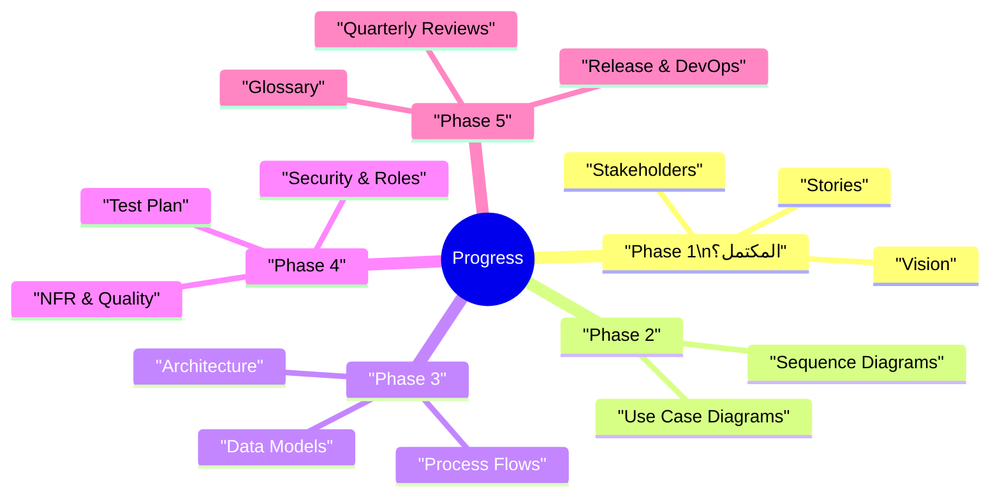

# 🗺️ خارطة طريق التوثيق والرسومات | Documentation & Diagrams Roadmap

> | 🔖  | البيان                       | Details                                   |
> | --- | ---------------------------- | ----------------------------------------- |
> | 🧾  | **المشروع / Project**        | CA Admin DmG                              |
> | 🧑‍💼  | **مالك التوثيق / Owner**     | Abdullah Alshaif                          |
> | 🎯  | **الغرض / Purpose**          | تطوير مهارات التوثيق والرسومات الاحترافية |
> | 📅  | **آخر تحديث / Last Updated** | 2025-09-08                                |

**الملخص التنفيذي | Executive Summary:**  
تسلسل تعليمي عملي يُمكّن الفريق من بناء توثيق CA Admin خطوة بخطوة؛ بدءًا من الرؤية وحتى الإطلاق والصيانة مع التركيز على الرسومات ومخططات Mermaid.  
**Summary (EN):** Hands-on learning sequence that guides the team through crafting CA Admin documentation from vision to release, emphasizing visuals and Mermaid diagrams.

---

## 🎯 الهدف | Goal

- 🧠 **إتقان التوثيق:** الانتقال من فهم الرؤية إلى إنتاج ملفات قابلة للمراجعة والإطلاق.  
  **Master Documentation:** Move from understanding the vision to shipping review-ready docs.
- 🖼️ **إجادة الرسومات:** استخدام Mermaid وDraw.io وBPMN/DFD لتوضيح الأفكار.  
  **Excel at Diagrams:** Apply Mermaid, Draw.io, BPMN/DFD to convey concepts.
- 🔄 **منهج متدرج:** تقسيم التعلم إلى مراحل صغيرة مع تطبيق عملي لكل خطوة.  
  **Iterative Learning:** Break skills into focused phases with practice per step.

---

## 🧭 نظرة بصرية شاملة | Visual Documentation Flow

- 🔗 يظهر المخطط العلاقة بين ملفات التوثيق الرئيسية وكيفية انتقال العمل بينها.  
  **Highlights how documents connect and flow across the project.**
- 🧭 استخدمه كدليل سريع عند إنشاء أو تحديث أي ملف.  
  **Use as a quick compass when creating or updating docs.**

---

## 🗂️ مخطط المراحل التعليمية | Phase Overview

| المرحلة (AR)         | Phase (EN)                       | التركيز / Focus                        | المخرجات الأساسية / Key Deliverables                           |
| -------------------- | -------------------------------- | -------------------------------------- | -------------------------------------------------------------- |
| 1. الأساسيات         | Foundations                      | Markdown، رؤية، أصحاب المصلحة، قصص     | مجلدات `01-vision`, `02-stakeholders`, `03-stories` مكتملة     |
| 2. النمذجة والرسومات | Modeling & Diagrams              | UML، حالات الاستخدام، أدوات الرسم      | مخططات استخدام وتسلسل + ملفات `04-use-cases`                   |
| 3. العمارة والتدفقات | Architecture & Flows             | ERD، نماذج البيانات، العمارة، BPMN/DFD | مستندات `05-data-model`, `06-architecture`, `07-process-flows` |
| 4. الأمان والجودة    | Security, Testing & Quality      | RBAC، الاستعلامات، NFR، خطة الاختبار   | ملفات `08`→`11` مكتملة بمخططات داعمة                           |
| 5. الإطلاق والتحسين  | Release & Continuous Improvement | CI/CD، القاموس، مراجعات دورية          | `12-release-and-devops` + `99-glossary` + خطة تحسين ربع سنوية  |

---

## 🧱 المرحلة 1: الأساسيات | Phase 1: Foundations

| 📝 المهارة              | شرح مختصر                                         | Skill                         | Summary                                  |
| ----------------------- | ------------------------------------------------- | ----------------------------- | ---------------------------------------- |
| توثيق Markdown          | كتابة وثائق واضحة ومنظمة                          | Markdown Documentation        | Clear, structured Markdown writing       |
| أساسيات التوثيق البرمجي | فهم الرؤية، أصحاب المصلحة، القصص، حالات الاستخدام | Software Documentation Basics | Vision, stakeholders, stories, use cases |

**موارد | Resources**

- [Markdown Crash Course – Traversy Media](https://www.youtube.com/watch?v=HUBNt18RFbo)
- [Mastering Markdown – FreeCodeCamp](https://www.youtube.com/watch?v=2JE66WFpaII)
- [Software Documentation Course – FreeCodeCamp](https://www.youtube.com/watch?v=qJqAXjz-Rh4)
- كتاب: _Software Requirements_ لـ Karl Wiegers

**تطبيق عملي | Practice**

- وثّق فكرة تطبيق صغيرة داخل `/docs`.
- اكمل مجلدات `01-vision`, `02-stakeholders`, `03-stories`.

---

## 🎯 المرحلة 2: النمذجة والرسومات | Phase 2: Modeling & Diagrams

| 📝 المهارة                  | شرح مختصر                           | Skill                   | Summary                            |
| --------------------------- | ----------------------------------- | ----------------------- | ---------------------------------- |
| مخططات UML وحالات الاستخدام | رسم مخططات حالات الاستخدام والتسلسل | UML & Use Case Diagrams | Build use case & sequence diagrams |
| أدوات النمذجة               | استخدام Mermaid وDraw.io            | Modeling Tools          | Apply Mermaid & Draw.io            |

**موارد | Resources**

- [Mermaid Documentation](https://mermaid-js.github.io/mermaid/#/)
- [Draw.io (diagrams.net)](https://app.diagrams.net/)
- [UML Diagrams Full Course – FreeCodeCamp](https://www.youtube.com/watch?v=WnMQ8HlmeXc)

**تطبيق عملي | Practice**

- صمّم مخطط حالة استخدام لسيناريو رئيسي.
- أنشئ مخطط تسلسل لرحلة طلب كاملة.
- املأ `/04-use-cases` بالمخططات والنصوص الداعمة.

---

## 🏗️ المرحلة 3: العمارة والتدفقات | Phase 3: Architecture & Flows

| 📝 المهارة             | شرح مختصر                               | Skill                             | Summary                               |
| ---------------------- | --------------------------------------- | --------------------------------- | ------------------------------------- |
| نمذجة البيانات (ERD)   | تعريف الكيانات والخصائص والعلاقات       | ERD & Data Modeling               | Entities, attributes, relationships   |
| العمارة وتقسيم الطبقات | Clean Architecture، تكامل Firebase      | Architecture & Clean Architecture | Layered design & Firebase integration |
| BPMN وDFD              | التفريق بين تدفق الأعمال وتدفق البيانات | BPMN & DFD                        | Business vs data flow diagrams        |

**موارد | Resources**

- [Database Design Full Course – FreeCodeCamp](https://www.youtube.com/watch?v=ztHopE5Wnpc)
- [ERD Basics – Lucidchart](https://www.youtube.com/watch?v=QpdhBUYk7Kk)
- [Clean Architecture in Flutter – ResoCoder](https://www.youtube.com/watch?v=KjE2IDphA_U)
- [System Design Basics – FreeCodeCamp](https://www.youtube.com/watch?v=F7AX1g0Y4Fw)
- [BPMN Tutorial – Camunda](https://www.youtube.com/watch?v=Jl2CWBj0vSQ)
- [Data Flow Diagram Tutorial](https://www.youtube.com/watch?v=R0kTTlJv8rE)

**تطبيق عملي | Practice**

- وثّق نموذج بيانات Firestore في `/05-data-model`.
- أنشئ مخطط عمارة في `/06-architecture`.
- جهّز مخططات BPMN/DFD في `/07-process-flows`.

---

## 🔒 المرحلة 4: الأمان، الاختبار، الجودة | Phase 4: Security, Testing & Quality

| 📝 المهارة             | شرح مختصر                                    | Skill             | Summary                           |
| ---------------------- | -------------------------------------------- | ----------------- | --------------------------------- |
| الأمان والأدوار        | RBAC، Firebase Security Rules، Custom Claims | Security & Roles  | RBAC & Firebase rules             |
| الفهارس والاستعلامات   | إعداد استعلامات Firestore والفهارس المركبة   | Indexes & Queries | Firestore querying & indexes      |
| المتطلبات غير الوظيفية | ISO/IEC 25010، سمات الجودة                   | NFR & Quality     | Quality attributes & measurements |
| خطة الاختبار           | Unit, Integration, UAT                       | Test Planning     | Build test strategies & plans     |

**موارد | Resources**

- [Firebase Security Rules – Fireship.io](https://www.youtube.com/watch?v=qKfkCY7cmwI)
- [Authentication & RBAC Basics](https://www.youtube.com/watch?v=VdNNxU2bXlU)
- [Firestore Querying – Academind](https://www.youtube.com/watch?v=2Vf1D-rUMwE)
- [Non-functional Requirements Explained](https://www.youtube.com/watch?v=i3AqkKdtOxE)
- [Flutter Testing Tutorial](https://www.youtube.com/watch?v=OwgH3Vh2dAs)
- [Software Testing Course – FreeCodeCamp](https://www.youtube.com/watch?v=Fj0sf0x5a4A)

**تطبيق عملي | Practice**

- وثّق حماية الوصول في `/08-security-and-roles`.
- أنشئ استعلامات وفهارس في `/09-indexes-and-queries`.
- اكتب ملف `/10-nfr-and-quality` مع معايير القياس.
- ابني خطة `/11-test-plan` بما يشمل الهرم، التغطية، والقبول.

---

## 🚀 المرحلة 5: الإطلاق والتحسين المستمر | Phase 5: Release & Continuous Improvement

| 📝 المهارة         | شرح مختصر                                 | Skill                  | Summary                         |
| ------------------ | ----------------------------------------- | ---------------------- | ------------------------------- |
| CI/CD وخطط الإطلاق | GitHub Actions، Firebase App Distribution | Release & DevOps       | Automate build/test/deploy      |
| إدارة المصطلحات    | توحيد المفاهيم بين الفرق                  | Glossary Management    | Maintain shared vocabulary      |
| التحسين المستمر    | مراجعات ربع سنوية للوثائق والرسومات       | Continuous Improvement | Quarterly doc & diagram reviews |

**موارد | Resources**

- [GitHub Actions for Beginners](https://www.youtube.com/watch?v=R8_veQiYBjI)
- [Firebase App Distribution – Google](https://www.youtube.com/watch?v=qhnN8eZmgxQ)

**تطبيق عملي | Practice**

- أعد ملف `/12-release-and-devops` مع مخطط CI/CD.
- حدّث `/99-glossary` دوريًا أثناء إضافة مصطلحات جديدة.
- ضع تذكيرًا ربع سنويًا لمراجعة التوثيق والرسومات.
- حسّن الرسومات باستخدام BPMN/DFD عندما لا تكفي Mermaid.

---

## 💡 نصائح إضافية | Extra Notes

- 🧭 اتبع ترتيب الملفات (الرؤية → أصحاب المصلحة → القصص → حالات الاستخدام → البيانات → العمارة → التدفقات → الأمان → الاختبار → الإطلاق → القاموس).  
  **Follow the file order to keep context flowing naturally.**
- 🧪 طبّق كل مهارة على مثال صغير قبل دمجها في CA Admin.  
  **Prototype on small examples before committing to the main docs.**
- 🖼️ استخدم Mermaid للرسومات السريعة وDraw.io أو أدوات BPMN للسيناريوهات المعقدة.  
  **Pick Mermaid for quick diagrams; escalate to Draw.io/BPMN as needed.**
- 🔄 اعتبر التوثيق وثيقة حية تُحدَّث مع كل تغيير وظيفي أو معماري.  
  **Treat documentation as living assets—update alongside feature or architecture changes.**

---

## ✅ قائمة التقدم | Progress Checklist

> استخدم هذه الخريطة الذهنية لتحديد المراحل المكتملة وتلك التي ما تزال قيد العمل.

---

## 📌 نصائح للنجاح | Tips for Success

1. 📅 خصص وقتًا أسبوعيًا ثابتًا للتوثيق (حتى لو ساعة واحدة).  
   **Block an hour weekly dedicated to docs.**
2. 📎 أضف روابط متقاطعة بين الملفات (مثلاً: خطة الاختبار ↔ حالات الاستخدام).  
   **Add cross-links (e.g., Test Plan ↔ Use Cases).**
3. 🧑‍🤝‍🧑 شارك التحديثات مع الفريق لتحصل على تغذية راجعة مبكرة.  
   **Share updates early for quick feedback.**
4. 📊 راقب تقدمك عبر تحديث قائمة التقدم بعد كل مرحلة.  
   **Update the progress checklist as you complete phases.**
5. 🧭 وسّع خارطة الطريق بمواضيع متقدمة عند الحاجة (تصميم الأنظمة، التحليلات، الأمان المتقدم).  
   **Extend this roadmap with advanced topics (system design, analytics, advanced security) when ready.**

---
