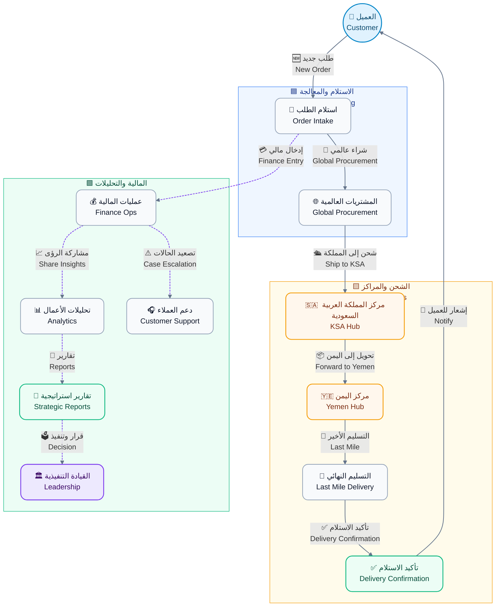
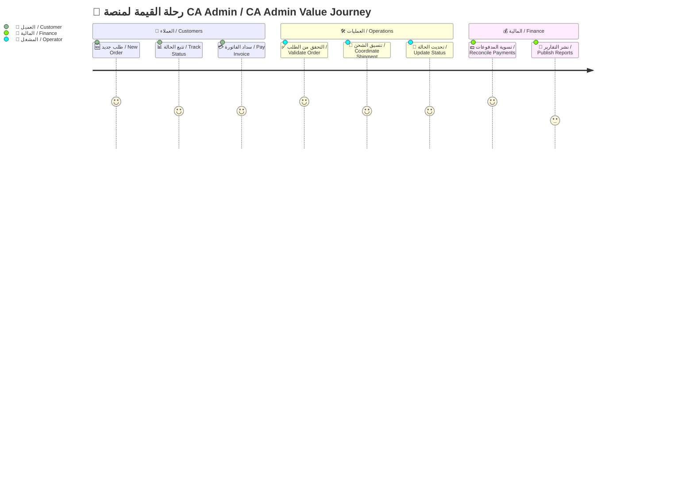
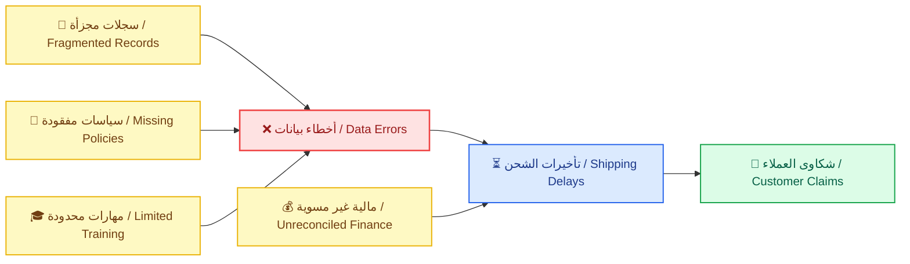
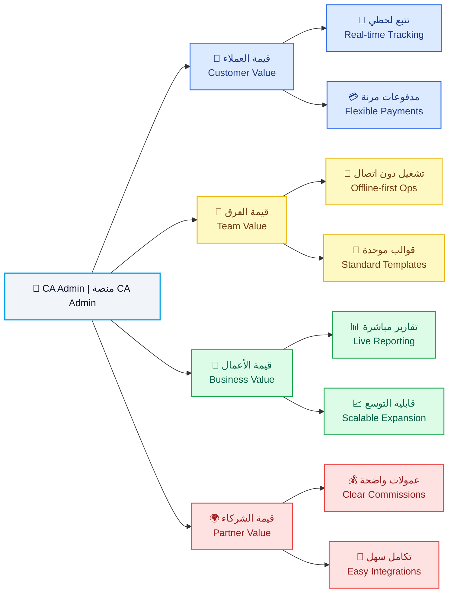
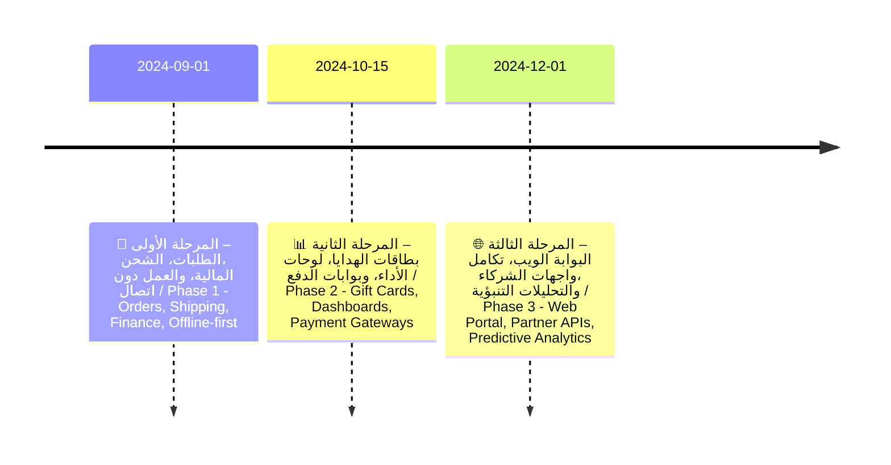

# 📝 وثيقة الرؤية | Vision Document

> <b>🗂️ المشروع | Project</b>  
> منصة الوساطة الشرائية CA Admin  
> CA Admin Shopping Mediation Platform
>
> <b>🧰 المكدس التقني | Tech Stack</b>  
> 🔹 Flutter | فلاتر  
> 🔹 Firebase (Firestore, Auth, Storage, Functions) | فايربيس
>
> <b>🏷️ الإصدار | Version</b>  
> 0.1 (رؤية | Vision) — Owner: عبدالله الشايف | Abdullah Alshaif — Last Updated: 2025-09-20

ℹ️ <b>النظرة العامة:</b> تقدم الوثيقة رؤية شاملة للمنصة، أهدافها، وأساسها التقني لضمان وضوح القيمة لجميع الأطراف.

ℹ️ <b>Overview:</b> The document provides a comprehensive view of the platform, its goals, and technology foundation to clarify value for every stakeholder.

<table class="doc-table">
  <thead>
    <tr>
      <th>🏷️ <b>العنصر</b> | <b>element</b></th>
      <th>ℹ️ <b>التفاصيل</b> | <b>details</b></th>
    </tr>
  </thead>
  <tbody>
    <tr>
      <td>
  
🏢 <b>التسمية:</b> المؤسسة

  
🏢 <b>Label:</b> <i>Institution</i>

      </td>
      <td>
  
ℹ️ <b>القيمة:</b> الإدارة العامة CA Admin DmG Headquarters

  
ℹ️ <b>Value:</b> <i>CA Admin DmG Headquarters</i>

      </td>
    </tr>
    <tr>
      <td>
  
🧭 <b>التسمية:</b> نطاق الحل

  
🧭 <b>Label:</b> <i>Solution Scope</i>

      </td>
      <td>
  
🌐 <b>القيمة:</b> منصة وساطة للتسوق عبر الحدود تخدم اليمن والسعودية مع ربط رقمي متكامل

  
🌐 <b>Value:</b> <i>A cross-border shopping mediation platform serving Yemen and Saudi Arabia with integrated digital linkages</i>

      </td>
    </tr>
    <tr>
      <td>
  
🎯 <b>التسمية:</b> الرؤية الإدارية

  
🎯 <b>Label:</b> <i>Executive Vision</i>

      </td>
      <td>
  
⚡ <b>القيمة:</b> تسريع الطلبات، الشحن، والمدفوعات عبر مسار رقمي واحد وشفاف

  
⚡ <b>Value:</b> <i>Accelerate orders, shipping, and payments through a single transparent digital lane</i>

      </td>
    </tr>
    <tr>
      <td>
  
👥 <b>التسمية:</b> الجمهور الأساسي

  
👥 <b>Label:</b> <i>Primary Audience</i>

      </td>
      <td>
  
🤝 <b>القيمة:</b> المتسوقون، العمليات، المالية، الشركاء، القيادة التنفيذية

  
🤝 <b>Value:</b> <i>Shoppers, operations teams, finance, partners, executive leadership</i>

      </td>
    </tr>
  </tbody>
</table>

---

## 1. ℹ️ مقدمة | Introduction

### 1.1 👁️ نظرة بصرية عامة | Visual Overview

ℹ️ <b>الوصف:</b> يوضح المخطط رحلة الطلب من إنشاء العميل حتى تسليم الشحنة مع إبراز نقاط التفاعل المالية والتحليلية.

ℹ️ <b>Description:</b> The diagram shows the order journey from customer initiation to delivery while flagging finance and analytics touchpoints.

### 1.2 🧭 رحلة القيمة المبسطة | Simplified Value Journey

ℹ️ <b>الوصف:</b> يبيّن المخطط دور كل طرف في كل مرحلة لضمان وضوح المسؤوليات وسرعة التسليم.

ℹ️ <b>Description:</b> The chart clarifies how each party contributes at every stage to keep responsibilities clear and delivery timely.

### 1.3 🏁 سياق المنصة | Platform Context

ℹ️ <b>الوصف:</b> يلخص هذا الجزء رسالة المنصة، الشرائح المستفيدة، والمبادئ التصميمية لضمان الاتساق.

ℹ️ <b>Description:</b> This section outlines the platform mission, beneficiary segments, and design principles to keep the experience consistent.

- 
<b>🎯 المهمة الأساسية:</b> تقديم مركز عمليات موحد لإدارة الطلبات، الشحن، والمدفوعات عبر الحدود بسهولة وشفافية.

  
<b>🎯 Core Mission:</b> Deliver a unified operations hub that manages cross-border orders, shipping, and payments with ease and transparency.

- 
<b>🧭 وصف المنصة:</b> حل متكامل يربط إنشاء الطلب بوثائق الشحن والسجلات المالية دون ازدواجية بيانات.

  
<b>🧭 Platform Definition:</b> An integrated solution linking order creation with shipping documents and financial records without data duplication.

- 
<b>🛠️ الوظيفة الرئيسية:</b> تنسيق تدفق العمل من الاستلام حتى الإغلاق مع أدوات رقابة وتقارير وأتمتة للمهام الحرجة.

  
<b>🛠️ Primary Function:</b> Orchestrate workflow from intake to closure with controls, reporting, and automation for critical tasks.

- 
<b>🏆 المنفعة المتوقعة:</b> خفض العمل اليدوي ورفع رضا العملاء عبر مصدر موحد للحقيقة وإشعارات فورية.

  
<b>🏆 Expected Benefit:</b> Reduce manual effort and raise customer satisfaction through a single source of truth and instant notifications.

- 
<b>👥 شرائح الخدمة:</b> المتسوقون، خدمة العملاء، مشغلو العمليات، فرق المالية، القيادة التنفيذية.

  
<b>👥 Target Segments:</b> Shoppers, customer service teams, operations operators, finance teams, executive leadership.

- 
<b>✨ مبدأ التجربة:</b> كل رحلة يجب أن تكون قابلة للتتبع، ثنائية اللغة، وقادرة على العمل دون اتصال لضمان التبني.

  
<b>✨ Experience Principle:</b> Every journey must be traceable, bilingual, and offline-ready to ensure adoption.

---

## 2. 🚀 لماذا الآن | Why Now

- 
<b>📈 تسارع التجارة العابرة للحدود:</b> تنمو احتياجات الشراء الدولي في اليمن بنسبة 35٪ سنويًا رغم تحديات البنية التحتية.

  
<b>📈 Cross-border Commerce Acceleration:</b> International shopping needs in Yemen grow by 35% annually despite infrastructure hurdles.

  - 
<b>🧩 الفائدة:</b> يبرر الاستثمار الفوري في منصة قابلة للتوسع تستوعب النمو وتقدم تجربة موحدة.

    
<b>🧩 Benefit:</b> Justifies immediate investment in a scalable platform that absorbs growth and keeps the experience unified.

- 
<b>🗂️ تشتت العمليات اليدوية:</b> تتكرر الطلبات في جداول ومحادثات متفرقة مما يهدر الوقت ويصعّب التدقيق.

  
<b>🗂️ Manual Fragmentation:</b> Orders repeat across scattered sheets and chats, wasting time and complicating audits.

  - 
<b>🧩 الفائدة:</b> يؤكد ضرورة الأتمتة المركزية لتقليل الأخطاء وتسريع المتابعة التشغيلية.

    
<b>🧩 Benefit:</b> Underlines the need for centralized automation to cut errors and speed operational follow-up.

- 
<b>🛡️ توقعات الثقة والامتثال:</b> يتطلب العملاء والشركاء إيصالات رقمية متوافقة مع اللوائح السعودية واليمنية منذ البداية.

  
<b>🛡️ Trust & Compliance Expectations:</b> Customers and partners demand digital receipts aligned with Saudi and Yemeni regulations from day one.

  - 
<b>🧩 الفائدة:</b> يدفع لتجهيز ضوابط الحوكمة المبكرة لضمان الامتثال وتقوية سمعة العلامة.

    
<b>🧩 Benefit:</b> Drives early governance controls to ensure compliance and reinforce brand reputation.

---

## 3. 🧩 التحديات المحورية | Core Challenges

- 
<b>🔍 عمى تشغيلي:</b> لا يمكن ربط حالة الشحنة بالطلب أو العميل من خلال مصدر واحد مما يؤخر القرارات.

  
<b>🔍 Operational Blind Spots:</b> Shipment status cannot be tied to an order or customer within a single source, delaying decisions.

  - 
<b>🧩 الفائدة:</b> يحفز بناء لوحة متابعة موحدة ودمج الحالة عبر الأنظمة.

    
<b>🧩 Benefit:</b> Encourages building a unified monitoring dashboard and integrating status across systems.

- 
<b>💸 اختلال السجلات المالية:</b> التسويات اليدوية وتعدد العملات تؤدي إلى فروقات في الأرصدة وتقارير متعارضة.

  
<b>💸 Financial Record Confusion:</b> Manual reconciliations and currency switches create balance gaps and conflicting reports.

  - 
<b>🧩 الفائدة:</b> يبرز ضرورة وجود محرك تسوية خفيف يحافظ على التوافق بين الطلبات والمدفوعات.

    
<b>🧩 Benefit:</b> Highlights the need for a lightweight reconciliation engine that keeps orders and payments aligned.

- 
<b>🧠 فجوات المعرفة والإجراءات:</b> غياب أدلة موحدة يعرقل الإحلال ويخلق تفاوتًا في جودة الخدمة بين المناطق.

  
<b>🧠 Knowledge & Process Gaps:</b> Missing playbooks hinder handovers and create uneven service quality across regions.

  - 
<b>🧩 الفائدة:</b> يدعم إنشاء أدلة رقمية مدمجة وتدريب متسق داخل النظام.

    
<b>🧩 Benefit:</b> Supports building embedded digital playbooks and consistent in-app training.

### 3.1 🎯 الحالة الحالية والمستهدفة | Current vs Target State

<table class="doc-table">
  <thead>
    <tr>
      <th>🧭 <b>البعد</b> | <b>aspect</b></th>
      <th>⏳ <b>الحالة الحالية</b> | <b>current state</b></th>
      <th>🚀 <b>الحالة المستهدفة</b> | <b>target state</b></th>
    </tr>
  </thead>
  <tbody>
    <tr>
      <td>
        
📦 <b>التسمية:</b> الطلبات

        
📦 <b>Label:</b> <i>Orders</i>

      </td>
      <td>
        
⏳ <b>الوصف:</b> إدخال يدوي مع اعتماد متأخر يؤدي إلى بطء التنفيذ

        
⏳ <b>Description:</b> <i>Manual entry with delayed approvals that slow execution</i>

      </td>
      <td>
        
🚀 <b>الوصف:</b> تدفق رقمي كامل مع إشعارات فورية ومسار تدقيق واضح

        
🚀 <b>Description:</b> <i>Fully digital flow with instant notifications and a clear audit trail</i>

      </td>
    </tr>
    <tr>
      <td>
        
🚚 <b>التسمية:</b> الشحن

        
🚚 <b>Label:</b> <i>Shipping</i>

      </td>
      <td>
        
⏳ <b>الوصف:</b> تحديثات متقطعة بدون أدلة مما يرفع التصعيدات

        
⏳ <b>Description:</b> <i>Irregular updates without evidence escalating disputes</i>

      </td>
      <td>
        
🚀 <b>الوصف:</b> تتبع لحظي مع صور إثبات وتأكيد تسليم موحد

        
🚀 <b>Description:</b> <i>Real-time tracking with proof images and unified delivery confirmation</i>

      </td>
    </tr>
    <tr>
      <td>
        
💰 <b>التسمية:</b> المالية

        
💰 <b>Label:</b> <i>Finance</i>

      </td>
      <td>
        
⏳ <b>الوصف:</b> دفاتر متباينة عبر العملات تعرقل التسوية الدقيقة

        
⏳ <b>Description:</b> <i>Disparate ledgers across currencies blocking accurate reconciliation</i>

      </td>
      <td>
        
🚀 <b>الوصف:</b> تسويات مؤتمتة وتحويلات فورية عبر القنوات المعتمدة

        
🚀 <b>Description:</b> <i>Automated reconciliations with instant transfers across approved channels</i>

      </td>
    </tr>
    <tr>
      <td>
        
📊 <b>التسمية:</b> التقارير

        
📊 <b>Label:</b> <i>Reporting</i>

      </td>
      <td>
        
⏳ <b>الوصف:</b> تقارير أسبوعية في جداول Excel تحد من الرؤية اللحظية

        
⏳ <b>Description:</b> <i>Weekly Excel reports limiting real-time visibility</i>

      </td>
      <td>
        
🚀 <b>الوصف:</b> لوحات تحليل مباشرة قابلة للتنقيب تدعم القرار السريع

        
🚀 <b>Description:</b> <i>Live drill-down dashboards supporting rapid decision-making</i>

      </td>
    </tr>
    <tr>
      <td>
        
📈 <b>التسمية:</b> القابلية للتوسع

        
📈 <b>Label:</b> <i>Scalability</i>

      </td>
      <td>
  
⏳ <b>الوصف:</b> اعتماد على أفراد محددين يهدد الاستمرارية التشغيلية

        
⏳ <b>Description:</b> <i>Dependence on key individuals risking operational continuity</i>

      </td>
      <td>
        
🚀 <b>الوصف:</b> عمليات موثقة قابلة للتكرار مع توزيع أدوار واضح

        
🚀 <b>Description:</b> <i>Documented repeatable processes with clear role distribution</i>

      </td>
    </tr>
  </tbody>
</table>

---

## 4. 💡 الرؤية والقيمة | Vision & Value

- 
<b>👥 قيمة العملاء:</b> ضمان مسار واضح من الاستفسار إلى التسليم مع تحديثات لحظية تعزز الثقة والولاء.

  
<b>👥 Customer Value:</b> Provide a visible journey from inquiry to delivery with real-time updates that boost trust and loyalty.

- 
<b>� قيمة فريق العمليات:</b> مسار عمل موحد يقلل الجهد المكرر ويجعل تدوير الأفراد أكثر سلاسة.

  
<b>� Operations Team Value:</b> A unified workflow that removes duplicated effort and smooths staff rotations.

- 
<b>💼 قيمة الأعمال:</b> تحويل البيانات التشغيلية إلى لوحات قرار موثوقة تمكّن الإدارة من التوسع بثقة.

  
<b>💼 Business Value:</b> Turn operational data into trustworthy decision dashboards enabling confident expansion.

- 
<b>🤝 قيمة الشركاء:</b> عمولات واضحة وتكاملات سريعة تعزز الشفافية وتخفض المخاطر المشتركة.

  
<b>🤝 Partner Value:</b> Transparent commissions and rapid integrations that enhance transparency and reduce shared risk.

---

## 5. 🎯 الأهداف الاستراتيجية | Strategic Objectives

- 
<b>💰 توسيع الإيرادات:</b> رفع متوسط قيمة الطلب بنسبة 20٪ عبر الباقات والاشتراكات لدعم الاستثمار المستمر.

  
<b>💰 Revenue Expansion:</b> Increase average order value by 20% through bundles and subscriptions to sustain ongoing investment.

  - 
<b>🧩 الفائدة:</b> يتيح إطلاق خدمات ملحقة ويعزز هوامش الربح المستهدفة.

    
<b>🧩 Benefit:</b> Enables ancillary services and strengthens target profit margins.

- 
<b>⚙️ التميز التشغيلي:</b> خفض زمن معالجة الطلب إلى أقل من 60 ثانية عند الاستلام بفضل الأتمتة والتدريب المركز.

  
<b>⚙️ Operational Excellence:</b> Cut order processing time below 60 seconds at intake via automation and focused training.

  - 
<b>🧩 الفائدة:</b> يحسّن تجربة العميل ويخفض تكاليف التشغيل اليومية.

    
<b>🧩 Benefit:</b> Improves customer experience and lowers daily operating costs.

- 
<b>🛡️ الحوكمة والامتثال:</b> فرض سياسات أدوار دقيقة وسجل تدقيق لكل معاملة مالية لحماية المنصة.

  
<b>🛡️ Governance & Compliance:</b> Enforce precise role policies and audit trails for each financial transaction to protect the platform.

  - 
<b>🧩 الفائدة:</b> يقلل التعرض القانوني ويرفع ثقة المنظمين والشركاء.

    
<b>🧩 Benefit:</b> Reduces legal exposure and increases regulator and partner confidence.

---

## 6. 🛠️ نطاق الإصدار الأولي | MVP Scope

- 
<b>📝 وحدة الطلبات:</b> إنشاء، تقسيم، وربط الطلبات بمكتبة العملاء والمرفقات لضمان اكتمال البيانات وتاريخها.

  
<b>📝 Orders Module:</b> Create, split, and link orders with the customer library and attachments to ensure complete data and history.

  - 
<b>🧩 الفائدة:</b> يوفر سجلًا موحدًا يسهل الرجوع إليه ويقلل فقدان المعلومات.

    
<b>🧩 Benefit:</b> Provides a unified record that is easy to reference and prevents information loss.

- 
<b>🚚 متابعة الشحن:</b> تتبع متعدد المراحل من الشراء حتى التسليم مع طوابع زمنية وأدلة مرفقة للمراجعة.

  
<b>🚚 Shipment Tracking:</b> Multi-stage tracking from purchase to delivery with timestamps and evidence attachments for review.

  - 
<b>🧩 الفائدة:</b> يقلل الاتصالات المتكررة ويضبط توقعات العملاء.

    
<b>🧩 Benefit:</b> Reduces repeated inquiries and aligns customer expectations.

- 
<b>💳 إدارة المالية:</b> أرصدة، مدفوعات، تحويلات، وبطاقات هدايا مع سجل تدقيق شامل عبر المواقع.

  
<b>💳 Finance Management:</b> Balances, payments, transfers, and gift cards with a comprehensive cross-site audit log.

  - 
<b>🧩 الفائدة:</b> يضمن تطابق الأرقام بين المتاجر والبنوك والمستخدمين بشكل فوري.

    
<b>🧩 Benefit:</b> Ensures numbers match instantly across stores, banks, and users.

---

## 7. 📊 مؤشرات النجاح (KPIs) | Success Metrics (KPIs)

<table class="doc-table">
  <thead>
    <tr>
      <th>🎯 <b>المؤشر</b> | <b>kpi</b></th>
      <th>📉 <b>خط الأساس</b> | <b>baseline</b></th>
      <th>🏁 <b>الهدف</b> | <b>target</b></th>
    </tr>
  </thead>
  <tbody>
    <tr>
      <td>
        
⏱️ <b>التسمية:</b> زمن استلام الطلب

        
⏱️ <b>Label:</b> <i>Order Intake Time</i>

      </td>
      <td>
        
📉 <b>القيمة:</b> 180 ثانية

        
📉 <b>Value:</b> <i>180 seconds</i>

      </td>
      <td>
  
🏁 <b>القيمة:</b> ≤ 60 ثانية (المئين 90)

        
🏁 <b>Value:</b> <i>≤ 60 seconds (P90)</i>

      </td>
    </tr>
    <tr>
      <td>
        
🚚 <b>التسمية:</b> حداثة حالة الشحن

        
🚚 <b>Label:</b> <i>Shipment Status Freshness</i>

      </td>
      <td>
        
📉 <b>القيمة:</b> تحديث كل 8 ساعات

        
📉 <b>Value:</b> <i>Updates every 8 hours</i>

      </td>
      <td>
        
🏁 <b>القيمة:</b> تحديث كل ساعة

        
🏁 <b>Value:</b> <i>Hourly updates</i>

      </td>
    </tr>
    <tr>
      <td>
        
💰 <b>التسمية:</b> دقة التسوية المالية

        
💰 <b>Label:</b> <i>Financial Reconciliation Accuracy</i>

      </td>
      <td>
  
📉 <b>القيمة:</b> 92٪

        
📉 <b>Value:</b> <i>92%</i>

      </td>
      <td>
  
🏁 <b>القيمة:</b> ≥ 99٪

        
🏁 <b>Value:</b> <i>≥ 99%</i>

      </td>
    </tr>
    <tr>
      <td>
        
📑 <b>التسمية:</b> زمن إعداد التقارير

        
📑 <b>Label:</b> <i>Report Preparation Time</i>

      </td>
      <td>
        
📉 <b>القيمة:</b> يوم عمل واحد

        
📉 <b>Value:</b> <i>1 business day</i>

      </td>
      <td>
        
🏁 <b>القيمة:</b> ≤ 5 دقائق

        
🏁 <b>Value:</b> <i>≤ 5 minutes</i>

      </td>
    </tr>
  </tbody>
</table>

---

## 8. 🗺️ خارطة الإصدارات | Release Roadmap

---

## 9. ⚠️ المخاطر وخطط التخفيف | Risks & Mitigations

<table class="doc-table">
  <thead>
    <tr>
      <th>⚠️ <b>الخطر</b> | <b>risk</b></th>
      <th>💥 <b>التأثير</b> | <b>impact</b></th>
      <th>🛡️ <b>خطة التخفيف</b> | <b>mitigation</b></th>
    </tr>
  </thead>
  <tbody>
    <tr>
      <td>
        
🔄 <b>التسمية:</b> تعارض البيانات أثناء المزامنة

        
🔄 <b>Label:</b> <i>Data conflicts during sync</i>

      </td>
      <td>
        
💥 <b>الوصف:</b> أرصدة غير صحيحة وتعطل التقارير التحليلية

        
💥 <b>Description:</b> <i>Incorrect balances and disrupted analytics reports</i>

      </td>
      <td>
        
🛡️ <b>الإجراء:</b> تطبيق تنافس متفائل مع سجل تدقيق مركزي يوفر استرجاعًا دقيقًا للإصدارات

        
🛡️ <b>Action:</b> <i>Apply optimistic concurrency with a central audit log to recover accurate versions</i>

      </td>
    </tr>
    <tr>
      <td>
        
🗂️ <b>التسمية:</b> حدود فهارس Firestore

        
🗂️ <b>Label:</b> <i>Firestore index limits</i>

      </td>
      <td>
        
💥 <b>الوصف:</b> استعلامات بطيئة تؤثر على أداء المنصة

        
💥 <b>Description:</b> <i>Slow queries impacting platform performance</i>

      </td>
      <td>
        
🛡️ <b>الإجراء:</b> تصميم فهارس مركبة مسبقًا وتقسيم البيانات مبكرًا لتوزيع الحمل

        
🛡️ <b>Action:</b> <i>Pre-design composite indexes and shard data early to distribute load</i>

      </td>
    </tr>
    <tr>
      <td>
        
🔐 <b>التسمية:</b> أدوار غير مضبوطة

        
🔐 <b>Label:</b> <i>Misconfigured roles</i>

      </td>
      <td>
        
💥 <b>الوصف:</b> كشف بيانات حساسة أو تنفيذ عمليات غير مصرح بها

        
💥 <b>Description:</b> <i>Sensitive data exposure or unauthorized operations</i>

      </td>
      <td>
        
🛡️ <b>الإجراء:</b> إنشاء مصفوفة صلاحيات مدققة مع اختبارات قواعد مستمرة وآلية تنبيه فوري

        
🛡️ <b>Action:</b> <i>Create an audited RBAC matrix with continuous rule tests and instant alerting</i>

      </td>
    </tr>
    <tr>
      <td>
        
👥 <b>التسمية:</b> الاعتماد على أفراد محددين

        
👥 <b>Label:</b> <i>Dependency on key staff</i>

      </td>
      <td>
        
💥 <b>الوصف:</b> توقف العمليات عند الغياب أو تبدل الأدوار الحرجة

        
💥 <b>Description:</b> <i>Operational halt when critical roles are absent or swapped</i>

      </td>
      <td>
        
🛡️ <b>الإجراء:</b> توثيق الإجراءات، تعيين بدلاء، وتدوير المهام وفق جدول واضح

        
🛡️ <b>Action:</b> <i>Document procedures, assign backups, and rotate duties on a defined schedule</i>

      </td>
    </tr>
  </tbody>
</table>

---

## 10. 🧾 مسرد المصطلحات | Glossary

<table class="doc-table">
  <thead>
    <tr>
      <th>🗣️ <b>المصطلح العربي</b> | <b>arabic term</b></th>
      <th>💬 <b>المصطلح الإنجليزي</b> | <b>english term</b></th>
      <th>📘 <b>التعريف (عربي)</b> | <b>definition (ar)</b></th>
      <th>📙 <b>التعريف (إنجليزي)</b> | <b>definition (en)</b></th>
    </tr>
  </thead>
  <tbody>
    <tr>
      <td>
        
🔢 <b>التسمية:</b> رقم الطلب

        
🔢 <b>Label:</b> <i>Order Number</i>

      </td>
      <td>
        
🔢 <b>المكافئ:</b> Order Number

        
🔢 <b>Equivalent:</b> <i>Order Number</i>

      </td>
      <td>
        
📘 <b>الوصف:</b> معرف فريد يربط جميع معاملات الطلب داخل النظام لضمان تتبع موحد

        
📘 <b>Description:</b> <i>A unique identifier linking every order transaction in the system for unified tracking</i>

      </td>
      <td>
        
📙 <b>الوصف:</b> Unique identifier linking each order transaction in the system to keep tracking consistent

        
📙 <b>Description:</b> <i>Unique identifier linking each order transaction in the system to keep tracking consistent</i>

      </td>
    </tr>
    <tr>
      <td>
        
📦 <b>التسمية:</b> توحيد الشحنات

        
📦 <b>Label:</b> <i>Shipment Consolidation</i>

      </td>
      <td>
        
📦 <b>المكافئ:</b> Shipment Consolidation

        
📦 <b>Equivalent:</b> <i>Shipment Consolidation</i>

      </td>
      <td>
        
📘 <b>الوصف:</b> دمج عدة طلبات في شحنة واحدة لخفض التكلفة وتسريع المعالجة التشغيلية

        
📘 <b>Description:</b> <i>Combining multiple orders into one shipment to reduce cost and speed operations</i>

      </td>
      <td>
        
📙 <b>الوصف:</b> Merging multiple orders into a single shipment to reduce cost and accelerate processing

        
📙 <b>Description:</b> <i>Merging multiple orders into a single shipment to reduce cost and accelerate processing</i>

      </td>
    </tr>
    <tr>
      <td>
        
⚖️ <b>التسمية:</b> محرك التسوية

        
⚖️ <b>Label:</b> <i>Reconciliation Engine</i>

      </td>
      <td>
  
⚖️ <b>المكافئ:</b> Reconciliation Engine

        
⚖️ <b>Equivalent:</b> <i>Reconciliation Engine</i>

      </td>
      <td>
        
📘 <b>الوصف:</b> طبقة منطقية تقارن المدفوعات بالطلبات والمخزون لاكتشاف الفروقات الرسمية

        
📘 <b>Description:</b> <i>A logic layer comparing payments to orders and inventory to detect official variances</i>

      </td>
      <td>
        
📙 <b>الوصف:</b> Logic layer comparing payments to orders and inventory to detect discrepancies

        
📙 <b>Description:</b> <i>Logic layer comparing payments to orders and inventory to detect discrepancies</i>

      </td>
    </tr>
    <tr>
      <td>
        
✅ <b>التسمية:</b> المطابقة المزدوجة

        
✅ <b>Label:</b> <i>Dual Matching</i>

      </td>
      <td>
        
✅ <b>المكافئ:</b> Dual Matching

        
✅ <b>Equivalent:</b> <i>Dual Matching</i>

      </td>
      <td>
        
📘 <b>الوصف:</b> خطوة تحقق مشتركة بين مركزي السعودية واليمن قبل التسليم النهائي لضمان التوافق الكامل

        
📘 <b>Description:</b> <i>A joint verification step between the KSA and Yemen hubs before final delivery to ensure full alignment</i>

      </td>
      <td>
        
📙 <b>الوصف:</b> Verification step between the KSA and Yemen hubs before final delivery to guarantee alignment

        
📙 <b>Description:</b> <i>Verification step between the KSA and Yemen hubs before final delivery to guarantee alignment</i>

      </td>
    </tr>
  </tbody>
</table>

---

## 11. 🔗 جدول المواءمة بين الأهداف والقيمة | Objectives vs Value Table

ℹ️ <b>الوصف:</b> يوضح الجدول كيفية ارتباط الأهداف الاستراتيجية بالقيمة المتحققة لكل فئة لضمان اتساق القرارات الاستثمارية.

ℹ️ <b>Description:</b> The table shows how strategic objectives translate into value for each group to keep investment decisions aligned.

<table class="doc-table">
  <thead>
    <tr>
      <th>🎯 <b>الهدف الاستراتيجي</b> | <b>strategic objective</b></th>
      <th>👥 <b>قيمة العملاء</b> | <b>customer value</b></th>
  <th>👥 <b>قيمة الفريق</b> | <b>team value</b></th>
      <th>💼 <b>قيمة الأعمال</b> | <b>business value</b></th>
      <th>🤝 <b>قيمة الشركاء</b> | <b>partner value</b></th>
    </tr>
  </thead>
  <tbody>
    <tr>
      <td>
        
🎯 <b>التسمية:</b> توسيع الإيرادات

        
🎯 <b>Label:</b> <i>Revenue Expansion</i>

      </td>
      <td>
        
👥 <b>الوصف:</b> عروض مجمعة وخيارات دفع مرنة تزيد الولاء وتكرار الشراء

        
👥 <b>Description:</b> <i>Bundle offers and flexible payments that grow loyalty and repeat purchases</i>

      </td>
      <td>
        
🧑‍🤝‍🧑 <b>الوصف:</b> أدوات تحصيل مبسطة تربط الطلب بالمخزون وتقلل الأخطاء المحاسبية

        
🧑‍🤝‍🧑 <b>Description:</b> <i>Simplified collection tools linking orders to inventory that reduce accounting errors</i>

      </td>
      <td>
        
💼 <b>الوصف:</b> نمو الربحية عبر سلال أعلى ومبيعات متكررة مع رؤية أوضح للهوامش

        
💼 <b>Description:</b> <i>Profit growth through higher baskets and repeat sales with clearer margin visibility</i>

      </td>
      <td>
  
🤝 <b>الوصف:</b> عمولات واضحة وتقارير مشتركة تعزز ثقة الوسطاء وتسرّع التسويات

        
🤝 <b>Description:</b> <i>Transparent commissions and shared reports that strengthen partner trust and speed settlements</i>

      </td>
    </tr>
    <tr>
      <td>
        
🎯 <b>التسمية:</b> التميز التشغيلي

        
🎯 <b>Label:</b> <i>Operational Excellence</i>

      </td>
      <td>
        
👥 <b>الوصف:</b> خدمة أسرع مع تحديثات حالة فورية تقلل قلق العملاء وتعزز رضاهم

        
👥 <b>Description:</b> <i>Faster service with real-time updates reducing customer anxiety and boosting satisfaction</i>

      </td>
      <td>
        
🧑‍🤝‍🧑 <b>الوصف:</b> مسار عمل موحد يقلل الجهد المكرر ويعجّل دمج الموظفين الجدد

        
🧑‍🤝‍🧑 <b>Description:</b> <i>Unified workflow removing duplicate effort and accelerating onboarding</i>

      </td>
      <td>
        
💼 <b>الوصف:</b> خفض التكاليف عبر أتمتة المهام الروتينية وتحسين الإنتاجية اليومية

        
💼 <b>Description:</b> <i>Cost reduction by automating routine tasks and improving daily productivity</i>

      </td>
      <td>
        
🤝 <b>الوصف:</b> تكامل أسهل وخفض الحاجة إلى المتابعة اليدوية المكلفة في المشاريع المشتركة

        
🤝 <b>Description:</b> <i>Streamlined integrations with less costly manual follow-up in joint projects</i>

      </td>
    </tr>
    <tr>
      <td>
        
🎯 <b>التسمية:</b> الحوكمة والامتثال

        
🎯 <b>Label:</b> <i>Governance &amp; Compliance</i>

      </td>
      <td>
        
👥 <b>الوصف:</b> شفافية كاملة في حقوق العميل وإشعاراته مما يعزز الثقة والاحتفاظ

        
👥 <b>Description:</b> <i>Full transparency on customer rights and notifications that improve trust and retention</i>

      </td>
      <td>
  
👥 <b>الوصف:</b> سياسات دقيقة تقلل الأخطاء البشرية وتوضح مسؤوليات كل فريق

  
👥 <b>Description:</b> <i>Precise policies reducing human error and clarifying each team’s responsibilities</i>

      </td>
      <td>
        
💼 <b>الوصف:</b> حماية قانونية وتقارير تدقيق جاهزة تدعم القرارات السريعة والاستثمارات الجديدة

        
💼 <b>Description:</b> <i>Legal protection and audit-ready reports supporting rapid decisions and new investments</i>

      </td>
      <td>
        
🤝 <b>الوصف:</b> ثقة أعلى لدى الشركاء والجهات المنظمة بفضل الالتزام الموثق والرقابة المستمرة

        
🤝 <b>Description:</b> <i>Greater trust from partners and regulators through documented compliance and continuous oversight</i>

      </td>
    </tr>
  </tbody>
</table>
