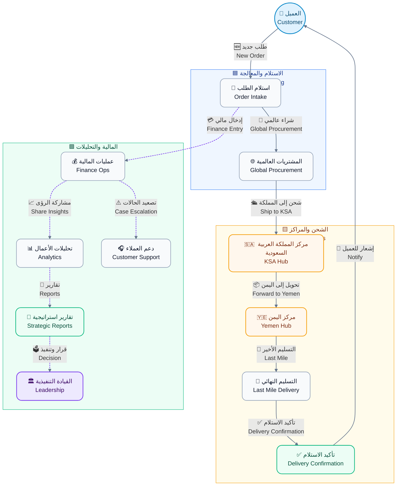
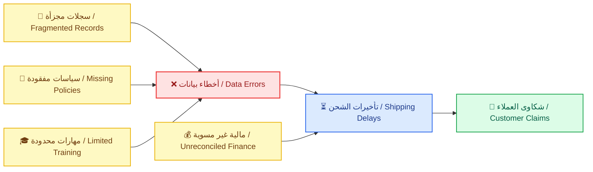
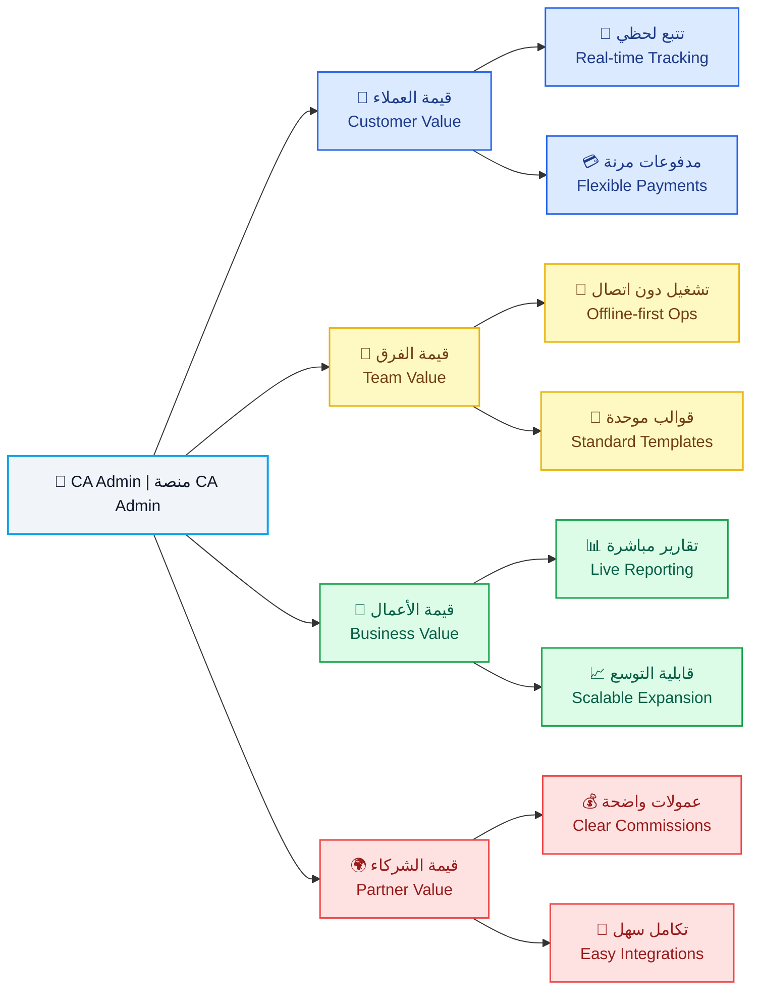
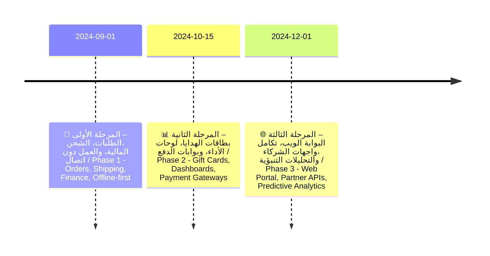

# **📝 وثيقة الرؤية | Vision Document**

---

> 
🗂️ <strong>المشروع:</strong> منصة الوساطة الشرائية CA Admin

> 
<i>🗂️ <strong>Project:</strong> CA Admin Shopping Mediation Platform</i>

> 
🧰 <strong>المكدس التقني:</strong> Flutter، Firebase (Firestore، Auth، Storage، Functions)

> 
<i>🧰 <strong>Tech Stack:</strong> Flutter, Firebase (Firestore, Auth, Storage, Functions)</i>

> 
🏷️ <strong>الإصدار:</strong> 0.1 (رؤية) – المالك: عبدالله الشائف – آخر تحديث: 2025-09-20

> 
<i>🏷️ <strong>Version:</strong> 0.1 (Vision) – Owner: Abdullah Alshaif – Last Updated: 2025-09-20</i>

<strong>النظرة العامة:</strong>

تقدم الوثيقة رؤية شاملة للمنصة، أهدافها، وأساسها التقني لضمان وضوح القيمة لجميع الأطراف.

<i><strong>Overview:</strong></i>

<i>The document provides a comprehensive view of the platform, its goals, and technology foundation to clarify value for every stakeholder.</i>

<table class="doc-table">
  <thead>
    <tr>
      <th class="center">العنصر <i>Element</i></th>
      <th>التفاصيل <i>Details</i></th>
    </tr>
  </thead>
  <tbody>
    <tr>
      <td class="center">
المؤسسة

<i>Organization</i>
</td>
      <td>
الإدارة العامة CA Admin DmG Headquarters

<i>CA Admin DmG Headquarters</i>
</td>
    </tr>
    <tr>
      <td class="center">
نطاق الحل

<i>Solution Scope</i>
</td>
      <td>
منصة وساطة للتسوق عبر الحدود تخدم اليمن والسعودية مع ربط رقمي متكامل

<i>A cross-border shopping mediation platform serving Yemen and Saudi Arabia with integrated digital linkages</i>
</td>
    </tr>
    <tr>
      <td class="center">
الرؤية الإدارية

<i>Management Vision</i>
</td>
      <td>
تسريع الطلبات، الشحن، والمدفوعات عبر مسار رقمي واحد وشفاف

<i>Accelerate orders, shipping, and payments through a single transparent digital lane</i>
</td>
    </tr>
    <tr>
      <td class="center">
الجمهور الأساسي

<i>Primary Audience</i>
</td>
      <td>
المتسوقون، العمليات، المالية، الشركاء، القيادة التنفيذية

<i>Shoppers, operations teams, finance, partners, executive leadership</i>
</td>
    </tr>
  </tbody>
</table>

---

## **1. ℹ️ مقدمة | Introduction**

### **1.1 👁️ نظرة بصرية عامة | Visual Overview**

<strong>الوصف:</strong>

يوضح المخطط رحلة الطلب من إنشاء العميل حتى تسليم الشحنة مع إبراز نقاط التفاعل المالية والتحليلية.

<i><strong>Description:</strong></i>

<i>The diagram shows the order journey from customer initiation to delivery while flagging finance and analytics touchpoints.</i>

### **1.2 🧭 رحلة القيمة المبسطة | Simplified Value Journey**

<strong>الوصف:</strong>

يبيّن المخطط دور كل طرف في كل مرحلة لضمان وضوح المسؤوليات وسرعة التسليم.

<i><strong>Description:</strong></i>

<i>The chart clarifies how each party contributes at every stage to keep responsibilities clear and delivery timely.</i>

### **1.3 🏁 سياق المنصة | Platform Context**

<strong>الوصف:</strong>

يلخص هذا الجزء رسالة المنصة، الشرائح المستفيدة، والمبادئ التصميمية لضمان الاتساق.

<i><strong>Description:</strong></i>

<i>This section outlines the platform mission, beneficiary segments, and design principles to keep the experience consistent.</i>

- 
🎯 <strong>المهمة الأساسية:</strong> تقديم مركز عمليات موحد لإدارة الطلبات، الشحن، والمدفوعات عبر الحدود بسهولة وشفافية.

  
<i>🎯 <strong>Core Mission:</strong> Deliver a unified operations hub that manages cross-border orders, shipping, and payments with ease and transparency.</i>

- 
🧭 <strong>وصف المنصة:</strong> حل متكامل يربط إنشاء الطلب بوثائق الشحن والسجلات المالية دون ازدواجية بيانات.

  
<i>🧭 <strong>Platform Definition:</strong> An integrated solution linking order creation with shipping documents and financial records without data duplication.</i>

- 
🛠️ <strong>الوظيفة الرئيسية:</strong> تنسيق تدفق العمل من الاستلام حتى الإغلاق مع أدوات رقابة وتقارير وأتمتة للمهام الحرجة.

  
<i>🛠️ <strong>Primary Function:</strong> Orchestrate workflow from intake to closure with controls, reporting, and automation for critical tasks.</i>

- 
🏆 <strong>المنفعة المتوقعة:</strong> خفض العمل اليدوي ورفع رضا العملاء عبر مصدر موحد للحقيقة وإشعارات فورية.

  
<i>🏆 <strong>Expected Benefit:</strong> Reduce manual effort and raise customer satisfaction through a single source of truth and instant notifications.</i>

- 
👥 <strong>شرائح الخدمة:</strong> المتسوقون، خدمة العملاء، مشغلو العمليات، فرق المالية، القيادة التنفيذية.

  
<i>👥 <strong>Target Segments:</strong> Shoppers, customer service teams, operations operators, finance teams, executive leadership.</i>

- 
✨ <strong>مبدأ التجربة:</strong> كل رحلة يجب أن تكون قابلة للتتبع، ثنائية اللغة، وقادرة على العمل دون اتصال لضمان التبني.

  
<i>✨ <strong>Experience Principle:</strong> Every journey must be traceable, bilingual, and offline-ready to ensure adoption.</i>

---

## **2. 🚀 لماذا الآن | Why Now**

- 
📈 <strong>تسارع التجارة العابرة للحدود:</strong> تنمو احتياجات الشراء الدولي في اليمن بنسبة ‎35٪‎ سنويًا رغم تحديات البنية التحتية.

  
<i>📈 <strong>Cross-border Commerce Acceleration:</strong> International shopping needs in Yemen grow by 35% annually despite infrastructure hurdles.</i>

  - 
🧩 <strong>الفائدة:</strong> يبرر الاستثمار الفوري في منصة قابلة للتوسع تستوعب النمو وتقدم تجربة موحدة.

    
<i>🧩 <strong>Benefit:</strong> Justifies immediate investment in a scalable platform that absorbs growth and keeps the experience unified.</i>

- 
🗂️ <strong>تشتت العمليات اليدوية:</strong> تتكرر الطلبات في جداول ومحادثات متفرقة مما يهدر الوقت ويصعّب التدقيق.

  
<i>🗂️ <strong>Manual Fragmentation:</strong> Orders repeat across scattered sheets and chats, wasting time and complicating audits.</i>

  - 
🧩 <strong>الفائدة:</strong> يؤكد ضرورة الأتمتة المركزية لتقليل الأخطاء وتسريع المتابعة التشغيلية.

    
<i>🧩 <strong>Benefit:</strong> Underlines the need for centralized automation to cut errors and speed operational follow-up.</i>

- 
🛡️ <strong>توقعات الثقة والامتثال:</strong> يتطلب العملاء والشركاء إيصالات رقمية متوافقة مع اللوائح السعودية واليمنية منذ البداية.

  
<i>🛡️ <strong>Trust &amp; Compliance Expectations:</strong> Customers and partners demand digital receipts aligned with Saudi and Yemeni regulations from day one.</i>

  - 
🧩 <strong>الفائدة:</strong> يدفع لتجهيز ضوابط الحوكمة المبكرة لضمان الامتثال وتقوية سمعة العلامة.

    
<i>🧩 <strong>Benefit:</strong> Drives early governance controls to ensure compliance and reinforce brand reputation.</i>

---

## **3. 🧩 التحديات المحورية | Core Challenges**

- 
🔍 <strong>عمى تشغيلي:</strong> لا يمكن ربط حالة الشحنة بالطلب أو العميل من خلال مصدر واحد مما يؤخر القرارات.

  
<i>🔍 <strong>Operational Blind Spots:</strong> Shipment status cannot be tied to an order or customer within a single source, delaying decisions.</i>

  - 
🧩 <strong>الفائدة:</strong> يحفز بناء لوحة متابعة موحدة ودمج الحالة عبر الأنظمة.

    
<i>🧩 <strong>Benefit:</strong> Encourages building a unified monitoring dashboard and integrating status across systems.</i>

- 
💸 <strong>اختلال السجلات المالية:</strong> التسويات اليدوية وتعدد العملات تؤدي إلى فروقات في الأرصدة وتقارير متعارضة.

  
<i>💸 <strong>Financial Record Confusion:</strong> Manual reconciliations and currency switches create balance gaps and conflicting reports.</i>

  - 
🧩 <strong>الفائدة:</strong> يبرز ضرورة وجود محرك تسوية خفيف يحافظ على التوافق بين الطلبات والمدفوعات.

    
<i>🧩 <strong>Benefit:</strong> Highlights the need for a lightweight reconciliation engine that keeps orders and payments aligned.</i>

- 
🧠 <strong>فجوات المعرفة والإجراءات:</strong> غياب أدلة موحدة يعرقل الإحلال ويخلق تفاوتًا في جودة الخدمة بين المناطق.

  
<i>🧠 <strong>Knowledge &amp; Process Gaps:</strong> Missing playbooks hinder handovers and create uneven service quality across regions.</i>

  - 
🧩 <strong>الفائدة:</strong> يدعم إنشاء أدلة رقمية مدمجة وتدريب متسق داخل النظام.

    
<i>🧩 <strong>Benefit:</strong> Supports building embedded digital playbooks and consistent in-app training.</i>

### **3.1 🎯 الحالة الحالية والمستهدفة | Current vs Target State**

<table class="doc-table">
  <thead>
    <tr>
      <th class="center">البعد <i>Aspect</i></th>
      <th>الحالة الحالية <i>Current State</i></th>
      <th>الحالة المستهدفة <i>Target State</i></th>
    </tr>
  </thead>
  <tbody>
    <tr>
      <td class="center">
الطلبات

<i>Orders</i>
</td>
      <td>
إدخال يدوي مع اعتماد متأخر يؤدي إلى بطء التنفيذ

<i>Manual entry with delayed approvals that slow execution</i>
</td>
      <td>
تدفق رقمي كامل مع إشعارات فورية ومسار تدقيق واضح

<i>Fully digital flow with instant notifications and a clear audit trail</i>
</td>
    </tr>
    <tr>
      <td class="center">
الشحن

<i>Shipping</i>
</td>
      <td>
تحديثات متقطعة بدون أدلة مما يرفع التصعيدات

<i>Irregular updates without evidence escalating disputes</i>
</td>
      <td>
تتبع لحظي مع صور إثبات وتأكيد تسليم موحد

<i>Real-time tracking with proof images and unified delivery confirmation</i>
</td>
    </tr>
    <tr>
      <td class="center">
المالية

<i>Finance</i>
</td>
      <td>
دفاتر متباينة عبر العملات تعرقل التسوية الدقيقة

<i>Disparate ledgers across currencies blocking accurate reconciliation</i>
</td>
      <td>
تسويات مؤتمتة وتحويلات فورية عبر القنوات المعتمدة

<i>Automated reconciliations with instant transfers across approved channels</i>
</td>
    </tr>
    <tr>
      <td class="center">
التقارير

<i>Reporting</i>
</td>
      <td>
تقارير أسبوعية في جداول Excel تحد من الرؤية اللحظية

<i>Weekly Excel reports limiting real-time visibility</i>
</td>
      <td>
لوحات تحليل مباشرة قابلة للتنقيب تدعم القرار السريع

<i>Live drill-down dashboards supporting rapid decision-making</i>
</td>
    </tr>
    <tr>
      <td class="center">
القابلية للتوسع

<i>Scalability</i>
</td>
      <td>
اعتماد على أفراد محددين يهدد الاستمرارية التشغيلية

<i>Dependence on key individuals risking operational continuity</i>
</td>
      <td>
عمليات موثقة قابلة للتكرار مع توزيع أدوار واضح

<i>Documented repeatable processes with clear role distribution</i>
</td>
    </tr>
  </tbody>
</table>

---

## **4. 💡 الرؤية والقيمة | Vision & Value**

- 
👥 <strong>قيمة العملاء:</strong> ضمان مسار واضح من الاستفسار إلى التسليم مع تحديثات لحظية تعزز الثقة والولاء.

  
<i>👥 <strong>Customer Value:</strong> Provide a visible journey from inquiry to delivery with real-time updates that boost trust and loyalty.</i>

- 
🧑 ‍💼 <strong>قيمة فريق العمليات:</strong> مسار عمل موحد يقلل الجهد المكرر ويجعل تدوير الأفراد أكثر سلاسة.

  
<i>🧑 ‍💼 <strong>Operations Team Value:</strong> A unified workflow that removes duplicated effort and smooths staff rotations.</i>

- 
💼 <strong>قيمة الأعمال:</strong> تحويل البيانات التشغيلية إلى لوحات قرار موثوقة تمكّن الإدارة من التوسع بثقة.

  
<i>💼 <strong>Business Value:</strong> Turn operational data into trustworthy decision dashboards enabling confident expansion.</i>

- 
🤝 <strong>قيمة الشركاء:</strong> عمولات واضحة وتكاملات سريعة تعزز الشفافية وتخفض المخاطر المشتركة.

  
<i>🤝 <strong>Partner Value:</strong> Transparent commissions and rapid integrations that enhance transparency and reduce shared risk.</i>

---

## **5. 🎯 الأهداف الاستراتيجية | Strategic Objectives**

- 
💰 <strong>توسيع الإيرادات:</strong> رفع متوسط قيمة الطلب بنسبة ‎20٪‎ عبر الباقات والاشتراكات لدعم الاستثمار المستمر.

  
<i>💰 <strong>Revenue Expansion:</strong> Increase average order value by 20% through bundles and subscriptions to sustain ongoing investment.</i>

  - 
🧩 <strong>الفائدة:</strong> يتيح إطلاق خدمات ملحقة ويعزز هوامش الربح المستهدفة.

    
<i>🧩 <strong>Benefit:</strong> Enables ancillary services and strengthens target profit margins.</i>

- 
⚙️ <strong>التميز التشغيلي:</strong> خفض زمن معالجة الطلب إلى أقل من 60 ثانية عند الاستلام بفضل الأتمتة والتدريب المركز.

  
<i>⚙️ <strong>Operational Excellence:</strong> Cut order processing time below 60 seconds at intake via automation and focused training.</i>

  - 
🧩 <strong>الفائدة:</strong> يحسّن تجربة العميل ويخفض تكاليف التشغيل اليومية.

    
<i>🧩 <strong>Benefit:</strong> Improves customer experience and lowers daily operating costs.</i>

- 
🛡️ <strong>الحوكمة والامتثال:</strong> فرض سياسات أدوار دقيقة وسجل تدقيق لكل معاملة مالية لحماية المنصة.

  
<i>🛡️ <strong>Governance &amp; Compliance:</strong> Enforce precise role policies and audit trails for each financial transaction to protect the platform.</i>

  - 
🧩 <strong>الفائدة:</strong> يقلل التعرض القانوني ويرفع ثقة المنظمين والشركاء.

    
<i>🧩 <strong>Benefit:</strong> Reduces legal exposure and increases regulator and partner confidence.</i>

---

## **6. 🛠️ نطاق الإصدار الأولي | MVP Scope**

- 
📝 <strong>وحدة الطلبات:</strong> إنشاء، تقسيم، وربط الطلبات بمكتبة العملاء والمرفقات لضمان اكتمال البيانات وتاريخها.

  
<i>📝 <strong>Orders Module:</strong> Create, split, and link orders with the customer library and attachments to ensure complete data and history.</i>

  - 
🧩 <strong>الفائدة:</strong> يوفر سجلًا موحدًا يسهل الرجوع إليه ويقلل فقدان المعلومات.

    
<i>🧩 <strong>Benefit:</strong> Provides a unified record that is easy to reference and prevents information loss.</i>

- 
🚚 <strong>متابعة الشحن:</strong> تتبع متعدد المراحل من الشراء حتى التسليم مع طوابع زمنية وأدلة مرفقة للمراجعة.

  
<i>🚚 <strong>Shipment Tracking:</strong> Multi-stage tracking from purchase to delivery with timestamps and evidence attachments for review.</i>

  - 
🧩 <strong>الفائدة:</strong> يقلل الاتصالات المتكررة ويضبط توقعات العملاء.

    
<i>🧩 <strong>Benefit:</strong> Reduces repeated inquiries and aligns customer expectations.</i>

- 
💳 <strong>إدارة المالية:</strong> أرصدة، مدفوعات، تحويلات، وبطاقات هدايا مع سجل تدقيق شامل عبر المواقع.

  
<i>💳 <strong>Finance Management:</strong> Balances, payments, transfers, and gift cards with a comprehensive cross-site audit log.</i>

  - 
🧩 <strong>الفائدة:</strong> يضمن تطابق الأرقام بين المتاجر والبنوك والمستخدمين بشكل فوري.

    
<i>🧩 <strong>Benefit:</strong> Ensures numbers match instantly across stores, banks, and users.</i>

---

## **7. 📊 مؤشرات النجاح (KPIs) | Success Metrics (KPIs)**

<table class="doc-table">
  <thead>
    <tr>
      <th class="center">المؤشر <i>KPI</i></th>
      <th>خط الأساس <i>Baseline</i></th>
      <th>الهدف <i>Target</i></th>
    </tr>
  </thead>
  <tbody>
    <tr>
      <td class="center">
زمن استلام الطلب

<i>Order Intake Time</i>
</td>
      <td>
180 ثانية

<i>180 seconds</i>
</td>
      <td>
≤ 60 ثانية (المئين ‎90‎)

<i>≤ 60 seconds (P90)</i>
</td>
    </tr>
    <tr>
      <td class="center">
حداثة حالة الشحن

<i>Shipment Status Freshness</i>
</td>
      <td>
تحديث كل 8 ساعات

<i>Updates every 8 hours</i>
</td>
      <td>
تحديث كل ساعة

<i>Hourly updates</i>
</td>
    </tr>
    <tr>
      <td class="center">
دقة التسوية المالية

<i>Financial Reconciliation Accuracy</i>
</td>
      <td>
‎92٪‎

<i>92%</i>
</td>
      <td>
≥ ‎99٪‎

<i>≥ 99%</i>
</td>
    </tr>
    <tr>
      <td class="center">
زمن إعداد التقارير

<i>Report Preparation Time</i>
</td>
      <td>
يوم عمل واحد

<i>1 business day</i>
</td>
      <td>
≤ 5 دقائق

<i>≤ 5 minutes</i>
</td>
    </tr>
  </tbody>
</table>

---

## **8. 🗺️ خارطة الإصدارات | Release Roadmap**

---

## **9. ⚠️ المخاطر وخطط التخفيف | Risks & Mitigations**

<table class="doc-table">
  <thead>
    <tr>
      <th class="center">الخطر <i>Risk</i></th>
      <th>التأثير <i>Impact</i></th>
      <th>خطة التخفيف <i>Mitigation</i></th>
    </tr>
  </thead>
  <tbody>
    <tr>
      <td class="center">
تعارض البيانات أثناء المزامنة

<i>Data conflicts during sync</i>
</td>
      <td>
أرصدة غير صحيحة وتعطل التقارير التحليلية

<i>Incorrect balances and disrupted analytics reports</i>
</td>
      <td>
تطبيق تنافس متفائل مع سجل تدقيق مركزي يوفر استرجاعًا دقيقًا للإصدارات

<i>Apply optimistic concurrency with a central audit log to recover accurate versions</i>
</td>
    </tr>
    <tr>
      <td class="center">
حدود فهارس Firestore

<i>Firestore index limits</i>
</td>
      <td>
استعلامات بطيئة تؤثر على أداء المنصة

<i>Slow queries impacting platform performance</i>
</td>
      <td>
تصميم فهارس مركبة مسبقًا وتقسيم البيانات مبكرًا لتوزيع الحمل

<i>Pre-design composite indexes and shard data early to distribute load</i>
</td>
    </tr>
    <tr>
      <td class="center">
أدوار غير مضبوطة

<i>Misconfigured roles</i>
</td>
      <td>
كشف بيانات حساسة أو تنفيذ عمليات غير مصرح بها

<i>Sensitive data exposure or unauthorized operations</i>
</td>
      <td>
إنشاء مصفوفة صلاحيات مدققة مع اختبارات قواعد مستمرة وآلية تنبيه فوري

<i>Create an audited RBAC matrix with continuous rule tests and instant alerting</i>
</td>
    </tr>
    <tr>
      <td class="center">
الاعتماد على أفراد محددين

<i>Dependency on key staff</i>
</td>
      <td>
توقف العمليات عند الغياب أو تبدل الأدوار الحرجة

<i>Operational halt when critical roles are absent or swapped</i>
</td>
      <td>
توثيق الإجراءات، تعيين بدلاء، وتدوير المهام وفق جدول واضح

<i>Document procedures, assign backups, and rotate duties on a defined schedule</i>
</td>
    </tr>
  </tbody>
</table>

---

## **10. 🧾 مسرد المصطلحات | Glossary**

<table class="doc-table">
  <thead>
    <tr>
      <th class="center">المصطلح العربي <i>Arabic Term</i></th>
      <th>المصطلح الإنجليزي <i>English Term</i></th>
      <th>التعريف العربي <i>Definition (AR)</i></th>
      <th>التعريف الإنجليزي <i>Definition (EN)</i></th>
    </tr>
  </thead>
  <tbody>
    <tr>
      <td class="center">
رقم الطلب

<i>Order Number</i>
</td>
      <td>
الاسم بالإنجليزية: Order Number

<i>Order Number</i>
</td>
      <td>
معرف فريد يربط جميع معاملات الطلب داخل النظام لضمان تتبع موحد

<i>A unique identifier linking every order transaction in the system for unified tracking</i>
</td>
      <td>
الوصف بالإنجليزية: Unique identifier linking each order transaction in the system to keep tracking consistent

<i>Unique identifier linking each order transaction in the system to keep tracking consistent</i>
</td>
    </tr>
    <tr>
      <td class="center">
توحيد الشحنات

<i>Shipment Consolidation</i>
</td>
      <td>
الاسم بالإنجليزية: Shipment Consolidation

<i>Shipment Consolidation</i>
</td>
      <td>
دمج عدة طلبات في شحنة واحدة لخفض التكلفة وتسريع المعالجة التشغيلية

<i>Combining multiple orders into one shipment to reduce cost and speed operations</i>
</td>
      <td>
الوصف بالإنجليزية: Merging multiple orders into a single shipment to reduce cost and accelerate processing

<i>Merging multiple orders into a single shipment to reduce cost and accelerate processing</i>
</td>
    </tr>
    <tr>
      <td class="center">
محرك التسوية

<i>Reconciliation Engine</i>
</td>
      <td>
الاسم بالإنجليزية: Reconciliation Engine

<i>Reconciliation Engine</i>
</td>
      <td>
طبقة منطقية تقارن المدفوعات بالطلبات والمخزون لاكتشاف الفروقات الرسمية

<i>A logic layer comparing payments to orders and inventory to detect official variances</i>
</td>
      <td>
الوصف بالإنجليزية: Logic layer comparing payments to orders and inventory to detect discrepancies

<i>Logic layer comparing payments to orders and inventory to detect discrepancies</i>
</td>
    </tr>
    <tr>
      <td class="center">
المطابقة المزدوجة

<i>Dual Matching</i>
</td>
      <td>
الاسم بالإنجليزية: Dual Matching

<i>Dual Matching</i>
</td>
      <td>
خطوة تحقق مشتركة بين مركزي السعودية واليمن قبل التسليم النهائي لضمان التوافق الكامل

<i>A joint verification step between the KSA and Yemen hubs before final delivery to ensure full alignment</i>
</td>
      <td>
الوصف بالإنجليزية: Verification step between the KSA and Yemen hubs before final delivery to guarantee alignment

<i>Verification step between the KSA and Yemen hubs before final delivery to guarantee alignment</i>
</td>
    </tr>
  </tbody>
</table>

---

## **11. 🔗 جدول المواءمة بين الأهداف والقيمة | Objectives vs Value Table**

<strong>الوصف:</strong>

يوضح الجدول كيفية ارتباط الأهداف الاستراتيجية بالقيمة المتحققة لكل فئة لضمان اتساق القرارات الاستثمارية.

<i><strong>Description:</strong></i>

<i>The table shows how strategic objectives translate into value for each group to keep investment decisions aligned.</i>

<table class="doc-table">
  <thead>
    <tr>
      <th class="center">الهدف الاستراتيجي <i>Strategic Objective</i></th>
      <th>قيمة العملاء <i>Customer Value</i></th>
      <th>قيمة الفريق <i>Team Value</i></th>
      <th>قيمة الأعمال <i>Business Value</i></th>
      <th>قيمة الشركاء <i>Partner Value</i></th>
    </tr>
  </thead>
  <tbody>
    <tr>
      <td class="center">
توسيع الإيرادات

<i>Revenue Expansion</i>
</td>
      <td>
عروض مجمعة وخيارات دفع مرنة تزيد الولاء وتكرار الشراء

<i>Bundle offers and flexible payments that grow loyalty and repeat purchases</i>
</td>
      <td>
أدوات تحصيل مبسطة تربط الطلب بالمخزون وتقلل الأخطاء المحاسبية

<i>Simplified collection tools linking orders to inventory that reduce accounting errors</i>
</td>
      <td>
نمو الربحية عبر سلال أعلى ومبيعات متكررة مع رؤية أوضح للهوامش

<i>Profit growth through higher baskets and repeat sales with clearer margin visibility</i>
</td>
      <td>
عمولات واضحة وتقارير مشتركة تعزز ثقة الوسطاء وتسرّع التسويات

<i>Transparent commissions and shared reports that strengthen partner trust and speed settlements</i>
</td>
    </tr>
    <tr>
      <td class="center">
التميز التشغيلي

<i>Operational Excellence</i>
</td>
      <td>
خدمة أسرع مع تحديثات حالة فورية تقلل قلق العملاء وتعزز رضاهم

<i>Faster service with real-time updates reducing customer anxiety and boosting satisfaction</i>
</td>
      <td>
مسار عمل موحد يقلل الجهد المكرر ويعجّل دمج الموظفين الجدد

<i>Unified workflow removing duplicate effort and accelerating onboarding</i>
</td>
      <td>
خفض التكاليف عبر أتمتة المهام الروتينية وتحسين الإنتاجية اليومية

<i>Cost reduction by automating routine tasks and improving daily productivity</i>
</td>
      <td>
تكامل أسهل وخفض الحاجة إلى المتابعة اليدوية المكلفة في المشاريع المشتركة

<i>Streamlined integrations with less costly manual follow-up in joint projects</i>
</td>
    </tr>
    <tr>
      <td class="center">
الحوكمة والامتثال

<i>Governance &amp; Compliance</i>
</td>
      <td>
شفافية كاملة في حقوق العميل وإشعاراته مما يعزز الثقة والاحتفاظ

<i>Full transparency on customer rights and notifications that improve trust and retention</i>
</td>
      <td>
سياسات دقيقة تقلل الأخطاء البشرية وتوضح مسؤوليات كل فريق

<i>Precise policies reducing human error and clarifying each team’s responsibilities</i>
</td>
      <td>
حماية قانونية وتقارير تدقيق جاهزة تدعم القرارات السريعة والاستثمارات الجديدة

<i>Legal protection and audit-ready reports supporting rapid decisions and new investments</i>
</td>
      <td>
ثقة أعلى لدى الشركاء والجهات المنظمة بفضل الالتزام الموثق والرقابة المستمرة

<i>Greater trust from partners and regulators through documented compliance and continuous oversight</i>
</td>
    </tr>
  </tbody>
</table>
