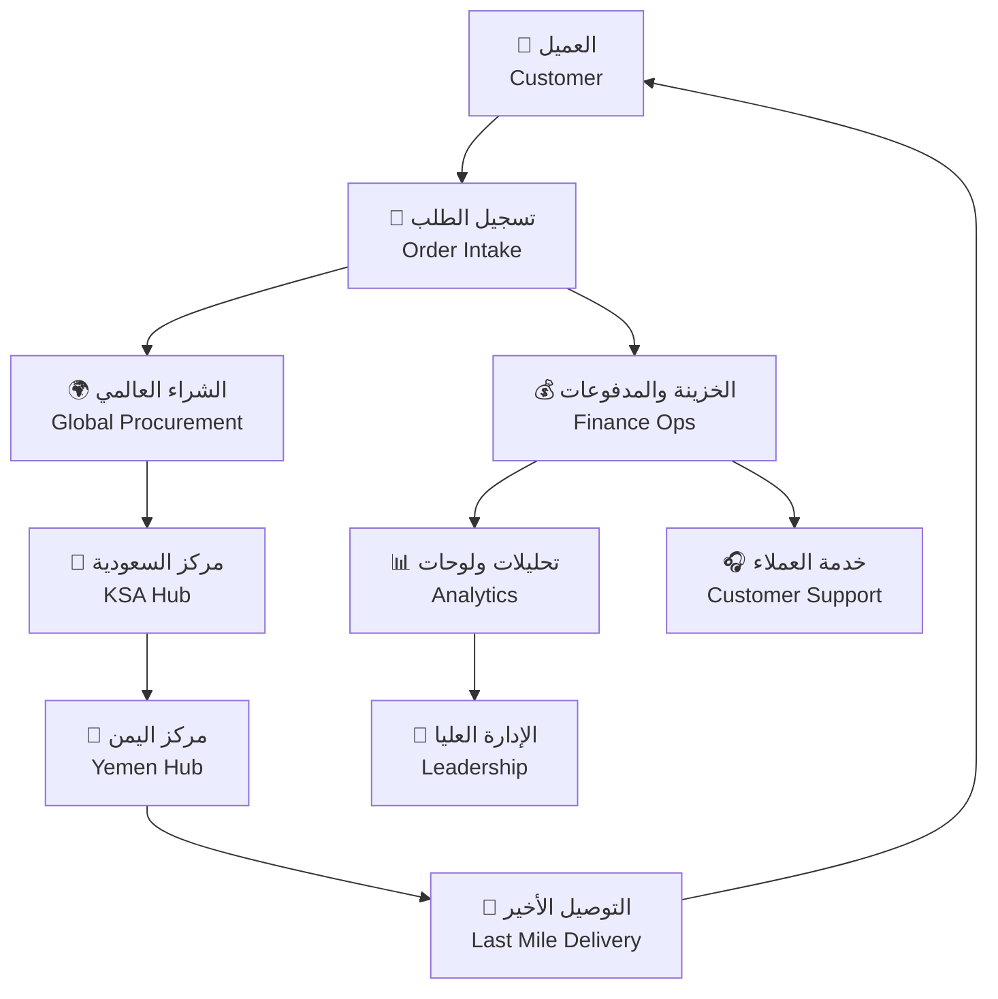
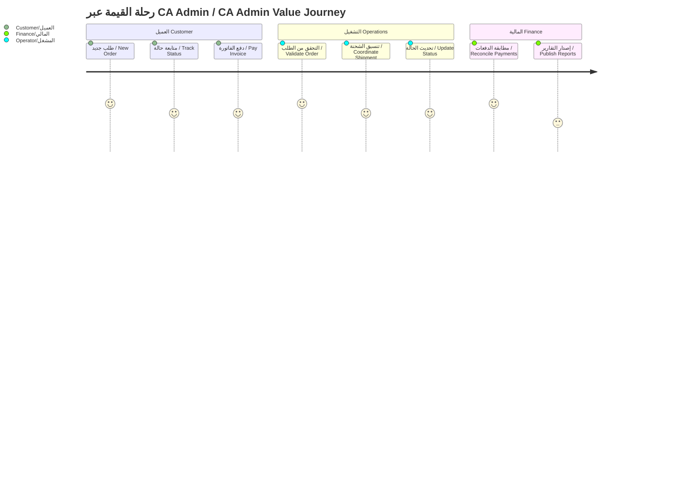
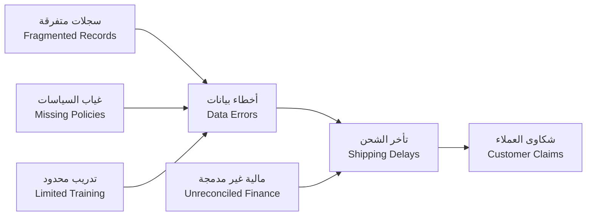
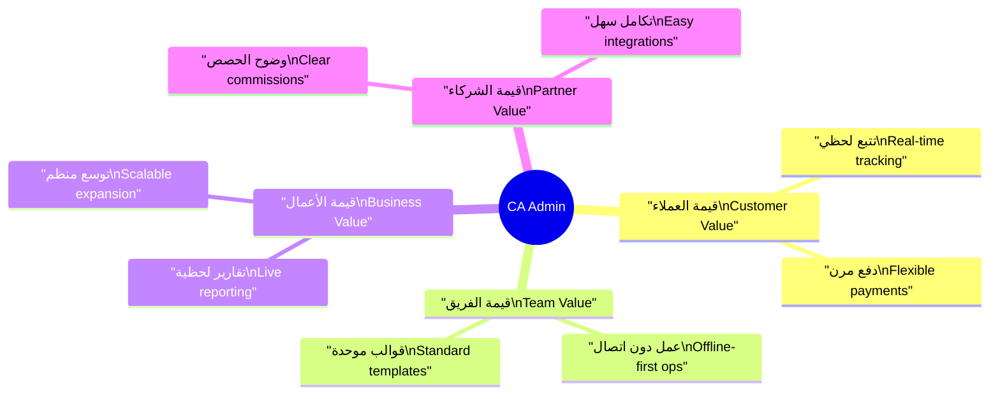
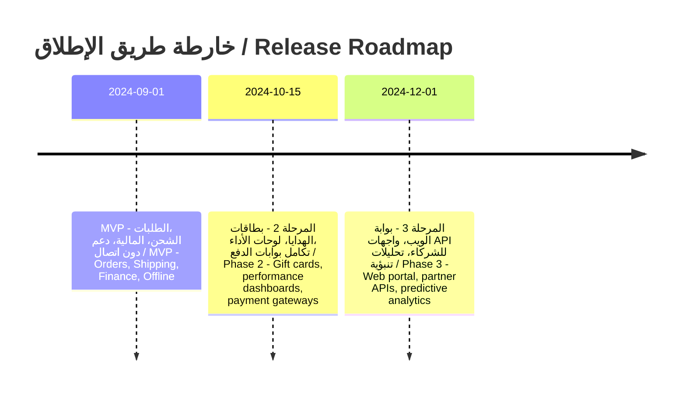

# 📝 وثيقة الرؤية

Vision Document

---

> **المشروع:** منصة إدارة وساطة التسوق CA Admin  
> **Project:** CA Admin Shopping Mediation Platform  
> **التقنيات:** Flutter، Firebase (Firestore، Auth، Storage، Functions)  
> **Stack:** Flutter, Firebase (Firestore, Auth, Storage, Functions)  
> **الإصدار:** 0.1 (رؤية) - المالك: عبدالله الشائف - آخر تحديث: 2025-09-20  
> **Version:** 0.1 (Vision) - Owner: Abdullah Alshaif - Last Updated: 2025-09-20

**شرح مختصر:**
توثيق الرؤية يحدد أهداف المنصة، التقنيات المستخدمة، ويعطي نظرة شاملة عن المشروع.

**Summary:**
Vision documentation defines platform goals, used technologies, and provides a comprehensive project overview.

---

## 1. مقدمة

Introduction

---

### 1.1 نظرة بصرية عامة

Visual Overview

**شرح مختصر:**
يوضح المخطط تدفق الطلب من العميل حتى التسليم النهائي، مع إبراز نقاط الإدارة المالية والدعم والتحليل.

**Summary:**
The diagram shows order flow from customer to final delivery, highlighting finance, support, and analytics points.

### 1.2 رحلة القيمة المبسطة

Simplified Value Journey

**شرح مختصر:**
يوضح المخطط رحلة العميل من الطلب حتى الدفع، ودور العمليات والمالية في كل مرحلة.

**Summary:**
The diagram illustrates the customer journey from order to payment, and the role of operations and finance at each stage.

### 1.3 سياق المنصة

Platform Context

**شرح مختصر:**
يحدد هذا القسم مهمة المنصة، الشرائح المستهدفة، ومبادئ تجربة المستخدم.

**Summary:**
This section defines the platform mission, target segments, and user experience principles.

- **المهمة الأساسية:** تقديم تجربة موحدة لإدارة الطلبات والشحنات والمدفوعات عبر الحدود.
- **Core Mission:** Deliver a unified experience for managing cross-border orders, shipments, and payments.
- **ما هي:** تعريف واضح للمنصة بصفتها مركز عمليات موحد للتسوق الدولي الموجّه للسوق اليمني.
- **What:** Clear definition of the platform as a unified operations hub for international shopping focused on the Yemeni market.
- **وظيفتها:** تنسق تدفق الطلب من إنشائه وحتى التسليم مع مزامنة مالية ولغوية ثنائية.
- **Function:** Coordinates the flow from order creation to delivery while synchronizing financial records and bilingual communication.
- **فائدتها:** تقلل الأعمال اليدوية وتضمن رؤية واحدة لكل الأطراف مما يرفع رضا العملاء.
- **Benefit:** Cuts manual work and provides a single source of truth for all parties, increasing customer satisfaction.

- **شرائح الخدمة المستهدفة:** عملاء التجزئة، موظفو خدمة العملاء، المشغلون، الإدارة المالية، والإدارة العليا.
- **Target Service Segments:** Retail customers, customer service staff, operators, finance teams, and leadership.
- **ما هي:** قائمة واضحة بالأطراف التي تتفاعل مع النظام يوميا.
- **What:** A clear list of actors who interact with the system daily.
- **وظيفتها:** توجيه التصميم لضمان تلبية احتياجات كل شريحة بأدوات وواجهات ملائمة.
- **Function:** Guides design to meet each segment needs with appropriate tools and interfaces.
- **فائدتها:** يمنع انحياز التطوير لشريحة واحدة ويحافظ على توازن القيمة.
- **Benefit:** Prevents development bias toward a single group and keeps value balanced.

- **مبدأ التجربة:** كل رحلة يجب أن تكون قابلة للتتبع، مترجمة، وقابلة للعمل دون اتصال كامل.
- **Experience Principle:** Every journey must be traceable, bilingual, and resilient to offline conditions.
- **ما هي:** معيار تصميم يحدد كيفية بناء التفاعلات والواجهات.
- **What:** A design standard that dictates how interactions and interfaces are built.
- **وظيفتها:** يفرض أن كل خطوة تسجل بيانات دقيقة وتعرض للمستخدم بحسب لغته وحالته.
- **Function:** Enforces recording accurate data at each step and presenting it in the relevant language and context.
- **فائدتها:** يضمن تجربة موثوقة في بيئات ذات اتصال متقطع ويخفض التدريب المطلوب.
- **Benefit:** Ensures a reliable experience in intermittent connectivity and reduces training needs.

---

## 2. لماذا الآن / Why Now

- 🇸🇦 **تسارع التجارة العابرة للحدود:** الطلب على الشراء الدولي في اليمن ينمو 35% سنويا رغم ضعف البنية التحتية.  
  🇬🇧 **Cross-border commerce acceleration:** International shopping demand in Yemen grows 35% yearly despite infrastructure gaps.  
  🇸🇦 **ما هي:** إحصائية أساسية توضح سياق التوسع في السوق الإقليمي.  
  🇬🇧 **What:** A core metric describing the expanding regional market context.  
  🇸🇦 **وظيفتها:** تبرر الاستثمار في منصة قادرة على التوسع ومتابعة النمو.  
  🇬🇧 **Function:** Justifies investing in a platform capable of scaling with market growth.  
  🇸🇦 **فائدتها:** تمنح أصحاب القرار ثقة في العائد المتوقع من بناء المنصة الآن.  
  🇬🇧 **Benefit:** Gives decision makers confidence in expected returns from building the platform now.

- 🇸🇦 **تشتت العمليات اليدوية:** يتكرر تسجيل الطلبات في جداول متفرقة ومحادثات مما يصعب المتابعة والتدقيق.  
  🇬🇧 **Manual fragmentation:** Orders get duplicated across spreadsheets and chats, making tracking and auditing difficult.  
  🇸🇦 **ما هي:** وصف للمعاناة اليومية في الوضع الحالي لدى الفريق التشغيلي.  
  🇬🇧 **What:** Description of daily pain experienced by the operations team.  
  🇸🇦 **وظيفتها:** توضح حجم الهدر والوقت الضائع الناتج عن العمليات الحالية.  
  🇬🇧 **Function:** Highlights the waste and lost time caused by current processes.  
  🇸🇦 **فائدتها:** تساعد في تحديد أولويات الأتمتة والرقمنة في خارطة الطريق.  
  🇬🇧 **Benefit:** Helps prioritize automation and digitization in the roadmap.

- 🇸🇦 **متطلبات الثقة والامتثال:** العملاء والموردون يطالبون بتوثيق فوري وإيصالات رقمية تتماشى مع المعايير السعودية واليمنية.  
  🇬🇧 **Trust and compliance expectations:** Customers and suppliers demand instant documentation and digital receipts aligned with Saudi and Yemeni regulations.  
  🇸🇦 **ما هي:** معايرة أمنية وقانونية يجب الالتزام بها من اليوم الأول.  
  🇬🇧 **What:** Security and legal calibration that must be respected from day one.  
  🇸🇦 **وظيفتها:** تحدد الحدود الدنيا للحوكمة والرقابة في التصميم المعماري.  
  🇬🇧 **Function:** Sets the minimum governance and control criteria for the architecture.  
  🇸🇦 **فائدتها:** تقلل مخاطر الغرامات وتزيد ثقة الشركاء عند الإطلاق.  
  🇬🇧 **Benefit:** Reduces fine risks and increases partner trust at launch.

---

## 3. التحديات الأساسية / Core Challenges

- 🇸🇦 **ضعف الرؤية التشغيلية:** لا يمكن ربط حالة الشحنة بالطلب أو العميل في مصدر واحد.  
  🇬🇧 **Operational blind spots:** Shipment status cannot be tied to an order or customer in a single source.  
  🇸🇦 **ما هي:** فجوة بيانات ناتجة عن مصادر غير مترابطة ومخازن معلومات شخصية.  
  🇬🇧 **What:** Data gap caused by siloed sources and personal data stores.  
  🇸🇦 **وظيفتها:** تكشف السبب الجذري لتأخر اتخاذ القرار وتصاعد البلاغات.  
  🇬🇧 **Function:** Exposes the root cause of delayed decisions and recurring escalations.  
  🇸🇦 **فائدتها:** توجّه بناء لوحة قيادة موحدة وتكامل حالات الشحن.  
  🇬🇧 **Benefit:** Directs the creation of a unified dashboard and status integration.

- 🇸🇦 **ارتباك السجلات المالية:** التسويات اليدوية والأخطاء في العملات تؤدي إلى تضارب الأرصدة.  
  🇬🇧 **Financial record confusion:** Manual reconciliations and currency errors cause balance discrepancies.  
  🇸🇦 **ما هي:** مشكلة متكررة عند تجميع المدفوعات والتحويلات بين السعودية واليمن.  
  🇬🇧 **What:** Recurring issue when aggregating payments and transfers between KSA and Yemen.  
  🇸🇦 **وظيفتها:** تبرز الحاجة إلى محرك محاسبي مبسط داخل التطبيق.  
  🇬🇧 **Function:** Highlights the need for a lightweight accounting engine inside the app.  
  🇸🇦 **فائدتها:** تقلل زمن الإغلاق المالي وتدعم الثقة مع الشركاء والمراجعين.  
  🇬🇧 **Benefit:** Cuts financial closing time and supports trust with partners and auditors.

- 🇸🇦 **فجوة المعرفة والإجراءات:** لا توجد خطط تدريب أو أدلة موحدة لتسليم المعرفة.  
  🇬🇧 **Knowledge and process gaps:** No training plans or unified playbooks exist for knowledge transfer.  
  🇸🇦 **ما هي:** ثغرة تنظيمية تظهر عند انضمام موظفين جدد أو توزيع المهام.  
  🇬🇧 **What:** Organizational gap evident when onboarding new staff or delegating tasks.  
  🇸🇦 **وظيفتها:** تفسر تباين جودة الخدمة بين الفرق والمناطق.  
  🇬🇧 **Function:** Explains inconsistent service quality between teams and regions.  
  🇸🇦 **فائدتها:** تدفع لوضع أدلة إجرائية داخل النظام وتكاملها مع التدريب.  
  🇬🇧 **Benefit:** Drives the creation of in-system playbooks and embedded training.

### 3.1 مقارنة الحالة الحالية والمستهدفة / Current vs Target State

| 🇸🇦 البعد | 🇬🇧 Aspect   | 🇸🇦 الوضع الحالي            | 🇬🇧 Current State                    | 🇸🇦 الوضع المستهدف            | 🇬🇧 Target State                                 |
| -------- | ----------- | -------------------------- | ----------------------------------- | ---------------------------- | ----------------------------------------------- |
| الطلبات  | Orders      | إدخال يدوي وتأخر الموافقات | Manual entry with delayed approvals | رقمي بإشعارات فورية          | Digital with instant notifications              |
| الشحن    | Shipping    | تحديثات غير منتظمة         | Irregular updates                   | تتبع لحظي مع صور الأدلة      | Real-time tracking with proof images            |
| المالية  | Finance     | دفاتر متفرقة بعملات مختلفة | Disparate ledgers across currencies | تسويات مؤتمتة وتحويلات لحظية | Automated reconciliations and instant transfers |
| التقارير | Reporting   | تقارير أسبوعية عبر إكسل    | Weekly Excel reports                | لوحات حية قابلة للتعمق       | Live drill-down dashboards                      |
| التوسع   | Scalability | يعتمد على أفراد محددين     | Dependent on specific individuals   | عمليات موثقة وقابلة للتكرار  | Documented, repeatable processes                |

---

## 4. الرؤية والقيمة / Vision & Value

- 🇸🇦 **قيمة العميل:** ضمان شفافية الطلب من الاستعلام حتى التسليم مع قنوات دعم متعددة.  
  🇬🇧 **Customer value:** Guarantee transparent orders from inquiry to delivery with multi-channel support.  
  🇸🇦 **ما هي:** وعد خدمة يحدد توقعات العميل النهائي.  
  🇬🇧 **What:** Service promise that sets end-customer expectations.  
  🇸🇦 **وظيفتها:** تستخدم لتصميم واجهة المستخدم وتحديد مؤشرات الرضا.  
  🇬🇧 **Function:** Used to design UI and define satisfaction indicators.  
  🇸🇦 **فائدتها:** تخلق ولاء مستداما وتزيد الإحالات العضوية.  
  🇬🇧 **Benefit:** Generates lasting loyalty and boosts organic referrals.

- 🇸🇦 **قيمة الفريق التشغيلي:** توفير مسار موحد لخدمة العملاء، تجهيز الطلب، وإدارة الشحنات.  
  🇬🇧 **Operations team value:** Provide a unified lane for customer care, order preparation, and shipment management.  
  🇸🇦 **ما هي:** إطار عمل يومي يسهل على الفرق الالتزام به دون تعقيد إضافي.  
  🇬🇧 **What:** A daily working framework that teams can follow without extra complexity.  
  🇸🇦 **وظيفتها:** يقلل ازدواجية الجهد ويجعل التناوب بين الموظفين سلسا.  
  🇬🇧 **Function:** Reduces duplicated effort and makes staff rotation smoother.  
  🇸🇦 **فائدتها:** يخفض تكاليف التدريب ويزيد القدرة على التعامل مع الذروة.  
  🇬🇧 **Benefit:** Lowers training costs and increases peak handling capacity.

- 🇸🇦 **قيمة الأعمال:** تحويل البيانات التشغيلية إلى لوحات قرارات وتمكين التوسع إلى أسواق جديدة.  
  🇬🇧 **Business value:** Turn operational data into decision dashboards and enable expansion into new markets.  
  🇸🇦 **ما هي:** رؤية الإدارة العليا لكيفية استثمار المنصة في النمو.  
  🇬🇧 **What:** Leadership vision for leveraging the platform to drive growth.  
  🇸🇦 **وظيفتها:** تحدد أولويات الاستثمار في التحليلات والتكاملات.  
  🇬🇧 **Function:** Sets investment priorities in analytics and integrations.  
  🇸🇦 **فائدتها:** يزيد هامش الربح ويبرر البحث عن تمويل أو شراكات إضافية.  
  🇬🇧 **Benefit:** Expands profit margins and justifies pursuing extra funding or partnerships.

---

## 5. الأهداف الإستراتيجية / Strategic Objectives

- 🇸🇦 **توسيع العائد:** زيادة متوسط قيمة الطلب بنسبة 20% عبر عروض تجميعية واشتراكات.  
  🇬🇧 **Revenue expansion:** Increase average order value by 20% through bundle offers and subscriptions.  
  🇸🇦 **ما هي:** هدف مالي يوجه تطوير المزايا المدفوعة.  
  🇬🇧 **What:** Financial target guiding development of monetized features.  
  🇸🇦 **وظيفتها:** يوفر معيارا لمتابعة أثر التحسينات على الأرباح.  
  🇬🇧 **Function:** Provides a benchmark to monitor improvements on profitability.  
  🇸🇦 **فائدتها:** يدعم استدامة المنصة ويعزز صورتها أمام المستثمرين.  
  🇬🇧 **Benefit:** Sustains the platform and strengthens perception among investors.

- 🇸🇦 **تفوق تشغيلي:** تقليل زمن معالجة الطلب إلى أقل من 60 ثانية عند نقطة الإدخال.  
  🇬🇧 **Operational excellence:** Reduce order processing time to under 60 seconds at intake.  
  🇸🇦 **ما هي:** مؤشر أداء يرتبط مباشرة بإنتاجية فريق الخدمة.  
  🇬🇧 **What:** Performance indicator tied directly to service team productivity.  
  🇸🇦 **وظيفتها:** يساعد في تقييم جدوى الأتمتة وفعالية التدريب.  
  🇬🇧 **Function:** Helps evaluate automation ROI and training effectiveness.  
  🇸🇦 **فائدتها:** يضمن تجربة عميل سلسة ويخفض تكاليف التشغيل.  
  🇬🇧 **Benefit:** Ensures a smooth customer experience and lowers operational cost.

- 🇸🇦 **حوكمة وامتثال:** الالتزام بسياسة صلاحيات دقيقة وتدقيق كامل لكل معاملة مالية.  
  🇬🇧 **Governance and compliance:** Enforce precise role policies and full audit trails for each financial transaction.  
  🇸🇦 **ما هي:** متطلب تنظيمي يحدد الحد الأدنى للضوابط.  
  🇬🇧 **What:** Regulatory requirement defining minimum controls.  
  🇸🇦 **وظيفتها:** تحمي المنصة من إساءة الاستخدام وتسهّل التدقيق الخارجي.  
  🇬🇧 **Function:** Protects the platform from misuse and simplifies external audits.  
  🇸🇦 **فائدتها:** يقلل المخاطر القانونية ويحافظ على سمعة العلامة.  
  🇬🇧 **Benefit:** Reduces legal exposure and maintains brand reputation.

---

## 6. نطاق الإصدار الأولي / MVP Scope

- 🇸🇦 **وحدة الطلبات:** إنشاء، تقسيم، وربط الطلبات مع مكتبة العملاء والمرفقات.  
  🇬🇧 **Orders module:** Create, split, and link orders with the customer library and attachments.  
  🇸🇦 **ما هي:** مجموعة الوظائف الأساسية لمعالجة الطلب منذ دخوله.  
  🇬🇧 **What:** Core functions for handling an order from intake.  
  🇸🇦 **وظيفتها:** تمكّن الفريق من متابعة الطلبات وتوثيق كافة التفاصيل.  
  🇬🇧 **Function:** Enables staff to track orders and document all details.  
  🇸🇦 **فائدتها:** تمنع ضياع المعلومات وتسرّع الاستجابة لشكاوى العملاء.  
  🇬🇧 **Benefit:** Prevents information loss and accelerates responses to customer issues.

- 🇸🇦 **تتبع الشحنات:** حالات متعددة من الشراء حتى التسليم مع إثباتات زمنية ومرفقات.  
  🇬🇧 **Shipment tracking:** Multiple statuses from purchase to delivery with timestamps and attachments.  
  🇸🇦 **ما هي:** خط زمني يوضح موقع كل شحنة في أي لحظة.  
  🇬🇧 **What:** Timeline showing every shipment's position at any moment.  
  🇸🇦 **وظيفتها:** يمنح الفرق رؤية موحدة لإدارة توقعات العملاء.  
  🇬🇧 **Function:** Gives teams a unified view to manage customer expectations.  
  🇸🇦 **فائدتها:** يقلل المكالمات المتكررة ويزيد ثقة العميل في الخدمة.  
  🇬🇧 **Benefit:** Cuts repetitive calls and boosts customer trust.

- 🇸🇦 **إدارة المالية:** أرصدة، دفعات، تحويلات، وكروت هدايا مع سجل تدقيق كامل.  
  🇬🇧 **Finance management:** Balances, payments, transfers, and gift cards with a full audit log.  
  🇸🇦 **ما هي:** قلب النظام المحاسبي المبسط داخل التطبيق.  
  🇬🇧 **What:** The heart of the lightweight accounting system inside the app.  
  🇸🇦 **وظيفتها:** تضمن تطابق الأرقام بين المتاجر، البنوك، والمستخدمين.  
  🇬🇧 **Function:** Ensures numbers match across stores, banks, and users.  
  🇸🇦 **فائدتها:** تدعم القرارات الفورية وتقلل الأخطاء البشرية.  
  🇬🇧 **Benefit:** Supports instant decisions and reduces human error.

---

## 7. مقاييس النجاح / Success Metrics (KPIs)

| 🇸🇦 المؤشر             | 🇬🇧 KPI                          | 🇸🇦 خط الأساس     | 🇬🇧 Baseline           | 🇸🇦 الهدف          | 🇬🇧 Target             |
| --------------------- | ------------------------------- | ---------------- | --------------------- | ----------------- | --------------------- |
| زمن التقاط الطلب      | Order Intake Time               | 180 ثانية        | 180 seconds           | <= 60 ثانية (P90) | <= 60 seconds (P90)   |
| حداثة حالة الشحنة     | Shipment Status Freshness       | تحديث كل 8 ساعات | Updates every 8 hours | تحديث كل ساعتين   | Updates every 2 hours |
| أخطاء التسوية المالية | Financial Reconciliation Errors | 12 أخطاء/أسبوع   | 12 errors/week        | <= 1 خطأ/أسبوع    | <= 1 error/week       |
| رضا العملاء           | Customer Satisfaction           | 68% NPS          | 68% NPS               | >= 85% NPS        | >= 85% NPS            |
| زمن إعداد التقرير     | Report Preparation Time         | 1 يوم عمل        | 1 business day        | <= 5 دقائق        | <= 5 minutes          |

---

## 8. خارطة الطريق / Release Roadmap

---

## 9. المخاطر والتخفيف / Risks & Mitigations

| 🇸🇦 الخطر                      | 🇬🇧 Risk                    | 🇸🇦 الأثر                 | 🇬🇧 Impact                   | 🇸🇦 خطة التخفيف                           | 🇬🇧 Mitigation                                    |
| ----------------------------- | -------------------------- | ------------------------ | --------------------------- | ---------------------------------------- | ------------------------------------------------ |
| تضارب البيانات أثناء المزامنة | Data conflicts during sync | أرصدة خاطئة              | Incorrect balances          | إستراتيجية تسوية متفائلة مع سجل تدقيق    | Optimistic concurrency with audit log            |
| حدود فهارس Firestore          | Firestore index limits     | بطء في الاستعلام         | Slow queries                | تصميم فهارس مركبة مسبقة وتقطيع البيانات  | Pre-designed composite indexes and data sharding |
| سوء ضبط الصلاحيات             | Misconfigured roles        | كشف بيانات حساسة         | Sensitive data exposure     | مصفوفة صلاحيات مدققة واختبارات قواعد     | Audited RBAC matrix and rule tests               |
| الاعتماد على أفراد محددين     | Dependency on key staff    | توقف العمليات عند الغياب | Operations halt when absent | توثيق الإجراءات وتوزيع المهام الاحتياطية | Document procedures and assign backups           |

---

## 10. مسرد المصطلحات / Glossary

| 🇸🇦 المصطلح        | 🇬🇧 Term                | 🇸🇦 التعريف                                            | 🇬🇧 Definition                                                |
| ----------------- | ---------------------- | ----------------------------------------------------- | ------------------------------------------------------------ |
| رقم الطلب         | Order Number           | رمز فريد يربط جميع الحركات الخاصة بالطلب              | Unique identifier that links all order transactions          |
| تجميع الشحنات     | Shipment Consolidation | دمج طلبات متعددة في شحنة واحدة لتقليل التكلفة         | Merging multiple orders into one shipment to reduce cost     |
| محرك التسوية      | Reconciliation Engine  | طبقة منطقية تقارن المدفوعات بالطلبات والمخزون         | Logic layer comparing payments to orders and inventory       |
| المطابقة المزدوجة | Dual Matching          | خطوة التحقق بين مركز السعودية ومركز اليمن قبل التسليم | Verification step between KSA and Yemen hubs before delivery |
