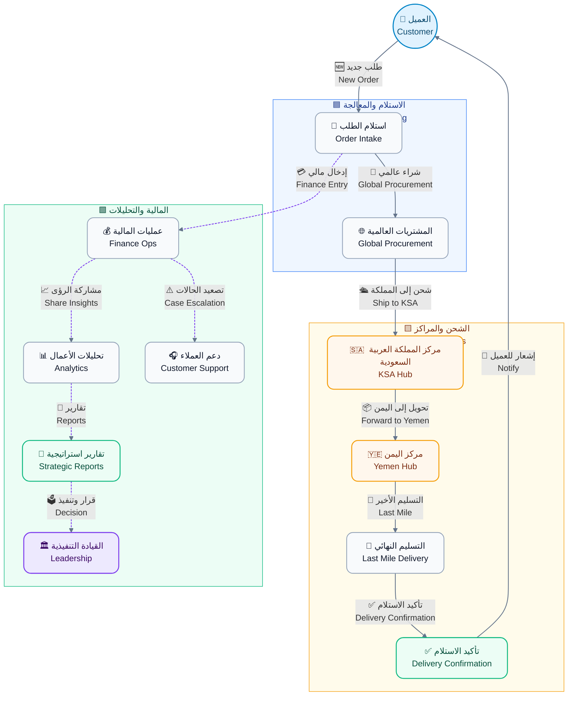
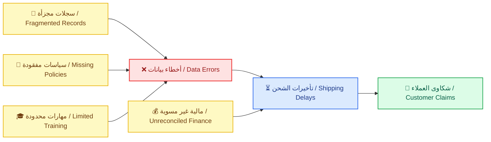
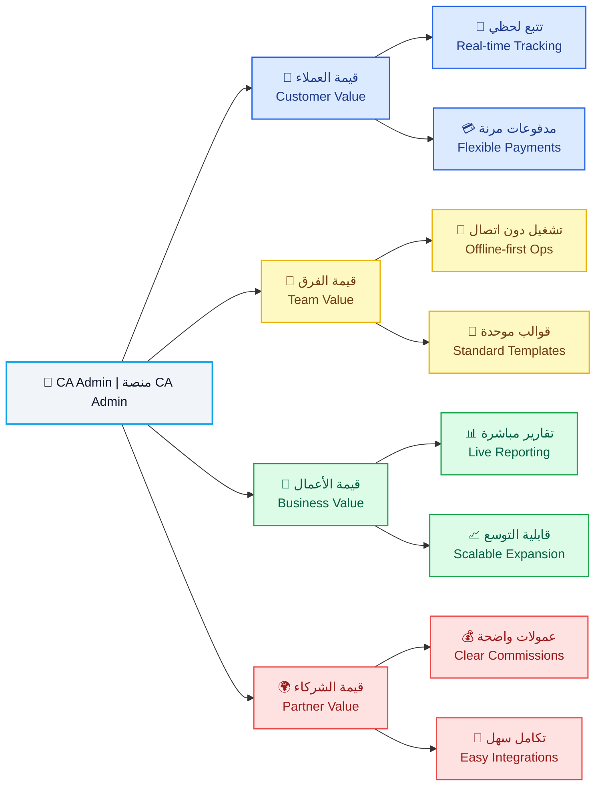
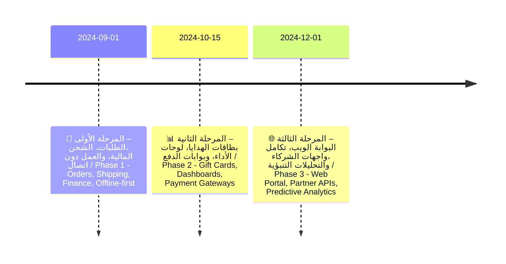

# 📝 وثيقة الرؤية | Vision Document

---

> **🗂️ المشروع | Project**
>
> منصة الوساطة الشرائية **CA Admin**  
> CA Admin Shopping Mediation Platform
>
> **🧰 المكدس التقني | Tech Stack**
>
> - Flutter
> - Firebase (Firestore, Auth, Storage, Functions)
>
> **🏷️ الإصدار | Version**
>
> 0.1 (رؤية) – المالك: **عبدالله الشايف** – آخر تحديث: **2025-09-20**  
> 0.1 (Vision) – Owner: **Abdullah Alshaif** – Last Updated: **2025-09-20**

---

## 👀 النظرة العامة | Overview

- تقدم الوثيقة رؤية شاملة للمنصة، أهدافها، وأساسها التقني لضمان وضوح القيمة لجميع الأطراف.  
  The document provides a comprehensive view of the platform, its goals, and technology foundation to clarify value for every stakeholder.

---

## 📊 العناصر الرئيسية | Key Elements

| العنصر 🏷️                                       | التفاصيل                                                                                                                                                                                     |
| ----------------------------------------------- | -------------------------------------------------------------------------------------------------------------------------------------------------------------------------------------------- |
| 🏢 **المؤسسة** **Organization**              | الإدارة العامة **CA Admin DmG Headquarters**   **CA Admin DmG Headquarters**                                                                                                              |
| 🌐 **نطاق الحل** **Solution Scope**          | منصة وساطة للتسوق عبر الحدود تخدم **اليمن والسعودية** مع ربط رقمي متكامل   A cross-border shopping mediation platform serving **Yemen and Saudi Arabia** with integrated digital linkages |
| 🚀 **الرؤية الإدارية** **Management Vision** | تسريع الطلبات، الشحن، والمدفوعات عبر **مسار رقمي واحد وشفاف**   Accelerate orders, shipping, and payments through a **single transparent digital lane**                                   |
| 🎯 **الجمهور الأساسي** **Primary Audience**  | المتسوقون، فرق العمليات، المالية، الشركاء، القيادة التنفيذية   Shoppers, operations teams, finance, partners, executive leadership                                                        |

---

## 1. ℹ️ مقدمة | Introduction

### 1.1 👁️ نظرة بصرية عامة | Visual Overview

**الوصف:**
يوضح المخطط رحلة الطلب من إنشاء العميل حتى تسليم الشحنة مع إبراز نقاط التفاعل المالية والتحليلية.
**Description:**
The diagram shows the order journey from customer initiation to delivery while flagging finance and analytics touchpoints.

### 1.2 🧭 رحلة القيمة المبسطة | Simplified Value Journey

**الوصف:**
يبيّن المخطط دور كل طرف في كل مرحلة لضمان وضوح المسؤوليات وسرعة التسليم.
**Description:**
The chart clarifies how each party contributes at every stage to keep responsibilities clear and delivery timely.

### 1.3 🏁 سياق المنصة | Platform Context

**الوصف:**
يلخص هذا الجزء رسالة المنصة، الشرائح المستفيدة، والمبادئ التصميمية لضمان الاتساق.
**Description:**
This section outlines the platform mission, beneficiary segments, and design principles to keep the experience consistent.

- 🎯 **المهمة الأساسية:** تقديم مركز عمليات موحد لإدارة الطلبات، الشحن، والمدفوعات عبر الحدود بسهولة وشفافية.
  🎯 **Core Mission:** Deliver a unified operations hub that manages cross-border orders, shipping, and payments with ease and transparency.
- 🧭 **وصف المنصة:** حل متكامل يربط إنشاء الطلب بوثائق الشحن والسجلات المالية دون ازدواجية بيانات.
  🧭 **Platform Definition:** An integrated solution linking order creation with shipping documents and financial records without data duplication.
- 🛠️ **الوظيفة الرئيسية:** تنسيق تدفق العمل من الاستلام حتى الإغلاق مع أدوات رقابة وتقارير وأتمتة للمهام الحرجة.
  🛠️ **Primary Function:** Orchestrate workflow from intake to closure with controls, reporting, and automation for critical tasks.
- 🏆 **المنفعة المتوقعة:** خفض العمل اليدوي ورفع رضا العملاء عبر مصدر موحد للحقيقة وإشعارات فورية.
  🏆 **Expected Benefit:** Reduce manual effort and raise customer satisfaction through a single source of truth and instant notifications.
- 👥 **شرائح الخدمة:** المتسوقون، خدمة العملاء، مشغلو العمليات، فرق المالية، القيادة التنفيذية.
  👥 **Target Segments:** Shoppers, customer service teams, operations operators, finance teams, executive leadership.
- ✨ **مبدأ التجربة:** كل رحلة يجب أن تكون قابلة للتتبع، ثنائية اللغة، وقادرة على العمل دون اتصال لضمان التبني.
  ✨ **Experience Principle:** Every journey must be traceable, bilingual, and offline-ready to ensure adoption.

---

## 2. 🚀 لماذا الآن | Why Now

- 📈 **تسارع التجارة العابرة للحدود:** تنمو احتياجات الشراء الدولي في اليمن بنسبة ‎35٪‎ سنويًا رغم تحديات البنية التحتية.
  📈 **Cross-border Commerce Acceleration:** International shopping needs in Yemen grow by 35% annually despite infrastructure hurdles.
  - 🧩 **الفائدة:** يبرر الاستثمار الفوري في منصة قابلة للتوسع تستوعب النمو وتقدم تجربة موحدة.
    🧩 **Benefit:** Justifies immediate investment in a scalable platform that absorbs growth and keeps the experience unified.
- 🗂️ **تشتت العمليات اليدوية:** تتكرر الطلبات في جداول ومحادثات متفرقة مما يهدر الوقت ويصعّب التدقيق.
  🗂️ **Manual Fragmentation:** Orders repeat across scattered sheets and chats, wasting time and complicating audits.
  - 🧩 **الفائدة:** يؤكد ضرورة الأتمتة المركزية لتقليل الأخطاء وتسريع المتابعة التشغيلية.
    🧩 **Benefit:** Underlines the need for centralized automation to cut errors and speed operational follow-up.
- 🛡️ **توقعات الثقة والامتثال:** يتطلب العملاء والشركاء إيصالات رقمية متوافقة مع اللوائح السعودية واليمنية منذ البداية.
  🛡️ **Trust & Compliance Expectations:** Customers and partners demand digital receipts aligned with Saudi and Yemeni regulations from day one.
  - 🧩 **الفائدة:** يدفع لتجهيز ضوابط الحوكمة المبكرة لضمان الامتثال وتقوية سمعة العلامة.
    🧩 **Benefit:** Drives early governance controls to ensure compliance and reinforce brand reputation.

---

## 3. 🧩 التحديات المحورية | Core Challenges

- 🔍 **عمى تشغيلي:** لا يمكن ربط حالة الشحنة بالطلب أو العميل من خلال مصدر واحد مما يؤخر القرارات.
  🔍 **Operational Blind Spots:** Shipment status cannot be tied to an order or customer within a single source, delaying decisions.
  - 🧩 **الفائدة:** يحفز بناء لوحة متابعة موحدة ودمج الحالة عبر الأنظمة.
    🧩 **Benefit:** Encourages building a unified monitoring dashboard and integrating status across systems.
- 💸 **اختلال السجلات المالية:** التسويات اليدوية وتعدد العملات تؤدي إلى فروقات في الأرصدة وتقارير متعارضة.
  💸 **Financial Record Confusion:** Manual reconciliations and currency switches create balance gaps and conflicting reports.
  - 🧩 **الفائدة:** يبرز ضرورة وجود محرك تسوية خفيف يحافظ على التوافق بين الطلبات والمدفوعات.
    🧩 **Benefit:** Highlights the need for a lightweight reconciliation engine that keeps orders and payments aligned.
- 🧠 **فجوات المعرفة والإجراءات:** غياب أدلة موحدة يعرقل الإحلال ويخلق تفاوتًا في جودة الخدمة بين المناطق.
  🧠 **Knowledge & Process Gaps:** Missing playbooks hinder handovers and create uneven service quality across regions.
  - 🧩 **الفائدة:** يدعم إنشاء أدلة رقمية مدمجة وتدريب متسق داخل النظام.
    🧩 **Benefit:** Supports building embedded digital playbooks and consistent in-app training.

### 3.1 🎯 الحالة الحالية والمستهدفة | Current vs Target State

<table>
  <thead>
    <tr>
      <th>📌 البعد Aspect</th>
      <th>📍 الحالة الحالية Current State</th>
      <th>🎯 الحالة المستهدفة Target State</th>
    </tr>
  </thead>
  <tbody>
    <tr>
      <td><b>🧾 الطلبات Orders</b></td>
      <td>إدخال يدوي مع اعتماد متأخر يؤدي إلى بطء التنفيذ <i>Manual entry with delayed approvals that slow execution</i></td>
      <td>تدفق رقمي كامل مع إشعارات فورية ومسار تدقيق واضح <i>Fully digital flow with instant notifications and a clear audit trail</i></td>
    </tr>
    <tr style="background-color:#f9fafb;">
      <td><b>🚚 الشحن Shipping</b></td>
      <td>تحديثات متقطعة بدون أدلة مما يرفع التصعيدات <i>Irregular updates without evidence escalating disputes</i></td>
      <td>تتبع لحظي مع صور إثبات وتأكيد تسليم موحد <i>Real-time tracking with proof images and unified delivery confirmation</i></td>
    </tr>
    <tr>
      <td><b>💰 المالية Finance</b></td>
      <td>دفاتر متباينة عبر العملات تعرقل التسوية الدقيقة <i>Disparate ledgers across currencies blocking accurate reconciliation</i></td>
      <td>تسويات مؤتمتة وتحويلات فورية عبر القنوات المعتمدة <i>Automated reconciliations with instant transfers across approved channels</i></td>
    </tr>
    <tr style="background-color:#f9fafb;">
      <td><b>📊 التقارير Reporting</b></td>
      <td>تقارير أسبوعية في جداول Excel تحد من الرؤية اللحظية <i>Weekly Excel reports limiting real-time visibility</i></td>
      <td>لوحات تحليل مباشرة قابلة للتنقيب تدعم القرار السريع <i>Live drill-down dashboards supporting rapid decision-making</i></td>
    </tr>
    <tr>
      <td><b>📈 القابلية للتوسع Scalability</b></td>
      <td>اعتماد على أفراد محددين يهدد الاستمرارية التشغيلية <i>Dependence on key individuals risking operational continuity</i></td>
      <td>عمليات موثقة قابلة للتكرار مع توزيع أدوار واضح <i>Documented repeatable processes with clear role distribution</i></td>
    </tr>
  </tbody>
</table>
---

## 4. 💡 الرؤية والقيمة | Vision & Value

- 👥 **قيمة العملاء:** ضمان مسار واضح من الاستفسار إلى التسليم مع تحديثات لحظية تعزز الثقة والولاء.
  👥 **Customer Value:** Provide a visible journey from inquiry to delivery with real-time updates that boost trust and loyalty.
- 🧑‍💼 **قيمة فريق العمليات:** مسار عمل موحد يقلل الجهد المكرر ويجعل تدوير الأفراد أكثر سلاسة.
  🧑‍💼 **Operations Team Value:** A unified workflow that removes duplicated effort and smooths staff rotations.
- 💼 **قيمة الأعمال:** تحويل البيانات التشغيلية إلى لوحات قرار موثوقة تمكّن الإدارة من التوسع بثقة.
  💼 **Business Value:** Turn operational data into trustworthy decision dashboards enabling confident expansion.
- 🤝 **قيمة الشركاء:** عمولات واضحة وتكاملات سريعة تعزز الشفافية وتخفض المخاطر المشتركة.
  🤝 **Partner Value:** Transparent commissions and rapid integrations that enhance transparency and reduce shared risk.

---

## 5. 🎯 الأهداف الاستراتيجية | Strategic Objectives

- 💰 **توسيع الإيرادات:** رفع متوسط قيمة الطلب بنسبة ‎20٪‎ عبر الباقات والاشتراكات لدعم الاستثمار المستمر.
  💰 **Revenue Expansion:** Increase average order value by 20% through bundles and subscriptions to sustain ongoing investment.
  - 🧩 **الفائدة:** يتيح إطلاق خدمات ملحقة ويعزز هوامش الربح المستهدفة.
    🧩 **Benefit:** Enables ancillary services and strengthens target profit margins.
- ⚙️ **التميز التشغيلي:** خفض زمن معالجة الطلب إلى أقل من 60 ثانية عند الاستلام بفضل الأتمتة والتدريب المركز.
  ⚙️ **Operational Excellence:** Cut order processing time below 60 seconds at intake via automation and focused training.
  - 🧩 **الفائدة:** يحسّن تجربة العميل ويخفض تكاليف التشغيل اليومية.
    🧩 **Benefit:** Improves customer experience and lowers daily operating costs.
- 🛡️ **الحوكمة والامتثال:** فرض سياسات أدوار دقيقة وسجل تدقيق لكل معاملة مالية لحماية المنصة.
  🛡️ **Governance & Compliance:** Enforce precise role policies and audit trails for each financial transaction to protect the platform.
  - 🧩 **الفائدة:** يقلل التعرض القانوني ويرفع ثقة المنظمين والشركاء.
    🧩 **Benefit:** Reduces legal exposure and increases regulator and partner confidence.

---

## 6. 🛠️ نطاق الإصدار الأولي | MVP Scope

- 📝 **وحدة الطلبات:** إنشاء، تقسيم، وربط الطلبات بمكتبة العملاء والمرفقات لضمان اكتمال البيانات وتاريخها.
  📝 **Orders Module:** Create, split, and link orders with the customer library and attachments to ensure complete data and history.
  - 🧩 **الفائدة:** يوفر سجلًا موحدًا يسهل الرجوع إليه ويقلل فقدان المعلومات.
    🧩 **Benefit:** Provides a unified record that is easy to reference and prevents information loss.
- 🚚 **متابعة الشحن:** تتبع متعدد المراحل من الشراء حتى التسليم مع طوابع زمنية وأدلة مرفقة للمراجعة.
  🚚 **Shipment Tracking:** Multi-stage tracking from purchase to delivery with timestamps and evidence attachments for review.
  - 🧩 **الفائدة:** يقلل الاتصالات المتكررة ويضبط توقعات العملاء.
    🧩 **Benefit:** Reduces repeated inquiries and aligns customer expectations.
- 💳 **إدارة المالية:** أرصدة، مدفوعات، تحويلات، وبطاقات هدايا مع سجل تدقيق شامل عبر المواقع.
  💳 **Finance Management:** Balances, payments, transfers, and gift cards with a comprehensive cross-site audit log.
  - 🧩 **الفائدة:** يضمن تطابق الأرقام بين المتاجر والبنوك والمستخدمين بشكل فوري.
    🧩 **Benefit:** Ensures numbers match instantly across stores, banks, and users.

---

## 7. 📊 مؤشرات النجاح (KPIs) | Success Metrics (KPIs)

<table>
  <thead>
    <tr>
      <th>📌 المؤشر KPI</th>
      <th>📍 خط الأساس Baseline</th>
      <th>🎯 الهدف Target</th>
    </tr>
  </thead>
  <tbody>
    <tr>
      <td><b>⏱️ زمن استلام الطلب Order Intake Time</b></td>
      <td>180 ثانية <i>180 seconds</i></td>
      <td>≤ 60 ثانية (المئين ‎90‎) <i>≤ 60 seconds (P90)</i></td>
    </tr>
    <tr style="background-color:#f9fafb;">
      <td><b>🚚 حداثة حالة الشحن Shipment Status Freshness</b></td>
      <td>تحديث كل 8 ساعات <i>Updates every 8 hours</i></td>
      <td>تحديث كل ساعة <i>Hourly updates</i></td>
    </tr>
    <tr>
      <td><b>💰 دقة التسوية المالية Financial Reconciliation Accuracy</b></td>
      <td>‎92٪‎ <i>92%</i></td>
      <td>≥ ‎99٪‎ <i>≥ 99%</i></td>
    </tr>
    <tr style="background-color:#f9fafb;">
      <td><b>📑 زمن إعداد التقارير Report Preparation Time</b></td>
      <td>يوم عمل واحد <i>1 business day</i></td>
      <td>≤ 5 دقائق <i>≤ 5 minutes</i></td>
    </tr>
  </tbody>
</table>
---

## 8. 🗺️ خارطة الإصدارات | Release Roadmap

---

## 9. ⚠️ المخاطر وخطط التخفيف | Risks & Mitigations

<table>
  <thead>
    <tr>
      <th>📌 الخطر Risk</th>
      <th>💥 التأثير Impact</th>
      <th>🛡️ خطة التخفيف Mitigation</th>
    </tr>
  </thead>
  <tbody>
    <tr>
      <td><b>🔄 تعارض البيانات أثناء المزامنة <i>Data conflicts during sync</i></b></td>
      <td>أرصدة غير صحيحة وتعطل التقارير التحليلية <i>Incorrect balances and disrupted analytics reports</i></td>
      <td>تطبيق تنافس متفائل مع سجل تدقيق مركزي يوفر استرجاعًا دقيقًا للإصدارات <i>Apply optimistic concurrency with a central audit log to recover accurate versions</i></td>
    </tr>
    <tr style="background-color:#f9fafb;">
      <td><b>📊 حدود فهارس Firestore <i>Firestore index limits</i></b></td>
      <td>استعلامات بطيئة تؤثر على أداء المنصة <i>Slow queries impacting platform performance</i></td>
      <td>تصميم فهارس مركبة مسبقًا وتقسيم البيانات مبكرًا لتوزيع الحمل <i>Pre-design composite indexes and shard data early to distribute load</i></td>
    </tr>
    <tr>
      <td><b>🔐 أدوار غير مضبوطة <i>Misconfigured roles</i></b></td>
      <td>كشف بيانات حساسة أو تنفيذ عمليات غير مصرح بها <i>Sensitive data exposure or unauthorized operations</i></td>
      <td>إنشاء مصفوفة صلاحيات مدققة مع اختبارات قواعد مستمرة وآلية تنبيه فوري <i>Create an audited RBAC matrix with continuous rule tests and instant alerting</i></td>
    </tr>
    <tr style="background-color:#f9fafb;">
      <td><b>👥 الاعتماد على أفراد محددين <i>Dependency on key staff</i></b></td>
      <td>توقف العمليات عند الغياب أو تبدل الأدوار الحرجة <i>Operational halt when critical roles are absent or swapped</i></td>
      <td>توثيق الإجراءات، تعيين بدلاء، وتدوير المهام وفق جدول واضح <i>Document procedures, assign backups, and rotate duties on a defined schedule</i></td>
    </tr>
  </tbody>
</table>

---

## 10. 🧾 مسرد المصطلحات | Glossary

<table>
  <thead>
    <tr>
      <th>📌 المصطلح Term</th>
      <th>📖 التعريف بالعربية Definition (AR)</th>
      <th>📖 التعريف بالإنجليزية Definition (EN)</th>
    </tr>
  </thead>
  <tbody>
    <tr>
      <td><b>🔢 رقم الطلب <i>Order Number</i></b></td>
      <td>معرف فريد يربط جميع معاملات الطلب داخل النظام لضمان تتبع موحد <i>A unique identifier linking every order transaction in the system for unified tracking</i></td>
      <td>Unique identifier linking each order transaction in the system to keep tracking consistent</td>
    </tr>
    <tr style="background-color:#f9fafb;">
      <td><b>📦 توحيد الشحنات <i>Shipment Consolidation</i></b></td>
      <td>دمج عدة طلبات في شحنة واحدة لخفض التكلفة وتسريع المعالجة التشغيلية <i>Combining multiple orders into one shipment to reduce cost and speed operations</i></td>
      <td>Merging multiple orders into a single shipment to reduce cost and accelerate processing</td>
    </tr>
    <tr>
      <td><b>⚖️ محرك التسوية <i>Reconciliation Engine</i></b></td>
      <td>طبقة منطقية تقارن المدفوعات بالطلبات والمخزون لاكتشاف الفروقات الرسمية <i>A logic layer comparing payments to orders and inventory to detect official variances</i></td>
      <td>Logic layer comparing payments to orders and inventory to detect discrepancies</td>
    </tr>
    <tr style="background-color:#f9fafb;">
      <td><b>✅ المطابقة المزدوجة <i>Dual Matching</i></b></td>
      <td>خطوة تحقق مشتركة بين مركزي السعودية واليمن قبل التسليم النهائي لضمان التوافق الكامل <i>A joint verification step between the KSA and Yemen hubs before final delivery to ensure full alignment</i></td>
      <td>Verification step between the KSA and Yemen hubs before final delivery to guarantee alignment</td>
    </tr>
  </tbody>
</table>

---

## 11. 🔗 جدول المواءمة بين الأهداف والقيمة | Objectives vs Value Table

**الوصف:**
يوضح الجدول كيفية ارتباط الأهداف الاستراتيجية بالقيمة المتحققة لكل فئة لضمان اتساق القرارات الاستثمارية.
**Description:**
The table shows how strategic objectives translate into value for each group to keep investment decisions aligned.

<table>
  <thead>
    <tr>
      <th>🎯 الهدف الاستراتيجي <i>Strategic Objective</i></th>
      <th>👥 قيمة العملاء <i>Customer Value</i></th>
      <th>👨‍💻 قيمة الفريق <i>Team Value</i></th>
      <th>🏢 قيمة الأعمال <i>Business Value</i></th>
      <th>🤝 قيمة الشركاء <i>Partner Value</i></th>
    </tr>
  </thead>
  <tbody>
    <tr>
      <td><b>💰 توسيع الإيرادات <i>Revenue Expansion</i></b></td>
      <td>عروض مجمعة وخيارات دفع مرنة تزيد الولاء وتكرار الشراء <i>Bundle offers and flexible payments that grow loyalty and repeat purchases</i></td>
      <td>أدوات تحصيل مبسطة تربط الطلب بالمخزون وتقلل الأخطاء المحاسبية <i>Simplified collection tools linking orders to inventory that reduce accounting errors</i></td>
      <td>نمو الربحية عبر سلال أعلى ومبيعات متكررة مع رؤية أوضح للهوامش <i>Profit growth through higher baskets and repeat sales with clearer margin visibility</i></td>
      <td>عمولات واضحة وتقارير مشتركة تعزز ثقة الوسطاء وتسرّع التسويات <i>Transparent commissions and shared reports that strengthen partner trust and speed settlements</i></td>
    </tr>
    <tr style="background-color:#f9fafb;">
      <td><b>⚡ التميز التشغيلي <i>Operational Excellence</i></b></td>
      <td>خدمة أسرع مع تحديثات حالة فورية تقلل قلق العملاء وتعزز رضاهم <i>Faster service with real-time updates reducing customer anxiety and boosting satisfaction</i></td>
      <td>مسار عمل موحد يقلل الجهد المكرر ويعجّل دمج الموظفين الجدد <i>Unified workflow removing duplicate effort and accelerating onboarding</i></td>
      <td>خفض التكاليف عبر أتمتة المهام الروتينية وتحسين الإنتاجية اليومية <i>Cost reduction by automating routine tasks and improving daily productivity</i></td>
      <td>تكامل أسهل وخفض الحاجة إلى المتابعة اليدوية المكلفة في المشاريع المشتركة <i>Streamlined integrations with less costly manual follow-up in joint projects</i></td>
    </tr>
    <tr>
      <td><b>🛡️ الحوكمة والامتثال <i>Governance & Compliance</i></b></td>
      <td>شفافية كاملة في حقوق العميل وإشعاراته مما يعزز الثقة والاحتفاظ <i>Full transparency on customer rights and notifications that improve trust and retention</i></td>
      <td>سياسات دقيقة تقلل الأخطاء البشرية وتوضح مسؤوليات كل فريق <i>Precise policies reducing human error and clarifying each team’s responsibilities</i></td>
      <td>حماية قانونية وتقارير تدقيق جاهزة تدعم القرارات السريعة والاستثمارات الجديدة <i>Legal protection and audit-ready reports supporting rapid decisions and new investments</i></td>
      <td>ثقة أعلى لدى الشركاء والجهات المنظمة بفضل الالتزام الموثق والرقابة المستمرة <i>Greater trust from partners and regulators through documented compliance and continuous oversight</i></td>
    </tr>
  </tbody>
</table>
