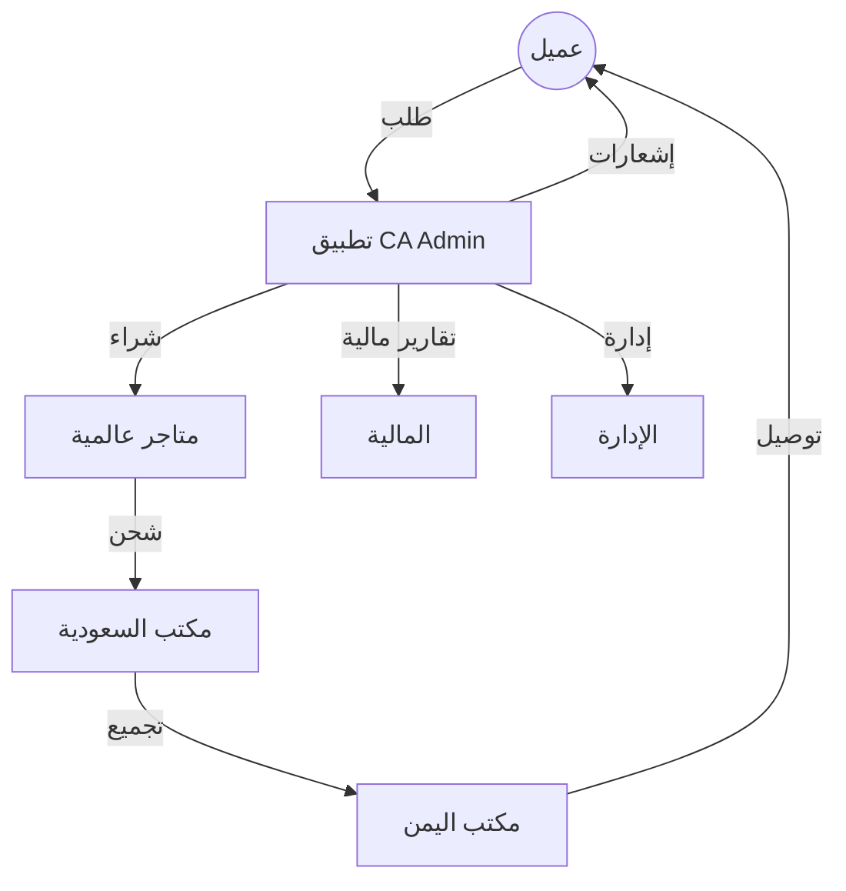
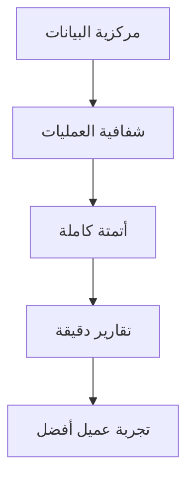
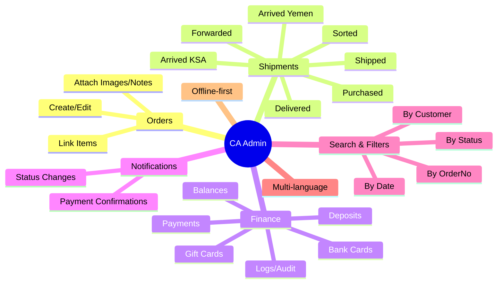
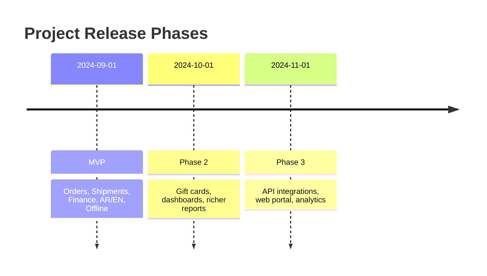

# 🎯 Vision Document / وثيقة الرؤية

> **Project:** CA Admin — إدارة العملاء، الطلبات، الشحنات، والمالية
> 
> **Stack:** Flutter + Firebase (Firestore, Auth, Storage, Functions)
> 
> **Version:** v0.1 (Vision) — Owner: Abdullah Alshaif — Last Updated: YYYY-MM-DD

---

## 1. Introduction / المقدمة

	

**EN:**
CA Admin is a unified platform for managing online purchasing mediation, centralizing customer orders, global shopping (Shein, iHerb, Amazon, Noon…), cross-border shipping (KSA → Yemen), last-mile delivery, and all financial operations.

**AR:**
يهدف CA Admin إلى توحيد عمليات الوساطة الشرائية عبر منصة مركزية لإدارة طلبات العملاء، الشراء من المتاجر العالمية، الشحن من السعودية إلى اليمن، التسليم المحلي، وجميع العمليات المالية.

---

## 1.1 Why Now? / لماذا الآن؟

> **EN:** The e-commerce and cross-border shopping market is growing rapidly in the region, but most intermediaries still rely on manual, error-prone processes. A modern, automated platform is essential to compete and scale.
> 
> **AR:** سوق التجارة الإلكترونية والشراء من الخارج ينمو بسرعة في المنطقة، لكن معظم الوسطاء ما زالوا يعتمدون على عمليات يدوية كثيرة الأخطاء. وجود منصة حديثة مؤتمتة أصبح ضرورة للمنافسة والتوسع.

---

## 1.2 System Overview / نظرة عامة على النظام

---

## 2. Problem Statement / المشكلة

**EN:**
Current operations are manual and fragmented: scattered spreadsheets, chat-based order intake, weak shipment visibility, and error-prone financial reconciliation.

**AR:**
العمليات الحالية يدوية ومجزأة (جداول متفرقة، استقبال الطلبات عبر المحادثات، ضعف شفافية التتبع، وأخطاء في المطابقة المالية).

---

## 2.1 Current vs. Target State / مقارنة الوضع الحالي والمستهدف

| Aspect | Current (الوضع الحالي) | Target (المستهدف) |
|--------|------------------------|-------------------|
| Order Intake | Manual, via chat | Digital, via app |
| Shipment Tracking | Weak, delayed | Real-time, transparent |
| Financial Logs | Scattered, error-prone | Centralized, automated |
| Reporting | Manual, slow | Automated, instant |
| Scalability | Limited | Ready for growth |

---

## 3. Vision & Value / الرؤية والقيمة

**EN:**
Provide a **centralized, transparent, and automated** platform that:
- Captures customer orders quickly
- Orchestrates purchasing & consolidation
- Tracks international & local shipments in real time
- Maintains accurate financial logs and reports
- Scales with multi-language (AR/EN) and offline-first usage

**AR:**
تقديم منصة **مركزية وشفافة ومؤتمتة** لالتقاط الطلبات، تنظيم الشراء والتجميع، تتبع الشحنات لحظيًا، حفظ السجلات المالية الدقيقة، ودعم تعدد اللغات والعمل دون إنترنت.

---

## 4. Objectives / الأهداف

| # | EN Objective | الهدف بالعربية |
|---|--------------|----------------|
| 1 | Single source of truth for customers, orders, shipments, finance | مصدر بيانات موحد للعملاء والطلبات والشحن والمالية |
| 2 | Real-time status & notifications | تتبع لحظي وإشعارات للحالات |
| 3 | Offline-first, safe two-way sync | عمل دون إنترنت مع مزامنة ثنائية |
| 4 | Role-based access control | صلاحيات مبنية على الأدوار |
| 5 | Weekly auto-reports | تقارير أسبوعية تلقائية |
| 6 | AR/EN UI, RTL/LTR | واجهة عربية/إنجليزية مع تبديل الاتجاه |

---

## 5. Scope / النطاق

**In-Scope / ضمن النطاق:**
- Customer accounts & order intake (links, SKU, qty, notes)
- Purchase workflow & consolidation (KSA office)
- Cross-border shipping + local delivery (drivers)
- Finance: invoices, payments, deductions, deposits, card logs, gift cards
- Dashboards & reports
- Security rules (Firestore) + RBAC via Custom Claims

**Out-of-Scope (Phase-1) / خارج النطاق (المرحلة الأولى):**
- Online payment gateway integration (manual first)
- Advanced analytics/AI (recommendations/forecast)
- Multi-country logistics beyond KSA–Yemen

---

## 6. Success Metrics (KPIs) / معايير النجاح

| KPI | Target |
|-----|--------|
| Order intake time | ≤ 60s per order (P90) |
| Status freshness | 95% shipments updated ≤ 2h |
| Financial errors | ↓ 90% vs. current |
| Report generation | ≤ 30s weekly |
| Customer satisfaction | ≥ 85% |

---

## 7. High-Level Features / الميزات عالية المستوى

---

## 8. Constraints & Assumptions / القيود والافتراضات

- **Connectivity:** intermittent; offline cache mandatory
- **Primary DB:** Firestore; local cache on device
- **Devices:** Android/iOS mid-range; Web/Desktop later
- **Security:** Firestore Security Rules + Custom Claims; GDPR-like hygiene

---

## 9. Risks & Mitigations / المخاطر والمعالجات

| Risk | Impact | Mitigation |
|------|--------|------------|
| Data conflicts during sync | Incorrect balances/status | Upsert strategy + conflict resolution + audit log |
| Index limits / hot spots | Slow queries | Composite indexes, sharding, pagination |
| Role misconfiguration | Data exposure | RBAC matrix + tests + rule simulator |
| Human data entry errors | Financial mismatches | Validation, required fields, guided flows |

---

## 10. Release Plan (Phases) / خطة الإصدارات

---

## 11. Glossary / القاموس المختصر

| Term | المصطلح | Definition |
|------|---------|-----------|
| OrderNo | رقم الطلب | Unique order number |
| Consolidation | تجميع | تجميع طرود العملاء في شحنة واحدة |
| RBAC | صلاحيات حسب الدور | Role-Based Access Control |
| Reconciliation | مطابقة | مطابقة قيود المالية مع الواقع |

---
