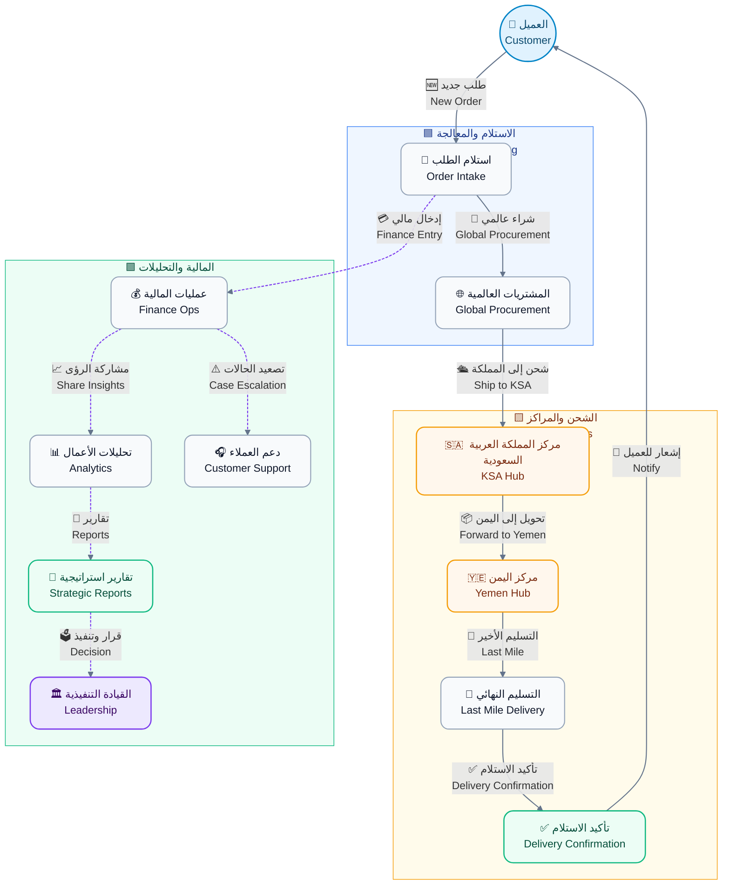
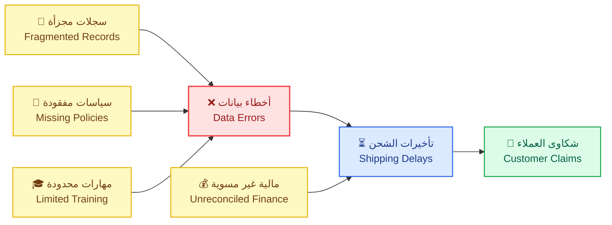
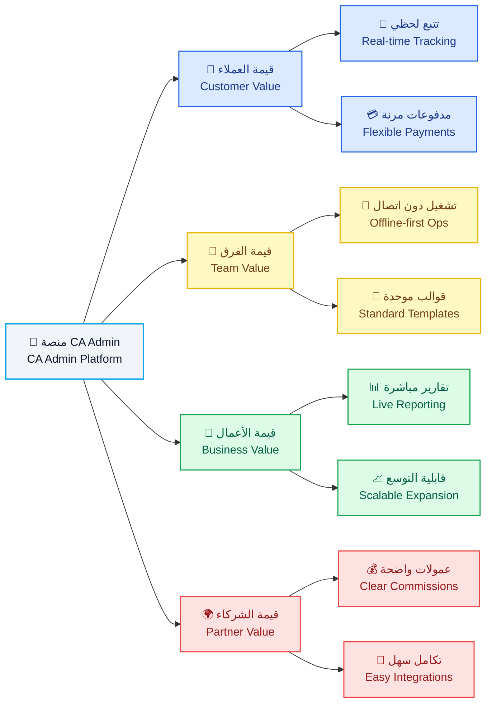
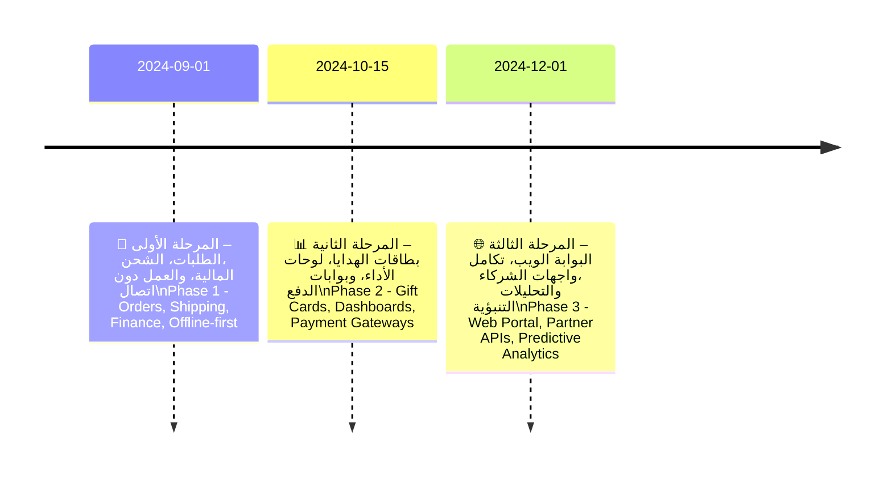

# 📝 وثيقة الرؤية | Vision Document

---

> **🗂️ المشروع | Project**
> 
منصة الوساطة الشرائية <b>CA Admin</b>

> 
<em>CA Admin Shopping Mediation Platform</em>

>
> **🧰 المكدس التقني | Tech Stack**
> 🔹 Flutter | فلاتر 
> 🔹 Firebase (Firestore, Auth, Storage, Functions) | فايربيس (Firestore, Auth, Storage, Functions)
>
> **🏷️ الإصدار | Version**
> 
<b>0.1 (Vision)</b> — Owner: <b>Abdullah Alshaif</b> — Last Updated: <b>2025-09-29</b>

---

## 1. 👀 النظرة العامة | Overview

**👀 النظرة العامة | Overview**

🔹 تقدم الوثيقة رؤية شاملة للمنصة، أهدافها، وأساسها التقني لضمان وضوح القيمة لجميع الأطراف.

<em>🔹 The document provides a comprehensive view of the platform, its goals, and technology foundation to clarify value for every stakeholder.</em>

---

## 2. 📌 العناصر الرئيسية | Key Elements

<table class="doc-table">
  <thead>
    <tr>
      <th>
        العنصر 🏷️ 
        <i>Element</i>
      </th>
      <th>
        التفاصيل 
        <i>Details</i>
      </th>
    </tr>
  </thead>
  <tbody>
    <tr>
      <td>
        
🏢 <b>المؤسسة</b>

        
<em><b>Organization</b></em>

      </td>
      <td>
        
الإدارة العامة <b>CA Admin DmG Headquarters</b>

        
<em>CA Admin DmG Headquarters</em>

      </td>
    </tr>
    <tr>
      <td>
        
🌐 <b>نطاق الحل</b>

        
<em><b>Solution Scope</b></em>

      </td>
      <td>
        
منصة وساطة للتسوق عبر الحدود تخدم <b>اليمن والسعودية</b> مع ربط رقمي متكامل

        
<em>A cross-border shopping mediation platform serving <b>Yemen and Saudi Arabia</b> with integrated digital linkages</em>

      </td>
    </tr>
    <tr>
      <td>
        
🚀 <b>الرؤية الإدارية</b>

        
<em><b>Management Vision</b></em>

      </td>
      <td>
        
تسريع الطلبات، الشحن، والمدفوعات عبر <b>مسار رقمي واحد وشفاف</b>

        
<em>Accelerate orders, shipping, and payments through a <b>single transparent digital lane</b></em>

      </td>
    </tr>
    <tr>
      <td>
        
🎯 <b>الجمهور الأساسي</b>

        
<em><b>Primary Audience</b></em>

      </td>
      <td>
        
المتسوقون، فرق العمليات، المالية، الشركاء، القيادة التنفيذية

        
<em>Shoppers, operations teams, finance, partners, executive leadership</em>

      </td>
    </tr>
  </tbody>
  
</table>

---

## 3. ℹ️ مقدمة | Introduction

### 3.1. 👁️ نظرة بصرية عامة | Visual Overview

**الوصف | Description**

يوضح المخطط رحلة الطلب من إنشاء العميل حتى تسليم الشحنة مع إبراز نقاط التفاعل المالية والتحليلية.

<em>The diagram shows the order journey from customer initiation to delivery while flagging finance and analytics touchpoints.</em>

### 3.2. 🧭 رحلة القيمة المبسطة | Simplified Value Journey

**الوصف | Description**

يبيّن المخطط دور كل طرف في كل مرحلة لضمان وضوح المسؤوليات وسرعة التسليم.

<em>The chart clarifies how each party contributes at every stage to keep responsibilities clear and delivery timely.</em>

### 3.3. 🏁 سياق المنصة | Platform Context

**الوصف | Description**

يلخص هذا الجزء رسالة المنصة، الشرائح المستفيدة، والمبادئ التصميمية لضمان الاتساق.

<em>This section outlines the platform mission, beneficiary segments, and design principles to keep the experience consistent.</em>

- 
🔹 🎯 **المهمة الأساسية:** تقديم مركز عمليات موحد لإدارة الطلبات، الشحن، والمدفوعات عبر الحدود بسهولة وشفافية.

  
<i>🔹 🎯 **Core Mission:** Deliver a unified operations hub that manages cross-border orders, shipping, and payments with ease and transparency.</i>

- 
🔹 🧭 **وصف المنصة:** حل متكامل يربط إنشاء الطلب بوثائق الشحن والسجلات المالية دون ازدواجية بيانات.

  
<i>🔹 🧭 **Platform Definition:** An integrated solution linking order creation with shipping documents and financial records without data duplication.</i>

- 
🔹 🛠️ **الوظيفة الرئيسية:** تنسيق تدفق العمل من الاستلام حتى الإغلاق مع أدوات رقابة وتقارير وأتمتة للمهام الحرجة.

  
<i>🔹 🛠️ **Primary Function:** Orchestrate workflow from intake to closure with controls, reporting, and automation for critical tasks.</i>

- 
🔹 🏆 **المنفعة المتوقعة:** خفض العمل اليدوي ورفع رضا العملاء عبر مصدر موحد للحقيقة وإشعارات فورية.

  
<i>🔹 🏆 **Expected Benefit:** Reduce manual effort and raise customer satisfaction through a single source of truth and instant notifications.</i>

- 
🔹 👥 **شرائح الخدمة:** المتسوقون، خدمة العملاء، مشغلو العمليات، فرق المالية، القيادة التنفيذية.

  
<i>🔹 👥 **Target Segments:** Shoppers, customer service teams, operations operators, finance teams, executive leadership.</i>

- 
🔹 ✨ **مبدأ التجربة:** كل رحلة يجب أن تكون قابلة للتتبع، ثنائية اللغة، وقادرة على العمل دون اتصال لضمان التبني.

  
<i>🔹 ✨ **Experience Principle:** Every journey must be traceable, bilingual, and offline-ready to ensure adoption.</i>

---

## 4. 🚀 لماذا الآن | Why Now

- 
🔹 📈 **تسارع التجارة العابرة للحدود:** تنمو احتياجات الشراء الدولي في اليمن بنسبة ‎35٪‎ سنويًا رغم تحديات البنية التحتية.

  
<i>🔹 📈 **Cross-border Commerce Acceleration:** International shopping needs in Yemen grow by 35% annually despite infrastructure hurdles.</i>

  - 
🔹 🧩 **الفائدة:** يبرر الاستثمار الفوري في منصة قابلة للتوسع تستوعب النمو وتقدم تجربة موحدة.

    
<i>🔹 🧩 **Benefit:** Justifies immediate investment in a scalable platform that absorbs growth and keeps the experience unified.</i>

- 
🔹 🗂️ **تشتت العمليات اليدوية:** تتكرر الطلبات في جداول ومحادثات متفرقة مما يهدر الوقت ويصعّب التدقيق.

  
<i>🔹 🗂️ **Manual Fragmentation:** Orders repeat across scattered sheets and chats, wasting time and complicating audits.</i>

  - 
🔹 🧩 **الفائدة:** يؤكد ضرورة الأتمتة المركزية لتقليل الأخطاء وتسريع المتابعة التشغيلية.

    
<i>🔹 🧩 **Benefit:** Underlines the need for centralized automation to cut errors and speed operational follow-up.</i>

- 
🔹 🛡️ **توقعات الثقة والامتثال:** يتطلب العملاء والشركاء إيصالات رقمية متوافقة مع اللوائح السعودية واليمنية منذ البداية.

  
<i>🔹 🛡️ **Trust & Compliance Expectations:** Customers and partners demand digital receipts aligned with Saudi and Yemeni regulations from day one.</i>

  - 
🔹 🧩 **الفائدة:** يدفع لتجهيز ضوابط الحوكمة المبكرة لضمان الامتثال وتقوية سمعة العلامة.

    
<i>🔹 🧩 **Benefit:** Drives early governance controls to ensure compliance and reinforce brand reputation.</i>

---

## 5. ⚠️ التحديات المحورية | Core Challenges

- 
🔹 🔍 **عمى تشغيلي:** لا يمكن ربط حالة الشحنة بالطلب أو العميل من خلال مصدر واحد مما يؤخر القرارات.

  
<i>🔹 🔍 **Operational Blind Spots:** Shipment status cannot be tied to an order or customer within a single source, delaying decisions.</i>

  - 
🔹 🧩 **الفائدة:** يحفز بناء لوحة متابعة موحدة ودمج الحالة عبر الأنظمة.

    
<i>🔹 🧩 **Benefit:** Encourages building a unified monitoring dashboard and integrating status across systems.</i>

- 
🔹 💸 **اختلال السجلات المالية:** التسويات اليدوية وتعدد العملات تؤدي إلى فروقات في الأرصدة وتقارير متعارضة.

  
<i>🔹 💸 **Financial Record Confusion:** Manual reconciliations and currency switches create balance gaps and conflicting reports.</i>

  - 
🔹 🧩 **الفائدة:** يبرز ضرورة وجود محرك تسوية خفيف يحافظ على التوافق بين الطلبات والمدفوعات.

    
<i>🔹 🧩 **Benefit:** Highlights the need for a lightweight reconciliation engine that keeps orders and payments aligned.</i>

- 
🔹 🧠 **فجوات المعرفة والإجراءات:** غياب أدلة موحدة يعرقل الإحلال ويخلق تفاوتًا في جودة الخدمة بين المناطق.

  
<i>🔹 🧠 **Knowledge & Process Gaps:** Missing playbooks hinder handovers and create uneven service quality across regions.</i>

  - 
🔹 🧩 **الفائدة:** يدعم إنشاء أدلة رقمية مدمجة وتدريب متسق داخل النظام.

    
<i>🔹 🧩 **Benefit:** Supports building embedded digital playbooks and consistent in-app training.</i>

### 5.1. 🎯 الحالة الحالية والمستهدفة | Current vs Target State

<table class="doc-table">
  <thead>
    <tr>
      <th>
        📌 البعد 
        <i>Aspect</i>
      </th>
      <th>
        📍 الحالة الحالية 
        <i>Current State</i>
      </th>
      <th>
        🎯 الحالة المستهدفة 
        <i>Target State</i>
      </th>
    </tr>
  </thead>
  <tbody>
    <tr>
      <td>
        
<b>🧾 الطلبات</b>

        
<em><b>Orders</b></em>

      </td>
      <td>
        
إدخال يدوي مع اعتماد متأخر يؤدي إلى بطء التنفيذ

        
<em>Manual entry with delayed approvals that slow execution</em>

      </td>
      <td>
        
تدفق رقمي كامل مع إشعارات فورية ومسار تدقيق واضح

        
<em>Fully digital flow with instant notifications and a clear audit trail</em>

      </td>
    </tr>
    <tr>
      <td>
        
<b>🚚 الشحن</b>

        
<em><b>Shipping</b></em>

      </td>
      <td>
        
تحديثات متقطعة بدون أدلة مما يرفع التصعيدات

        
<em>Irregular updates without evidence escalating disputes</em>

      </td>
      <td>
        
تتبع لحظي مع صور إثبات وتأكيد تسليم موحد

        
<em>Real-time tracking with proof images and unified delivery confirmation</em>

      </td>
    </tr>
    <tr>
      <td>
        
<b>💰 المالية</b>

        
<em><b>Finance</b></em>

      </td>
      <td>
        
دفاتر متباينة عبر العملات تعرقل التسوية الدقيقة

        
<em>Disparate ledgers across currencies blocking accurate reconciliation</em>

      </td>
      <td>
        
تسويات مؤتمتة وتحويلات فورية عبر القنوات المعتمدة

        
<em>Automated reconciliations with instant transfers across approved channels</em>

      </td>
    </tr>
    <tr>
      <td>
        
<b>📊 التقارير</b>

        
<em><b>Reporting</b></em>

      </td>
      <td>
        
تقارير أسبوعية في جداول Excel تحد من الرؤية اللحظية

        
<em>Weekly Excel reports limiting real-time visibility</em>

      </td>
      <td>
        
لوحات تحليل مباشرة قابلة للتنقيب تدعم القرار السريع

        
<em>Live drill-down dashboards supporting rapid decision-making</em>

      </td>
    </tr>
    <tr>
      <td>
        
<b>📈 القابلية للتوسع</b>

        
<em><b>Scalability</b></em>

      </td>
      <td>
        
اعتماد على أفراد محددين يهدد الاستمرارية التشغيلية

        
<em>Dependence on key individuals risking operational continuity</em>

      </td>
      <td>
        
عمليات موثقة قابلة للتكرار مع توزيع أدوار واضح

        
<em>Documented repeatable processes with clear role distribution</em>

      </td>
    </tr>
  </tbody>
</table>

---

## 6. 💡 الرؤية والقيمة | Vision & Value

- 
🔹 👥 **قيمة العملاء:** ضمان مسار واضح من الاستفسار إلى التسليم مع تحديثات لحظية تعزز الثقة والولاء.

  
<i>🔹 👥 **Customer Value:** Provide a visible journey from inquiry to delivery with real-time updates that boost trust and loyalty.</i>

- 
🔹 🧑‍💼 **قيمة فريق العمليات:** مسار عمل موحد يقلل الجهد المكرر ويجعل تدوير الأفراد أكثر سلاسة.

  
<i>🔹 🧑‍💼 **Operations Team Value:** A unified workflow that removes duplicated effort and smooths staff rotations.</i>

- 
🔹 💼 **قيمة الأعمال:** تحويل البيانات التشغيلية إلى لوحات قرار موثوقة تمكّن الإدارة من التوسع بثقة.

  
<i>🔹 💼 **Business Value:** Turn operational data into trustworthy decision dashboards enabling confident expansion.</i>

- 
🔹 🤝 **قيمة الشركاء:** عمولات واضحة وتكاملات سريعة تعزز الشفافية وتخفض المخاطر المشتركة.

  
<i>🔹 🤝 **Partner Value:** Transparent commissions and rapid integrations that enhance transparency and reduce shared risk.</i>

---

## 7. 🎯 الأهداف الاستراتيجية | Strategic Objectives

- 
🔹 💰 **توسيع الإيرادات:** رفع متوسط قيمة الطلب بنسبة ‎20٪‎ عبر الباقات والاشتراكات لدعم الاستثمار المستمر.

  
<i>🔹 💰 **Revenue Expansion:** Increase average order value by 20% through bundles and subscriptions to sustain ongoing investment.</i>

  - 
🔹 🧩 **الفائدة:** يتيح إطلاق خدمات ملحقة ويعزز هوامش الربح المستهدفة.

    
<i>🔹 🧩 **Benefit:** Enables ancillary services and strengthens target profit margins.</i>

- 
🔹 ⚙️ **التميز التشغيلي:** خفض زمن معالجة الطلب إلى أقل من 60 ثانية عند الاستلام بفضل الأتمتة والتدريب المركز.

  
<i>🔹 ⚙️ **Operational Excellence:** Cut order processing time below 60 seconds at intake via automation and focused training.</i>

  - 
🔹 🧩 **الفائدة:** يحسّن تجربة العميل ويخفض تكاليف التشغيل اليومية.

    
<i>🔹 🧩 **Benefit:** Improves customer experience and lowers daily operating costs.</i>

- 
🔹 🛡️ **الحوكمة والامتثال:** فرض سياسات أدوار دقيقة وسجل تدقيق لكل معاملة مالية لحماية المنصة.

  
<i>🔹 🛡️ **Governance & Compliance:** Enforce precise role policies and audit trails for each financial transaction to protect the platform.</i>

  - 
🔹 🧩 **الفائدة:** يقلل التعرض القانوني ويرفع ثقة المنظمين والشركاء.

    
<i>🔹 🧩 **Benefit:** Reduces legal exposure and increases regulator and partner confidence.</i>

---

## 8. 🛠️ نطاق الإصدار الأولي | MVP Scope

- 
🔹 📝 **وحدة الطلبات:** إنشاء، تقسيم، وربط الطلبات بمكتبة العملاء والمرفقات لضمان اكتمال البيانات وتاريخها.

  
<i>🔹 📝 **Orders Module:** Create, split, and link orders with the customer library and attachments to ensure complete data and history.</i>

  - 
🔹 🧩 **الفائدة:** يوفر سجلًا موحدًا يسهل الرجوع إليه ويقلل فقدان المعلومات.

    
<i>🔹 🧩 **Benefit:** Provides a unified record that is easy to reference and prevents information loss.</i>

- 
🔹 🚚 **متابعة الشحن:** تتبع متعدد المراحل من الشراء حتى التسليم مع طوابع زمنية وأدلة مرفقة للمراجعة.

  
<i>🔹 🚚 **Shipment Tracking:** Multi-stage tracking from purchase to delivery with timestamps and evidence attachments for review.</i>

  - 
🔹 🧩 **الفائدة:** يقلل الاتصالات المتكررة ويضبط توقعات العملاء.

    
<i>🔹 🧩 **Benefit:** Reduces repeated inquiries and aligns customer expectations.</i>

- 
🔹 💳 **إدارة المالية:** أرصدة، مدفوعات، تحويلات، وبطاقات هدايا مع سجل تدقيق شامل عبر المواقع.

  
<i>🔹 💳 **Finance Management:** Balances, payments, transfers, and gift cards with a comprehensive cross-site audit log.</i>

  - 
🔹 🧩 **الفائدة:** يضمن تطابق الأرقام بين المتاجر والبنوك والمستخدمين بشكل فوري.

    
<i>🔹 🧩 **Benefit:** Ensures numbers match instantly across stores, banks, and users.</i>

---

## 9. 📊 مؤشرات النجاح (KPIs) | Success Metrics (KPIs)

<table class="doc-table">
  <thead>
    <tr>
      <th>
        📌 المؤشر 
        <i>KPI</i>
      </th>
      <th>
        📍 خط الأساس 
        <i>Baseline</i>
      </th>
      <th>
        🎯 الهدف 
        <i>Target</i>
      </th>
    </tr>
  </thead>
  <tbody>
    <tr>
      <td>
        
<b>⏱️ زمن استلام الطلب</b>

        
<em><b>Order Intake Time</b></em>

      </td>
      <td>
        
180 ثانية

        
<em>180 seconds</em>

      </td>
      <td>
        
≤ 60 ثانية (المئين ‎90‎)

        
<em>≤ 60 seconds (P90)</em>

      </td>
    </tr>
    <tr>
      <td>
        
<b>🚚 حداثة حالة الشحن</b>

        
<em><b>Shipment Status Freshness</b></em>

      </td>
      <td>
        
تحديث كل 8 ساعات

        
<em>Updates every 8 hours</em>

      </td>
      <td>
        
تحديث كل ساعة

        
<em>Hourly updates</em>

      </td>
    </tr>
    <tr>
      <td>
        
<b>💰 دقة التسوية المالية</b>

        
<em><b>Financial Reconciliation Accuracy</b></em>

      </td>
      <td>
        
‎92٪‎

        
<em>92%</em>

      </td>
      <td>
        
≥ ‎99٪‎

        
<em>≥ 99%</em>

      </td>
    </tr>
    <tr>
      <td>
        
<b>📑 زمن إعداد التقارير</b>

        
<em><b>Report Preparation Time</b></em>

      </td>
      <td>
        
يوم عمل واحد

        
<em>1 business day</em>

      </td>
      <td>
        
≤ 5 دقائق

        
<em>≤ 5 minutes</em>

      </td>
    </tr>
  </tbody>
</table>

---

## 10. 🗺️ خارطة الإصدارات | Release Roadmap

---

## 11. ⚠️ المخاطر وخطط التخفيف | Risks & Mitigations

<table class="doc-table">
  <thead>
    <tr>
      <th>
        📌 الخطر 
        <i>Risk</i>
      </th>
      <th>
        💥 التأثير 
        <i>Impact</i>
      </th>
      <th>
        🛡️ خطة التخفيف 
        <i>Mitigation</i>
      </th>
    </tr>
  </thead>
  <tbody>
    <tr>
      <td>
        
<b>🔄 تعارض البيانات أثناء المزامنة</b>

        
<em><b>Data conflicts during sync</b></em>

      </td>
      <td>
        
أرصدة غير صحيحة وتعطل التقارير التحليلية

        
<em>Incorrect balances and disrupted analytics reports</em>

      </td>
      <td>
        
تطبيق تنافس متفائل مع سجل تدقيق مركزي يوفر استرجاعًا دقيقًا للإصدارات

        
<em>Apply optimistic concurrency with a central audit log to recover accurate versions</em>

      </td>
    </tr>
    <tr>
      <td>
        
<b>📊 حدود فهارس Firestore</b>

        
<em><b>Firestore index limits</b></em>

      </td>
      <td>
        
استعلامات بطيئة تؤثر على أداء المنصة

        
<em>Slow queries impacting platform performance</em>

      </td>
      <td>
        
تصميم فهارس مركبة مسبقًا وتقسيم البيانات مبكرًا لتوزيع الحمل

        
<em>Pre-design composite indexes and shard data early to distribute load</em>

      </td>
    </tr>
    <tr>
      <td>
        
<b>🔐 أدوار غير مضبوطة</b>

        
<em><b>Misconfigured roles</b></em>

      </td>
      <td>
        
كشف بيانات حساسة أو تنفيذ عمليات غير مصرح بها

        
<em>Sensitive data exposure or unauthorized operations</em>

      </td>
      <td>
        
إنشاء مصفوفة صلاحيات مدققة مع اختبارات قواعد مستمرة وآلية تنبيه فوري

        
<em>Create an audited RBAC matrix with continuous rule tests and instant alerting</em>

      </td>
    </tr>
    <tr>
      <td>
        
<b>👥 الاعتماد على أفراد محددين</b>

        
<em><b>Dependency on key staff</b></em>

      </td>
      <td>
        
توقف العمليات عند الغياب أو تبدل الأدوار الحرجة

        
<em>Operational halt when critical roles are absent or swapped</em>

      </td>
      <td>
        
توثيق الإجراءات، تعيين بدلاء، وتدوير المهام وفق جدول واضح

        
<em>Document procedures, assign backups, and rotate duties on a defined schedule</em>

      </td>
    </tr>
  </tbody>
</table>

---

## 12. 🧾 مسرد المصطلحات | Glossary

<table class="doc-table">
  <thead>
    <tr>
      <th>
        📌 المصطلح 
        <i>Term</i>
      </th>
      <th>
        📖 التعريف بالعربية 
        <i>Definition (AR)</i>
      </th>
      <th>
        📖 التعريف بالإنجليزية 
        <i>Definition (EN)</i>
      </th>
    </tr>
  </thead>
  <tbody>
    <tr>
      <td>
        
<b>🔢 رقم الطلب</b>

        
<em><b>Order Number</b></em>

      </td>
      <td>
        
معرف فريد يربط جميع معاملات الطلب داخل النظام لضمان تتبع موحد

        
<em>A unique identifier linking every order transaction in the system for unified tracking</em>

      </td>
      <td>
        
<em>Unique identifier linking each order transaction in the system to keep tracking consistent</em>

      </td>
    </tr>
    <tr>
      <td>
        
<b>📦 توحيد الشحنات</b>

        
<em><b>Shipment Consolidation</b></em>

      </td>
      <td>
        
دمج عدة طلبات في شحنة واحدة لخفض التكلفة وتسريع المعالجة التشغيلية

        
<em>Combining multiple orders into one shipment to reduce cost and speed operations</em>

      </td>
      <td>
        
<em>Merging multiple orders into a single shipment to reduce cost and accelerate processing</em>

      </td>
    </tr>
    <tr>
      <td>
        
<b>⚖️ محرك التسوية</b>

        
<em><b>Reconciliation Engine</b></em>

      </td>
      <td>
        
طبقة منطقية تقارن المدفوعات بالطلبات والمخزون لاكتشاف الفروقات الرسمية

        
<em>A logic layer comparing payments to orders and inventory to detect official variances</em>

      </td>
      <td>
        
<em>Logic layer comparing payments to orders and inventory to detect discrepancies</em>

      </td>
    </tr>
    <tr>
      <td>
        
<b>✅ المطابقة المزدوجة</b>

        
<em><b>Dual Matching</b></em>

      </td>
      <td>
        
خطوة تحقق مشتركة بين مركزي السعودية واليمن قبل التسليم النهائي لضمان التوافق الكامل

        
<em>A joint verification step between the KSA and Yemen hubs before final delivery to ensure full alignment</em>

      </td>
      <td>
        
<em>Verification step between the KSA and Yemen hubs before final delivery to guarantee alignment</em>

      </td>
    </tr>
  </tbody>
</table>

---

## 13. 🔗 جدول المواءمة بين الأهداف والقيمة | Objectives vs Value Table

**الوصف | Description**

يوضح الجدول كيفية ارتباط الأهداف الاستراتيجية بالقيمة المتحققة لكل فئة لضمان اتساق القرارات الاستثمارية.

<em>The table shows how strategic objectives translate into value for each group to keep investment decisions aligned.</em>

<table class="doc-table">
  <thead>
    <tr>
      <th>
        🎯 الهدف الاستراتيجي 
        <i>Strategic Objective</i>
      </th>
      <th>
        👥 قيمة العملاء 
        <i>Customer Value</i>
      </th>
      <th>
        👨‍💻 قيمة الفريق 
        <i>Team Value</i>
      </th>
      <th>
        🏢 قيمة الأعمال 
        <i>Business Value</i>
      </th>
      <th>
        🤝 قيمة الشركاء 
        <i>Partner Value</i>
      </th>
    </tr>
  </thead>
  <tbody>
    <tr>
      <td>
        
<b>💰 توسيع الإيرادات</b>

        
<em><b>Revenue Expansion</b></em>

      </td>
      <td>
        
عروض مجمعة ومدفوعات مرنة تزيد الولاء وتكرار الشراء

        
<em>Bundle offers and flexible payments that grow loyalty and repeat purchases</em>

      </td>
      <td>
        
أدوات تحصيل مبسطة تربط الطلبات بالمخزون لتقليل أخطاء المحاسبة

        
<em>Simplified collection tools linking orders to inventory that reduce accounting errors</em>

      </td>
      <td>
        
نمو الأرباح عبر سلال أعلى ومبيعات متكررة مع وضوح أفضل للهوامش

        
<em>Profit growth through higher baskets and repeat sales with clearer margin visibility</em>

      </td>
      <td>
        
عمولات شفافة وتقارير مشتركة تعزز ثقة الشركاء وتسّرع التسويات

        
<em>Transparent commissions and shared reports that strengthen partner trust and speed settlements</em>

      </td>
    </tr>
    <tr>
      <td>
        
<b>⚙️ التميز التشغيلي</b>

        
<em><b>Operational Excellence</b></em>

      </td>
      <td>
        
خدمة أسرع مع تحديثات لحظية تخفف قلق العملاء وتعزز رضاهم

        
<em>Faster service with real-time updates reducing customer anxiety and boosting satisfaction</em>

      </td>
      <td>
        
مسار عمل موحد يزيل الجهد المكرر ويسرّع دمج الأعضاء الجدد

        
<em>Unified workflow removing duplicate effort and accelerating onboarding</em>

      </td>
      <td>
        
خفض التكاليف عبر أتمتة المهام الروتينية وتحسين الإنتاجية اليومية

        
<em>Cost reduction by automating routine tasks and improving daily productivity</em>

      </td>
      <td>
        
تكاملات أكثر سلاسة مع متابعة يدوية أقل كلفة في المشاريع المشتركة

        
<em>Streamlined integrations with less costly manual follow-up in joint projects</em>

      </td>
    </tr>
    <tr>
      <td>
        
<b>🛡️ الحوكمة والامتثال</b>

        
<em><b>Governance & Compliance</b></em>

      </td>
      <td>
        
شفافية كاملة في حقوق العميل وإشعارات تحسّن الثقة والاحتفاظ

        
<em>Full transparency on customer rights and notifications that improve trust and retention</em>

      </td>
      <td>
        
سياسات دقيقة تقلل الأخطاء البشرية وتوضح مسؤوليات كل فريق

        
<em>Precise policies reducing human error and clarifying each team’s responsibilities</em>

      </td>
      <td>
        
حماية قانونية وتقارير جاهزة للتدقيق تدعم القرارات السريعة والاستثمارات الجديدة

        
<em>Legal protection and audit-ready reports supporting rapid decisions and new investments</em>

      </td>
      <td>
        
ثقة أعلى من الشركاء والمنظمين بفضل التزام موثق ورقابة مستمرة

        
<em>Greater trust from partners and regulators through documented compliance and continuous oversight</em>

      </td>
    </tr>
  </tbody>
</table>
