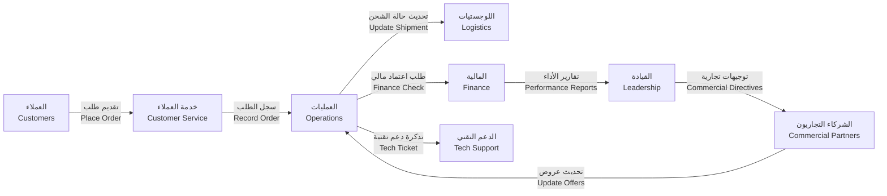
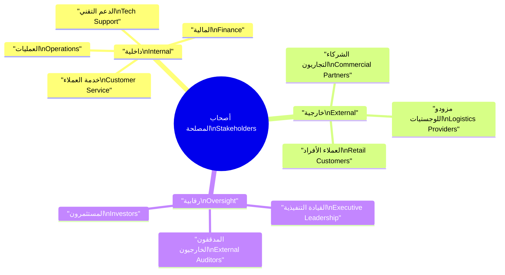
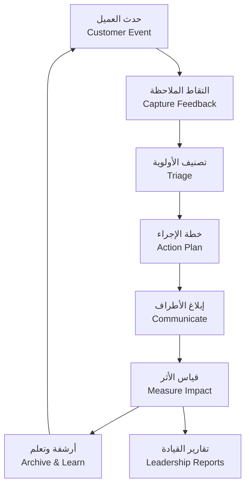

# 🧭 تحليل أصحاب المصلحة

🧭 Stakeholders Analysis

---

> 🗂️ **المشروع:** منصة الوساطة الشرائية CA Admin
> 🗂️ **Project:** CA Admin Shopping Mediation Platform
> 🧰 **المكدس التقني:** Flutter، Firebase (Firestore، Auth، Storage، Functions)
> 🧰 **Tech Stack:** Flutter, Firebase (Firestore, Auth, Storage, Functions)
> 🏷️ **الإصدار:** 0.1 (رؤية) – المالك: عبدالله الشائف – آخر تحديث: 2025-09-20
> 🏷️ **Version:** 0.1 (Vision) – Owner: Abdullah Alshaif – Last Updated: 2025-09-20

**الرؤية المختصرة:**
يوضح هذا المستند جميع الأطراف ذات التأثير على نجاح المنصة، مع إبراز توقعاتهم، وأدوارهم، وقنوات التفاعل المناسبة.
**Condensed View:**
This document outlines every party impacting platform success, highlighting their expectations, roles, and fit communication channels.

---

## 1. ✨ مقدمة التحليل

1. ✨ Analysis Introduction

## 1.1 🛰️ المشهد العام للتفاعل

1.1 🛰️ Interaction Landscape

**الوصف:**
يبين الرسم تدفق التفاعل بين الفئات الرئيسة وكيف يدعم كل مسار تحقيق أهداف المنصة.
**Description:**
The diagram visualizes interaction flows between major groups and how each stream supports platform objectives.

- 🔑 توضح أهمية التحليل كيف يؤثر كل طرف على نجاح المنصة وإطلاقها السلس.
  🔑 The importance insight clarifies how each party influences a smooth launch and sustained success.
- 🧭 يحدد إطار التأثير والاهتمام طريقة تصنيف الأطراف لضمان تركيز الموارد.
  🧭 The influence-interest frame defines how parties are classified to focus resources effectively.
- 🛠️ يوجه هذا المخطط قرارات التصميم والحوكمة وقنوات الاتصال المناسبة لكل فئة.
  🛠️ The flow guides design, governance, and communication decisions tailored to each group.
- 🛡️ يقلل وضوح المسارات مخاطر التعارض مبكرًا ويضمن مواءمة التوقعات.
  🛡️ Clear pathways lower conflict risks early and align expectations consistently.

## 1.2 🧠 تصنيف أصحاب المصلحة

1.2 🧠 Stakeholder Classification

**الوصف:**
يصنف المخطط الذهني الأطراف إلى داخلية، خارجية، ورقابية مع إبراز أمثلة لكل فئة.
**Description:**
The mindmap groups stakeholders into internal, external, and oversight clusters with representative examples.

- 🧩 يضمن التصنيف الشامل عدم إغفال أي طرف له تأثير أو مصلحة.
  🧩 The comprehensive classification ensures no influential or interested party is overlooked.
- 🔄 يساعد الربط بين الفئات على تصميم رحلات متكاملة من الواجهة الأمامية وحتى غرف العمليات.
  🔄 Linking categories supports designing end-to-end journeys from front office to back office.
- 📌 يوفر المخطط نظرة مرئية سريعة تسهل تقديم العرض على المدراء والفِرق الجديدة.
  📌 The visual provides a quick reference that simplifies briefings for leaders and onboarding teams.

---

## 2. 📇 دليل أصحاب المصلحة

📇 Stakeholder Catalogue

**الوصف:**
يوضح الجدول الفئات الرئيسة مع أدوارها المتوقعة وقيمة المنصة بالنسبة لها.
**Description:**
The table details key stakeholder groups, their roles, and the value the platform must deliver.

| الفئة Category                             | الدور الرئيسي Primary Role                                                                                                           | التوقع المحوري Key Expectation                                                                                                                        |
| --------------------------------------------- | --------------------------------------------------------------------------------------------------------------------------------------- | -------------------------------------------------------------------------------------------------------------------------------------------------------- |
| 👥 العملاء Customers                       | تنفيذ الطلبات ومتابعة حالتها عبر قنوات متعددة Place orders and monitor status across channels                                        | رحلة ثنائية اللغة شفافة بأسعار واضحة وإشعارات في الوقت الحقيقي Transparent bilingual journey with clear pricing and real-time notifications           |
| 💬 فريق خدمة العملاء Customer Service Team | استلام الطلبات وتأكيد بيانات العملاء وإدارة الاستفسارات Capture orders, verify customer data, and handle inquiries                   | واجهة سريعة بقوالب استجابة وسجل تفاعل موحد لكل عميل Fast UI with response templates and unified interaction history                                   |
| ⚙️ فريق العمليات Operations Team           | إدارة المشتريات والتنسيق مع الموردين وتتبع المراحل التشغيلية Manage procurement, vendor coordination, and stage tracking             | لوحة موحدة وتنبيهات استباقية تقلل العمل اليدوي وتمنع الأعطال Unified dashboard with proactive alerts that cut manual work and prevent breakdowns      |
| 💵 فريق المالية Finance Team               | تسوية المدفوعات وإدارة الأرصدة وإصدار التقارير الدورية Reconcile payments, manage balances, and publish periodic reports             | دقة بيانات ودعم متعدد العملات مع جاهزية تدقيق مستمرة Accurate data, multi-currency support, and continuous audit readiness                            |
| 🧭 القيادة التنفيذية Executive Leadership  | تحديد الأولويات واعتماد الميزانيات ومراقبة الأداء الاستراتيجي Set priorities, approve budgets, and track strategic performance       | مؤشرات قياس إستراتيجية وقراءات نمو وبدائل مخاطر واضحة Strategic KPIs, growth insights, and transparent risk scenarios                                 |
| 🛠️ الدعم التقني Tech Support               | إدارة الصلاحيات ومراقبة الأداء وحل المشكلات التقنية Manage roles, monitor performance, and resolve technical issues                  | سجلات أخطاء واضحة، أدوات مراقبة فورية، واختبارات أمن منتظمة Clear error logs, real-time monitoring tools, and recurring security testing              |
| 🤝 الشركاء التجاريون Commercial Partners   | توفير المنتجات وتحديث الأسعار والمساهمة في عمليات الشحن Provide inventory, update pricing, and support shipping operations           | تكاملات API مستقرة، تقارير عمولات دقيقة، ورؤية آنية للطلبات Stable API integrations, precise commission reports, and live order visibility            |
| 🚚 مزودو اللوجستيات Logistics Providers    | استلام الشحنات ونقلها وتسليمها وفق الجداول المتفق عليها Receive, transport, and deliver shipments on agreed schedules                | جداول دقيقة، إثباتات تسليم رقمية، وقناة دعم لعمليات الاستثناءات Accurate schedules, digital proof of delivery, and support for exception handling     |
| 📋 المدققون الخارجيون External Auditors    | التحقق من الالتزام المالي والتشغيلي استنادًا إلى السجلات الرسمية<brValidate financial and operational compliance using official records | وصول مضبوط للبيانات، سجلات كاملة لكل عملية، وتقارير معتمدة للتدقيق Controlled data access, complete per-transaction logs, and certified audit reports |

---

## 3. 🎯 الاحتياجات الجوهرية

🎯 Core Needs

**الوصف:**
تلخص النقاط التالية المتطلبات الأساسية التي تضمن نجاح المنصة لجميع الأطراف.
**Description:**
The following highlights the foundational needs that keep the platform successful for every party.

- 🧾 وضوح رحلة العميل يضمن تقديم معلومات شفافة من الطلب حتى التسليم وتقليل التصعيدات.
  🧾 Customer journey clarity guarantees transparent information from order to delivery and minimizes escalations.
- ⚙️ الكفاءة الداخلية تمكّن الفرق من إنجاز المهام دون ازدواجية عبر سياسات أدوار وأذونات متناسقة.
  ⚙️ Internal efficiency enables teams to finish tasks without duplication through consistent role and permission policies.
- 💼 صرامة مالية قابلة للتدقيق توحد مصادر البيانات وتتيح تتبعًا كاملًا لكل معامل.
  💼 Auditable financial rigor unifies data sources and provides complete traceability for every transaction.
- 📊 بصيرة قيادية استراتيجية تمنح الإدارة مؤشرات أداء وتنبؤات تدعم قرارات التوسع.
  📊 Strategic leadership insight equips executives with KPIs and forecasts that back expansion decisions.

---

## 4. 📣 استراتيجيات التفاعل

📣 Engagement Strategies

**الوصف:**
توضح النقاط آليات التواصل والمتابعة لكل فئة لضمان مشاركة فعّالة ومستدامة.
**Description:**
The items detail communication and follow-up practices that secure sustained, effective engagement.

- 📬 قنوات تواصل موجهة تحدد لكل شريحة القناة الأنسب مثل اللوحات أو البريد أو مجموعات العمل.
  📬 Tailored communication channels assign the right medium—dashboards, email, or working groups—to each segment.
- 📅 جدول تحديثات منتظم يضمن نشر التقارير التشغيلية أسبوعيًا والاستراتيجية شهريًا دون تأخير.
  📅 Scheduled updates ensure weekly operational reports and monthly strategic reviews are published without delay.
- ⏱️ حدود زمنية واضحة للاستجابة تعرف الأطر القصوى للرد على الطلبات والاستفسارات الداخلية والخارجية.
  ⏱️ Clear response thresholds define maximum turnaround times for internal and external requests.
- 🤝 مشاركة تعاونية عبر جلسات مشتركة تعزز الثقة مع الشركاء ومزودي الخدمات وتكشف فرص التحسين.
  🤝 Collaborative sessions with partners and providers strengthen trust and uncover improvement opportunities.

---

## 5. 🔁 دورة التغذية الراجعة

🔁 Feedback Cycle

**الوصف:**
يعرض الرسم خطوات جمع الملاحظات ومعالجتها لتغذية التحسين المستمر.
**Description:**
The diagram depicts how feedback is captured and processed to fuel continuous improvement.

- 🗂️ منهجية حل منهجية تحول كل ملاحظة إلى تذكرة بمالك وتاريخ استحقاق معروف.
  🗂️ Structured resolution turns every feedback item into a ticket with a defined owner and due date.
- 🔄 الربط التشغيلي بين القنوات الأمامية وفِرق الدعم يمنع ضياع الرسائل ويضمن المتابعة.
  🔄 Operational linkage between front channels and support teams prevents message loss and secures follow-through.
- 📚 الأرشفة المتكررة تبني قاعدة معرفة تزيد ثقة العملاء وتدعم التدريب الداخلي.
  📚 Regular archiving grows the knowledge base, boosting customer trust and supporting internal training.

---

## 6. 🧮 مصفوفة المسؤوليات (RACI)

🧮 Responsibility Matrix (RACI)

**الوصف:**
يوضح الجدول توزيع الأدوار لكل نشاط رئيسي باستخدام نموذج RACI.
**Description:**
The matrix allocates roles for each key activity following the RACI model.

| النشاط Activity                         | المسؤول Responsible           | المعتمد Accountable | المستشارون Consulted                            | المطلعون Informed                                      |
| ------------------------------------------ | -------------------------------- | ---------------------- | -------------------------------------------------- | --------------------------------------------------------- |
| استقبال الطلب الجديد New order intake   | خدمة العملاء Customer Service | العمليات Operations | التقنية، المالية Tech, Finance                  | القيادة Leadership                                     |
| تحديث حالة الشحن Update shipment status | العمليات Operations           | المالية Finance     | مزودو اللوجستيات Logistics Providers            | خدمة العملاء Customer Service                          |
| تسوية المدفوعات Payment reconciliation  | المالية Finance               | القيادة Leadership  | العمليات Operations                             | الشركاء والمدققون Partners, Auditors                   |
| إطلاق ميزة جديدة Launch new feature     | الدعم التقني Tech Support     | القيادة Leadership  | خدمة العملاء، المالية Customer Service, Finance | جميع أصحاب المصلحة المتأثرين All impacted stakeholders |

---

## 7. 📈 مؤشرات المتابعة

📈 Monitoring Indicators

**الوصف:**
تعرض المؤشرات المقترحة آلية قياس الأداء النوعي والرقمي للأطراف المختلفة.
**Description:**
The indicators provide quantitative and qualitative measurements for stakeholder-focused performance.

- ⏳ معدل الاستجابة للشكاوى يقيس نسبة الردود ضمن اتفاقيات مستوى الخدمة ويكشف الاختناقات مبكرًا.
  ⏳ Complaint response rate measures replies within SLA targets and surfaces bottlenecks early.
- 💰 زمن إغلاق الدورة المالية يتتبع المدة بين المعاملة والتسوية النهائية لدعم قرارات الاستثمار والتدقيق.
  💰 Financial cycle closure time tracks the span from transaction to reconciliation, aiding investment and audit decisions.
- 🤝 مؤشر رضا الشركاء يجمع تقييمات جودة التكامل والدعم للحفاظ على الحصة السوقية وتوسيع شبكة الموردين.
  🤝 Partner satisfaction index captures integration and support ratings to protect market share and expand supplier networks.

---
