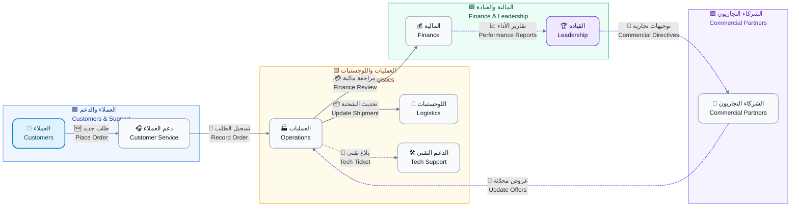
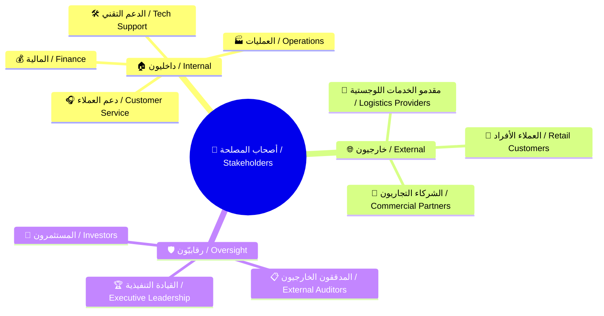
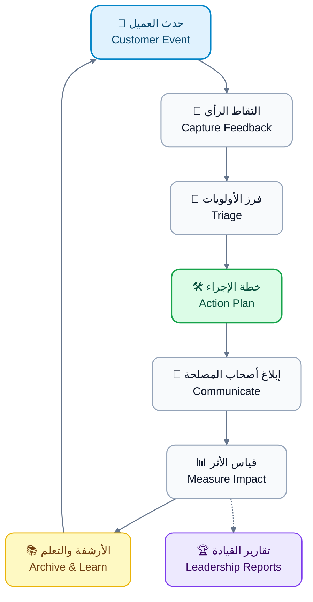

# 🤝 تحليل أصحاب المصلحة | Stakeholder Analysis

> 🏷️ **اسم المشروع:** منصة CA Admin للوساطة الشرائية
> Project Name: CA Admin Shopping Mediation Platform
> 🧑‍💼 **مالك الوثيقة:** عبدالله الشايع
> Document Owner: Abdullah Alshaif
> 🛠️ **المكدس التقني:** Flutter، Firebase (Firestore، Auth، Storage، Functions)
> Tech Stack: Flutter, Firebase (Firestore, Auth, Storage, Functions)
> 🔢 **الإصدار:** 0.1 (رؤية)
> Version: 0.1 (Vision)
> 📅 **آخر تحديث:** 20-09-2025
> Last Updated: 2025-09-20

**🎯 نظرة مركّزة:**
يقدم الملف تصورًا موحدًا لتوقعات أصحاب المصلحة ويوجه القرارات اليومية نحو أولوياتهم.
Focused insight: The document delivers a unified view of stakeholder expectations and steers day-to-day decisions toward their priorities.

**🧭 قيمة تطبيقية:**
يوضح المسار التشغيلي لتحديث بيانات الأطراف ويسهّل إعداد موجزات الإدارة والحوكمة.
Applied value: It clarifies the operational path for updating stakeholder data and streamlines the preparation of management and governance briefs.

---

## 1. 🔍 نظرة عامة على التحليل

Analysis Overview

يشرح القسم منهجية تحديد الأطراف المؤثرة استنادًا إلى قوتهم واهتمامهم وكيفية دمج النتائج في خارطة الطريق.
It explains the methodology for mapping influential parties by power and interest and shows how findings feed the roadmap.

يركز التحليل على التحديث المستمر باستخدام جلسات مراجعة ربع سنوية مع قادة الأعمال والفرق التقنية.
The analysis relies on continuous refresh through quarterly review sessions with business leaders and technical squads.

## 1.1 🔗 مشهد التفاعل | Interaction Landscape

**📌 الهدف:**
يرسم المخطط تتابع التفاعل بين الفرق الرئيسية ويوضح نقاط التسليم الحرجة لكل مسار.
Purpose: The diagram traces interactions among key teams and exposes critical hand-off points for each stream.

- 🔄 يوضح انتقال الطلب من خدمة العملاء إلى العمليات مع تمييز العتبات الزمنية لكل خطوة.
  It clarifies how orders move from customer service to operations while flagging timing thresholds for every step.
- 🧮 يبرز دور المالية في ضبط المدخلات وتحويلها إلى مؤشرات تنفيذية للقيادة العليا.
  It highlights finance's role in converting inputs into executive indicators for leadership.
- 🛡️ يضمن وجود مسار تصعيد تقني لتقليل الأعطال وإغلاق البلاغات خلال مستوى الخدمة المتفق عليه.
  It ensures a technical escalation lane that reduces outages and closes tickets within the agreed SLA.
- 🤝 يربط الشركاء التجاريين بخط التدفقات لضمان تزامن العروض وتسعير المنتجات مع حالة العمليات.
  It connects commercial partners to the flow so promotions and pricing stay synchronized with operational status.

## 1.2 🧭 تصنيف أصحاب المصلحة | Stakeholder Classification

**📌 الهدف:**
يجمع التصنيف أصحاب المصلحة في مجموعات واضحة تساعد على مواءمة قنوات الاتصال ومسارات الاعتماد.
Purpose: The classification groups stakeholders clearly, enabling aligned communication channels and approval paths.

- 📌 يسهل المخطط تحديد المسؤوليات المشتركة وتوزيع الموارد بما يتناسب مع قوة كل فئة.
  The map streamlines how shared responsibilities are identified and resources are allocated to match each group's influence.
- 🧱 يوفر نظرة بصرية تساعد الفرق الجديدة على فهم البيئة التنظيمية خلال جلسات الإعداد الأولى.
  It offers a visual snapshot that assists new teams in grasping the organizational landscape during onboarding.
- 📈 يدعم قرارات التوسع عبر ربط المستويات الرقابية بالشرائح التشغيلية لضمان الحوكمة المستمرة.
  It supports expansion decisions by linking oversight bodies to operational tiers, securing ongoing governance.

---

## 2. 📚 سجل أصحاب المصلحة | Stakeholder Catalogue

**📌 الهدف:**
يقدم الجدول توصيفًا موجزًا للأدوار والتوقعات لضمان توحيد الرسائل والنتائج المطلوبة.
Purpose: The table delivers concise role and expectation definitions to unify messaging and desired outcomes.

| الفئة Category                                 | الدور الرئيسي Primary Role                                                                                                                           | التوقع المحوري Key Expectation                                                                                                                                      |
| ------------------------------------------------- | ------------------------------------------------------------------------------------------------------------------------------------------------------- | ---------------------------------------------------------------------------------------------------------------------------------------------------------------------- |
| 👥 العملاء Customers                           | تقديم الطلبات ومتابعة حالتها عبر القنوات الرقمية والهاتفية. Submit orders and track their status through digital and phone channels.                 | رحلة واضحة ثنائية اللغة مع تسعير شفاف وإشعارات آنية بكل تغيير. A clear bilingual journey with transparent pricing and real-time change alerts.                      |
| 🎧 فريق خدمة العملاء Customer Service Team     | التحقق من بيانات الطلبات والرد على الاستفسارات وإدارة شكاوى المستخدمين. Validate order data, handle questions, and manage customer complaints.       | واجهة موحدة وسجلات تفاعل قابلة للبحث مع قوالب رد جاهزة. A unified interface and searchable interaction history with ready-to-use response templates.                |
| 🏭 فريق العمليات Operations Team               | تنسيق المشتريات وإدارة المخزون والمتابعة مع الشحن والموردين. Coordinate procurement, manage inventory, and liaise with shipping and suppliers.       | لوحة تحكم تنبؤية تقلل العمل اليدوي وتنبه مبكرًا لأي تأخير أو نقص. A predictive dashboard that reduces manual steps and raises early alerts for delays or shortages. |
| 💰 فريق المالية Finance Team                   | مطابقة المدفوعات، إدارة الأرصدة، وإصدار التقارير الدورية للحوكمة. Reconcile payments, manage balances, and produce periodic governance reports.      | بيانات دقيقة متعددة العملات وجاهزية فورية للتدقيق. Accurate multi-currency data with instant audit readiness.                                                       |
| 🏆 القيادة التنفيذية Executive Leadership      | وضع الأولويات، اعتماد الميزانيات، ومراقبة الأداء الاستراتيجي. Set priorities, approve budgets, and monitor strategic performance.                    | مؤشرات أداء موجزة ونماذج مخاطر شفافة لدعم قرارات النمو. Concise KPIs and transparent risk models to back growth decisions.                                          |
| 🛠️ الدعم التقني Tech Support                   | إدارة الصلاحيات، مراقبة سلامة النظام، ومعالجة الأعطال والبلاغات التقنية. Manage permissions, monitor system health, and resolve technical incidents. | سجلات أخطاء دقيقة وأدوات مراقبة لحظية مع اختبارات أمن متكررة. Precise error logs, real-time monitoring tools, and recurring security tests.                         |
| 🤝 الشركاء التجاريون Commercial Partners       | تحديث الأسعار وتوفير التوافر وتنسيق الحملات المشتركة. Update pricing, secure availability, and coordinate joint campaigns.                           | تكاملات API مستقرة وتقارير عمولات موثوقة مع رؤية زمنية للطلبات. Stable API integrations, reliable commission reports, and timely order visibility.                  |
| 🚚 مقدمو الخدمات اللوجستية Logistics Providers | استلام الشحنات ونقلها وتوثيق التسليم ضمن الإطارات الزمنية المتفق عليها. Receive, transport, and confirm deliveries within agreed timeframes.         | جداول دقيقة، إثباتات تسليم رقمية، ونظام لإدارة الاستثناءات بسهولة. Accurate schedules, digital proof of delivery, and easy exception management.                    |
| 📋 المدققون الخارجيون External Auditors        | التحقق من الامتثال المالي والتشغيلي باستخدام سجلات رسمية موثوقة. Validate financial and operational compliance through authoritative records.        | وصول مضبوط للبيانات وسجلات كاملة لكل معاملة وتقارير مراجعة معتمدة. Controlled data access, full per-transaction logs, and certified audit reports.                  |
| 💼 المستثمرون Investors                        | متابعة العوائد، فهم خارطة الطريق، ومراقبة مستويات المخاطر. Track returns, understand the roadmap, and observe risk levels.                           | تقارير حكومية مختصرة وتوقعات نمو مدعومة ببيانات موثوقة. Concise governance reports and growth forecasts backed by trustworthy data.                                 |

---

## 3. 💡 الاحتياجات الجوهرية | Core Needs

**📌 الهدف:**
تحدد النقاط التالية المتطلبات الأساسية التي تحافظ على نجاح المنصة لجميع الأطراف.
Purpose: The following points capture the essential requirements that keep the platform successful for every group.

- 🧭 وضوح رحلة العميل من الطلب إلى التسليم يقلل التصعيدات ويعزز الثقة.
  Customer journey clarity from order to delivery lowers escalations and boosts trust.
- ⚙️ كفاءة العمليات الداخلية تعتمد على أدوار وصلاحيات متسقة تمنع الازدواجية.
  Internal efficiency depends on consistent roles and permissions that prevent duplication.
- 🧾 صرامة السجلات المالية توحد مصادر البيانات وتوفر تتبعًا كاملاً لكل معاملة.
  Financial record rigor unifies data sources and provides complete traceability for each transaction.
- 📊 رؤى قيادية استراتيجية توفر مؤشرات أداء وتنبؤات توسّع موثوقة.
  Strategic leadership insight supplies dependable KPIs and expansion forecasts.

---

## 4. 🤝 استراتيجيات التفاعل | Engagement Strategies

**📌 الهدف:**
توفر النقاط أدناه أساليب ثابتة للتواصل والمتابعة تحفظ الشراكة الفعالة.
Purpose: The items below outline consistent communication and follow-up practices that secure effective partnerships.

- 📡 اختيار القناة المناسبة لكل فئة بين لوحات البيانات والبريد والاجتماعات المشتركة.
  Assign the optimal channel to each group, balancing dashboards, email, and joint workshops.
- 🗓️ نشر تقارير تشغيل أسبوعية ومراجعات استراتيجية شهرية دون انقطاع.
  Publish weekly operational reports and monthly strategic reviews without interruption.
- ⏱️ تحديد حدود زمنية واضحة للردود الداخلية والخارجية مع مسار تصعيد موثق.
  Define explicit turnaround thresholds for internal and external responses with a documented escalation route.
- 🧑‍🤝‍🧑 عقد جلسات تطوير ربع سنوية مع الشركاء والموردين لبناء الثقة واكتشاف فرص التحسين.
  Hold quarterly improvement sessions with partners and providers to build trust and surface enhancement opportunities.

---

## 5. 🔄 دورة التغذية الراجعة | Feedback Cycle

**📌 الهدف:**
يبين المخطط كيفية جمع الملاحظات وتحويلها إلى تحسينات مستمرة قابلة للقياس.
Purpose: The diagram shows how feedback is captured and turned into measurable continuous improvements.

- 🧾 تحويل كل ملاحظة إلى تذكرة محددة المسؤول والموعد النهائي يحافظ على المساءلة.
  Converting every comment into a ticket with an owner and due date preserves accountability.
- 📞 ربط القنوات الأمامية بفريق الدعم يمنع فقدان الرسائل ويضمن المتابعة الكاملة.
  Linking front-line channels to the support team prevents message loss and ensures full follow-through.
- 🧠 أرشفة النتائج بشكل دوري توسع قاعدة المعرفة وتدعم التدريب المتكرر.
  Periodic archiving expands the knowledge base and supports recurring enablement.

---

## 6. 🗂️ مصفوفة المسؤوليات (RACI) | Responsibility Matrix (RACI)

**📌 الهدف:**
يوزع الجدول أدوار RACI للأنشطة المحورية حتى تبقى الخطوط الوظيفية واضحة وفعّالة.
Purpose: The table assigns RACI roles to critical activities, keeping functional boundaries clear and effective.

| النشاط Activity                             | المسؤول Responsible             | المُحاسَب Accountable  | المستشارون Consulted                                  | الجهات المُخطَرة Informed                              |
| ---------------------------------------------- | ---------------------------------- | ------------------------- | -------------------------------------------------------- | --------------------------------------------------------- |
| 📨 استقبال الطلبات الجديدة New Order Intake | 🎧 دعم العملاء Customer Service | 🏭 العمليات Operations | 🛠️ الدعم التقني، 💰 المالية Tech Support, Finance     | 🏆 القيادة Leadership                                  |
| 🚚 تحديث حالة الشحن Update Shipment Status  | 🏭 العمليات Operations          | 💰 المالية Finance     | 🚚 مقدمو الخدمات اللوجستية Logistics Providers        | 🎧 دعم العملاء Customer Service                        |
| 💳 مطابقة الدفعات Payment Reconciliation    | 💰 المالية Finance              | 🏆 القيادة Leadership  | 🏭 العمليات Operations                                | 🤝 الشركاء، 📋 المدققون Partners, Auditors             |
| 🚀 إطلاق ميزة جديدة Launch New Feature      | 🛠️ الدعم التقني Tech Support    | 🏆 القيادة Leadership  | 🎧 خدمة العملاء، 💰 المالية Customer Service, Finance | جميع أصحاب المصلحة المتأثرين All impacted stakeholders |

---

## 7. 📈 مؤشرات المتابعة | Monitoring Indicators

**📌 الهدف:**
تساعد المؤشرات على قياس تأثير إدارة أصحاب المصلحة وتوجيه التحسين المستمر.
Purpose: The indicators measure the impact of stakeholder management and guide continuous improvement.

- ⏱️ معدل الاستجابة للشكاوى يختبر الالتزام بمستويات الخدمة ويسلط الضوء على الاختناقات.
  Complaint response rate tests SLA compliance and exposes emerging bottlenecks.
- 💸 زمن إغلاق الدورة المالية يتتبع المدة من المعاملة حتى التسوية لتوجيه قرارات الاستثمار والتدقيق.
  Financial cycle closure time tracks the span from transaction to reconciliation to guide investment and audit decisions.
- 🤝 مؤشر رضا الشركاء يقيس جودة التكامل والدعم ويحمي الحصة السوقية مع توسيع شبكة الموردين.
  Partner satisfaction index gauges integration quality and support, protecting market share while expanding the supplier network.
