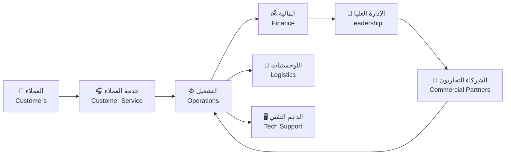
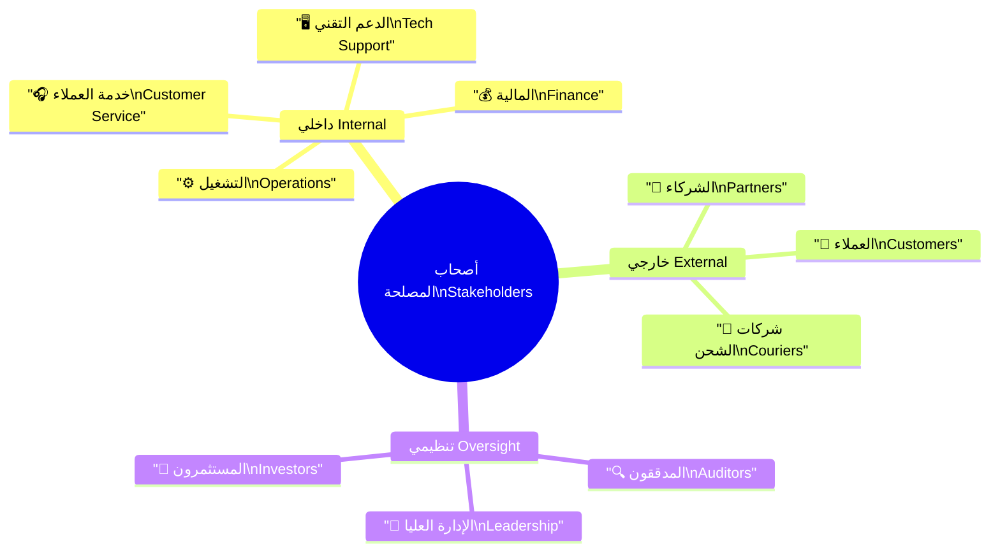
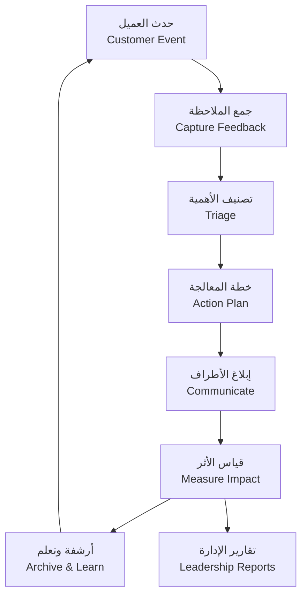

# 👥 تحليل أصحاب المصلحة

Stakeholders Analysis

---

> **المشروع:** منصة إدارة وساطة التسوق CA Admin  
> **Project:** CA Admin Shopping Mediation Platform  
> **التقنيات:** Flutter، Firebase (Firestore، Auth، Storage، Functions)  
> **Stack:** Flutter, Firebase (Firestore, Auth, Storage, Functions)  
> **الإصدار:** 0.1 (رؤية) - المالك: عبدالله الشائف - آخر تحديث: 2025-09-20  
> **Version:** 0.1 (Vision) - Owner: Abdullah Alshaif - Last Updated: 2025-09-20

**شرح مختصر:**
تحليل أصحاب المصلحة يحدد جميع الأطراف المؤثرة في نجاح المنصة، ويوضح احتياجاتهم وتوقعاتهم.

**Summary:**
Stakeholder analysis identifies all parties influencing platform success and clarifies their needs and expectations.

---

## 1. مقدمة

Introduction

---

### 1.1 نظرة بصرية

Visual Overview

**شرح مختصر:**
يوضح المخطط كيف تتفاعل الفئات الرئيسية مع بعضها لتحقيق أهداف المنصة.

**Summary:**
The diagram shows how main categories interact to achieve platform goals.

- 🇸🇦 **أهمية تحليل أصحاب المصلحة:** يوضح كيف يؤثر كل طرف على نجاح المنصة وإطلاقها.  
  🇬🇧 **Stakeholder analysis importance:** Shows how each party influences platform success and rollout.  
  🇸🇦 **ما هي:** إطار لتصنيف الأطراف حسب التأثير والاهتمام.  
  🇬🇧 **What:** A framework that classifies parties by influence and interest.  
  🇸🇦 **وظيفتها:** توجه قرارات التصميم، الحوكمة، والتواصل.  
  🇬🇧 **Function:** Guides decisions on design, governance, and communication.  
  🇸🇦 **فائدتها:** تقلل مخاطر التعارض وتضمن مواءمة التوقعات مبكرا.  
  🇬🇧 **Benefit:** Reduces conflict risk and aligns expectations early.

- 🇸🇦 **تنوع أصحاب المصلحة:** يجمع النظام مستخدمين داخليين، شركاء خارجيين، ومدققين مستقلين.  
  🇬🇧 **Stakeholder diversity:** The system brings together internal users, external partners, and independent auditors.  
  🇸🇦 **ما هي:** خارطة توضح الأطراف المتصلة بالتجربة الرقمية والعمليات الخلفية.  
  🇬🇧 **What:** A map describing parties linked to the digital experience and back-office operations.  
  🇸🇦 **وظيفتها:** تكشف نقاط التماس ومسؤوليات كل فريق.  
  🇬🇧 **Function:** Reveals touchpoints and responsibilities for each team.  
  🇸🇦 **فائدتها:** تسهل تصميم رحلات متكاملة وتحدد فرق الدعم المطلوبة.  
  🇬🇧 **Benefit:** Simplifies building end-to-end journeys and defining support teams.

- 🇸🇦 **مخرجات التحليل:** مصفوفة تأثير/اهتمام، خطط مشاركة، ومؤشرات التزام لكل طرف.  
  🇬🇧 **Analysis output:** Influence/interest matrix, engagement plans, and commitment indicators for each party.  
  🇸🇦 **ما هي:** مجموعة وثائق تشغيلية ومقاييس متابعة.  
  🇬🇧 **What:** A set of operational documents and monitoring metrics.  
  🇸🇦 **وظيفتها:** توفر مرجع موحد عند اتخاذ القرارات أو إدارة التغيير.  
  🇬🇧 **Function:** Provides a unified reference for decision making and change management.  
  🇸🇦 **فائدتها:** تعزز الشفافية وتدعم سرعة الاستجابة للفرص أو المخاطر.  
  🇬🇧 **Benefit:** Enhances transparency and enables faster response to opportunities or risks.

### 1.2 خريطة الفئات

Stakeholder Category Map

**شرح مختصر:**
المخطط الذهني يصنف أصحاب المصلحة إلى داخليين، خارجيين، وتنظيميين.

**Summary:**
The mindmap classifies stakeholders into internal, external, and oversight groups.

---

## 2. قائمة أصحاب المصلحة / Stakeholder Catalogue

| 🇸🇦 الفئة           | 🇬🇧 Category            | 🇸🇦 الدور الأساسي                                  | 🇬🇧 Primary Role                                         | 🇸🇦 التوقع الرئيسي                                   | 🇬🇧 Key Expectation                                             |
| ------------------ | ---------------------- | ------------------------------------------------- | ------------------------------------------------------- | --------------------------------------------------- | -------------------------------------------------------------- |
| العملاء            | Customers              | تقديم الطلبات ومتابعة الشحنات                     | Place orders and track shipments                        | تجربة موثوقة ثنائية اللغة مع شفافية الأسعار         | Reliable bilingual journey with transparent pricing            |
| موظفو خدمة العملاء | Customer Service Staff | استقبال الطلبات، التحقق من بيانات العملاء         | Capture orders, verify customer data                    | واجهات سريعة، قوالب استجابة، سجل تفاعلات            | Fast UI, response templates, interaction history               |
| فريق التشغيل       | Operations Team        | إدارة الشراء، الربط مع الموردين، التتبع المرحلي   | Manage procurement, vendor coordination, stage tracking | لوحة تحكم موحدة وتنبيهات استباقية                   | Unified dashboard and proactive alerts                         |
| فريق المالية       | Finance Team           | تسوية المدفوعات، إدارة الأرصدة، إعداد التقارير    | Reconcile payments, manage balances, prepare reports    | دقة البيانات، إمكانية التدقيق، دعم العملات المتعددة | Data accuracy, audit readiness, multi-currency support         |
| الإدارة العليا     | Leadership             | تحديد الأولويات، اعتماد الميزانيات، متابعة الأداء | Set priorities, approve budgets, monitor performance    | مؤشرات استراتيجية، رؤى نمو، سيناريوهات مخاطر        | Strategic KPIs, growth insights, risk scenarios                |
| الدعم التقني       | Tech Support           | إدارة الصلاحيات، مراقبة الأداء، دعم التطبيق       | Manage roles, monitor performance, support app          | سجلات أخطاء واضحة، أدوات مراقبة، اختبارات أمان      | Clear error logs, monitoring tools, security tests             |
| الشركاء التجاريون  | Commercial Partners    | توفير المنتجات، تحديث الأسعار، معالجة الشحن       | Provide products, update pricing, process shipping      | تكامل API مستقر، تقارير عمولة، رؤية على الطلب       | Stable API integration, commission reports, order visibility   |
| شركات الشحن        | Logistics Providers    | استلام الشحنات، النقل، التسليم داخل اليمن         | Receive shipments, transport, deliver within Yemen      | جداول دقيقة، إثبات تسليم، تواصل في الوقت الفعلي     | Accurate schedules, proof of delivery, real-time communication |
| المدققون الخارجيون | External Auditors      | التحقق من الالتزام المالي والتشغيلي               | Verify financial and operational compliance             | وصول مقنن للبيانات، سجلات كاملة، تقارير مصدقة       | Controlled data access, complete logs, certified reports       |

---

## 3. الاحتياجات الأساسية / Core Needs

- 🇸🇦 **وضوح تجربة العميل:** ضمان معلومات شفافة من الطلب حتى التسليم.  
  🇬🇧 **Customer journey clarity:** Guarantee transparent information from order to delivery.  
  🇸🇦 **ما هي:** مطلب جودة يركز على البيانات المحدثة ودعم اللغتين.  
  🇬🇧 **What:** A quality requirement emphasizing fresh data and bilingual support.  
  🇸🇦 **وظيفتها:** يحدد المعايير التي يجب على فرق الخدمة والعمليات الالتزام بها.  
  🇬🇧 **Function:** Sets standards that service and operations teams must uphold.  
  🇸🇦 **فائدتها:** يعزز الثقة ويقلل الاستفسارات التصعيدية.  
  🇬🇧 **Benefit:** Builds trust and reduces escalated inquiries.

- 🇸🇦 **كفاءة الفريق الداخلي:** تمكين الموظفين من إنجاز المهام دون ازدواجية أو أعطال.  
  🇬🇧 **Internal efficiency:** Enable staff to complete tasks without duplication or breakdowns.  
  🇸🇦 **ما هي:** مجموعة ضوابط لأدوار العمل، الصلاحيات، والدعم.  
  🇬🇧 **What:** A set of controls covering roles, permissions, and support.  
  🇸🇦 **وظيفتها:** تضمن سير العمل المتسق بين المواقع والفروع.  
  🇬🇧 **Function:** Ensures consistent workflows across locations and branches.  
  🇸🇦 **فائدتها:** ترفع الإنتاجية وتقلل زمن التدريب للمنضمين الجدد.  
  🇬🇧 **Benefit:** Boosts productivity and shortens onboarding time.

- 🇸🇦 **صرامة مالية قابلة للتدقيق:** توحيد مصادر البيانات المالية وإتاحة تتبع كامل.  
  🇬🇧 **Auditable financial rigor:** Unify financial data sources with complete traceability.  
  🇸🇦 **ما هي:** مجموعة متطلبات تسوية وسجلات لكل حركة.  
  🇬🇧 **What:** A package of reconciliation requirements and per-transaction logs.  
  🇸🇦 **وظيفتها:** تغذي تقارير الالتزام والقرارات الاستثمارية.  
  🇬🇧 **Function:** Feeds compliance reports and investment decisions.  
  🇸🇦 **فائدتها:** تحمي من المخاطر القانونية وتحافظ على سمعة المنصة.  
  🇬🇧 **Benefit:** Shields from legal risk and preserves platform reputation.

- 🇸🇦 **رؤى استراتيجية للإدارة:** توفير مؤشرات أداء وبيانات تنبؤية.  
  🇬🇧 **Strategic insight for leadership:** Provide performance indicators and predictive data.  
  🇸🇦 **ما هي:** لوحات قياس ونماذج توقع تعتمد على بيانات محدثة.  
  🇬🇧 **What:** Dashboards and forecasting models built on fresh data.  
  🇸🇦 **وظيفتها:** تساعد على تخطيط التوسع وتقييم العوائد.  
  🇬🇧 **Function:** Helps plan expansion and evaluate returns.  
  🇸🇦 **فائدتها:** تدعم اتخاذ قرارات أسرع وأكثر ثقة.  
  🇬🇧 **Benefit:** Enables faster, more confident decisions.

---

## 4. استراتيجيات المشاركة / Engagement Strategies

- 🇸🇦 **قنوات تواصل مخصصة:** تحديد القناة المناسبة لكل فئة (لوحات، بريد، مجموعات عمل).  
  🇬🇧 **Tailored communication channels:** Assign the right channel to each segment (dashboards, email, working groups).  
  🇸🇦 **ما هي:** سياسة تصنيف للقنوات حسب نوع الرسالة وسرعتها.  
  🇬🇧 **What:** A policy that classifies channels by message type and urgency.  
  🇸🇦 **وظيفتها:** تمنع تشتيت الرسائل وتسرع الوصول للمعلومات المهمة.  
  🇬🇧 **Function:** Prevents message fatigue and accelerates delivery of critical updates.  
  🇸🇦 **فائدتها:** تحافظ على التفاعل وترفع نسبة الاستجابة.  
  🇬🇧 **Benefit:** Maintains engagement and improves response rates.

- 🇸🇦 **جدولة ثابتة للتحديثات:** نشر تقارير تشغيلية أسبوعية ومراجعات شهرية استراتيجية.  
  🇬🇧 **Scheduled updates:** Publish weekly operational reports and monthly strategic reviews.  
  🇸🇦 **ما هي:** تقويم اتصالات موحد يحدد المواعيد والمسؤوليات.  
  🇬🇧 **What:** A unified communication calendar defining timing and ownership.  
  🇸🇦 **وظيفتها:** يضمن عدم تفويت المستجدات ويثبت الإيقاع الإداري.  
  🇬🇧 **Function:** Ensures no update is missed and stabilizes executive cadence.  
  🇸🇦 **فائدتها:** يزيد التوقعية ويقلل الاجتماعات الطارئة.  
  🇬🇧 **Benefit:** Increases predictability and reduces emergency meetings.

- 🇸🇦 **عتبات استجابة واضحة:** تعريف أزمنة قصوى للرد على الطلبات والاستفسارات.  
  🇬🇧 **Clear response thresholds:** Define maximum turnaround times for requests and inquiries.  
  🇸🇦 **ما هي:** SLA ثنائي اللغة يغطي القنوات الداخلية والخارجية.  
  🇬🇧 **What:** A bilingual SLA covering internal and external channels.  
  🇸🇦 **وظيفتها:** يضبط الأداء ويتيح مراقبة الالتزام عبر مؤشرات.  
  🇬🇧 **Function:** Regulates performance and enables monitoring through metrics.  
  🇸🇦 **فائدتها:** يحد من التصعيد ويرفع رضا الشركاء.  
  🇬🇧 **Benefit:** Limits escalations and lifts partner satisfaction.

---

## 5. دورة التغذية الراجعة / Feedback Cycle

- 🇸🇦 **منهجية الوصول للحلول:** تحويل كل تغذية راجعة إلى بطاقة محددة المسؤول والموعد.  
  🇬🇧 **Structured resolution methodology:** Turn each feedback item into a ticket with owner and due date.  
  🇸🇦 **ما هي:** عملية تشغيلية تربط القنوات الأمامية بالفرق الداعمة.  
  🇬🇧 **What:** An operational process linking front-line channels to support teams.  
  🇸🇦 **وظيفتها:** تمنع فقدان الرسائل وتضمن تتبع التنفيذ.  
  🇬🇧 **Function:** Prevents message loss and ensures follow-through.  
  🇸🇦 **فائدتها:** تزيد الثقة في منظومة الخدمة وتتيح بناء قاعدة معرفة.  
  🇬🇧 **Benefit:** Builds trust in support operations and grows the knowledge base.

---

## 6. مصفوفة المسؤوليات / Responsibility Matrix (RACI)

| 🇸🇦 النشاط        | 🇬🇧 Activity            | 🇸🇦 R (مسؤول) | 🇬🇧 R             | 🇸🇦 A (معتمد)   | 🇬🇧 A       | 🇸🇦 C (استشاري)        | 🇬🇧 C                      | 🇸🇦 I (مطلع)                  | 🇬🇧 I                      |
| ---------------- | ---------------------- | ------------ | ---------------- | -------------- | ---------- | --------------------- | ------------------------- | ---------------------------- | ------------------------- |
| تسجيل طلب جديد   | New order intake       | خدمة العملاء | Customer Service | التشغيل        | Operations | التقنية، المالية      | Tech, Finance             | الإدارة العليا               | Leadership                |
| تحديث حالة شحنة  | Update shipment status | التشغيل      | Operations       | المالية        | Finance    | شركات الشحن           | Couriers                  | خدمة العملاء                 | Customer Service          |
| تسوية دفعة       | Payment reconciliation | المالية      | Finance          | الإدارة العليا | Leadership | التشغيل               | Operations                | الشركاء، المدققون            | Partners, Auditors        |
| إطلاق ميزة جديدة | Launch new feature     | التقنية      | Tech Support     | الإدارة العليا | Leadership | خدمة العملاء، المالية | Customer Service, Finance | جميع أصحاب المصلحة المتأثرين | All impacted stakeholders |

---

## 7. مؤشرات المتابعة / Monitoring Indicators

- 🇸🇦 **معدل استجابة الشكاوى:** قياس نسبة الرد خلال SLA المحدد.  
  🇬🇧 **Complaint response rate:** Measure percentage of replies within defined SLA.  
  🇸🇦 **ما هي:** مؤشر يجمع مخرجات خدمة العملاء والتشغيل أسبوعيا.  
  🇬🇧 **What:** A metric combining weekly outputs from customer service and operations.  
  🇸🇦 **وظيفتها:** يكشف عن الاختناقات أو الحاجة لدعم إضافي.  
  🇬🇧 **Function:** Reveals bottlenecks or need for extra support.  
  🇸🇦 **فائدتها:** يسمح بإعادة توزيع الموارد بسرعة قبل تفاقم المشاكل.  
  🇬🇧 **Benefit:** Enables rapid resource reallocation before issues escalate.

- 🇸🇦 **زمن إغلاق الدورات المالية:** تتبع المدة بين المعاملة والتسوية النهائية.  
  🇬🇧 **Financial cycle closure time:** Track duration between transaction and final reconciliation.  
  🇸🇦 **ما هي:** مقياس يجمع بيانات الدفع، التحويل، والتقارير.  
  🇬🇧 **What:** A measurement combining payment, transfer, and reporting data.  
  🇸🇦 **وظيفتها:** يقيس كفاءة الفريق المالي ومدى جاهزية التدقيق.  
  🇬🇧 **Function:** Gauges finance team efficiency and audit readiness.  
  🇸🇦 **فائدتها:** يدعم قرارات الاستثمار ويقلل تكاليف التدقيق.  
  🇬🇧 **Benefit:** Supports investment decisions and reduces audit costs.

- 🇸🇦 **مؤشر رضا الشركاء:** جمع تقييمات الشركاء حول جودة التكامل والدعم.  
  🇬🇧 **Partner satisfaction index:** Gather partner ratings on integration quality and support.  
  🇸🇦 **ما هي:** استبيان دوري بدرجات كمية وتعليقات نوعية.  
  🇬🇧 **What:** A periodic survey with quantitative scores and qualitative notes.  
  🇸🇦 **وظيفتها:** يرصد صحة العلاقات التجارية ومجالات التحسين.  
  🇬🇧 **Function:** Monitors health of commercial relationships and improvement areas.  
  🇸🇦 **فائدتها:** يساعد في الحفاظ على الحصة السوقية وتوسيع شبكة التوريد.  
  🇬🇧 **Benefit:** Helps maintain market share and expand supplier network.
