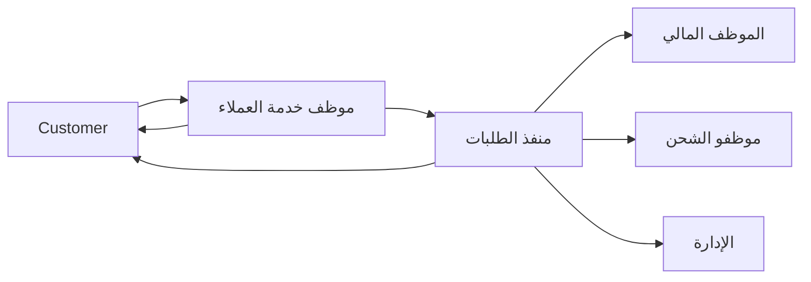
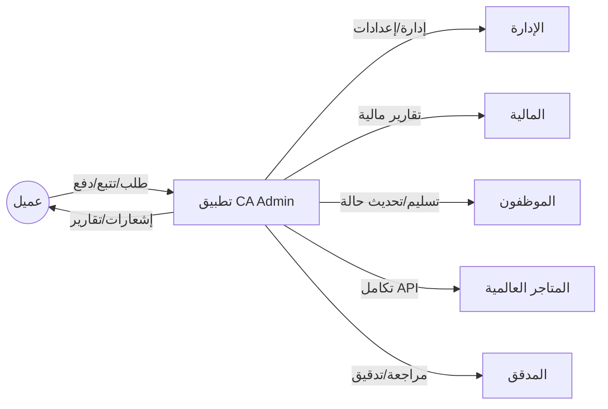
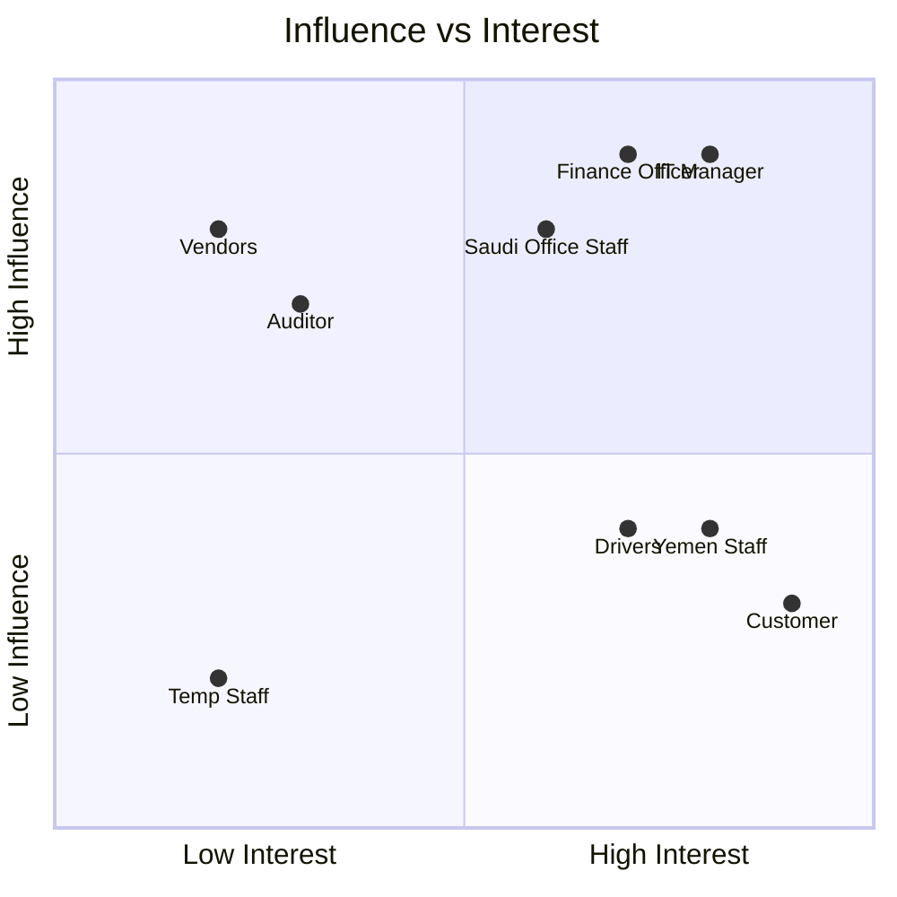
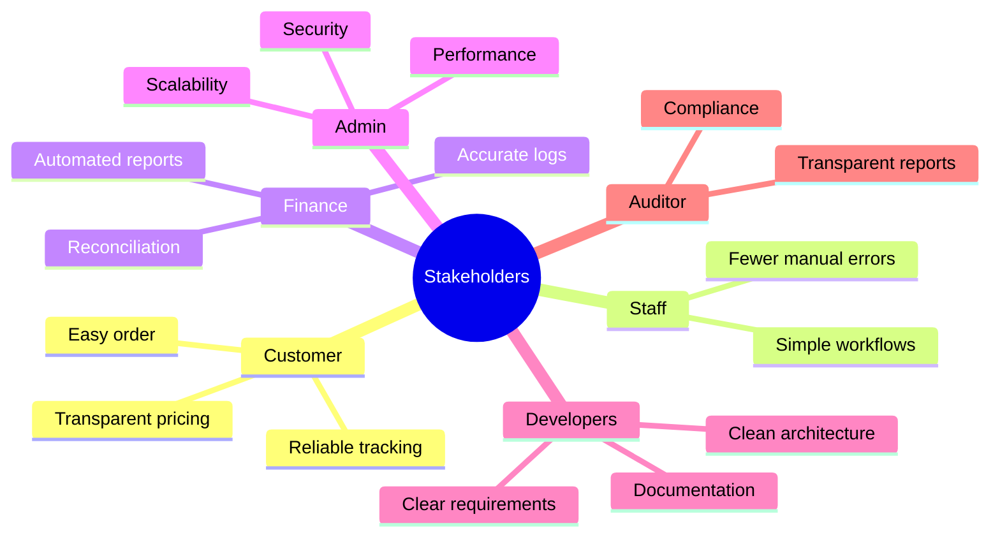

# 👥 Stakeholders Analysis / تحليل أصحاب المصلحة

> **Project:** CA Admin
> **Version:** v0.1 — Owner: Abdullah Alshaif — Last Updated: YYYY-MM-DD

---

## 1. Introduction / المقدمة

---

## 1.2 Staff Workflow Overview / نظرة على سير عمل الموظفين

<!-- Centered image workaround for Markdown linting -->

**EN:**
Stakeholders are all individuals, groups, or entities who have an interest in the CA Admin system, whether internal (staff, finance, IT) or external (customers, vendors). Identifying and analyzing stakeholders ensures that requirements are clear and priorities are aligned.

**AR:**
أصحاب المصلحة هم جميع الأفراد أو المجموعات أو الجهات التي لها علاقة بنظام CA Admin، سواء داخليًا (الموظفون، المالية، التقنية) أو خارجيًا (العملاء، المتاجر). تحديدهم وتحليلهم يساعد على وضوح المتطلبات وتوافق الأولويات.

---

## 1.1 Stakeholder Interaction Map / خريطة تفاعل أصحاب المصلحة

---

## 2. Stakeholder List / قائمة أصحاب المصلحة

| **Collaboration Scenario** | سيناريو التعاون | موظف خدمة العملاء يدخل طلب جديد لعميل، منفذ الطلبات يراجعه ويقسمه ويصدر الفواتير ويربطها ببطاقة هدية، ثم يتم إشعار العميل بالفاتورة وحالة الطلب. |

| Stakeholder (EN) | Stakeholder (AR) | Description / الوصف | Interest / الدور | Example Scenario / سيناريو عملي |
| ---------------- | ---------------- | ------------------- | ---------------- | ------------------------------- |

| **Customer** | العميل | End-users placing product requests via app | Wants simple order flow, payment transparency, shipment tracking | "Ali places an order, tracks his shipment, and pays online." |
| **Customer Service Staff** | موظفو خدمة العملاء | Enter customer names and data into the customer library; enter customer orders into the order library | Ensure accurate customer records and order entry | "Layla adds a new customer and enters their order details into the system." |
| **Order Processor** | منفذ الطلبات | Create order numbers in the order number library; view and execute customer orders; edit any order field as needed; add new orders; link multiple orders together; split orders into parts; create tracking states for each part (with part number, reference, account, quantity); link tracking states to orders; create payment invoices for each part and record all discounts; link invoices to orders and gift cards used for payment | Ensure all order processing, tracking, and invoicing is accurate and linked | "Khalid processes several customer orders, splits one into two parts, creates tracking and invoices, and links gift cards for payment." |
| **Saudi Office Staff** | موظفو مكتب السعودية | Receive shipments, consolidate packages | Ensure accurate consolidation & timely forwarding | "Sara receives packages, scans them, and prepares for Yemen." |
| **Yemen Office Staff** | موظفو مكتب اليمن | Handle local delivery to customers | Deliver accurately and update system | "Ahmed delivers packages to customers in Sana'a and updates status." |
| **Drivers / Couriers** | السائقون / المندوبون | Transport shipments (KSA → Yemen / local) | Keep shipments safe and update statuses | "Mohammed drives from KSA to Yemen, updates delivery status." |
| **Finance Officer** | الموظف المالي | Manage invoices, payments, deductions, deposits | Maintain accurate logs & reports | "Fatima logs payments and generates weekly reports." |
| **Admin / IT Manager** | المدير / مدير التقنية | Oversee the entire system, assign roles | System stability, security, scalability | "Omar assigns roles and monitors system health." |
| **Developers** | المطورون | Flutter & Firebase developers | Implement requirements, ensure maintainability | "The dev team adds a new feature for order search." |
| **Vendors (Shein, Amazon, iHerb, Noon)** | المتاجر العالمية | Provide products and order APIs | Reliable APIs, correct order fulfillment | "Shein API sends order confirmation to the system." |
| **Auditor / Reviewer** | المدقق | Internal/external reviewer of financial logs | Ensure compliance & transparency | "External auditor reviews financial logs for compliance." |

---

## 2.1 Communication Channels / قنوات التواصل

| Stakeholder | Channel (EN)              | القناة (AR)                             |
| ----------- | ------------------------- | --------------------------------------- |
| Customer    | Mobile App, Email, SMS    | تطبيق الجوال، بريد إلكتروني، رسائل نصية |
| Staff       | Mobile App, Web Dashboard | تطبيق الجوال، لوحة تحكم ويب             |
| Finance     | Web Dashboard, Reports    | لوحة تحكم ويب، تقارير                   |
| Admin       | Web Dashboard, Email      | لوحة تحكم ويب، بريد إلكتروني            |
| Developers  | GitHub, Documentation     | GitHub، التوثيق                         |
| Vendors     | API Integration, Email    | تكامل API، بريد إلكتروني                |
| Auditor     | Reports, Dashboard        | تقارير، لوحة تحكم                       |

---

## 3. Stakeholder Classification / تصنيف أصحاب المصلحة

---

## 4. RACI Matrix / مصفوفة المسؤوليات

| Task / المهمة           | Responsible (منفذ)    | Accountable (مسؤول رئيسي) | Consulted (مستشار) | Informed (مطلع) |
| ----------------------- | --------------------- | ------------------------- | ------------------ | --------------- |
| Collect customer orders | Yemen Staff           | IT Manager                | Customer           | Finance         |
| Purchase from vendors   | Saudi Staff           | IT Manager                | Vendors            | Finance         |
| Shipment consolidation  | Saudi Staff           | IT Manager                | Drivers            | Yemen Staff     |
| Local delivery          | Yemen Staff + Drivers | Office Manager            | Customer           | Finance         |
| Payment collection      | Finance Officer       | IT Manager                | Auditor            | Customer        |
| Financial reporting     | Finance Officer       | Auditor                   | IT Manager         | Admin           |
| System maintenance      | Developers            | IT Manager                | Finance            | All Staff       |

---

## 5. Needs & Expectations / الاحتياجات والتوقعات

---

## 6. Impact of Feedback / أثر ملاحظات أصحاب المصلحة

- **EN:** Stakeholder feedback is continuously collected through the app, meetings, and support channels. It directly influences feature prioritization, bug fixes, and roadmap updates.
- **AR:** يتم جمع ملاحظات أصحاب المصلحة باستمرار عبر التطبيق والاجتماعات وقنوات الدعم، وتؤثر مباشرة في ترتيب الأولويات، إصلاح المشاكل، وتحديث خارطة الطريق.

---

## 7. Notes / ملاحظات

- تقسيم الموظفين حسب المهام يتيح تخصيص التدريب والصلاحيات لكل نوع، ويساعد في مراقبة الأداء وتحسين الخدمة.
- سيناريو عملي: موظف خدمة العملاء يدخل الطلب، منفذ الطلبات يراجعه ويقسمه ويصدر الفواتير ويربطها ببطاقة هدية، ثم يتم إشعار العميل بالفاتورة وحالة الطلب.
- سيتم إضافة أنواع موظفين جديدة مستقبلاً حسب توسع النظام، مثل موظف مراجعة الطلبات، موظف دعم فني، إلخ.

- Stakeholder expectations will guide **User Stories** and **Use Cases**.
- Updates to roles/responsibilities must be reflected in **Security & Roles (RBAC)** documentation.
- More staff types and their responsibilities will be added in the future as the system evolves.

---
