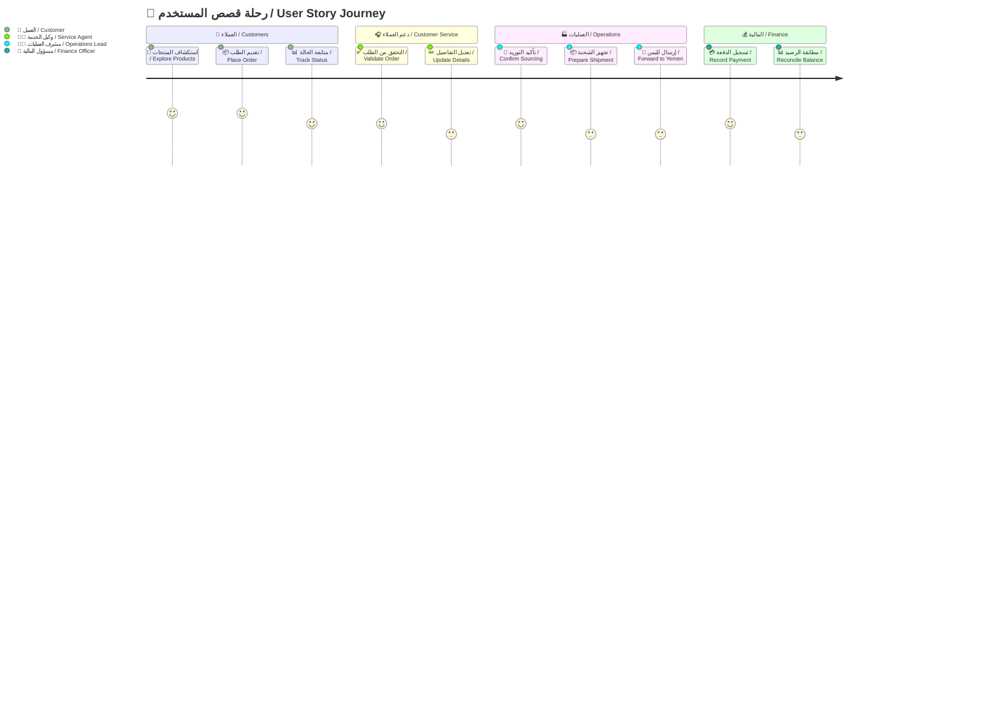
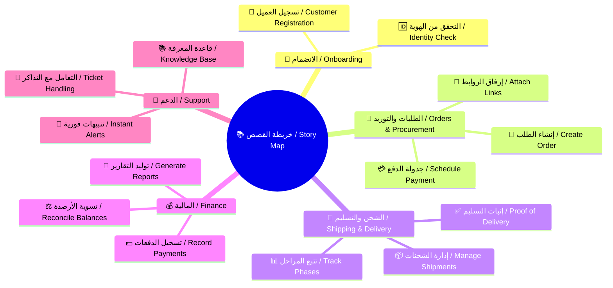

# 🗺️ قصص المستخدم | User Stories

> 🏷️ **اسم المشروع:** منصة الوساطة الشرائية CA Admin
> Project Name: CA Admin Shopping Mediation Platform
> 👤 **مالك الوثيقة:** عبدالله الشايع
> Document Owner: Abdullah Alshaif
> 🛠️ **المكدس التقني:** Flutter، Firebase (Firestore، Auth، Storage، Functions)
> Tech Stack: Flutter, Firebase (Firestore, Auth, Storage, Functions)
> 🔢 **الإصدار:** 0.1 (رؤية)
> Version: 0.1 (Vision)
> 📅 **آخر تحديث:** 20-09-2025
> Last Updated: 2025-09-20

**⚡ نظرة خاطفة:**
تجمع الوثيقة قصص المستخدم المعتمدة وتربط كل قصة بنتيجة قابلة للقياس وقيمة تجارية واضحة.
Focused insight: The document consolidates approved user stories and links each one to measurable outcomes and business value.

**🧭 قيمة تنفيذية:**
تعمل القصص كبوصلة للأولويات وتضمن اتساق تجربة جميع أصحاب المصلحة مع أهداف المنصة.
Applied value: The stories act as a compass for prioritisation, keeping every stakeholder experience aligned with platform objectives.

---

## 1. 🔍 نظرة عامة على القصص | Stories Overview

- 🧑‍🤝‍🧑 تعتمد الخريطة على شخصيات محددة لضمان تغطية احتياجات العميل، والدعم، والعمليات، والمالية.
  It relies on defined personas to ensure the needs of customer, service, operations, and finance teams are covered.
- 🧩 يتم تحديث القصص بشكل ربع سنوي بناءً على التغذية الراجعة والبيانات التشغيلية.
  Stories are refreshed every quarter based on feedback and operational insights.

## 1.1 🛣️ رحلة القصة | Story Journey Map

**🎯 الهدف:**
يبين المخطط مسار القصة من الاكتشاف وحتى مراجعة المالية وتغذية التحسين المستمر.
Purpose: The chart highlights the flow from discovery to finance review and continuous improvement.



- 🔄 يوضح المخطط نقاط التسليم بين الفرق الرئيسية ويحدد العتبات الزمنية لكل مرحلة.
  The journey highlights hand-offs among core teams and clarifies timing thresholds per stage.
- 📊 يساعد على بناء مؤشرات أداء تعكس صحة كل مرحلة من منظور العميل والعمليات.
  It supports defining KPIs that represent stage health from customer and operations perspectives.
- 🛡️ يكشف عن نقاط المخاطر التي يجب مراقبتها لتقليل التأخير أو التصعيد.
  It exposes risk points that need monitoring to reduce delays or escalations.

---

## 2. 🧠 خريطة القصص | Story Map

**🎯 الهدف:**
تنظم الخريطة القصص حسب المجال التشغيلي مع إبراز الاعتمادية المتقاطعة بين الفرق.
Purpose: The mindmap organises stories by operational domain while surfacing cross-team dependencies.



- 🧭 يمكّن الفرق من تحديد الفجوات المحتملة بين الأنشطة والبحث عن قصص داعمة جديدة.
  Enables teams to spot potential gaps between activities and propose supportive stories.
- 🔌 يبرز نقاط التكامل مع الأنظمة الداخلية والخارجية لضمان تبادل بيانات سلس.
  Highlights integration touchpoints with internal and external systems for smooth data exchange.
- 🗺️ يوفر مرجعًا بصريًا سريعًا لجلسات التخطيط وورش المواءمة.
  Provides a fast visual reference during planning and alignment workshops.

---

## 3. 📋 جدول قصص المستخدم | User Stories Table

**🎯 الهدف:**
يقدم الجدول أهم القصص المعتمدة مع إبراز القيمة المضافة ومعايير القبول لكل قصة.
Purpose: The table summarises key approved stories, detailing delivered value and acceptance criteria.

| المستفيد<br>Beneficiary                        | الهدف الرئيسي<br>Main Goal                                                                                         | قصة المستخدم<br>User Story                                                                                                                                                                                  | القيمة المتحققة<br>Delivered Value                                                                                                                                             | معايير القبول المحورية<br>Key Acceptance Criteria                                                                                                                                                                                                                                                                                                                                                   |
| ---------------------------------------------- | ------------------------------------------------------------------------------------------------------------------ | ----------------------------------------------------------------------------------------------------------------------------------------------------------------------------------------------------------- | ------------------------------------------------------------------------------------------------------------------------------------------------------------------------------ | --------------------------------------------------------------------------------------------------------------------------------------------------------------------------------------------------------------------------------------------------------------------------------------------------------------------------------------------------------------------------------------------------- |
| 👥 العملاء الأفراد<br>Retail Customers         | تقديم طلب جديد بروابط المنتجات مع متابعة كاملة.<br>Submit a new order with product links and full tracking.        | كعميل أرغب في إدخال طلب جديد مرفقًا بروابط المنتجات حتى أتابع الشحنة بسهولة.<br>As a customer I want to submit an order with product links so I can monitor the shipment easily.                            | رحلة تقديم مبسطة مع إشعارات تلقائية تقلل الاستفسارات المتكررة.<br>Simplified submission with automated alerts that lower repeated inquiries.                                   | 1. يعرض ملخص الطلب قبل الإرسال.<br>Summary is shown before submission.<br>2. يدعم الحقول إدخال روابط متعددة وتوضيح الملاحظات الثنائية اللغة.<br>Fields accept multiple links and bilingual notes.<br>3. يتم إرسال إشعار فوري بالبريد وقناة الاتصال المختارة.<br>Instant notification is delivered to email and selected channel.                                                                    |
| 🎧 فريق خدمة العملاء<br>Customer Service Team  | تحديث بيانات الطلب دون فقدان سجل المراجعات.<br>Update order data without losing revision history.                  | كوكيل خدمة أريد تعديل تفاصيل الطلب مع الاحتفاظ بسجل التغييرات لضمان متابعة دقيقة.<br>As a service agent I want to edit order details while keeping change history to ensure accurate follow-up.             | تحسين جودة البيانات وتقليل أخطاء التوثيق في مركز الاتصال.<br>Improves data quality and reduces documentation errors inside the contact centre.                                 | 1. يخزن كل تعديل الوقت والاسم والملاحظات.<br>Each edit stores timestamp, username, and notes.<br>2. يظهر تنبيه عند وجود تعارض بين تعديلات متعددة.<br>Conflict warning appears on overlapping edits.<br>3. يمكن الرجوع لإصدار سابق بضغطة واحدة للحالات الطارئة.<br>Previous version can be restored in a single click for emergencies.                                                               |
| 🏭 مشرف العمليات<br>Operations Supervisor      | مراقبة مراحل التوريد والشحن في لوحة واحدة موحدة.<br>Monitor sourcing and shipping stages from a unified dashboard. | كمشرف عمليات أريد عرض حالة كل شحنة ومصدرها حتى أوجه الفريق وتلافى التأخير.<br>As an operations supervisor I want to see every shipment status and origin so I can steer the team and prevent delays.        | يقلل الوقت المطلوب لتنسيق الموردين ويمنح رؤية موحدة للتقدم اليومي.<br>Reduces coordination time with suppliers and provides a unified view of daily progress.                  | 1. تعرض اللوحة مؤشرات اللون لكل مرحلة.<br>Dashboard shows coloured indicators per stage.<br>2. يُولد تقرير PDF يومي تلقائي للمراجعة الصباحية.<br>Daily PDF report is generated automatically for morning review.<br>3. يمكن تصفية البيانات حسب المورد أو الدولة أو حالة الشحن.<br>Data can be filtered by supplier, country, or shipping stage.                                                     |
| 💰 محلل المالية<br>Finance Analyst             | مطابقة الدفعات وتحديث الرصيد المتبقي بدقة.<br>Reconcile payments and update remaining balance accurately.          | كمحلل مالية أريد مراجعة كل دفعة وربطها بالطلب حتى أضمن شمولية السجلات.<br>As a finance analyst I want to reconcile each payment with its order so that records stay complete.                               | يدعم الفوترة الدقيقة ويقلل زمن التسوية ويعزز جاهزية التدقيق.<br>Supports precise invoicing, shortens reconciliation time, and boosts audit readiness.                          | 1. يمكن استيراد الحركات البنكية CSV وتطابقها مع الطلبات.<br>Bank CSV imports can be matched to orders.<br>2. يظهر تنبيه فوري إذا لم يُغطِّ الدفع كامل المبلغ.<br>Alert triggers when payment does not cover full amount.<br>3. تُخزن القيود المحاسبية باللغتين للاستخدام في التقارير الخارجية.<br>Journal entries are stored bilingually for external reporting.                                    |
| 🛠️ مهندس الدعم التقني<br>Tech Support Engineer | تتبع مشكلات الأداء وربطها بالقصص ذات الصلة.<br>Track performance issues and link them to relevant stories.         | كمهندس دعم أريد ربط البلاغات بقصص المستخدم لأتأكد من معالجة الأسباب الجذرية في الإصدارات القادمة.<br>As a support engineer I want to link incidents to user stories so future releases address root causes. | يعزز الشفافية بين فرق الدعم والتطوير ويمنع تكرار الأعطال الحرجة.<br>Enhances transparency between support and development teams and prevents recurrence of critical incidents. | 1. يسمح النظام بربط التذكرة بأكثر من قصة مع توثيق المبررات.<br>System allows linking tickets to multiple stories with documented rationale.<br>2. يتم توليد تقرير أسبوعي للبلاغات المرتفعة.<br>A weekly raised-incidents report is generated automatically.<br>3. تتبع الحل يحدَّث تلقائيًا عند إغلاق القصة المرتبطة.<br>Resolution tracking updates automatically when the linked story is closed. |

---

## 4. 🎯 ترتيب أولويات القصص | Story Prioritisation

**🎯 الهدف:**
تحدد التوجيهات التالية آلية تقييم القصص قبل إدراجها في دورة التطوير.
Purpose: The guidance below defines how stories are evaluated before entering the delivery cycle.

- ⚖️ يتم تقييم كل قصة وفقًا لمحورين: تأثير الأعمال ومجهود التنفيذ، مع تعزيز القصص ذات التأثير العالي والمجهود المنخفض.
  Each story is scored on business impact versus implementation effort, promoting high-impact, low-effort items.
- 🧪 تتطلب القصص ذات الافتراضات غير المؤكدة تجربة سريعة أو نمذجة أولية قبل الالتزام الكامل.
  Stories with uncertain assumptions require quick experiments or prototyping before full commitment.
- 🔁 تُراجع قائمة الأولويات في نهاية كل سباق تطوير لضمان استيعاب الدروس المستفادة.
  The priority list is revisited at the end of every sprint to incorporate lessons learned.
- 🤝 يجب إشراك ممثلي العمليات والمالية في قرارات التدرج لضمان مواءمة التشغيل والحوكمة.
  Operations and finance representatives join prioritisation forums to keep execution and governance aligned.

---

## 5. 🔄 دورة حياة القصة | Story Lifecycle

**🎯 الهدف:**
يوضح المخطط كيفية تطور القصة منذ الفكرة وحتى التحسين المستمر بعد الإطلاق.
Purpose: The flow illustrates how a story evolves from idea to continuous improvement after release.

```mermaid
flowchart LR
  IDEA["💡 فكرة<br>Idea"]:::stage --> DRAFT["📝 مسودة<br>Draft"]:::stage
  DRAFT --> READY["🧹 جاهزة للتهيئة<br>Ready"]:::stage
  READY --> PROG["🚧 قيد التنفيذ<br>In Progress"]:::progress
  PROG --> QA["🔍 مراجعة الجودة<br>QA Review"]:::review
  QA --> DONE["✅ منجزة<br>Done"]:::done
  DONE --> METRIC["📊 قياس الأثر<br>Measure"]:::stage
  METRIC --> IMP["🔧 تحسين<br>Improve"]:::stage
  IMP --> BACK["📚 دروس متجددة<br>Learning Backlog"]:::backlog
  BACK --> DRAFT

  %% ===== Styles =====
  classDef stage fill:#f8fafc,stroke:#94a3b8,stroke-width:1.5px,color:#0f172a,rx:12,ry:12;
  classDef progress fill:#e0f2fe,stroke:#0284c7,stroke-width:2px,color:#0c4a6e,rx:12,ry:12;
  classDef review fill:#fff7ed,stroke:#f59e0b,stroke-width:2px,color:#7c2d12,rx:12,ry:12;
  classDef done fill:#ecfdf5,stroke:#10b981,stroke-width:2px,color:#064e3b,rx:12,ry:12;
  classDef backlog fill:#ede9fe,stroke:#7c3aed,stroke-width:1.5px,color:#3b0764,rx:12,ry:12;

  linkStyle default stroke:#64748b,stroke-width:1.5px
```



- ♻️ يضمن وجود حلقة تغذية راجعة بعد كل إطلاق لتفادي تراكم المشكلات.
  Maintains a feedback loop after each release to prevent issue build-up.
- 📐 يسمح قياس الأثر بإعادة ترتيب القصص اللاحقة اعتمادًا على النتائج الفعلية.
  Measuring impact enables reprioritisation of future stories based on real outcomes.
- 🧠 تغذي الدروس المتجددة سجلًا مرجعيًا للأفكار القادمة وتحسّن جودة التقدير.
  The learning backlog feeds future ideation and improves estimation quality.

---

## 6. 📏 مقاييس الجودة | Quality Metrics

**🎯 الهدف:**
تدعم المقاييس التالية وضوح القصص وسرعة التنفيذ وجودة التسليم.
Purpose: These metrics sustain story clarity, delivery speed, and outcome quality.

- 🧾 استهداف تغطية 100‎٪‎ بمعايير قبول محدثة لكل قصة قبل دخولها التطوير.
  Target 100% coverage of up-to-date acceptance criteria before a story enters development.
- ⏱️ مراقبة زمن دورة القصة من حالة "جاهزة" إلى "منجزة" لرصد الاختناقات مبكرًا.
  Monitor story cycle time from "Ready" to "Done" to spot bottlenecks early.
- 🔁 تتبع معدل ارتجاع القصص من اختبار الجودة إلى التطوير لتحسين جودة التسليم.
  Track story return rate from QA back to development to uplift delivery quality.
- 🤖 قياس نسبة القصص المدعومة باختبارات آلية لضمان استقرار الإصدارات.
  Measure the percentage of stories backed by automated tests to maintain release stability.

---

## 7. 🧱 قالب القصة | Story Template

```yaml
story:
  ar: "بصفتي [الدور] أرغب في [الهدف] حتى [القيمة]."
  en: "As a [role], I want [goal] so that [value]."
acceptance_criteria:
  - ar: "عند [الشرط] يجب أن [النتيجة]."
    en: "Given [condition], it should [outcome]."
  - ar: "إذا [الحدث] فعندها [السلوك المتوقع]."
    en: "If [event], then it [expected behaviour]."
  - ar: "ينبغي أن [التوقع] عندما [السياق]."
    en: "It must [expectation] when [context]."
notes:
  - ar: "أرفق الروابط أو المراجع الداعمة هنا."
    en: "Attach supporting links or references here."
```

> 📝 **ملاحظة:** يسهّل القالب الثنائي كتابة القصص ويقلل مخاطر سوء الفهم بين الفرق متعددة اللغات.
> Note: The bilingual template speeds authoring and reduces misunderstanding across multilingual teams.

---
