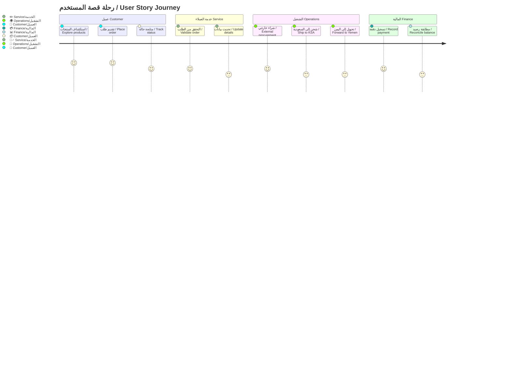
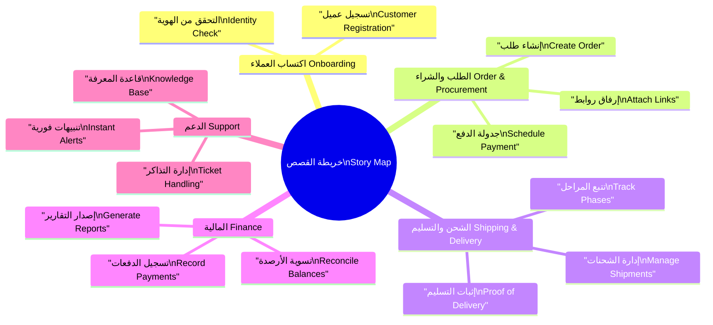
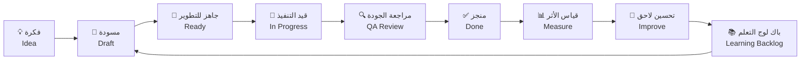

# 📖 قصص المستخدم

User Stories

---

> **المشروع:** منصة إدارة وساطة التسوق CA Admin  
> **Project:** CA Admin Shopping Mediation Platform  
> **التقنيات:** Flutter، Firebase (Firestore، Auth، Storage، Functions)  
> **Stack:** Flutter, Firebase (Firestore, Auth, Storage, Functions)  
> **الإصدار:** 0.1 (رؤية) - المالك: عبدالله الشائف - آخر تحديث: 2025-09-20  
> **Version:** 0.1 (Vision) - Owner: Abdullah Alshaif - Last Updated: 2025-09-20

**📝 شرح مختصر:**
قصص المستخدم توضح احتياجات الأطراف المختلفة وتربط كل قصة بهدف وقيمة واضحة.

**📝 Summary:**
User stories clarify the needs of different parties and link each story to a clear goal and value.

---

## 1. مقدمة

---

### 1.1 نظرة بصرية

---

**شرح مختصر:**
يوضح المخطط رحلة المستخدم من استكشاف المنتجات حتى إتمام الدفع والتسوية المالية.

**Summary:**
The diagram shows the user journey from product exploration to payment and financial reconciliation.

---



---

## 2. خريطة القصص / Story Map

**🗺️ شرح مختصر:**
مخطط ذهني يوضح الفئات الرئيسية للقصص وعلاقتها بالعمليات.

**🗺️ Summary:**
A mindmap showing main story categories and their relation to operations.

---



---

## 3. جدول قصص المستخدم / User Stories Table

| 🇸🇦 الشخصية           | 🇬🇧 Persona             | 🇸🇦 قصة المستخدم                                                                             | 🇬🇧 User Story                                                                                                                     | 🇸🇦 معايير القبول المختصرة                                                 | 🇬🇧 Key Acceptance Criteria                                                                           |
| -------------------- | ---------------------- | ------------------------------------------------------------------------------------------- | --------------------------------------------------------------------------------------------------------------------------------- | ------------------------------------------------------------------------- | ---------------------------------------------------------------------------------------------------- |
| 👤 العميل            | Customers              | بصفتي عميلا أرغب في تقديم طلب جديد مع روابط المنتجات حتى أستطيع متابعة الشحنة بسهولة.       | As a customer I want to submit a new order with product links so that I can track the shipment easily.                            | يدعم النموذج عدة روابط، إشعار تأكيد لحظي، حالة ابتدائية "بانتظار الشراء". | Form supports multiple links, instant confirmation notification, initial status "Awaiting purchase". |
| 🕵️‍♂️ موظف خدمة العملاء | Customer Service Agent | بصفتي موظف خدمة أريد البحث عن عميل وإضافة طلبه بضغطة واحدة حتى أضمن إدخال البيانات بسرعة.   | As a service agent I want to search for a customer and add their order in one click so that I capture data quickly.               | بحث بالأسماء والأرقام، التحقق من الحقول الإلزامية، تسجيل اسم المدخل.      | Search by name and number, validate required fields, log agent identity.                             |
| 🛠️ مشغل العمليات     | Operations Specialist  | بصفتي مشغلا أحتاج إلى تقسيم الطلب إلى شحنات فرعية مع حالة لكل شحنة حتى أضمن التتبع المرحلي. | As an operations specialist I need to split an order into sub-shipments with status per shipment so that I ensure stage tracking. | إنشاء أرقام فرعية، تاريخ لكل انتقال، منع إغلاق الطلب قبل اكتمال الشحنات.  | Create sub identifiers, timestamp every transition, block closure before shipments complete.         |
| 💰 محلل مالي         | Finance Analyst        | بصفتي محلل مالية أريد مطابقة الدفعات مع الطلبات المرتبطة حتى أخرج تقرير الربحية الأسبوعي.   | As a finance analyst I want to reconcile payments with linked orders so that I produce the weekly profitability report.           | استيراد كشف البنك، تنبيه عند اختلاف العملة، تقرير تفصيلي مع إجمالي الربح. | Import bank statement, alert on currency mismatch, detailed report with gross margin.                |

---

## 4. أولوية القصص / Story Prioritization

**⚡ شرح مختصر:**
سياسات ترتيب القصص حسب القيمة، الجهد، والمخاطر.

**⚡ Summary:**
Policies for ordering stories by value, effort, and risk.

---

- 🇸🇦 **نظام تسجيل قيمة-جهد:** تقييم كل قصة بدرجات قيمة وتأثير وتعقيد.  
  🇬🇧 **Value-effort scoring system:** Rate each story on value, impact, and complexity.  
  🇸🇦 **ما هي:** مصفوفة من ثلاث نقاط (1-5) يستخدمها الفريق عند التخطيط.  
  🇬🇧 **What:** A three-axis matrix (1-5) applied during planning.  
  🇸🇦 **وظيفتها:** تمكّن من ترتيب القصص داخل السبرنت والربع سنويا.  
  🇬🇧 **Function:** Enables ordering stories within sprints and quarterly cycles.  
  🇸🇦 **فائدتها:** تضمن بدء العمل بالأعلى أثرا دون إهمال المكاسب السريعة.  
  🇬🇧 **Benefit:** Ensures high-impact items start first without ignoring quick wins.

- 🇸🇦 **خريطة الاعتماديات:** تحديد العلاقات بين القصص التقنية والوظيفية.  
  🇬🇧 **Dependency mapping:** Identify relationships between technical and functional stories.  
  🇸🇦 **ما هي:** لوحة تربط القصص باستخدام أسهم قبل/بعد.  
  🇬🇧 **What:** A board that links stories with before/after arrows.  
  🇸🇦 **وظيفتها:** تمنع إدخال قصة غير قابلة للتنفيذ بسبب عائق تقني.  
  🇬🇧 **Function:** Prevents pulling a story that is blocked by a technical prerequisite.  
  🇸🇦 **فائدتها:** تقلل التوقف المفاجئ وتحسن دقة تقديرات السبرنت.  
  🇬🇧 **Benefit:** Reduces sudden blockers and improves sprint estimate accuracy.

- 🇸🇦 **مؤشر المخاطر:** تسجيل مستوى المخاطرة (منخفض، متوسط، مرتفع) لكل قصة ذات تعقيد تنظيمي.  
  🇬🇧 **Risk indicator:** Assign low/medium/high risk to stories with regulatory or operational complexity.  
  🇸🇦 **ما هي:** تسميات ألوان تظهر في لوحة كانبان.  
  🇬🇧 **What:** Color labels displayed on the Kanban board.  
  🇸🇦 **وظيفتها:** توجه الاهتمام القيادي وتحدد الحاجة لمراجعات قانونية.  
  🇬🇧 **Function:** Directs leadership attention and flags legal review needs.  
  🇸🇦 **فائدتها:** تمنع التأخير المتأخر وتدعم الامتثال المبكر.  
  🇬🇧 **Benefit:** Prevents late delays and supports early compliance.

---

## 5. إدارة دورة الحياة / Story Lifecycle

**🔄 شرح مختصر:**
مخطط يوضح مراحل تطور القصة من الفكرة حتى التحسين.

**🔄 Summary:**
Diagram showing story evolution from idea to improvement.

---



---

## 6. مقاييس الجودة / Quality Metrics

**📊 شرح مختصر:**
مؤشرات جودة تضمن وضوح القصة وسرعة التنفيذ.

**📊 Summary:**
Quality metrics ensuring story clarity and execution speed.

---

- 🇸🇦 **نسبة القصص ذات معايير القبول الصريحة:** الهدف 100%.  
  🇬🇧 **Stories with explicit acceptance criteria:** Target 100%.  
  🇸🇦 **ما هي:** مراجعة أسبوعية لحصر القصص المفقودة للمعايير.  
  🇬🇧 **What:** Weekly review counting stories missing criteria.  
  🇸🇦 **وظيفتها:** تكشف الثغرات في التحضير وتحدد القصص المهددة.  
  🇬🇧 **Function:** Exposes preparation gaps and flags at-risk stories.  
  🇸🇦 **فائدتها:** تقلل الأخطاء المتكررة بين السبرنتات.  
  🇬🇧 **Benefit:** Reduces recurring sprint defects.

- 🇸🇦 **زمن دورة القصة:** المدة من جاهز للتطوير إلى منجز.  
  🇬🇧 **Story cycle time:** Duration from Ready to Done.  
  🇸🇦 **ما هي:** قياس تلقائي عبر لوحة كانبان.  
  🇬🇧 **What:** Automated measurement via Kanban board.  
  🇸🇦 **وظيفتها:** يقيّم كفاءة التنفيذ ويكشف الزحام.  
  🇬🇧 **Function:** Evaluates execution efficiency and spots congestion.  
  🇸🇦 **فائدتها:** يساعد على تحسين حجم السبرنت وضبط الطاقة الاستيعابية.  
  🇬🇧 **Benefit:** Helps tune sprint size and capacity.

- 🇸🇦 **معدل إرجاع القصة:** النسبة التي تعاد من الاختبار إلى التطوير.  
  🇬🇧 **Story return rate:** Percentage sent back from QA to development.  
  🇸🇦 **ما هي:** مؤشر جودة أسبوعي.  
  🇬🇧 **What:** A weekly quality metric.  
  🇸🇦 **وظيفتها:** يرصد جودة القبول والتوثيق.  
  🇬🇧 **Function:** Monitors acceptance quality and documentation.  
  🇸🇦 **فائدتها:** يدفع لتحسين معايير القبول والاختبارات الآلية.  
  🇬🇧 **Benefit:** Drives better acceptance criteria and automated tests.

---

## 7. قالب القصة / Story Template

```yaml
# 📝 قالب قصة المستخدم / User Story Template

story:
  ar: "🇸🇦 بصفتي [الشخصية] أريد [الهدف] حتى [القيمة]."
  en: "🇬🇧 As a [persona] I want [goal] so that [value]."
acceptance_criteria:
  - ar: "🇸🇦 [شرط عربي]"
    en: "🇬🇧 [English condition]"
  - ar: "🇸🇦 [شرط عربي]"
    en: "🇬🇧 [English condition]"
  - ar: "🇸🇦 [شرط عربي]"
    en: "🇬🇧 [English condition]"
notes:
  - ar: "🇸🇦 [مرجع أو رابط]"
    en: "🇬🇧 [Reference or link]"
```

> 📝 **شرح مختصر:** قالب موحد لكتابة قصة المستخدم ومعايير القبول والملاحظات بشكل منظم وسهل القراءة.
> 📝 **Summary:** Unified template for writing user stories, acceptance criteria, and notes in a readable, structured format.

---
