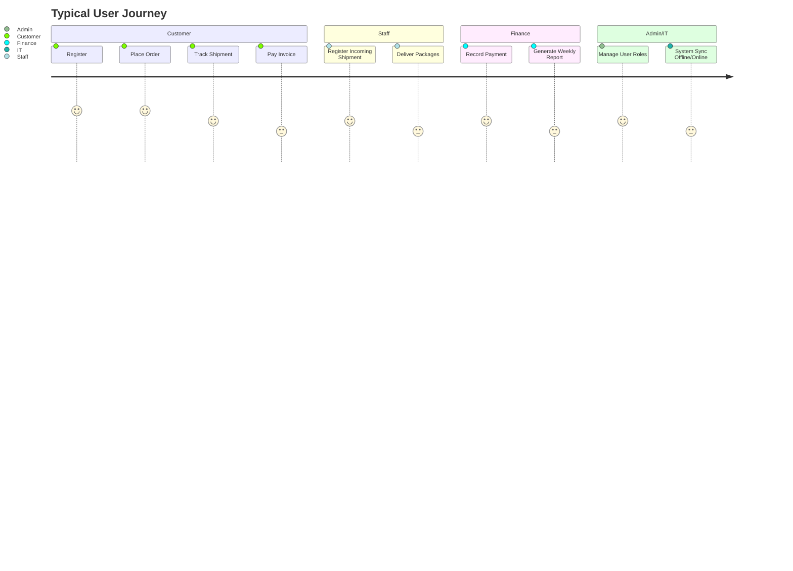
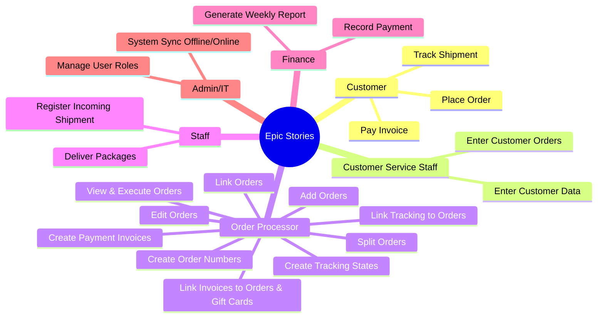
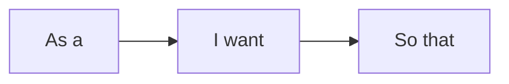

# 📝 User Stories / قصص المستخدم

> **Project:** CA Admin
> **Version:** v0.1 — Owner: Abdullah Alshaif — Last Updated: YYYY-MM-DD

---

## 1. Introduction / المقدمة

**EN:**
User Stories describe system features from the perspective of the end-users or stakeholders. They are written in a simple structure to clarify what the user wants and why. Each story should have **Acceptance Criteria** to make it testable.

**AR:**
قصص المستخدم تصف ميزات النظام من منظور المستخدمين النهائيين أو أصحاب المصلحة. تُكتب بشكل مبسط لتوضيح ما يريده المستخدم ولماذا. يجب أن تحتوي كل قصة على **معايير قبول** لتكون قابلة للاختبار.

---

## 1.1 User Journey Overview / رحلة المستخدم

---

## 2. Epic Stories & Breakdown / القصص الكبرى والتفصيلية

---

## 3. User Story Template / قالب قصة المستخدم

- **As a [role]**, I want [feature] so that [benefit].
- **بصفتي [الدور]**، أريد [الميزة] لكي [الفائدة].

**Acceptance Criteria / معايير القبول:**

- **Given** (الحالة الأولية)
- **When** (الحدث)
- **Then** (النتيجة المتوقعة)

---

## 4. User Story Examples / أمثلة قصص المستخدم

### Category B: Customer Service Staff Stories / قصص موظفي خدمة العملاء

#### Story CS1: Enter customer data

- EN: As a **Customer Service Staff**, I want to **enter customer names and details** so that the customer library is accurate.
- AR: بصفتي **موظف خدمة العملاء**، أريد **إدخال أسماء العملاء وبياناتهم** لكي تكون مكتبة العملاء دقيقة.

**Acceptance Criteria:**

- Given a new customer
- When staff enters their data
- Then the customer is added to the customer library

#### Story CS2: Enter customer orders

- EN: As a **Customer Service Staff**, I want to **enter customer orders** so that all requests are recorded.
- AR: بصفتي **موظف خدمة العملاء**، أريد **إدخال طلبيات العملاء** لكي يتم تسجيل جميع الطلبات.

**Acceptance Criteria:**

- Given a valid order
- When staff enters the order
- Then it is added to the order library

### Category C: Order Processor Stories / قصص منفذ الطلبات

#### Story OP1: Create order numbers

- EN: As an **Order Processor**, I want to **create order numbers** so that each order is uniquely tracked.
- AR: بصفتي **منفذ الطلبات**، أريد **إنشاء أرقام الطلبيات** لكي يتم تتبع كل طلب بشكل فريد.

**Acceptance Criteria:**

- Given a new order
- When processor creates the order
- Then a unique order number is generated and stored

#### Story OP2: View and execute orders

- EN: As an **Order Processor**, I want to **view and execute customer orders** so that requests are fulfilled.
- AR: بصفتي **منفذ الطلبات**، أريد **استعراض وتنفيذ طلبيات العملاء** لكي يتم تنفيذ الطلبات.

**Acceptance Criteria:**

- Given a list of orders
- When processor selects and executes an order
- Then the order status is updated

#### Story OP3: Edit orders

- EN: As an **Order Processor**, I want to **edit any order field as needed** so that corrections can be made.
- AR: بصفتي **منفذ الطلبات**، أريد **تعديل أي حقل في الطلبيات حسب الحاجة** لكي يتم تصحيح الأخطاء.

**Acceptance Criteria:**

- Given an order
- When processor edits a field
- Then the change is saved

#### Story OP4: Link and split orders

- EN: As an **Order Processor**, I want to **link multiple orders and split them into parts** so that complex requests are handled.
- AR: بصفتي **منفذ الطلبات**، أريد **ربط عدة طلبيات وتقسيمها إلى أجزاء** لكي يتم التعامل مع الطلبات المعقدة.

**Acceptance Criteria:**

- Given several orders
- When processor links or splits them
- Then tracking states and references are created for each part

#### Story OP5: Create tracking states and invoices

- EN: As an **Order Processor**, I want to **create tracking states and payment invoices for each part** and link invoices to orders and gift cards.
- AR: بصفتي **منفذ الطلبات**، أريد **إنشاء حالات تتبع وفواتير مدفوعات لكل جزء وربطها بالطلبيات وبطاقات الهدايا**.

**Acceptance Criteria:**

- Given split orders
- When processor creates tracking and invoices
- Then all links and discounts are recorded

### Category A: Customer Stories / قصص العملاء

### Story C1: Place an order

- EN: As a **Customer**, I want to **submit product links and quantities** so that I can **buy items easily**.
- AR: بصفتي **عميل**، أريد **إرسال روابط المنتجات والكميات** لكي أتمكن من **الشراء بسهولة**.

**Acceptance Criteria:**

- Given product links are valid
- When the customer submits the order
- Then the system generates an OrderNo and stores it in Firestore

---

#### Story C2: Track shipment

- EN: As a **Customer**, I want to **view shipment status** so that I know **when to expect delivery**.
- AR: بصفتي **عميل**، أريد **عرض حالة الشحنة** لكي أعرف **متى ستصل**.

**Acceptance Criteria:**

- Given the shipment is in the system
- When the customer opens “My Orders”
- Then the current status is displayed

---

### Story C3: Pay invoice

- EN: As a **Customer**, I want to **see my balance and pay invoices** so that I stay updated financially.
- AR: بصفتي **عميل**، أريد **رؤية رصيدي ودفع الفواتير** لكي أبقى مطلعًا ماليًا.

**Acceptance Criteria:**

- Given an invoice exists
- When the customer pays
- Then the system updates the balance

---

### Category B: Staff Stories / قصص الموظفين

#### Story S1: Register incoming shipment

- EN: As **Saudi Office Staff**, I want to **register incoming packages** so that they can be consolidated.
- AR: بصفتي **موظف مكتب السعودية**، أريد **تسجيل الطرود الواردة** لكي يتم تجميعها.

**Acceptance Criteria:**

- Given a shipment arrives
- When staff register it
- Then it is linked to customer orders

---

#### Story S2: Deliver packages

- EN: As **Yemen Office Staff**, I want to **mark deliveries as complete** so that records are accurate.
- AR: بصفتي **موظف مكتب اليمن**، أريد **تحديد الطرود كمُسلمة** لكي تكون السجلات دقيقة.

**Acceptance Criteria:**

- Given a package is out for delivery
- When staff mark it delivered
- Then the system updates customer status

---

### Category C: Finance Stories / قصص المالية

#### Story F1: Record customer payment

- EN: As a **Finance Officer**, I want to **record customer payments** so that balances remain correct.
- AR: بصفتي **موظف مالي**، أريد **تسجيل مدفوعات العملاء** لكي تبقى الأرصدة صحيحة.

**Acceptance Criteria:**

- Given a payment amount
- When it is logged in the system
- Then the customer balance decreases

---

#### Story F2: Generate weekly report

- EN: As a **Finance Officer**, I want to **generate weekly reports** so that I can review trends.
- AR: بصفتي **موظف مالي**، أريد **إنشاء تقارير أسبوعية** لكي أراجع الاتجاهات.

**Acceptance Criteria:**

- Given the system has financial logs
- When the report is requested
- Then the system outputs a PDF/Excel

---

### Category D: Admin / IT Stories / قصص الإدارة والتقنية

#### Story A1: Manage user roles

- EN: As an **Admin**, I want to **assign staff roles** so that access is controlled.
- AR: بصفتي **مدير**، أريد **تعيين أدوار الموظفين** لكي يكون الوصول مضبوطًا.

**Acceptance Criteria:**

- Given a staff account
- When the role is updated
- Then permissions are applied immediately

---

#### Story A2: System sync offline/online

- EN: As an **IT Manager**, I want the app to **work offline and sync later** so that staff can work without internet.
- AR: بصفتي **مدير تقنية**، أريد أن يعمل التطبيق **بدون إنترنت ويزامن لاحقًا** لكي يتمكن الموظفون من العمل باستمرار.

**Acceptance Criteria:**

- Given no internet connection
- When staff enter data
- Then it is cached locally and synced on reconnect

---

## 5. Mapping to Use Cases & Test Plan / ربط القصص بحالات الاستخدام وخطة الاختبار

- Each User Story is linked to at least one **Use Case** (see [Use Cases](../04-use-cases/04-use-cases.md)).
- **Acceptance Criteria** are reused directly in the [Test Plan](../11-test-plan/11-test-plan.md) for validation.
- Stories are updated as requirements evolve and feedback is received from stakeholders.

---

## 6. Suggested Categories / التصنيفات المقترحة

- Customers / العملاء
- Staff (Saudi & Yemen) / الموظفون (السعودية واليمن)
- Finance / المالية
- Admin / الإدارة
- IT / التقنية

---

## 7. Notes / ملاحظات

- User Stories are the foundation for system design and testing.
- Keep stories concise, testable, and always up to date.

---
