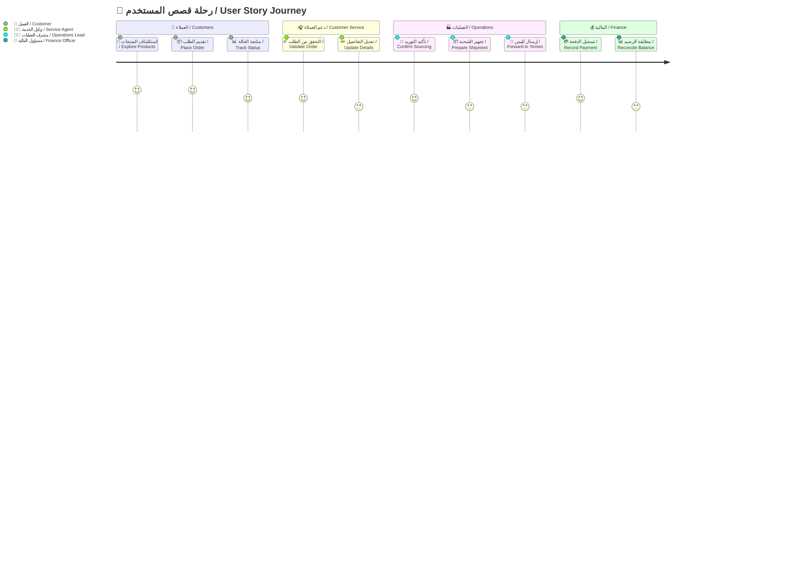
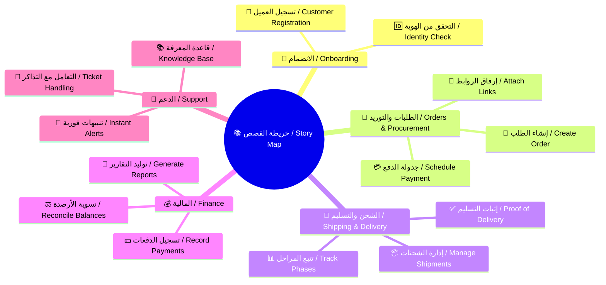

# 🗺️ قصص المستخدم | User Stories

> **🏷️ اسم المشروع | Project Name**
> منصة **CA Admin** للوساطة الشرائية  
> CA Admin Shopping Mediation Platform
>
> **🧑‍💼 مالك الوثيقة | Document Owner**  
> عبدالله الشايف | Abdullah Alshaif
>
> **🛠️ المكدس التقني | Tech Stack**
>
> - Flutter
> - Firebase (Firestore, Auth, Storage, Functions)
>
> **🔢 الإصدار | Version**  
> 0.1 (رؤية) | (Vision)
>
> **📅 آخر تحديث | Last Updated**  
> 20-09-2025

---

## ⚡ نظرة خاطفة | Focused Insight

- تجمع الوثيقة قصص المستخدم المعتمدة وتربط كل قصة بنتيجة قابلة للقياس وقيمة تجارية واضحة.  
  The document consolidates approved user stories and links each one to measurable outcomes and business value.

## 🧭 قيمة تنفيذية | Applied Value

- تعمل القصص كبوصلة للأولويات وتضمن اتساق تجربة جميع أصحاب المصلحة مع أهداف المنصة.  
  The stories act as a compass for prioritisation, keeping every stakeholder experience aligned with platform objectives.

---

## 1. 🔍 نظرة عامة على القصص | Stories Overview

- 🧑‍🤝‍🧑 تعتمد الخريطة على شخصيات محددة لضمان تغطية احتياجات العميل، والدعم، والعمليات، والمالية.
  It relies on defined personas to ensure the needs of customer, service, operations, and finance teams are covered.
- 🧩 يتم تحديث القصص بشكل ربع سنوي بناءً على التغذية الراجعة والبيانات التشغيلية.
  Stories are refreshed every quarter based on feedback and operational insights.

## 1.1 🛣️ رحلة القصة | Story Journey Map

**🎯 الهدف:**
يبين المخطط مسار القصة من الاكتشاف وحتى مراجعة المالية وتغذية التحسين المستمر.
Purpose: The chart highlights the flow from discovery to finance review and continuous improvement.



- 🔄 يوضح المخطط نقاط التسليم بين الفرق الرئيسية ويحدد العتبات الزمنية لكل مرحلة.
  The journey highlights hand-offs among core teams and clarifies timing thresholds per stage.
- 📊 يساعد على بناء مؤشرات أداء تعكس صحة كل مرحلة من منظور العميل والعمليات.
  It supports defining KPIs that represent stage health from customer and operations perspectives.
- 🛡️ يكشف عن نقاط المخاطر التي يجب مراقبتها لتقليل التأخير أو التصعيد.
  It exposes risk points that need monitoring to reduce delays or escalations.

---

## 2. 🧠 خريطة القصص | Story Map

**🎯 الهدف:**
تنظم الخريطة القصص حسب المجال التشغيلي مع إبراز الاعتمادية المتقاطعة بين الفرق.
Purpose: The mindmap organises stories by operational domain while surfacing cross-team dependencies.



- 🧭 يمكّن الفرق من تحديد الفجوات المحتملة بين الأنشطة والبحث عن قصص داعمة جديدة.
  Enables teams to spot potential gaps between activities and propose supportive stories.
- 🔌 يبرز نقاط التكامل مع الأنظمة الداخلية والخارجية لضمان تبادل بيانات سلس.
  Highlights integration touchpoints with internal and external systems for smooth data exchange.
- 🗺️ يوفر مرجعًا بصريًا سريعًا لجلسات التخطيط وورش المواءمة.
  Provides a fast visual reference during planning and alignment workshops.

---

## 3. 📋 جدول قصص المستخدم | User Stories Table

**🎯 الهدف:**
يقدم الجدول أهم القصص المعتمدة مع إبراز القيمة المضافة ومعايير القبول لكل قصة.
Purpose: The table summarises key approved stories, detailing delivered value and acceptance criteria.

<table>
  <thead>
    <tr>
      <th>👤 المستفيد<br><i>Beneficiary</i></th>
      <th>🎯 الهدف الرئيسي<br><i>Main Goal</i></th>
      <th>📖 قصة المستخدم<br><i>User Story</i></th>
      <th>💡 القيمة المتحققة<br><i>Delivered Value</i></th>
      <th>✔️ معايير القبول<br><i>Acceptance Criteria</i></th>
    </tr>
  </thead>
  <tbody>
    <tr>
      <td><b>👥 العملاء الأفراد<br><i>Retail Customers</i></b></td>
      <td>تقديم طلب جديد بروابط المنتجات مع متابعة كاملة<br><i>Submit a new order with product links and full tracking</i></td>
      <td>كعميل أرغب في إدخال طلب جديد مرفقًا بروابط المنتجات حتى أتابع الشحنة بسهولة<br><i>As a customer I want to submit an order with product links so I can monitor the shipment easily</i></td>
      <td>رحلة تقديم مبسطة مع إشعارات تلقائية تقلل الاستفسارات المتكررة<br><i>Simplified submission with automated alerts that lower repeated inquiries</i></td>
      <td>
        <ul>
          <li>📌 يعرض ملخص الطلب قبل الإرسال<br><i>Summary shown before submission</i></li>
          <li>📌 يدعم إدخال روابط متعددة وملاحظات ثنائية اللغة<br><i>Fields accept multiple links and bilingual notes</i></li>
          <li>📌 يتم إرسال إشعار فوري بالبريد وقناة الاتصال<br><i>Instant notification sent via email and selected channel</i></li>
        </ul>
      </td>
    </tr>
    <tr style="background-color:#f9fafb;">
      <td><b>🎧 فريق خدمة العملاء<br><i>Customer Service Team</i></b></td>
      <td>تحديث بيانات الطلب دون فقدان سجل المراجعات<br><i>Update order data without losing revision history</i></td>
      <td>كوكيل خدمة أريد تعديل تفاصيل الطلب مع الاحتفاظ بسجل التغييرات<br><i>As a service agent I want to edit order details while keeping change history</i></td>
      <td>تحسين جودة البيانات وتقليل أخطاء التوثيق<br><i>Improves data quality and reduces documentation errors</i></td>
      <td>
        <ul>
          <li>🕒 يخزن كل تعديل الوقت والاسم والملاحظات<br><i>Each edit stores timestamp, username, and notes</i></li>
          <li>⚠️ يظهر تنبيه عند وجود تعارض بين التعديلات<br><i>Conflict warning on overlapping edits</i></li>
          <li>↩️ يمكن الرجوع لإصدار سابق بضغطة واحدة<br><i>Previous version can be restored with one click</i></li>
        </ul>
      </td>
    </tr>
    <tr>
      <td><b>🏭 مشرف العمليات<br><i>Operations Supervisor</i></b></td>
      <td>مراقبة مراحل التوريد والشحن في لوحة واحدة<br><i>Monitor sourcing and shipping stages from a unified dashboard</i></td>
      <td>كمشرف عمليات أريد عرض حالة كل شحنة ومصدرها<br><i>As an operations supervisor I want to see every shipment status and origin</i></td>
      <td>تقليل وقت التنسيق ورؤية موحدة للتقدم اليومي<br><i>Reduces coordination time and provides a unified view of progress</i></td>
      <td>
        <ul>
          <li>🎨 مؤشرات لونية لكل مرحلة<br><i>Colour indicators per stage</i></li>
          <li>📄 تقرير PDF يومي تلقائي<br><i>Daily PDF report generated automatically</i></li>
          <li>🔍 إمكانية التصفية حسب المورد أو الدولة<br><i>Data filtering by supplier, country, or stage</i></li>
        </ul>
      </td>
    </tr>
    <tr style="background-color:#f9fafb;">
      <td><b>💰 محلل المالية<br><i>Finance Analyst</i></b></td>
      <td>مطابقة الدفعات وتحديث الرصيد بدقة<br><i>Reconcile payments and update remaining balance accurately</i></td>
      <td>كمحلل مالية أريد مراجعة كل دفعة وربطها بالطلب<br><i>As a finance analyst I want to reconcile each payment with its order</i></td>
      <td>دعم الفوترة الدقيقة وتقليل زمن التسوية<br><i>Supports precise invoicing and shortens reconciliation time</i></td>
      <td>
        <ul>
          <li>📥 استيراد الحركات البنكية CSV وربطها بالطلبات<br><i>Import bank CSV and match to orders</i></li>
          <li>⚠️ تنبيه فوري عند عدم تغطية المبلغ<br><i>Alert when payment does not cover full amount</i></li>
          <li>🌐 تخزين القيود المحاسبية باللغتين<br><i>Bilingual journal entries for reporting</i></li>
        </ul>
      </td>
    </tr>
    <tr>
      <td><b>🛠️ مهندس الدعم التقني<br><i>Tech Support Engineer</i></b></td>
      <td>تتبع مشكلات الأداء وربطها بالقصص<br><i>Track performance issues and link them to stories</i></td>
      <td>كـمهندس دعم أريد ربط البلاغات بقصص المستخدم<br><i>As a support engineer I want to link incidents to user stories</i></td>
      <td>تعزيز الشفافية بين الدعم والتطوير<br><i>Enhances transparency and prevents recurrence</i></td>
      <td>
        <ul>
          <li>🔗 ربط التذكرة بأكثر من قصة<br><i>Link ticket to multiple stories</i></li>
          <li>📊 تقرير أسبوعي للبلاغات<br><i>Weekly raised-incidents report</i></li>
          <li>✅ تحديث تلقائي لتتبع الحل<br><i>Resolution tracking updates automatically</i></li>
        </ul>
      </td>
    </tr>
  </tbody>
</table>

---

## 4. 🎯 ترتيب أولويات القصص | Story Prioritisation

**🎯 الهدف:**
تحدد التوجيهات التالية آلية تقييم القصص قبل إدراجها في دورة التطوير.
Purpose: The guidance below defines how stories are evaluated before entering the delivery cycle.

- ⚖️ يتم تقييم كل قصة وفقًا لمحورين: تأثير الأعمال ومجهود التنفيذ، مع تعزيز القصص ذات التأثير العالي والمجهود المنخفض.
  Each story is scored on business impact versus implementation effort, promoting high-impact, low-effort items.
- 🧪 تتطلب القصص ذات الافتراضات غير المؤكدة تجربة سريعة أو نمذجة أولية قبل الالتزام الكامل.
  Stories with uncertain assumptions require quick experiments or prototyping before full commitment.
- 🔁 تُراجع قائمة الأولويات في نهاية كل سباق تطوير لضمان استيعاب الدروس المستفادة.
  The priority list is revisited at the end of every sprint to incorporate lessons learned.
- 🤝 يجب إشراك ممثلي العمليات والمالية في قرارات التدرج لضمان مواءمة التشغيل والحوكمة.
  Operations and finance representatives join prioritisation forums to keep execution and governance aligned.

---

## 5. 🔄 دورة حياة القصة | Story Lifecycle

**🎯 الهدف:**
يوضح المخطط كيفية تطور القصة منذ الفكرة وحتى التحسين المستمر بعد الإطلاق.
Purpose: The flow illustrates how a story evolves from idea to continuous improvement after release.

```mermaid
flowchart LR
  IDEA["💡 فكرة<br>Idea"]:::stage --> DRAFT["📝 مسودة<br>Draft"]:::stage
  DRAFT --> READY["🧹 جاهزة للتهيئة<br>Ready"]:::stage
  READY --> PROG["🚧 قيد التنفيذ<br>In Progress"]:::progress
  PROG --> QA["🔍 مراجعة الجودة<br>QA Review"]:::review
  QA --> DONE["✅ منجزة<br>Done"]:::done
  DONE --> METRIC["📊 قياس الأثر<br>Measure"]:::stage
  METRIC --> IMP["🔧 تحسين<br>Improve"]:::stage
  IMP --> BACK["📚 دروس متجددة<br>Learning Backlog"]:::backlog
  BACK --> DRAFT

  %% ===== Styles =====
  classDef stage fill:#f8fafc,stroke:#94a3b8,stroke-width:1.5px,color:#0f172a,rx:12,ry:12;
  classDef progress fill:#e0f2fe,stroke:#0284c7,stroke-width:2px,color:#0c4a6e,rx:12,ry:12;
  classDef review fill:#fff7ed,stroke:#f59e0b,stroke-width:2px,color:#7c2d12,rx:12,ry:12;
  classDef done fill:#ecfdf5,stroke:#10b981,stroke-width:2px,color:#064e3b,rx:12,ry:12;
  classDef backlog fill:#ede9fe,stroke:#7c3aed,stroke-width:1.5px,color:#3b0764,rx:12,ry:12;

  linkStyle default stroke:#64748b,stroke-width:1.5px
```



- ♻️ يضمن وجود حلقة تغذية راجعة بعد كل إطلاق لتفادي تراكم المشكلات.
  Maintains a feedback loop after each release to prevent issue build-up.
- 📐 يسمح قياس الأثر بإعادة ترتيب القصص اللاحقة اعتمادًا على النتائج الفعلية.
  Measuring impact enables reprioritisation of future stories based on real outcomes.
- 🧠 تغذي الدروس المتجددة سجلًا مرجعيًا للأفكار القادمة وتحسّن جودة التقدير.
  The learning backlog feeds future ideation and improves estimation quality.

---

## 6. 📏 مقاييس الجودة | Quality Metrics

**🎯 الهدف:**
تدعم المقاييس التالية وضوح القصص وسرعة التنفيذ وجودة التسليم.
Purpose: These metrics sustain story clarity, delivery speed, and outcome quality.

- 🧾 استهداف تغطية 100‎٪‎ بمعايير قبول محدثة لكل قصة قبل دخولها التطوير.
  Target 100% coverage of up-to-date acceptance criteria before a story enters development.
- ⏱️ مراقبة زمن دورة القصة من حالة "جاهزة" إلى "منجزة" لرصد الاختناقات مبكرًا.
  Monitor story cycle time from "Ready" to "Done" to spot bottlenecks early.
- 🔁 تتبع معدل ارتجاع القصص من اختبار الجودة إلى التطوير لتحسين جودة التسليم.
  Track story return rate from QA back to development to uplift delivery quality.
- 🤖 قياس نسبة القصص المدعومة باختبارات آلية لضمان استقرار الإصدارات.
  Measure the percentage of stories backed by automated tests to maintain release stability.

---

## 7. 🧱 قالب القصة | Story Template

```yaml
story:
  ar: "بصفتي [الدور] أرغب في [الهدف] حتى [القيمة]."
  en: "As a [role], I want [goal] so that [value]."
acceptance_criteria:
  - ar: "عند [الشرط] يجب أن [النتيجة]."
    en: "Given [condition], it should [outcome]."
  - ar: "إذا [الحدث] فعندها [السلوك المتوقع]."
    en: "If [event], then it [expected behaviour]."
  - ar: "ينبغي أن [التوقع] عندما [السياق]."
    en: "It must [expectation] when [context]."
notes:
  - ar: "أرفق الروابط أو المراجع الداعمة هنا."
    en: "Attach supporting links or references here."
```

> 📝 **ملاحظة:** يسهّل القالب الثنائي كتابة القصص ويقلل مخاطر سوء الفهم بين الفرق متعددة اللغات.
> Note: The bilingual template speeds authoring and reduces misunderstanding across multilingual teams.

---
