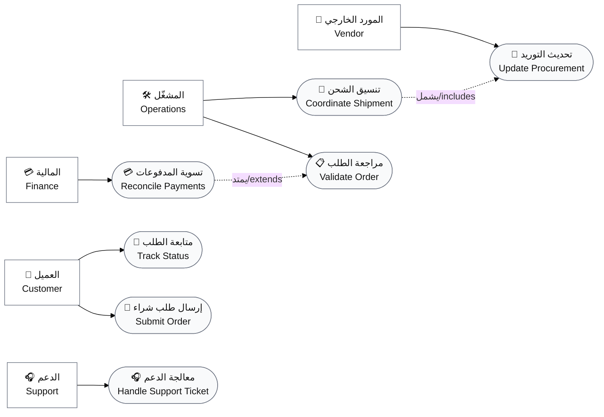
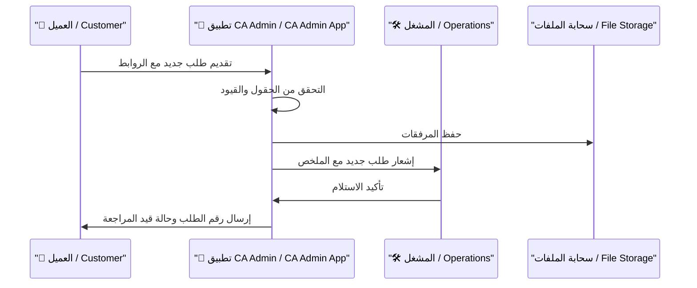
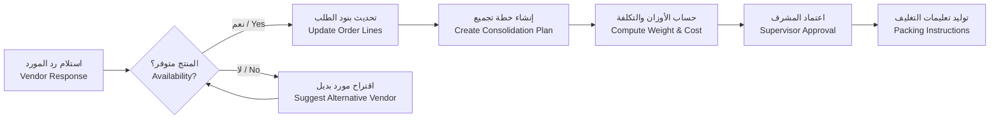
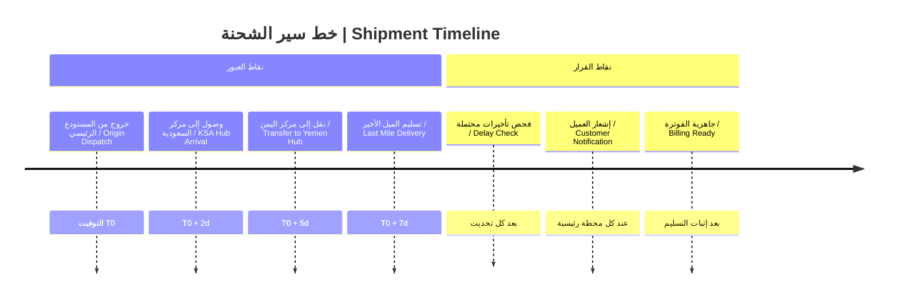
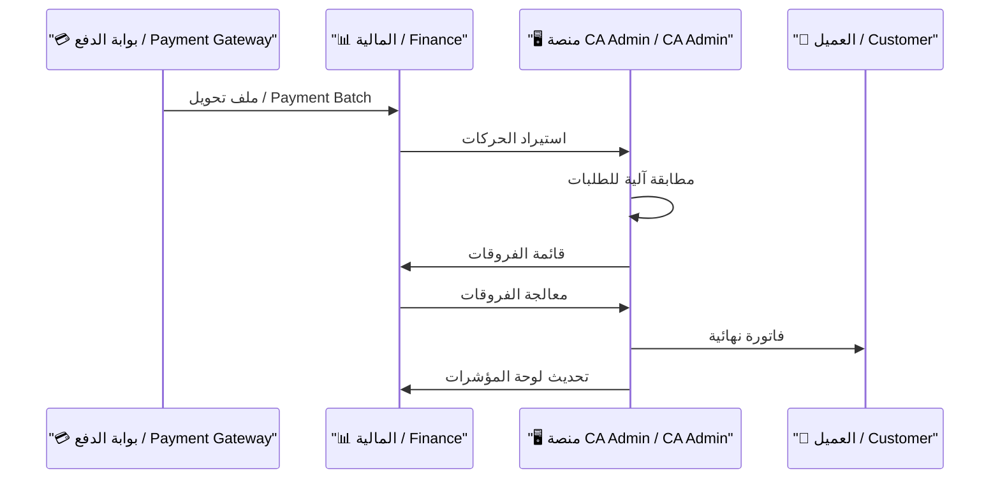
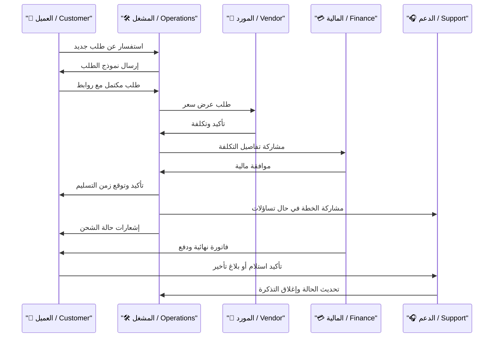

# 📑 حالات الاستخدام | Use Cases

| البيان / Item                   | التفاصيل / Details                                                                                              |
| ------------------------------- | --------------------------------------------------------------------------------------------------------------- |
| النظام / Product                | منصة **CA Admin** لإدارة الوساطة الشرائية / **CA Admin Shopping Mediation Platform**                            |
| الإصدار / Version               | 0.2 — آخر تحديث 2025-09-21 بواسطة Abdullah Alshaif                                                              |
| التقنية / Stack                 | Flutter + Firebase (Firestore, Auth, Storage, Functions)                                                        |
| الوثائق المرتبطة / Related Docs | `docs/01-vision/01-vision.md`, `docs/03-stories/03-stories.md`, `docs/10-nfr-and-quality/10-nfr-and-quality.md` |

> 💡 **لماذا نقرأ هذا المستند؟ | Why read this document?**
>
> - يترجم المتطلبات السردية إلى سيناريوهات قابلة للبناء والاختبار - Translates narrative requirements into executable use cases for analysts, designers, and engineers.
> - يوفر لغة مشتركة بين فرق العمل لضمان فهم نقاط التفاعل والضوابط - Creates a shared language across teams so every interaction and control point is understood.

---

## 1. 🧭 مقدمة | Introduction

- 🧭 **النطاق / Scope**
  يغطي الرحلة من تقديم الطلب حتى التسوية المالية.  
  Covers the end-to-end journey from order intake to reconciliation.

- 🎯 **الهدف / Purpose** -
  توثيق ما يفعله كل ممثل ولماذا، مع إبراز القيمة.  
  Documents actor behaviour, intent, and delivered value.

- 📘 **المخرجات / Deliverable**
  حالات استخدام قابلة للتحليل، التصميم، والاختبار.  
  Use cases ready for analysis, design, and testing.

### 1.1 👁️ نظرة سريعة على النظام | System Overview

---

## 2. 👥 الممثلون الرئيسيون | Primary Actors

| الرمز | الممثل / Actor                   | 📌 المسؤوليات الأساسية / Core Responsibilities                                    | ⭐ الفائدة المتوقعة / Value Delivered                          |
| ----- | -------------------------------- | --------------------------------------------------------------------------------- | -------------------------------------------------------------- |
| 👤    | العميل النهائي / Customer        | • إنشاء الطلبات وإرفاق روابط المنتجات • تتبع حالة الطلب واستلام الإشعارات      | • تجربة واضحة وشفافة • ثقة في التسعير • زمن استجابة أسرع |
| 🛠️    | المشغل / Operations Specialist   | • تدقيق الطلبات وتأكيد الجدوى • تنسيق التوريد والشحن والمحطات الوسيطة          | • رؤية موحدة لحالة الطلبات • تقليل الأخطاء التشغيلية        |
| 🤝    | المورد الخارجي / External Vendor | • توفير الأسعار وتأكيد التوفر • تحديث أوقات التسليم واستلام الدفعات            | • تدفق معلومات موثوق • مدفوعات موثقة                        |
| 💳    | فريق المالية / Finance Team      | • إصدار الفواتير وتتبع المدفوعات • تسوية الحسابات وإعداد التقارير              | • بيانات مالية دقيقة • إجراءات موحدة • تقارير موثوقة     |
| 🎧    | فريق الدعم / Support Team        | • استقبال شكاوى العملاء والتحديثات العاجلة • إعادة توجيه الطلبات للفرق المختصة | • خدمة عملاء فعّالة • قاعدة معرفة متجددة                    |

> ✅ **ملاحظة:** تم ربط المسؤوليات مباشرة بمؤشرات الأداء (KPIs) لضمان قابلية القياس والتنفيذ.

---

## 3. 🗂️ الحالات الأساسية | Core Use Cases

يوفر هذا القسم نظرة مكثفة على أهم السيناريوهات التي يعتمد عليها النظام اليومي.

| ID    | الحالة بالعربية / Scenario (AR) | Scenario (EN)                      | الممثل القائد / Primary Actor | المحفز / Trigger                  | المخرجات الرئيسية / Key Outcome | أيقونة / Icon |
| ----- | ------------------------------- | ---------------------------------- | ----------------------------- | --------------------------------- | ------------------------------- | ------------- |
| UC-01 | تقديم طلب شراء                  | Submit Purchase Request            | العميل النهائي / Customer     | رغبة العميل في شراء منتج خارجي    | طلب موثق مع تقدير تكلفة مبدئي   | 🛒            |
| UC-02 | إدارة التوريد والتجميع          | Manage Procurement & Consolidation | المشغل / Operations           | استلام طلب معتمد من UC-01         | قبول أو رفض التوريد مع خطة شحن  | 📦            |
| UC-03 | مراقبة الشحن والتسليم           | Track Shipment & Delivery          | المشغل + الدعم                | جاهزية الشحنة وخروجها من المستودع | تحديث حالة مفصل وإشعار العميل   | 🚚            |
| UC-04 | تسوية المدفوعات والتقارير       | Reconcile Payments & Reporting     | فريق المالية / Finance        | تأكيد الشحن أو استلام دفعة        | فاتورة مقفلة وتقارير أداء       | 📊            |

---

## 4. 📋 تفاصيل الحالات | Detailed Scenarios

### UC-01 🛒 تقديم طلب شراء | Submit Purchase Request

🎯 **الهدف / Goal**  
تمكين العميل من إدخال طلب موحد يحتوي على روابط المنتجات، الكميات، وتوقعات التسليم مع توفير شفافية التكلفة.

⚙️ **الشروط المسبقة / Preconditions**

- يوجد حساب نشط للعميل - The customer has an active verified account.
- تم تحديث قائمة الوجهات والمدن - Destination catalog is up to date.

📌 **المسار الأساسي / Main Flow**

1. يفتح العميل نموذج الطلب في التطبيق - Customer opens the order intake form.
2. يدخل روابط المنتجات والكميات المطلوبة - Customer enters product links and quantities.
3. يقوم النظام بجلب السعر المبدئي والرسوم التقديرية - System fetches initial pricing and fees.
4. يراجع العميل تفاصيل الطلب ويضيف ملاحظات إضافية - Customer reviews request and adds notes.
5. يعتمد العميل الطلب ويرسله للمشغل - Customer submits the order for operations review.
6. يسجل النظام الطلب ويولد رقم تتبع أولي - System stores the order and issues a tracking reference.
7. يرسل النظام إشعارا للمشغل بوجود طلب جديد - System notifies operations about the new submission.

🔁 **مسارات بديلة / Alternate Paths**

- إذا تعذر جلب السعر يتم طلب رفع فاتورة مبدئية من العميل - If pricing fetch fails, the customer uploads a quoted screenshot.
- إذا تجاوزت الكمية حد الإنذار يتم طلب موافقة إضافية من المشرف - Large quantity triggers supervisor approval before proceeding.

✅ **المخرجات / Outcomes**

- حالة الطلب تنتقل إلى 'قيد المراجعة' - Order status becomes 'Under Review'.
- يتم أرشفة جميع المرفقات في التخزين السحابي المشترك - Attachments stored in shared cloud storage.

🤝 **القيمة لكل طرف / Value by Role**

| الطرف / Stakeholder | القيمة / Value                                 |
| ------------------- | ---------------------------------------------- |
| العميل / Customer   | وضوح كامل حول التكلفة المتوقعة وخطوات المتابعة |
| المشغل / Operations | يستلم طلبا مكتمل البيانات يقلل وقت التدقيق     |
| المالية / Finance   | يملك مرجعا رقميا يربط الطلب بالفوترة لاحقا     |

> 📎 **مؤشرات الأداء:** زمن إنشاء الطلب أقل من 3 دقائق، ونسبة الطلبات المكتملة البيانات 95%.

---

### UC-02 📦 إدارة التوريد والتجميع | Manage Procurement

🎯 **الهدف / Goal**  
ضمان توفر المنتجات وتجميعها في شحنة واحدة مع تقليل التكلفة والوقت.

⚙️ **الشروط المسبقة / Preconditions**

- الطلب في حالة 'قيد المراجعة' وتم تعيين مشغل مسؤول - Order is under review and assigned to an operator.
- قنوات التواصل مع الموردين مفعلة - Supplier communication channels are active.

📌 **المسار الأساسي / Main Flow**

1. يقوم المشغل بمراجعة تفاصيل الطلب والمرفقات - Operator reviews order details and attachments.
2. يرسل استفسارا للمورد الخارجي عن التوفر والتكلفة - Operator requests availability and cost from vendor.
3. يستلم رد المورد ويحدث عناصر الطلب - Vendor response updates order line items.
4. في حال الموافقة يتم إنشاء خطة تجميع وشحن - Operator creates a consolidation and shipping plan.
5. يتم تقسيم الطلب إلى دفعات عند الحاجة وتحديد أوزان الشحن - System calculates shipment batches and weights.
6. يعتمد المشرف خطة التجميع ويغير الحالة إلى 'قيد التوريد' - Supervisor approves plan and sets status to 'Procurement in Progress'.
7. يتم توليد تعليمات التعبئة والتغليف ومشاركتها مع المستودع - Packing instructions are shared with warehouse.

🔁 **مسارات بديلة / Alternate Paths**

- في حال رفض المورد يتم اقتراح مورد بديل أو تقسيم الطلب - If vendor declines, system suggests alternative vendor or split order.
- إذا تأخر الرد أكثر من SLA يتم إرسال تنبيه للفريق وتصعيد الحالة - SLA breach triggers escalation alert.

✅ **المخرجات / Outcomes**

- خطة توريد موثقة مع تكاليف محدثة - Documented procurement plan with updated costs.
- حالة الطلب تنتقل إلى 'قيد التجميع' - Order status updated to 'Consolidation'.

🤝 **القيمة لكل طرف / Value by Role**

| الطرف / Stakeholder | القيمة / Value                                  |
| ------------------- | ----------------------------------------------- |
| المشغل / Operations | رؤية موحدة للطلبات وأتمتة لحساب الأوزان         |
| المورد / Vendor     | تعليمات واضحة ومواعيد دفع محددة                 |
| الدعم / Support     | معلومات جاهزة للرد على العملاء في حال الاستفسار |

> 📦 **نتيجة متوقعة:** زمن دورة التوريد أقل من 12 ساعة، ومعدل نجاح التواصل مع الموردين 90% أو أكثر.

---

### UC-03 — 🚚 مراقبة الشحن والتسليم | Track Shipment & Delivery

🎯 **الهدف / Goal**  
تقديم شفافية لحركة الشحنة من نقطة التجميع حتى التسليم النهائي وإبقاء العميل على اطلاع.

⚙️ **الشروط المسبقة / Preconditions**

- خطة التجميع معتمدة وتم إنشاء رقم شحنة - Consolidation plan approved and shipment ID created.
- تكامل نقاط العبور مفعل - Checkpoint integrations are active.

📌 **المسار الأساسي / Main Flow**

1. يسجل المشغل خروج الشحنة من المستودع الأول - Operator logs departure from origin warehouse.
2. يحدث النظام الأحداث الزمنية لكل محطة - System timestamps each checkpoint.
3. يتم إرسال إشعار للعميل عند كل تحديث مهم - Customer receives notification on major status changes.
4. يتابع فريق الدعم مؤشرات التأخير المحتملة - Support monitors delay indicators dashboard.
5. عند الوصول إلى المحطة النهائية يتم جدولة التسليم - Final mile delivery is scheduled.
6. يلتقط المندوب إثبات التسليم ويحمله للنظام - Courier uploads proof of delivery.
7. يتم تحديث حالة الطلب إلى 'تم التسليم' ويغلق البلاغ - Order status set to 'Delivered' and case closed.

🔁 **مسارات بديلة / Alternate Paths**

- في حال تأخر الشحنة يتم فتح تذكرة دعم مع خطة تصحيحية - Delay triggers support ticket with mitigation plan.
- إذا فشل التسليم يعاد الجدولة مع إرسال تنبيه للمالية - Failed delivery schedules retry and notifies finance.

✅ **المخرجات / Outcomes**

- سجل تتبع كامل يمكن الرجوع له - Complete audit trail of shipment.
- تحديثات لحظية للوحة المتابعة - Real time updates to operations dashboard.

🤝 **القيمة لكل طرف / Value by Role**

| الطرف / Stakeholder | القيمة / Value                             |
| ------------------- | ------------------------------------------ |
| العميل / Customer   | إشعارات لحظية وثقة في وقت الوصول           |
| المشغل / Operations | القدرة على التدخل المبكر قبل تفاقم التأخير |
| المالية / Finance   | تأكيد التسليم لبدء عملية الفوترة النهائية  |

> 🚚 **مقياس النجاح:** معدل التحديث الآلي >= 95% من نقاط العبور، ووقت معالجة تذكرة التأخير أقل من 1 ساعة.

---

### UC-04 — 💳 تسوية المدفوعات والتقارير | Reconcile Payments & Reporting

🎯 **الهدف / Goal**  
التأكد من مطابقة المدفوعات مع الطلبات والشحنات وإصدار تقارير موثوقة للإدارة.

⚙️ **الشروط المسبقة / Preconditions**

- حالة الطلب 'تم التسليم' أو 'ملغي مع مستحقات' - Order is delivered or cancelled with dues.
- توفر بيانات الدفع من بوابة الدفع أو التحويل البنكي - Payment data available from gateway or bank.

📌 **المسار الأساسي / Main Flow**

1. يستقبل فريق المالية بيانات الدفع الواردة - Finance imports payment data.
2. يربط النظام المدفوعات بالطلبات عبر رقم المرجع - System matches payments to orders using reference IDs.
3. في حال وجود فروقات يتم فتح بند تسوية يدوي - Unmatched amounts create manual reconciliation item.
4. يتم توليد فاتورة نهائية وإرسالها للعميل - Final invoice generated and sent to customer.
5. تحدث مؤشرات التحصيل والتدفق النقدي في لوحة القيادة - Cash flow KPIs updated on dashboard.
6. يحفظ النظام نسخة من الفاتورة والمستندات القانونية - Archive final invoice and legal documents.
7. يتم إصدار تقرير أسبوعي للإدارة والامتثال - Weekly report compiled and shared.

🔁 **مسارات بديلة / Alternate Paths**

- في حال دفع جزئي يتم إنشاء خطة تحصيل ويرسل إشعار تذكيري - Partial payment triggers collection plan and reminder.
- إذا تعذر الربط آليا يتم رفع الحالة لفريق تقنية المعلومات لمراجعة التكامل - Integration failure escalated to IT.

✅ **المخرجات / Outcomes**

- حالة الدفع 'مؤكد' أو 'قيد المتابعة' - Payment status updated accordingly.
- لوحة مؤشرات محدثة تدعم القرار المالي - Dashboard reflects latest finance KPIs.

🤝 **القيمة لكل طرف / Value by Role**

| الطرف / Stakeholder  | القيمة / Value                     |
| -------------------- | ---------------------------------- |
| المالية / Finance    | رؤية وقتية للفروقات والالتزامات    |
| الإدارة / Leadership | تقارير موحدة تدعم التوقعات المالية |
| التدقيق / Audit      | سجل موثق لكل خطوة ومرفق داعم       |

> 💰 **مؤشر رئيسي:** نسبة المطابقة الآلية >= 92%، ووقت إغلاق التسويات الأسبوعية <= 24 ساعة.

---

## 5. 🔗 مصفوفة تتبع المتطلبات | Requirement Traceability Matrix

| Use Case | Requirement ID | الوصف (AR)                                                    | Description (EN)                                            | الأولوية / Priority | اختبار مرتبط / Linked Test |
| -------- | -------------- | ------------------------------------------------------------- | ----------------------------------------------------------- | ------------------- | -------------------------- |
| UC-01    | REQ-INT-001    | يجب أن يسمح النظام بإدخال روابط متعددة واحتساب الرسوم تلقائيا | Allow multiple product links with automatic fee calculation | عالية / High        | TC-INT-CreateOrder         |
| UC-02    | REQ-OPS-004    | توفير لوحة لمتابعة أوامر التوريد وتسجيل قرارات القبول والرفض  | Provide procurement board capturing approval decisions      | عالية / High        | TC-OPS-ProcurementBoard    |
| UC-03    | REQ-OPS-009    | تفعيل إشعارات زمنية عند تخطي نقاط العبور الحرجة               | Trigger timed alerts upon critical checkpoint delays        | متوسطة / Medium     | TC-OPS-CheckpointAlerts    |
| UC-04    | REQ-FIN-003    | مطابقة المدفوعات مع الطلبات خلال 24 ساعة وإنتاج تقارير PDF    | Reconcile payments within 24h and export PDF reports        | عالية / High        | TC-FIN-Reconcile           |

> 🔍 **ملاحظة:** يتم تحديث المصفوفة مع كل تغيير في قصص المستخدم أو المتطلبات التنظيمية لضمان تغطية الاختبارات.

---

## 6. 🎬 محاكاة سيناريو متكاملة | Scenario Simulation

يوضح هذا السيناريو رحلة طلب مكتمل مع أبرز نقاط القرار.

> 🎬 **خلاصة السيناريو:** يوضح كيف يتكامل كل فريق إلى أن تصل الفاتورة النهائية ويغلق الطلب بدون فجوات معلومات.

---

## 7. 🚀 امتدادات مستقبلية | Future Extensions

- 🔄 **تكامل API مع الأسواق العالمية / Global Marketplace API Integration** - يتيح استيراد الطلبات آليا من متاجر مثل Amazon وAliExpress مما يقلل الإدخال اليدوي ويزيد سرعة الاستجابة.
- 📦 **التنبؤ بالتأخير باستخدام التعلم الآلي / Delay Prediction by ML** - يستخدم بيانات UC-03 للتنبؤ بمخاطر التأخير ويرسل تنبيهات مبكرة للفريق والدعم.
- 🗂️ **مستودع معرفة متعدد اللغات / Multilingual Knowledge Base** - يبني قاعدة مقالات تربط حالات الاستخدام بأدلة التشغيل لتقصير وقت تدريب الأعضاء الجدد.

---

## 8. 📊 إيقاع الحوكمة | Governance Rhythm

- 🗓️ **مراجعة شهرية لحالات الاستخدام / Monthly Use Case Review** - يجمع المنتج والعمليات والمالية والدعم لمراجعة السيناريوهات الحقيقية وتحديث الوثائق بناء على التغذية الراجعة مما يحافظ على الدقة.
- 📊 **لوحة مؤشرات الامتثال / Compliance Scorecard** - تقيس نسبة الحالات المغطاة بالاختبارات والضوابط وتعرض النتائج في اجتماع القيادة لضمان الالتزام.
- 🧪 **جلسات محاكاة فصلية / Quarterly Simulation Drills** - تنفذ اختبارات لعب أدوار كاملة من UC-01 إلى UC-04 للتأكد من جاهزية الأدوات والفرق لأي ذروة تشغيلية.

> ✅ **جاهزية الوثيقة:** بعد كل تحديث يتم التأكد من مطابقة الجداول والرسومات مع الواقع التشغيلي قبل اعتماد أي تغيير تقني.
