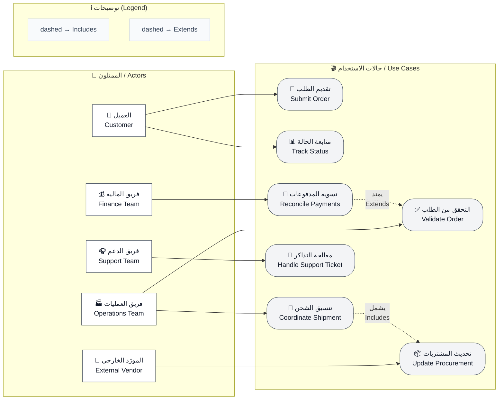
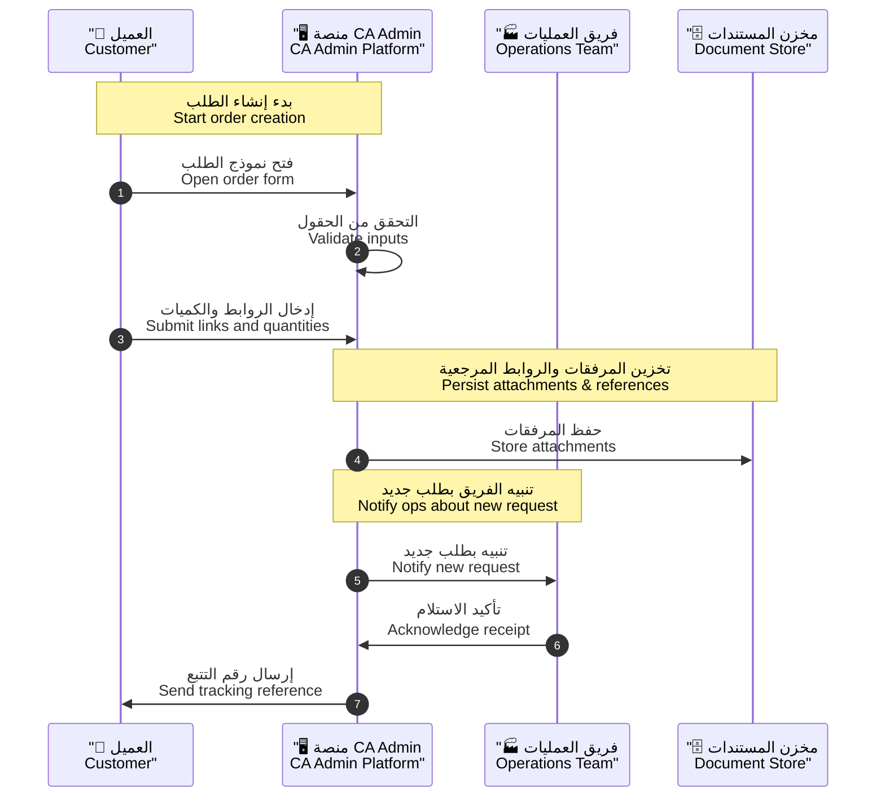
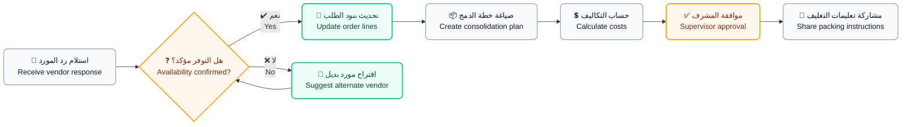
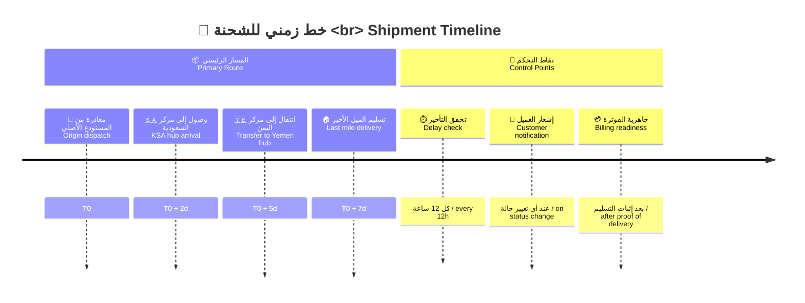
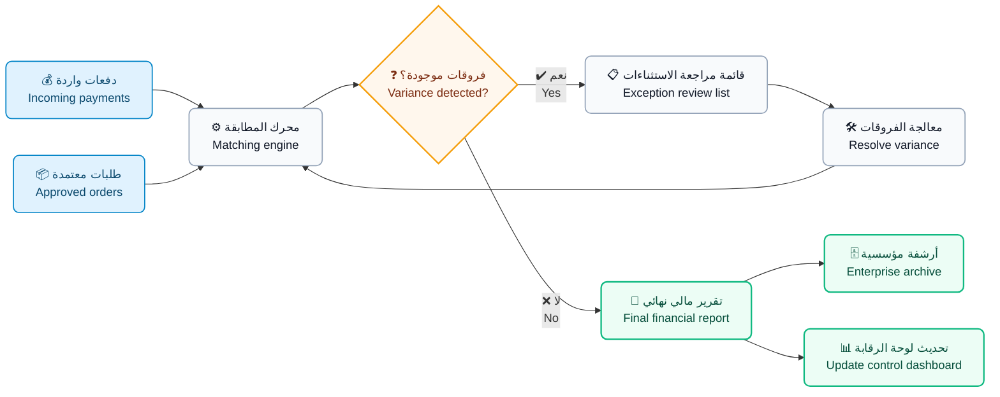
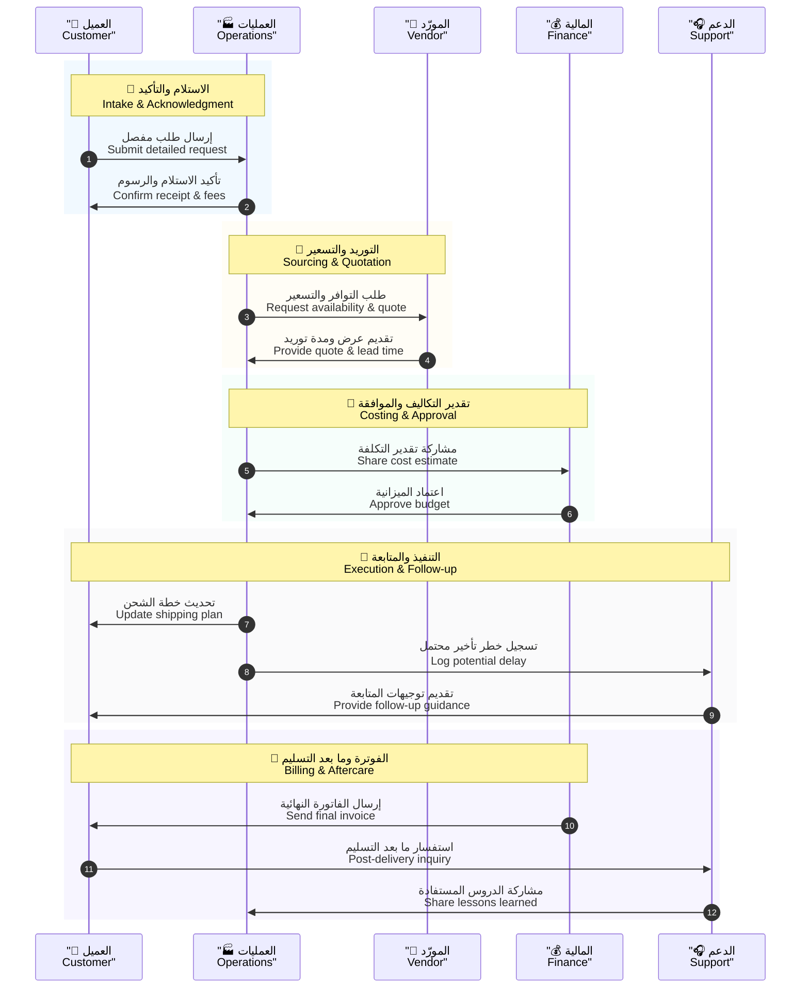

# 🚀 حالات الاستخدام | Use Cases

> **🧩 المنتج | Product**  
> منصة وساطة التسوق **CA Admin**  
> CA Admin Shopping Mediation Platform
>
> **📅 الإصدار | Version**  
> الإصدار **0.2** — آخر تحديث: **2025-09-21** — المالك: **عبدالله الشايف**  
> Version **0.2** — Last updated: **2025-09-21** — Owner: **Abdullah Alshaif**
>
> **🧰 التقنيات | Tech Stack**
>
> - Flutter
> - Firebase (Firestore, Auth, Storage, Functions)
>
> **🔗 مراجع مرتبطة | References**
>
> - `docs/01-vision/01-vision.md`
> - `docs/03-stories/03-stories.md`
> - `docs/10-nfr-and-quality/10-nfr-and-quality.md`

---

## 📌 لماذا تقرأ هذا المستند؟ | Why read this document?

- 🧠 يحوّل المتطلبات السردية إلى حالات استخدام قابلة للتنفيذ تدعم فرق التحليل والتسليم بأدوات موحدة.  
  🧠 Turns narrative requirements into executable use cases that equip analysis and delivery teams with shared tooling.
- 🤝 يبني لغة مشتركة بين العمليات والتقنية والمالية لتحديد نقاط التحكم وتقليل المخاطر التشغيلية.  
  🤝 Builds a shared language across operations, technology, and finance to clarify control points and reduce operational risk.

---

## 🧭 1. نظرة عامة | Overview

- 📍 **النطاق:** يغطي رحلة المنصة من استقبال الطلب وحتى المصالحة المالية الختامية مع إبراز نقاط القرار الحرجة.
  📍 **Scope:** Encompasses the platform journey from intake through final financial reconciliation while highlighting critical decision points.
- 🎯 **الهدف:** يشرح سلوك الممثلين الأساسيين والقيمة المتوقعة من كل حالة استخدام لدعم التخطيط المرحلي.
  🎯 **Purpose:** Explains primary actor behaviors and the value expected from each use case to support phased planning.
- 📦 **المخرجات:** ينتج حالات استخدام جاهزة للتحليل والتصميم والاختبار ضمن سياق تشغيلي واضح.
  📦 **Deliverable:** Produces use cases ready for analysis, design, and testing within a clearly articulated operational context.

## 1.1 🗺️ مخطط نظرة عامة على النظام | System Overview Diagram

- 🛰️ **الوصف:** يعرض المخطط التالي الممثلين الرئيسيين وتفاعلهم مع حالات الاستخدام لتوضيح تغطية المنصة من طرف إلى طرف.
  🛰️ **Description:** The following diagram maps the key actors and their touchpoints with use cases to illustrate end-to-end platform coverage.

---

## 2. 🎭 الممثلون الرئيسيون | Primary Actors

<table>
  <thead>
    <tr>
      <th>👤 الممثل <i>Actor</i></th>
      <th>🎯 الدور <i>Role</i></th>
      <th>🛠️ المسؤوليات <i>Responsibilities</i></th>
      <th>💡 القيمة المضافة <i>Added Value</i></th>
    </tr>
  </thead>
  <tbody>
    <tr>
      <td><b>🙋‍♂️ العميل <i>Customer</i></b></td>
      <td>يستخدم المنصة لتجميع الروابط والكميات وتقديم الطلبات <i>Uses the platform to gather links, quantities, and submit orders</i></td>
      <td>
        <ul>
          <li>📌 يزوّد البيانات الأولية <i>Provides initial data</i></li>
          <li>🚚 يؤكد تفضيلات الشحن والدفع <i>Confirms shipping & payment preferences</i></li>
        </ul>
      </td>
      <td>
        <ul>
          <li>🧭 يعكس احتياجات السوق <i>Represents market demand</i></li>
          <li>✅ يضمن توافق الخدمة مع توقعات المستهلك <i>Ensures service aligns with customer expectations</i></li>
        </ul>
      </td>
    </tr>
    <tr style="background-color:#f9fafb;">
      <td><b>🛠️ أخصائي العمليات <i>Operations Specialist</i></b></td>
      <td>يدير تقييم الطلبات والتواصل مع الموردين <i>Manages requests and supplier communication</i></td>
      <td>
        <ul>
          <li>📝 يتحقق من اكتمال المستندات <i>Validates documentation</i></li>
          <li>📊 يوزع الأعمال ويراقب SLA <i>Assigns work & monitors SLA</i></li>
        </ul>
      </td>
      <td>
        <ul>
          <li>🔗 يربط فرق الدعم والمالية والموردين <i>Aligns support, finance, and suppliers</i></li>
          <li>⚡ يحافظ على انسياب العمل <i>Keeps workflow smooth</i></li>
        </ul>
      </td>
    </tr>
    <tr>
      <td><b>🌐 مسؤول الموردين <i>Vendor Manager</i></b></td>
      <td>ينسق العروض ويؤكد التوافر <i>Coordinates quotes & confirms availability</i></td>
      <td>
        <ul>
          <li>🔄 يحدد البدائل <i>Surfaces alternatives</i></li>
          <li>💲 يتفاوض على الأسعار <i>Negotiates pricing</i></li>
          <li>📅 يقدم مواعيد توريد موثوقة <i>Provides reliable lead times</i></li>
        </ul>
      </td>
      <td>
        <ul>
          <li>🛡️ يضمن جاهزية التوريد <i>Ensures supply readiness</i></li>
          <li>📉 يقلل مخاطر انقطاع السلسلة <i>Lowers supply chain risk</i></li>
        </ul>
      </td>
    </tr>
    <tr style="background-color:#f9fafb;">
      <td><b>💰 محلل المالية <i>Finance Analyst</i></b></td>
      <td>يطابق المدفوعات ويخرج تقارير التدقيق <i>Reconciles payments & produces audit reports</i></td>
      <td>
        <ul>
          <li>⚙️ يشغّل أنظمة المحاسبة <i>Runs accounting routines</i></li>
          <li>📈 يراقب الفروقات <i>Monitors variances</i></li>
          <li>⏱️ يغلق الدورات المالية بسرعة <i>Closes financial cycles quickly</i></li>
        </ul>
      </td>
      <td>
        <ul>
          <li>🤝 يعزز الثقة الرقابية <i>Strengthens governance</i></li>
          <li>🔗 يربط الأداء المالي بالتشغيلي <i>Links financial & operational performance</i></li>
        </ul>
      </td>
    </tr>
    <tr>
      <td><b>🤝 وكيل الدعم <i>Support Agent</i></b></td>
      <td>يدير التذاكر ويهتم بتجربة ما بعد التسليم <i>Handles tickets & post-delivery experience</i></td>
      <td>
        <ul>
          <li>⚠️ يراقب إنذارات التأخير <i>Watches delay alerts</i></li>
          <li>📋 يجمع التغذية الراجعة <i>Collects feedback</i></li>
          <li>💡 يقترح تحسينات الخدمة <i>Recommends service improvements</i></li>
        </ul>
      </td>
      <td>
        <ul>
          <li>😊 يحافظ على رضا المستخدم <i>Sustains user satisfaction</i></li>
          <li>📚 يغلق الدروس المستفادة <i>Closes lessons learned</i></li>
        </ul>
      </td>
    </tr>
  </tbody>
</table>

---

## 3. 📂 حالات الاستخدام الجوهرية | Core Use Cases

<table>
  <thead>
    <tr>
      <th>🔑 الحالة <i>Use Case</i></th>
      <th>📌 العنوان <i>Title</i></th>
      <th>🎭 الممثل الرئيسي <i>Main Actor</i></th>
      <th>🎯 الغاية <i>Goal</i></th>
      <th>📊 الأولوية <i>Priority</i></th>
    </tr>
  </thead>
  <tbody>
    <tr>
      <td><b>UC-01</b></td>
      <td>🛒 تقديم طلب شراء <i>Submit Purchase Request</i></td>
      <td>🙋‍♂️ العميل <i>Retail Customer</i></td>
      <td>
        يلتقط الطلب الكامل ويولّد مرجع تتبع فوري لضمان شفافية المعاملة. 
        <i>Captures the full order and issues an instant tracking reference for transactional transparency.</i>
      </td>
      <td>🔴 عالية <i>High</i></td>
    </tr>
    <tr style="background-color:#f9fafb;">
      <td><b>UC-02</b></td>
      <td>📦 إدارة المشتريات والتجميع <i>Manage Procurement & Consolidation</i></td>
      <td>🛠️ أخصائي العمليات <i>Operations Specialist</i></td>
      <td>
        ينسّق عروض الموردين ويعد خطة الدمج لضبط التكلفة والجدول الزمني. 
        <i>Aligns supplier quotes and prepares consolidation plans to control cost and schedule.</i>
      </td>
      <td>🔴 عالية <i>High</i></td>
    </tr>
    <tr>
      <td><b>UC-03</b></td>
      <td>🚚 تتبع الشحن والتسليم <i>Track Shipment & Delivery</i></td>
      <td>🛠️ أخصائي العمليات + 🤝 وكيل الدعم <i>Operations & Support</i></td>
      <td>
        يوفّر رؤية لحظية ومعالجة مبكرة للتأخيرات لحماية تجربة العميل. 
        <i>Delivers real-time visibility and early delay mitigation to protect customer experience.</i>
      </td>
      <td>🟠 متوسطة <i>Medium</i></td>
    </tr>
    <tr style="background-color:#f9fafb;">
      <td><b>UC-04</b></td>
      <td>💳 تسوية المدفوعات والتقارير <i>Reconcile Payments & Reporting</i></td>
      <td>💰 محلل المالية <i>Finance Team</i></td>
      <td>
        يضمن إغلاق الدورة المالية وإصدار تقارير المراجعة خلال يوم عمل واحد. 
        <i>Ensures financial closure and audit-ready reporting within one business day.</i>
      </td>
      <td>🔴 عالية <i>High</i></td>
    </tr>
  </tbody>
</table>

---

## 4. 🧪 السيناريوهات التفصيلية | Detailed Scenarios

### UC-01 🛒 تقديم طلب شراء | Submit Purchase Request

- 🎯 **الهدف:** تمكين العميل من توثيق الطلب بدقة مع عرض تقديرات الرسوم بشكل فوري لدعم اتخاذ القرار.
  🎯 **Goal:** Enable the customer to capture the request accurately with instant fee estimates to support decision making.
- ⚙️ **الافتراضات:** حساب العميل موثّق وجداول الرسوم محدثة وروابط المنتجات متاحة للوصول.
  ⚙️ **Assumptions:** Customer account is verified, fee tables are up to date, and product links are accessible.

#### UC-01 🔄 التدفق الرئيسي | Main Flow

1. ✅ يفتح العميل نموذج الإدخال من القناة المفضلة لديه لبدء الطلب.
   ✅ The customer opens the intake form from the preferred channel to start the order.
2. ✅ يضيف روابط المنتجات والكميات ووجهة التسليم لتكوين صورة الطلب.
   ✅ Adds product links, quantities, and delivery destination to form the order picture.
3. ✅ يحسب النظام الرسوم المتوقعة ويعرضها لضمان الشفافية المسبقة.
   ✅ The system calculates projected fees and displays them to ensure upfront transparency.
4. ✅ يراجع العميل التفاصيل ويضيف الملاحظات أو التعليمات الخاصة عند الحاجة.
   ✅ The customer reviews details and adds notes or special instructions if needed.
5. ✅ يرسل الطلب ويتلقى مرجع تتبع تلقائي لتسهيل المتابعة اللاحقة.
   ✅ Submits the request and receives an automatic tracking reference for later follow-up.
6. ✅ يُخطِر النظام فريق العمليات بوجود طلب جديد لمراجعة الجودة الأولية.
   ✅ The system notifies the operations team of a new request for initial quality review.

#### UC-01 🔁 المسارات البديلة | Alternate Paths

- ⚠️ إذا تعذر حساب الرسوم تلقائيًا، يرفع العميل عرض السعر كمرجع للمراجعة اليدوية.
  ⚠️ If fee calculation fails automatically, the customer uploads the supplier quote as a reference.
- 🛡️ عند تجاوز الكميات الحد المسموح، يرسل النظام الطلب إلى مشرف لموافقة استثنائية.
  🛡️ When quantities exceed thresholds, the system routes the request to a supervisor for exceptional approval.

#### UC-01 💎 القيمة لأصحاب المصلحة | Value by Stakeholder

<table>
  <thead>
    <tr>
      <th>👥 صاحب المصلحة <i>Stakeholder</i></th>
      <th>💎 القيمة المتحققة <i>Delivered Value</i></th>
    </tr>
  </thead>
  <tbody>
    <tr>
      <td>🙋‍♂️ العميل <i>Customer</i></td>
      <td>
        يحصل على تجربة طلب شفافة مع تتبع فوري وخيارات ملاحظات واضحة. 
        <i>Obtains a transparent ordering experience with instant tracking and clear note options.</i>
      </td>
    </tr>
    <tr style="background-color:#f9fafb;">
      <td>🛠️ العمليات <i>Operations</i></td>
      <td>
        يتلقى بيانات منظمة تسهّل التدقيق السريع وتوزيع المهام مباشرة. 
        <i>Receives structured data that simplifies quick review and direct task assignment.</i>
      </td>
    </tr>
    <tr>
      <td>💰 المالية <i>Finance</i></td>
      <td>
        ينال رؤية مبكرة لتوقع الرسوم مما يقلل اختلافات الفواتير لاحقًا. 
        <i>Gains early visibility of expected fees reducing later invoice variances.</i>
      </td>
    </tr>
  </tbody>
</table>

> 📊 **مؤشر الأداء:** إتمام إدخال الطلب خلال ≤3 دقائق بمعدل نجاح ≥95%.
> 📊 **Performance Indicator:** Complete order capture within ≤3 minutes with a success rate ≥95%.

---

### UC-02 📦 إدارة المشتريات والتجميع | Manage Procurement & Consolidation

- 🎯 **الهدف:** ضمان الحصول على عروض تنافسية وإعداد خطة دمج توازن بين التكلفة والالتزام الزمني.
  🎯 **Goal:** Secure competitive quotes and craft a consolidation plan that balances cost with lead-time commitments.
- ⚙️ **الافتراضات:** الطلب في مرحلة المراجعة وقنوات الموردين نشطة وحدود الميزانية محددة.
  ⚙️ **Assumptions:** The request is under review, supplier channels are active, and budget ceilings are defined.

#### UC-02 🔄 التدفق الرئيسي | Main Flow

1. ✅ يراجع أخصائي العمليات تفاصيل الطلب والمرفقات للتأكد من اكتمالها.
   ✅ Operations specialist reviews request details and attachments to confirm completeness.
2. ✅ يطلب عروض الأسعار والتوافر من الموردين المعتمدين مع تحديد مواعيد التوريد.
   ✅ Requests pricing and availability from approved vendors including supply lead times.
3. ✅ يحدّث النظام بنود الطلب بناءً على ردود الموردين لضمان توافق البيانات.
   ✅ The system updates order lines based on supplier responses to keep data aligned.
4. ✅ يُعدّ مسودة خطة دمج وشحن تشمل الموجات وطرق النقل المقترحة.
   ✅ Drafts a consolidation and shipping plan covering waves and recommended transportation.
5. ✅ يحسب النظام الأوزان والرسوم ويعرض تأثير كل خيار دمج على الربحية.
   ✅ The system calculates weights and fees, showing how each consolidation option influences profitability.
6. ✅ يعتمد المشرف الخطة لينتقل الطلب إلى حالة «التجميع قيد التنفيذ».
   ✅ A supervisor approves the plan, moving the request to the "Consolidation in Progress" status.
7. ✅ يشارك فريق العمليات تعليمات التغليف والتعبئة مع المستودع أو المركز اللوجستي.
   ✅ Operations shares packing and labeling instructions with the warehouse or logistics hub.

#### UC-02 🔁 المسارات البديلة | Alternate Paths

- ⚠️ عند اعتذار المورد، يوصي النظام بمورد بديل أو توزيع الشحن على دفعات متعددة.
  ⚠️ If a supplier declines, the system recommends an alternate vendor or splits the shipment into multiple batches.
- 🛡️ عندما يلوح خرق SLA، يرفع النظام تنبيه تصعيد للقيادة مع خطة طوارئ مقترحة.
  🛡️ When an SLA breach is imminent, the system escalates to leadership with a proposed contingency plan.

#### UC-02 💎 القيمة لأصحاب المصلحة | Value by Stakeholder

<table>
  <thead>
    <tr>
      <th>👥 صاحب المصلحة <i>Stakeholder</i></th>
      <th>💎 القيمة المتحققة <i>Delivered Value</i></th>
    </tr>
  </thead>
  <tbody>
    <tr>
      <td>🙋‍♂️ العميل <i>Customer</i></td>
      <td>
        يحصل على تجربة طلب شفافة مع تتبع فوري وخيارات ملاحظات واضحة. 
        <i>Obtains a transparent ordering experience with instant tracking and clear note options.</i>
      </td>
    </tr>
    <tr style="background-color:#f9fafb;">
      <td>🛠️ العمليات <i>Operations</i></td>
      <td>
        يتلقى بيانات منظمة تسهّل التدقيق السريع وتوزيع المهام مباشرة. 
        <i>Receives structured data that simplifies quick review and direct task assignment.</i>
      </td>
    </tr>
    <tr>
      <td>💰 المالية <i>Finance</i></td>
      <td>
        ينال رؤية مبكرة لتوقع الرسوم مما يقلل اختلافات الفواتير لاحقًا. 
        <i>Gains early visibility of expected fees reducing later invoice variances.</i>
      </td>
    </tr>
  </tbody>
</table>

> 📊 **مؤشر الأداء:** إقفال خطة الدمج خلال ≤12 ساعة عمل مع التزام الموردين بالمواعيد بنسبة ≥90%.
> 📊 **Performance Indicator:** Close the consolidation plan within ≤12 business hours with suppliers meeting deadlines ≥90%.

---

### UC-03 🚚 تتبع الشحن والتسليم | Track Shipment & Delivery

- 🎯 **الهدف:** توفير رؤية لحظية لمسار الشحنة وتمكين التدخل المبكر عند ظهور مخاطر تأخير.
  🎯 **Goal:** Provide real-time shipment visibility and allow early intervention when delay risks emerge.
- ⚙️ **الافتراضات:** تمت الموافقة على خطة الدمج، ومعرّف الشحنة فعّال، ونقاط المراقبة متصلة بالنظام.
  ⚙️ **Assumptions:** The consolidation plan is approved, the shipment ID is active, and checkpoints are connected to the system.

#### UC-03 🔄 التدفق الرئيسي | Main Flow

1. ✅ يسجل فريق العمليات وقت المغادرة من المستودع الأصلي لبدء الجدول الزمني.
   ✅ Operations logs the departure time from the origin warehouse to start the timeline.
2. ✅ يحدد النظام الطوابع الزمنية لكل نقطة تفتيش تلقائيًا عبر تكاملات التتبع.
   ✅ The system timestamps each checkpoint automatically through tracking integrations.
3. ✅ يرسل النظام تنبيهات للعميل عند تغيّر الحالة لتحديث التوقعات فورًا.
   ✅ The system pushes alerts to the customer when status changes to update expectations instantly.
4. ✅ يراقب فريق الدعم لوحة التأخيرات ليجهز إجراءات التخفيف قبل تأثير العميل.
   ✅ Support monitors the delay dashboard to prepare mitigation steps before customer impact.
5. ✅ يحدد فريق العمليات التسليم النهائي ويؤكد الموعد مع العميل لتجنب الفجوات.
   ✅ Operations schedules the final delivery and confirms the appointment with the customer to avoid gaps.
6. ✅ يرفع المرسل إثبات التسليم ويخزنه النظام تلقائيًا كمرجع تدقيقي.
   ✅ The courier uploads proof of delivery and the system stores it automatically as an audit reference.
7. ✅ يحدّث النظام حالة الطلب إلى «تم التسليم» ويغلق السيناريو.
   ✅ The system updates order status to "Delivered" and closes the scenario.

#### UC-03 🔁 المسارات البديلة | Alternate Paths

- ⚠️ إذا ظهر تأخير، ينشئ النظام تذكرة دعم مع خطة معالجة زمنية محددة.
  ⚠️ If a delay occurs, the system creates a support ticket with a time-bound mitigation plan.
- 🛡️ عند فشل التسليم، ينسق الفريق إعادة الجدولة ويخطِر المالية بتأثير الإيرادات.
  🛡️ When delivery fails, the team arranges re-scheduling and notifies finance about revenue impact.

#### UC-03 💎 القيمة لأصحاب المصلحة | Value by Stakeholder

<table>
  <thead>
    <tr>
      <th>👥 صاحب المصلحة <i>Stakeholder</i></th>
      <th>💎 القيمة المتحققة <i>Delivered Value</i></th>
    </tr>
  </thead>
  <tbody>
    <tr>
      <td>🙋‍♂️ العميل <i>Customer</i></td>
      <td>
        يتلقى تحديثات دقيقة تعزز الثقة وتتيح التخطيط للاستلام دون مفاجآت. 
        <i>Receives accurate updates that boost trust and allow pickup planning without surprises.</i>
      </td>
    </tr>
    <tr style="background-color:#f9fafb;">
      <td>🛠️ العمليات <i>Operations</i></td>
      <td>
        يحصل على إنذار مبكر للأزمات لتصحيح المسار بسرعة وتقليل تكاليف التعثر. 
        <i>Obtains early warning on issues to correct course quickly and reduce disruption costs.</i>
      </td>
    </tr>
    <tr>
      <td>💰 المالية <i>Finance</i></td>
      <td>
        تتوفر بيانات زمنية دقيقة لدعم احتساب الإيراد والديون قصيرة الأجل. 
        <i>Has precise timing data to support revenue recognition and short-term liabilities.</i>
      </td>
    </tr>
  </tbody>
</table>

> 📊 **مؤشر الجودة:** دقة نقاط التفتيش ≥95% مع توقع التأخيرات قبل 24 ساعة على الأقل.
> 📊 **Quality Indicator:** Checkpoint accuracy ≥95% with delays predicted at least 24 hours in advance.

---

### UC-04 💳 تسوية المدفوعات والتقارير | Reconcile Payments & Reporting

- 🎯 **الهدف:** مطابقة المدفوعات مع الطلبات وإصدار تقارير مراجعة قابلة للتدقيق خلال يوم عمل واحد.
  🎯 **Goal:** Match payments to orders and produce audit-ready reports within one business day.
- ⚙️ **الافتراضات:** بيانات المعاملات متزامنة والضوابط المصرفية مفعلة وحالات الطلبات محدّثة.
  ⚙️ **Assumptions:** Transaction data is synced, banking controls are active, and order statuses are up to date.

#### UC-04 🔄 التدفق الرئيسي | Main Flow

1. ✅ يجمع محلل المالية حركات الدفع من البوابة البنكية ومنصة CA Admin.
   ✅ The finance analyst pulls payment movements from the banking gateway and the CA Admin platform.
2. ✅ يربط النظام كل دفعة بمعرّف الطلب باستخدام قواعد المطابقة التلقائية.
   ✅ The system matches each payment to an order ID using automated reconciliation rules.
3. ✅ يحدد النظام الفروقات ويرسلها لقائمة مراجعة لمعالجة الاستثناءات.
   ✅ The system flags variances and queues them for an exceptions review list.
4. ✅ يراجع المحلل الفروقات، ويضيف تعليقات تصحيحية، ويعيد تشغيل المطابقة إذا لزم الأمر.
   ✅ The analyst reviews variances, adds remediation notes, and re-runs matching when necessary.
5. ✅ يولّد النظام تقريرًا ماليًا بتنسيق PDF/CSV مع مؤشرات الأداء الرئيسية.
   ✅ The system generates financial reports in PDF/CSV including key performance metrics.
6. ✅ يخزن التقرير في المستودع المؤسسي ويشارك الروابط مع القيادة والعمليات.
   ✅ Stores the report in the enterprise repository and shares links with leadership and operations.
7. ✅ يحدّث النظام لوحة التحكم بحالة المصالحة ويغلق الدورة اليومية.
   ✅ Updates the dashboard with reconciliation status and closes the daily cycle.

#### UC-04 🔁 المسارات البديلة | Alternate Paths

- ⚠️ إذا ظهرت مدفوعات بدون مرجع، يتم إنشاء حالة دعم لمراجعة العميل والتأكد من الوصف.
  ⚠️ When unmatched payments appear, a support case is opened to confirm descriptors with the customer.
- 🛡️ إذا تأخر ملف البنك، يفعّل النظام خطة استمرارية الأعمال لتحديث السجلات يدويًا.
  🛡️ If the bank file is delayed, the system triggers the business continuity plan for manual ledger updates.

#### UC-04 💎 القيمة لأصحاب المصلحة | Value by Stakeholder

<table>
  <thead>
    <tr>
      <th>👥 صاحب المصلحة <i>Stakeholder</i></th>
      <th>💎 القيمة المتحققة <i>Delivered Value</i></th>
    </tr>
  </thead>
  <tbody>
    <tr>
      <td>💰 المالية <i>Finance</i></td>
      <td>
        تمتلك دورة إغلاق سريعة مع سجلات مراجعة كاملة وشفافة. 
        <i>Gains a fast close cycle with complete and transparent audit trails.</i>
      </td>
    </tr>
    <tr style="background-color:#f9fafb;">
      <td>🛠️ العمليات <i>Operations</i></td>
      <td>
        تحصل على إشعارات فارق تمكنها من إصلاح البيانات المصدرية مبكرًا. 
        <i>Receives variance alerts that allow early correction of upstream data.</i>
      </td>
    </tr>
    <tr>
      <td>🙋‍♂️ العميل <i>Customer</i></td>
      <td>
        يستفيد من فواتير دقيقة ومواعيد استرداد أموال موثوقة. 
        <i>Benefits from accurate invoices and reliable refund timing.</i>
      </td>
    </tr>
  </tbody>
</table>

> 📊 **مؤشر الامتثال:** إقفال المصالحة خلال ≤24 ساعة مع توثيق 100% من الفروقات في سجل المراجعة.
> 📊 **Compliance Indicator:** Complete reconciliation within ≤24 hours with 100% of variances documented in the audit log.

---

## 5. 🔗 مصفوفة تتبع المتطلبات | Requirement Traceability Matrix

<table>
  <thead>
    <tr>
      <th>📌 حالة الاستخدام <i>Use Case</i></th>
      <th>🆔 معرف المتطلب <i>Requirement ID</i></th>
      <th>📝 التفاصيل <i>Details</i></th>
      <th>🎯 الأولوية <i>Priority</i></th>
      <th>✅ مرجع الاختبار <i>Test Reference</i></th>
    </tr>
  </thead>
  <tbody>
    <tr>
      <td>UC-01</td>
      <td>REQ-INT-001</td>
      <td>
        يدعم إدخال روابط متعددة مع حساب تلقائي للرسوم لضمان دقة التسعير. 
        <i>Supports entering multiple product links with automated fee calculation for pricing accuracy.</i>
      </td>
      <td>🔴 عالية <i>High</i></td>
      <td>TC-INT-CreateOrder</td>
    </tr>
    <tr style="background-color:#f9fafb;">
      <td>UC-02</td>
      <td>REQ-OPS-004</td>
      <td>
        يوفر لوحة مشتريات تسجل قرارات الاعتماد وتدفقات العمل المرتبطة. 
        <i>Provides a procurement board that logs approval decisions and related workflows.</i>
      </td>
      <td>🔴 عالية <i>High</i></td>
      <td>TC-OPS-ProcurementBoard</td>
    </tr>
    <tr>
      <td>UC-03</td>
      <td>REQ-OPS-009</td>
      <td>
        يطلق إنذارات زمنية عند تجاوز نقاط المراقبة الحرجة لضمان الاستجابة السريعة. 
        <i>Triggers timed alerts when critical checkpoints are breached to ensure fast response.</i>
      </td>
      <td>🟠 متوسطة <i>Medium</i></td>
      <td>TC-OPS-CheckpointAlerts</td>
    </tr>
    <tr style="background-color:#f9fafb;">
      <td>UC-04</td>
      <td>REQ-FIN-003</td>
      <td>
        يحقق مصالحة المدفوعات خلال 24 ساعة ويصدر تقارير PDF جاهزة للتدقيق. 
        <i>Reconciles payments within 24 hours and exports audit-ready PDF reports.</i>
      </td>
      <td>🔴 عالية <i>High</i></td>
      <td>TC-FIN-Reconcile</td>
    </tr>
  </tbody>
</table>
> 🛠️ **تنبيه تشغيلي:** حدّث هذه المصفوفة مع أي تغيير في نطاق قصص المستخدم أو ضوابط الأمان.
> 🛠️ **Operational Reminder:** Update this matrix whenever user-story scope or security controls change.

---

## 6. 🎞️ محاكاة سيناريو متكاملة | Integrated Scenario Simulation

> 📌 **ملاحظة تشغيلية:** يضمن هذا المسار امتلاك جميع الفرق لمصدر موحّد للحقيقة قبل وأثناء وبعد التسليم.
> 📌 **Operational Note:** This flow ensures every team shares a single source of truth before, during, and after delivery.

---

## 7. 🌱 امتدادات مستقبلية | Future Extensions

- 🌐 دمج واجهات مع أسواق عالمية لاستيراد بيانات المنتجات وحساب الرسوم تلقائيًا.
  🌐 Integrate APIs with global marketplaces to import product data and auto-calculate fees.
- 🤖 تطوير نماذج تنبؤ بالتأخير تعتمد على بيانات UC-03 لإطلاق إنذارات استباقية.
  🤖 Build delay-prediction models leveraging UC-03 data to trigger proactive alerts.
- 📚 إطلاق قاعدة معرفة متعددة اللغات لدعم العملاء والفرق الداخلية بمحتوى محدث باستمرار.
  📚 Launch a multilingual knowledge base to support customers and internal teams with continuously refreshed content.

---

## 8. 📅 إيقاع الحوكمة | Governance Rhythm

- 🗓️ مراجعة شهرية لحالات الاستخدام تجمع التحليل والعمليات والدعم لتقييم الأداء وتحديد التحسينات.
  🗓️ Conduct a monthly use case review across analysis, operations, and support to assess performance and spot improvements.
- ✅ بطاقة امتثال دورية تتابع سياسات الأمان والمالية مع أدلة موثقة لكل عنصر تحكم.
  ✅ Maintain a recurring compliance scorecard tracking security and finance policies with documented evidence for each control.
- 🛡️ تدريبات محاكاة ربع سنوية تغطي UC-01 حتى UC-04 للحفاظ على جاهزية خطط الطوارئ.
  🛡️ Run quarterly simulation drills covering UC-01 through UC-04 to keep contingency plans ready.

> 🧭 **تذكير:** حافظ على هذا المستند كمرجع تشغيلي حي، وقم بتحديثه عند تغير تدفقات العمل أو اللوائح.
> 🧭 **Reminder:** Treat this document as a living operational reference and refresh it whenever workflows or regulations change.
