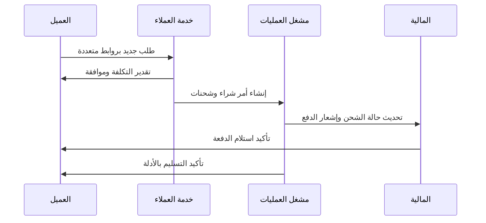

# 🗂️ حالات الاستخدام

Use Cases

---

> **المشروع:** منصة إدارة وساطة التسوق CA Admin  
> **Project:** CA Admin Shopping Mediation Platform  
> **التقنيات:** Flutter، Firebase (Firestore، Auth، Storage، Functions)  
> **Stack:** Flutter, Firebase (Firestore, Auth, Storage, Functions)  
> **الإصدار:** 0.1 (رؤية) - المالك: عبدالله الشائف - آخر تحديث: 2025-09-20  
> **Version:** 0.1 (Vision) - Owner: Abdullah Alshaif - Last Updated: 2025-09-20

**شرح مختصر:**
توثيق حالات الاستخدام يحول المتطلبات إلى سيناريوهات عملية لكل فاعل في النظام.

**Summary:**
Use case documentation converts requirements into actionable scenarios for each system actor.

---

## 1. مقدمة

Introduction

---

### 1.1 نظرة بصرية

Visual Overview

**شرح مختصر:**
يوضح المخطط كيف يتفاعل كل فاعل مع حالات الاستخدام الرئيسية في النظام.

**Summary:**
The diagram shows how each actor interacts with the main use cases in the system.

```mermaid
usecaseDiagram
  actor "👤 العميل\nCustomer" as Customer
  actor "🎧 موظف الخدمة\nService Agent" as Service
  actor "⚙️ مشغل العمليات\nOperations Operator" as Operator
  actor "💰 المحاسب\nAccountant" as Accountant
  actor "🖥️ المسؤول التقني\nTech Admin" as Tech
  Customer --> (📝 تقديم طلب جديد\nSubmit New Order)
  Customer --> (🔎 متابعة الطلب\nTrack Order)
  Service --> (✅ تخصيص الطلب\nQualify Order)
  Operator --> (🚚 إدارة الشحن المتعدد\nManage Multi-Shipments)
  Operator --> (📦 تأكيد التسليم\nConfirm Delivery)
  Accountant --> (💳 تسوية المدفوعات\nReconcile Payments)
  Tech --> (🔐 إدارة الصلاحيات\nManage Roles)
  (📝 تقديم طلب جديد\nSubmit New Order) ..> (💳 تسوية المدفوعات\nReconcile Payments) : <<includes>>
  (🚚 إدارة الشحن المتعدد\nManage Multi-Shipments) ..> (📦 تأكيد التسليم\nConfirm Delivery) : <<extends>>
```

- 🇸🇦 **الغرض من وثيقة حالات الاستخدام:** تحويل المتطلبات إلى سيناريوهات تفاعلية قابلة للتنفيذ.  
  🇬🇧 **Purpose of the use case document:** Convert requirements into actionable interaction scenarios.  
  🇸🇦 **ما هي:** وصف منظم للحالات التي يواجهها كل ممثل أثناء استخدام النظام.  
  🇬🇧 **What:** Structured description of scenarios each actor experiences while using the system.  
  🇸🇦 **وظيفتها:** توجيه التصميم وتجربة المستخدم والاختبار بالتفصيل المطلوب.  
  🇬🇧 **Function:** Directs design, UX, and testing with the needed detail.  
  🇸🇦 **فائدتها:** تقلل سوء الفهم وتضمن أن التطوير يلبي الاحتياجات الواقعية.  
  🇬🇧 **Benefit:** Reduces misinterpretation and keeps development aligned with real needs.

- 🇸🇦 **مستويات التفاصيل:** تتراوح من حالات استخدام أساسية إلى موسعة مع شروط استثنائية.  
  🇬🇧 **Levels of detail:** Range from basic to extended use cases with exception conditions.  
  🇸🇦 **ما هي:** تدرج يسمح بتغطية المسارات الرئيسية والفرعية في السرد.  
  🇬🇧 **What:** A hierarchy that covers primary and alternate flows within narratives.  
  🇸🇦 **وظيفتها:** يمكّن الفرق من فهم الاعتماديات قبل التنفيذ.  
  🇬🇧 **Function:** Enables teams to grasp dependencies prior to execution.  
  🇸🇦 **فائدتها:** يقلل إعادة العمل ويزيد دقة التقدير الزمني.  
  🇬🇧 **Benefit:** Lowers rework and increases estimation accuracy.

---

## 2. الفاعلون الرئيسيون / Primary Actors

| 🇸🇦 الفاعل         | 🇬🇧 Actor            | 🇸🇦 ما هي                                            | 🇬🇧 What                                                      | 🇸🇦 الوظيفة                                  | 🇬🇧 Function                                                       | 🇸🇦 الفائدة                                 | 🇬🇧 Benefit                                               |
| ----------------- | ------------------- | --------------------------------------------------- | ------------------------------------------------------------ | ------------------------------------------- | ----------------------------------------------------------------- | ------------------------------------------ | -------------------------------------------------------- |
| العميل            | Customer            | مستخدم نهائي يقدم طلباته عبر التطبيق                | End user placing requests through the app                    | يبدأ الرحلة من جمع المنتجات حتى تأكيد الدفع | Initiates journey from product collection to payment confirmation | يضمن تجربة شراء سلسة وشفافة                | Ensures a smooth, transparent purchase experience        |
| موظف خدمة العملاء | Service Agent       | عضو فريق يتولى إدخال الطلبات ومتابعة بيانات العملاء | Team member handling order entry and customer data           | يتحقق من صحة البيانات ويدير التواصل الأولي  | Validates information and manages first-line communication        | يقلل أخطاء الإدخال ويرفع رضا العملاء       | Reduces input errors and increases customer satisfaction |
| مشغل العمليات     | Operations Operator | مسؤول عن التنسيق اللوجستي وتتبع مراحل الشحنة        | Responsible for logistics coordination and shipment tracking | يقسم الشحنات، يدير الحالات، ويوثق الإثباتات | Splits shipments, manages statuses, and logs evidence             | يوفر رؤية تشغيلية موحدة على مستوى المراكز  | Provides unified operational visibility across hubs      |
| المحاسب           | Accountant          | عضو من فريق المالية يراجع الدفعات والأرصدة          | Finance team member reviewing payments and balances          | يربط المدفوعات بالطلبات ويعد التقارير       | Links payments to orders and prepares reports                     | يحسن الدقة المالية ويضمن الامتثال          | Improves financial accuracy and ensures compliance       |
| المسؤول التقني    | Tech Admin          | مسؤول عن الصلاحيات والأمان والتكاملات               | Oversees permissions, security, and integrations             | يعين الأدوار، يراقب الأداء، ويطبق السياسات  | Assigns roles, monitors performance, enforces policies            | يحافظ على سلامة البيانات واستمرارية الخدمة | Maintains data safety and service continuity             |

---

## 3. حالات استخدام أساسية / Core Use Cases

| 🇸🇦 الرمز | 🇬🇧 ID | 🇸🇦 الحالة          | 🇬🇧 Use Case                | 🇸🇦 وصف موجز                                            | 🇬🇧 Brief Description                                                | 🇸🇦 المسار الرئيسي                                    | 🇬🇧 Main Flow                                               | 🇸🇦 المسارات البديلة                        | 🇬🇧 Alternate Flows                               |
| -------- | ----- | ------------------ | -------------------------- | ------------------------------------------------------ | ------------------------------------------------------------------- | ---------------------------------------------------- | ---------------------------------------------------------- | ------------------------------------------ | ------------------------------------------------ |
| UC-01    | UC-01 | تقديم طلب جديد     | Submit New Order           | العميل يرفع روابط المنتجات ويحدد خيارات الدفع          | Customer submits product links and selects payment options          | تسجيل بيانات العميل، تحميل الروابط، تأكيد ملخص الطلب | Capture customer data, upload links, confirm order summary | الروابط غير الصالحة، إشعار نقص الرصيد      | Invalid links, insufficient balance notification |
| UC-02    | UC-02 | تأهيل الطلب        | Qualify Order              | موظف الخدمة يراجع الطلب، يقدر التكلفة، ويؤكد مع العميل | Service agent reviews order, estimates cost, confirms with customer | التحقق من المخزون، حساب الرسوم، إرسال موافقة         | Check inventory, compute fees, send approval               | تبديل عملة الدفع، تعليقات إضافية من العميل | Change of payment currency, extra customer notes |
| UC-03    | UC-03 | تقسيم الطلب لشحنات | Split Order into Shipments | مشغل العمليات يقسم الطلب حسب البائع أو الوزن           | Operator splits order by vendor or weight                           | إنشاء معرف لكل شحنة، تحديث الجدول الزمني             | Create identifier per shipment, update timeline            | دمج شحنات، تأجيل لمنتج متأخر               | Merge shipments, backorder handling              |
| UC-04    | UC-04 | تسوية دفعة         | Reconcile Payment          | المحاسب يطابق الدفعات مع الطلبات                       | Accountant matches payments with orders                             | استيراد كشف، مطابقة تلقائية، معالجة فروقات           | Import statement, auto-match, handle differences           | تحويل يدوي، تسجيل خصم عمولة                | Manual transfer, record commission discount      |
| UC-05    | UC-05 | إدارة الصلاحيات    | Manage Permissions         | المسؤول التقني يحدّث أدوار المستخدمين                  | Tech admin updates user roles                                       | اختيار المستخدم، تعيين الدور، مراجعة السجلات         | Select user, assign role, review logs                      | إبطال جلسة، رفع صلاحية مؤقتة               | Revoke session, temporary privilege elevation    |

---

## 4. تفاصيل الحالة UC-01

- 🇸🇦 **عنوان الحالة:** تقديم طلب جديد.  
  🇬🇧 **Use case title:** Submit new order.  
  🇸🇦 **ما هي:** سيناريو يبدأه العميل لإرسال قائمة منتجات للشراء عبر المنصة.  
  🇬🇧 **What:** Scenario initiated by customer to submit product list for platform procurement.  
  🇸🇦 **وظيفتها:** تضمن جمع بيانات دقيقة حول المنتج، الكمية، التفضيلات، وخيارات الدفع.  
  🇬🇧 **Function:** Ensures accurate capture of item, quantity, preference, and payment choices.  
  🇸🇦 **فائدتها:** تهيئ الطلب للمعالجة السلسة وتحسين التخطيط اللوجستي.  
  🇬🇧 **Benefit:** Prepares the order for smooth processing and better logistics planning.

| 🇸🇦 الخطوة | 🇬🇧 Step | 🇸🇦 الوصف                                         | 🇬🇧 Description                                               |
| --------- | ------- | ------------------------------------------------ | ------------------------------------------------------------ |
| 1         | 1       | يفتح العميل نموذج الطلب من صفحة المنتج           | Customer opens order form from product page                  |
| 2         | 2       | يدخل روابط المنتجات، الخيارات، والكمية           | Enters product links, options, and quantity                  |
| 3         | 3       | يختار طريقة الدفع ويحدد التفضيلات (تجميع، تغليف) | Selects payment method and preferences (bundling, packaging) |
| 4         | 4       | يراجع الملخص ويتلقى إشعار التوثيق                | Reviews summary and receives confirmation alert              |
| 5         | 5       | يرسل الطلب وينتظر موافقة الخدمة                  | Submits order and awaits service approval                    |

- 🇸🇦 **مسارات استثنائية:** رفض رابط، تنبيه حد ائتماني، تغيير عنوان الشحن.  
  🇬🇧 **Exception flows:** Link rejection, credit limit alert, shipping address change.  
  🇸🇦 **ما هي:** حالات تتطلب معالجة خاصة أثناء التقديم الأولي.  
  🇬🇧 **What:** Situations needing dedicated handling during submission.  
  🇸🇦 **وظيفتها:** تمنع دخول طلب غير مكتمل أو مخالف للسياسات.  
  🇬🇧 **Function:** Prevents incomplete or non-compliant orders from entering pipeline.  
  🇸🇦 **فائدتها:** تقلل إعادة الإدخال وتجنب تأخير المراجعة.  
  🇬🇧 **Benefit:** Lowers re-entry rates and avoids review delays.

---

## 5. مصفوفة تتبع المتطلبات / Requirement Traceability Matrix

| 🇸🇦 المعيار | 🇬🇧 Requirement          | 🇸🇦 مصدره        | 🇬🇧 Source             | 🇸🇦 حالة الاستخدام المرتبطة | 🇬🇧 Linked Use Case |
| ---------- | ----------------------- | --------------- | --------------------- | -------------------------- | ------------------ |
| RQ-01      | دعم الروابط المتعددة    | طلب العميل      | Customer request      | UC-01                      | UC-01                      |
| RQ-07      | تقسيم الشحنات           | فريق العمليات   | Operations team       | UC-03                      | UC-03                      |
| RQ-12      | مطابقة المصاريف تلقائيا | المالية         | Finance               | UC-04                      | UC-04                      |
| RQ-19      | Audit logs for permissions | سجلات التدقيق للصلاحيات | الأمن والامتثال | Security & Compliance | UC-05                      |

- 🇸🇦 **أهمية المصفوفة:** ضمان تغطية كل مطلب عبر حالة استخدام واضحة.  
  🇬🇧 **Matrix importance:** Ensure every requirement is covered by a clear use case.  
  🇸🇦 **ما هي:** جدول ربط بين المتطلبات التنفيذية وحالات الاستخدام.  
  🇬🇧 **What:** A linking table between execution requirements and use cases.  
  🇸🇦 **وظيفتها:** تكشف أي فجوات أو تكرارات في التغطية.  
  🇬🇧 **Function:** Reveals gaps or duplicates in coverage.  
  🇸🇦 **فائدتها:** تمنع نسيان المتطلبات وتدعم تحكم التغيير.  
  🇬🇧 **Benefit:** Prevents missed requirements and supports change control.

---

## 6. تشغيل السيناريوهات / Scenario Simulation



- 🇸🇦 **محاكاة التسلسل:** تصور تفاعل الأطراف عبر الزمن في حالة استخدام واحدة.  
  🇬🇧 **Sequence simulation:** Visualizes party interactions over time within a use case.  
  🇸🇦 **ما هي:** مخطط زمن يعرض تبادل الرسائل والخطوات.  
  🇬🇧 **What:** Timeline chart showing message exchanges and steps.  
  🇸🇦 **وظيفتها:** يساعد على اكتشاف التداخلات ومواطن التأخير.  
  🇬🇧 **Function:** Helps detect overlaps and potential delays.  
  🇸🇦 **فائدتها:** يوفر أساسا لتحسين الأداء وتقليل زمن الدورة.  
  🇬🇧 **Benefit:** Provides foundation for performance tuning and cycle reduction.

---

## 7. التوسع المستقبلي / Future Extensions

- 🇸🇦 **تكامل API مع أسواق جديدة:** تمكين إدخال الطلبات عبر قنوات بائعين خارجيين.  
  🇬🇧 **API integrations with new marketplaces:** Allow order intake through external vendor channels.  
  🇸🇦 **ما هي:** امتداد لحالة UC-01 لاستقبال الطلبات تلقائيا.  
  🇬🇧 **What:** Extension of UC-01 to receive orders automatically.  
  🇸🇦 **وظيفتها:** تقلل الحاجة للإدخال اليدوي وتوسع العرض.  
  🇬🇧 **Function:** Reduces manual entry and broadens catalog.  
  🇸🇦 **فائدتها:** تدعم النمو وتسرع الاستجابة للاتجاهات.  
  🇬🇧 **Benefit:** Supports scale and speeds response to trends.

- 🇸🇦 **تحليلات توقع التأخير:** استخدام بيانات الحالات لاستباق مشاكل الشحن.  
  🇬🇧 **Delay prediction analytics:** Use case data to anticipate shipment issues.  
  🇸🇦 **ما هي:** نماذج تعتمد على سجلات UC-03 وUC-04.  
  🇬🇧 **What:** Models built on UC-03 and UC-04 logs.  
  🇸🇦 **وظيفتها:** تنبه الفرق قبل تفاقم التأخير.  
  🇬🇧 **Function:** Alerts teams before delays escalate.  
  🇸🇦 **فائدتها:** يحافظ على رضا العميل ويقلل غرامات التخزين.  
  🇬🇧 **Benefit:** Maintains customer satisfaction and reduces storage penalties.

---

## 8. المراجعة الدورية / Governance Rhythm

- 🇸🇦 **اجتماع شهري لمراجعة الحالات:** تحديث السيناريوهات بناء على التغذية الراجعة.  
  🇬🇧 **Monthly use case review:** Refresh scenarios based on feedback.  
  🇸🇦 **ما هي:** جلسة تشمل المنتج، العمليات، المالية، والأمن.  
  🇬🇧 **What:** Session spanning product, operations, finance, and security.  
  🇸🇦 **وظيفتها:** تحافظ على حداثة الوثائق واتساقها مع الواقع.  
  🇬🇧 **Function:** Keeps documentation current and aligned with reality.  
  🇸🇦 **فائدتها:** تمنع تقادم العمليات وتضمن تكامل التجربة.  
  🇬🇧 **Benefit:** Prevents process drift and ensures cohesive experience.

- 🇸🇦 **لوحة قياس الامتثال:** تتبع نسبة الحالات المغطاة بالاختبارات.  
  🇬🇧 **Compliance scorecard:** Track percentage of use cases covered by tests.  
  🇸🇦 **ما هي:** مؤشر قيادة يربط التوثيق بجودة الاختبار.  
  🇬🇧 **What:** Leadership metric linking documentation to test quality.  
  🇸🇦 **وظيفتها:** يكشف الثغرات ويحفز تسوية الديون التقنية.  
  🇬🇧 **Function:** Exposes gaps and encourages tech debt resolution.  
  🇸🇦 **فائدتها:** يضمن أن كل سيناريو مدعوم بحماية جودة مناسبة.  
  🇬🇧 **Benefit:** Ensures every scenario has adequate quality safeguards.
