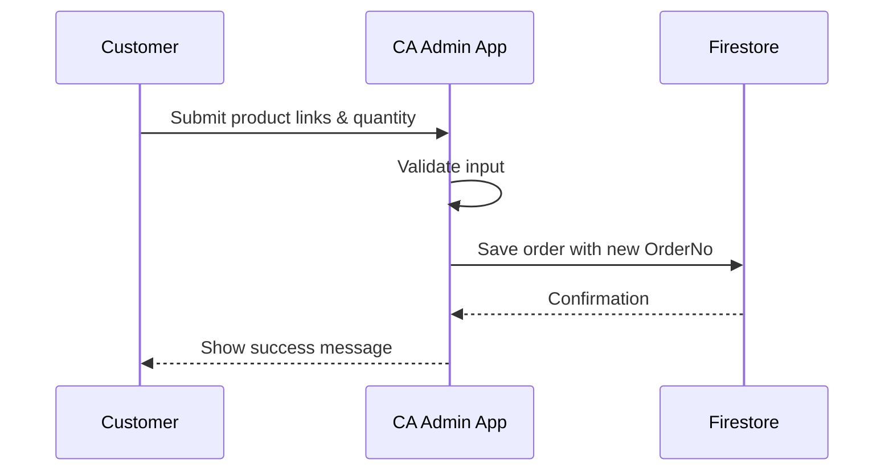

# 🎭 Use Cases / حالات الاستخدام

> Project: **CA Admin**  
> Version: v0.1 — Owner: Abdullah Alshaif — Last Updated: YYYY-MM-DD

---

## 1) Introduction / المقدمة
**EN:**  
Use Cases describe the functional scenarios of the CA Admin system. Each Use Case explains how an **Actor** (Customer, Staff, Driver, Finance, Admin) interacts with the system to achieve a business goal. They provide detailed flows and form the base for test cases.

**AR:**  
تصف حالات الاستخدام السيناريوهات الوظيفية لنظام CA Admin. كل حالة استخدام توضح كيف يتفاعل **الممثل** (العميل، الموظف، السائق، المالية، المدير) مع النظام لتحقيق هدف عمل. وهي توفر تدفقات مفصلة وتشكل أساسًا لحالات الاختبار.

---

## 2) Use Case Overview / نظرة عامة على حالات الاستخدام

| ID    | Use Case (EN)           | Use Case (AR)             | Actor          | Priority |
|-------|--------------------------|----------------------------|----------------|----------|
| UC-01 | Place Customer Order     | إنشاء طلبية عميل          | Customer       | High     |
| UC-02 | Process Payment          | معالجة دفعة مالية          | Finance Officer| High     |
| UC-03 | Track Shipment           | تتبع الشحنة               | Customer       | Medium   |
| UC-04 | Update Shipment Status   | تحديث حالة الشحنة         | Driver         | High     |
| UC-05 | Manage User Roles        | إدارة صلاحيات المستخدم    | Admin          | High     |
| UC-06 | Generate Reports         | إنشاء تقارير              | Finance/Admin  | Medium   |
| UC-07 | Offline Data Sync        | مزامنة البيانات دون إنترنت | IT Manager     | High     |

---

## 3) Detailed Use Cases / تفاصيل حالات الاستخدام

### UC-01: Place Customer Order / إنشاء طلبية عميل
- **Actors / الممثلون:** Customer  
- **Preconditions / الشروط المسبقة:** Customer logged in, product links available  
- **Main Flow / التدفق الرئيسي:**  
  1. Customer enters product links and quantities.  
  2. System validates inputs.  
  3. System generates a unique OrderNo.  
  4. Order is saved to Firestore.  
- **Alternative Flow / التدفق البديل:** Invalid link → error message.  

---

### UC-02: Process Payment / معالجة دفعة مالية
- **Actors:** Finance Officer  
- **Preconditions:** Order exists in the system  
- **Main Flow:**  
  1. Finance selects order.  
  2. Enters payment amount and method.  
  3. System updates customer balance and logs transaction.  
- **Alternative Flow:** Payment > Due → system alerts Finance.  

---

### UC-03: Track Shipment / تتبع الشحنة
- **Actors:** Customer  
- **Main Flow:**  
  1. Customer opens “My Orders”.  
  2. System fetches latest shipment status.  
  3. Status is displayed in real time.  

---

### UC-04: Update Shipment Status / تحديث حالة الشحنة
- **Actors:** Driver  
- **Main Flow:**  
  1. Driver selects shipment.  
  2. Updates status (in transit, delivered).  
  3. System stores update and notifies customer.  

---

### UC-05: Manage User Roles / إدارة صلاحيات المستخدم
- **Actors:** Admin  
- **Main Flow:**  
  1. Admin selects staff account.  
  2. Assigns role (Finance, Staff, Driver, etc.).  
  3. System updates permissions instantly.  

---

### UC-06: Generate Reports / إنشاء تقارير
- **Actors:** Finance/Admin  
- **Main Flow:**  
  1. User selects report type (financial or shipments).  
  2. System aggregates data.  
  3. Report exported to PDF/Excel.  

---

### UC-07: Offline Data Sync / مزامنة البيانات دون إنترنت
- **Actors:** IT Manager, Staff  
- **Main Flow:**  
  1. Staff enters data offline.  
  2. System caches locally.  
  3. Once online, system syncs with Firestore.  

---

## 4) Use Case Diagram / رسم حالات الاستخدام

```mermaid
usecaseDiagram
  actor Customer
  actor "Finance Officer" as Finance
  actor Driver
  actor Admin
  actor "IT Manager" as IT

  Customer --> (UC-01 Place Order)
  Customer --> (UC-03 Track Shipment)
  Finance --> (UC-02 Process Payment)
  Finance --> (UC-06 Generate Reports)
  Driver --> (UC-04 Update Shipment Status)
  Admin --> (UC-05 Manage User Roles)
  IT --> (UC-07 Offline Data Sync)


# 🎭 Use Cases / حالات الاستخدام

> **Project:** CA Admin  
> **Version:** v0.1 — Owner: Abdullah Alshaif — Last Updated: YYYY-MM-DD

---

## 1. Introduction / المقدمة

<div align="center">
  
</div>

**EN:**
Use Cases describe the functional scenarios of the CA Admin system. Each Use Case explains how an **Actor** (Customer, Staff, Driver, Finance, Admin) interacts with the system to achieve a business goal. They provide detailed flows and form the base for test cases.

**AR:**
تصف حالات الاستخدام السيناريوهات الوظيفية لنظام CA Admin. كل حالة استخدام توضح كيف يتفاعل **الممثل** (العميل، الموظف، السائق، المالية، المدير) مع النظام لتحقيق هدف عمل. وهي توفر تدفقات مفصلة وتشكل أساسًا لحالات الاختبار.

---

## 1.1 Use Case Lifecycle / دورة حياة حالة الاستخدام

```mermaid
flowchart LR
    A[User Story] --> B[Use Case]
    B --> C[Sequence Diagram]
    C --> D[Test Case]
    D --> E[Deployment]
    E --> F[Feedback & Update]
    F --> B
```

---

## 2. Use Case Overview / نظرة عامة على حالات الاستخدام

| ID    | Use Case (EN)           | Use Case (AR)             | Actor          | Priority |
|-------|-------------------------|---------------------------|----------------|----------|
| UC-01 | Place Customer Order    | إنشاء طلبية عميل         | Customer       | High     |
| UC-02 | Process Payment         | معالجة دفعة مالية         | Finance Officer| High     |
| UC-03 | Track Shipment          | تتبع الشحنة              | Customer       | Medium   |
| UC-04 | Update Shipment Status  | تحديث حالة الشحنة        | Driver         | High     |
| UC-05 | Manage User Roles       | إدارة صلاحيات المستخدم   | Admin          | High     |
| UC-06 | Generate Reports        | إنشاء تقارير             | Finance/Admin  | Medium   |
| UC-07 | Offline Data Sync       | مزامنة البيانات دون إنترنت| IT Manager     | High     |

---

## 3. Detailed Use Cases / تفاصيل حالات الاستخدام

### UC-01: Place Customer Order / إنشاء طلبية عميل
- **Actors / الممثلون:** Customer
- **Preconditions / الشروط المسبقة:** Customer logged in, product links available
- **Main Flow / التدفق الرئيسي:**
  1. Customer enters product links and quantities.
  2. System validates inputs.
  3. System generates a unique OrderNo.
  4. Order is saved to Firestore.
- **Alternative Flow / التدفق البديل:** Invalid link → error message.

---

### UC-02: Process Payment / معالجة دفعة مالية
- **Actors:** Finance Officer
- **Preconditions:** Order exists in the system
- **Main Flow:**
  1. Finance selects order.
  2. Enters payment amount and method.
  3. System updates customer balance and logs transaction.
- **Alternative Flow:** Payment > Due → system alerts Finance.

---

### UC-03: Track Shipment / تتبع الشحنة
- **Actors:** Customer
- **Main Flow:**
  1. Customer opens “My Orders”.
  2. System fetches latest shipment status.
  3. Status is displayed in real time.

---

### UC-04: Update Shipment Status / تحديث حالة الشحنة
- **Actors:** Driver
- **Main Flow:**
  1. Driver selects shipment.
  2. Updates status (in transit, delivered).
  3. System stores update and notifies customer.

---

### UC-05: Manage User Roles / إدارة صلاحيات المستخدم
- **Actors:** Admin
- **Main Flow:**
  1. Admin selects staff account.
  2. Assigns role (Finance, Staff, Driver, etc.).
  3. System updates permissions instantly.

---

### UC-06: Generate Reports / إنشاء تقارير
- **Actors:** Finance/Admin
- **Main Flow:**
  1. User selects report type (financial or shipments).
  2. System aggregates data.
  3. Report exported to PDF/Excel.

---

### UC-07: Offline Data Sync / مزامنة البيانات دون إنترنت
- **Actors:** IT Manager, Staff
- **Main Flow:**
  1. Staff enters data offline.
  2. System caches locally.
  3. Once online, system syncs with Firestore.

---

## 4. Use Case Diagram / رسم حالات الاستخدام

```mermaid
usecaseDiagram
  actor Customer
  actor "Finance Officer" as Finance
  actor Driver
  actor Admin
  actor "IT Manager" as IT

  Customer --> (UC-01 Place Order)
  Customer --> (UC-03 Track Shipment)
  Finance --> (UC-02 Process Payment)
  Finance --> (UC-06 Generate Reports)
  Driver --> (UC-04 Update Shipment Status)
  Admin --> (UC-05 Manage User Roles)
  IT --> (UC-07 Offline Data Sync)
```

---

## 5. Sequence Diagram (UC-01 Example) / رسم تسلسلي (مثال على UC-01)



---

## 6. Mapping to User Stories & Test Plan / ربط حالات الاستخدام بالقصص وخطة الاختبار

- Each Use Case is linked to at least one **User Story** ([see User Stories](../03-stories/03-stories.md)).
- Use Cases are the foundation for the [Test Plan](../11-test-plan/11-test-plan.md).
- Diagrams are written in Mermaid and render natively in GitHub.
- Use Cases are updated as requirements and feedback evolve.

---

## 7. Notes / ملاحظات

- Use Cases clarify the system’s functional requirements for all stakeholders.
- Keep flows concise, visual, and always up to date.

---
