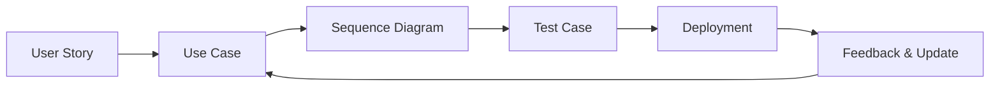

# 🎭 Use Cases / حالات الاستخدام

> Project: **CA Admin**
> Version: v0.1 — Owner: Abdullah Alshaif — Last Updated: 2025-09-08

---

## 1. Introduction / المقدمة


**EN:**
Use Cases describe the functional scenarios of the CA Admin system. Each Use Case explains how an **Actor** (Customer, Staff, Driver, Finance, Admin) interacts with the system to achieve a business goal. They provide detailed flows and form the base for test cases.

**AR:**
تصف حالات الاستخدام السيناريوهات الوظيفية لنظام CA Admin. كل حالة استخدام توضح كيف يتفاعل **الممثل** (العميل، الموظف، السائق، المالية، المدير) مع النظام لتحقيق هدف عمل. وهي توفر تدفقات مفصلة وتشكل أساسًا لحالات الاختبار.

---

## 1.1 Use Case Lifecycle / دورة حياة حالة الاستخدام



---

## 2. Use Case Overview / نظرة عامة على حالات الاستخدام

| ID    | Use Case (EN)          | Use Case (AR)              | Actor           | Priority |
| ----- | ---------------------- | -------------------------- | --------------- | -------- |
| UC-01 | Place Customer Order   | إنشاء طلبية عميل           | Customer        | High     |
| UC-02 | Process Payment        | معالجة دفعة مالية          | Finance Officer | High     |
| UC-03 | Track Shipment         | تتبع الشحنة                | Customer        | Medium   |
| UC-04 | Update Shipment Status | تحديث حالة الشحنة          | Driver          | High     |
| UC-05 | Manage User Roles      | إدارة صلاحيات المستخدم     | Admin           | High     |
| UC-06 | Generate Reports       | إنشاء تقارير               | Finance/Admin   | Medium   |
| UC-07 | Offline Data Sync      | مزامنة البيانات دون إنترنت | IT Manager      | High     |

---

## 3. Detailed Use Cases / تفاصيل حالات الاستخدام

### UC-01: Place Customer Order / إنشاء طلبية عميل

- **Actors / الممثلون:** Customer
- **Preconditions / الشروط المسبقة:** Customer logged in, product links available
- **Main Flow / التدفق الرئيسي:**
  1. Customer enters product links and quantities.
  2. System validates inputs.
  3. System generates a unique OrderNo.
  4. Order is saved to Firestore.
- **Alternative Flow / التدفق البديل:** Invalid link → error message.

---

### UC-02: Process Payment / معالجة دفعة مالية

- **Actors:** Finance Officer
- **Preconditions:** Order exists in the system
- **Main Flow:**
  1. Finance selects order.
  2. Enters payment amount and method.
  3. System updates customer balance and logs transaction.
- **Alternative Flow:** Payment > Due → system alerts Finance.

---

### UC-03: Track Shipment / تتبع الشحنة

- **Actors:** Customer
- **Main Flow:**
  1. Customer opens “My Orders”.
  2. System fetches latest shipment status.
  3. Status is displayed in real time.

---

### UC-04: Update Shipment Status / تحديث حالة الشحنة

- **Actors:** Driver
- **Main Flow:**
  1. Driver selects shipment.
  2. Updates status (in transit, delivered).
  3. System stores update and notifies customer.

---

### UC-05: Manage User Roles / إدارة صلاحيات المستخدم

- **Actors:** Admin
- **Main Flow:**
  1. Admin selects staff account.
  2. Assigns role (Finance, Staff, Driver, etc.).
  3. System updates permissions instantly.

---

### UC-06: Generate Reports / إنشاء تقارير

- **Actors:** Finance/Admin
- **Main Flow:**
  1. User selects report type (financial or shipments).
  2. System aggregates data.
  3. Report exported to PDF/Excel.

---

### UC-07: Offline Data Sync / مزامنة البيانات دون إنترنت

- **Actors:** IT Manager, Staff
- **Main Flow:**
  1. Staff enters data offline.
  2. System caches locally.
  3. Once online, system syncs with Firestore.

---

## 4. Use Case Diagram / رسم حالات الاستخدام

```mermaid
usecaseDiagram
  actor Customer
  actor "Finance Officer" as Finance
  actor Driver
  actor Admin
  actor "IT Manager" as IT

  Customer --> (UC-01 Place Order)
  Customer --> (UC-03 Track Shipment)
  Finance --> (UC-02 Process Payment)
  Finance --> (UC-06 Generate Reports)
  Driver --> (UC-04 Update Shipment Status)
  Admin --> (UC-05 Manage User Roles)
  IT --> (UC-07 Offline Data Sync)
```

## 🛠️ Tips for Developers & Analysts / نصائح للمطورين والمحللين

**EN:**

- Always keep use cases updated as requirements evolve.
- Link use cases to user stories ([see User Stories](../03-stories/03-stories.md)), data model ([see Data Model](../05-data-model/05-data-model.md)), and test plan ([see Test Plan](../11-test-plan/11-test-plan.md)).
- Use sequence diagrams for complex flows.
- Validate each use case with stakeholders before implementation.

**AR:**

- احرص على تحديث حالات الاستخدام مع تطور المتطلبات.
- اربط حالات الاستخدام بالقصص ([انظر القصص](../03-stories/03-stories.md))، نموذج البيانات ([انظر نموذج البيانات](../05-data-model/05-data-model.md))، وخطة الاختبار ([انظر خطة الاختبار](../11-test-plan/11-test-plan.md)).
- استخدم مخططات التسلسل للعمليات المعقدة.
- تحقق من كل حالة استخدام مع الأطراف المعنية قبل التنفيذ.

---

## 🚀 Future Expansion & Challenges / التوسعة المستقبلية والتحديات

**EN:**

- Consider adding use cases for notifications, audit logs, and advanced analytics.
- Plan for scalability and offline-first scenarios.
- Anticipate integration with external payment/shipping providers.

**AR:**

- فكر في إضافة حالات استخدام للإشعارات، سجلات التدقيق، والتحليلات المتقدمة.
- خطط للتوسع ودعم العمل دون اتصال.
- توقع الحاجة للربط مع مزودي الدفع أو الشحن الخارجيين.

---

---
