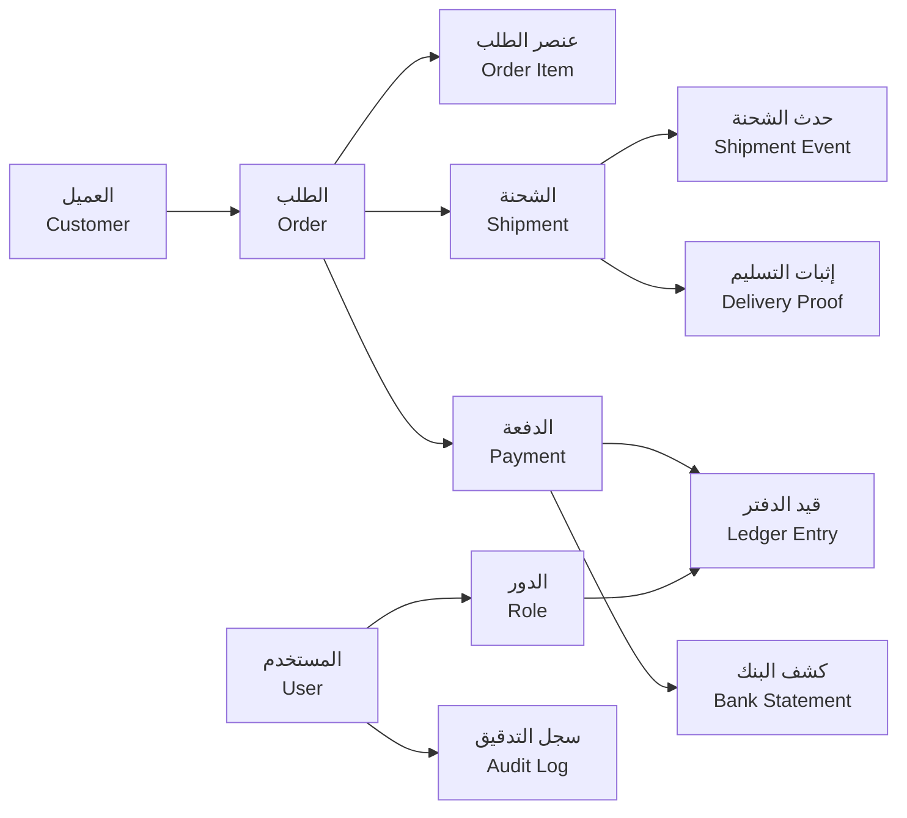
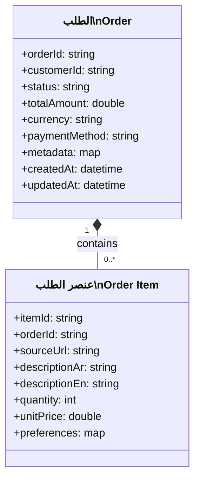
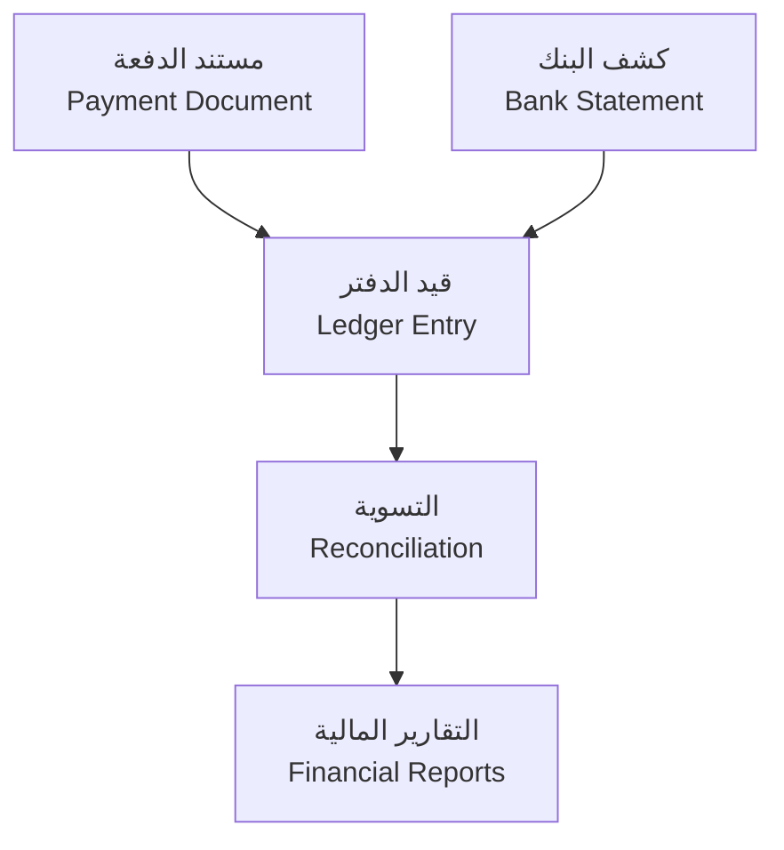

# 🗃️ نموذج البيانات | Data Model

| العنصر        | التفاصيل                                                                                                                                                                                                                           |
| ------------- | ---------------------------------------------------------------------------------------------------------------------------------------------------------------------------------------------------------------------------------- |
| المنصة        | منصة الوساطة الشرائية CA Admin CA Admin Shopping Mediation Platform                                                                                                                                                             |
| الإصدار       | 0.1 – آخر تحديث 2025-09-20 – المالك: عبدالله الشائف Version 0.1 – Last updated 2025-09-20 – Owner: Abdullah Alshaif                                                                                                             |
| المكدس التقني | Flutter، Firebase (Firestore، Auth، Storage، Functions) Flutter, Firebase (Firestore, Auth, Storage, Functions)                                                                                                                 |
| روابط مساندة  | `docs/01-vision/01-vision.md`، `docs/03-stories/03-stories.md`، `docs/10-nfr-and-quality/10-nfr-and-quality.md` `docs/01-vision/01-vision.md`, `docs/03-stories/03-stories.md`, `docs/10-nfr-and-quality/10-nfr-and-quality.md` |

> 🔑 **الخلاصة السريعة:** يربط هذا المستند بين التشغيل اليومي وطبقات البيانات لضمان الدقة، منع التضارب، وتمكين التحليلات الفورية.
> 🔑 **Quick Glance:** This reference links daily operations to their data layers to guarantee accuracy, avoid conflicts, and enable real-time analytics.

---

## 1. نظرة عامة | Overview

- 🧭 يوضح نطاق العمل الرحلة من استلام الطلب حتى التسوية المالية النهائية.
  🧭 Outlines the scope from order intake all the way to final financial reconciliation.
- 🎯 يحدد الأهداف عبر وصف سلوك الممثلين والقيمة التشغيلية لكل جزء من النموذج.
  🎯 States the goals by describing actor behaviour and the operational value tied to each model segment.
- 📦 يسلم حالات استخدام بيانات جاهزة للتحليل والتصميم والاختبار مع سياق إداري واضح.
  📦 Delivers data use cases ready for analysis, design, and testing with explicit governance context.

## 1.1 🛰️ العرض المرئي العام | System Overview Diagram

> 📌 يوضح الرسم كيفية ترابط الكيانات التشغيلية والمالية لضمان مصدر واحد للحقيقة عبر المنصة.
> 📌 The diagram highlights how operational and financial entities interlink to maintain a single source of truth across the platform.

## 1.2 🎯 مبادئ نموذج البيانات | Data Model Principles

- 🧱 يغطي التصميم كيانات العميل، الطلب، الشحنة، المالية، والأمن لضمان الصورة المتكاملة.
  🧱 The structure spans customer, order, shipment, finance, and security entities to deliver a holistic view.
- 🔄 يربط إجراءات اليوم الواحد بمصادر بيانات موثوقة لمنع التكرار والتضارب.
  🔄 Links day-to-day actions to trusted data sources, eliminating duplication and conflict.
- 📊 يؤسس لفصل واضح بين البيانات التشغيلية والتحليلات مع إمكان بناء مؤشرات الأداء بسلاسة.
  📊 Establishes a clean separation between operational data and analytics, making KPI construction straightforward.
- 🛡️ يشمل اعتبارات Firestore من حيث البنية، الشاردينغ، والفهارس للحفاظ على الأداء.
  🛡️ Embeds Firestore considerations around structure, sharding, and indexes to keep performance stable.

---

## 2. كيان العميل | Customer Entity

> 👥 يعكس هذا الكيان بيانات التعريف والتواصل لكل عميل مع حقول صالحة للبحث السريع والتخصيص.
> 👥 This entity captures customer identity and contact data with fields optimised for quick search and personalisation.

| الحقل Field     | النوع Type             | الوصف Description                                                                                                                     |
| --------------- | ---------------------- | ------------------------------------------------------------------------------------------------------------------------------------- |
| customerId      | معرف نصي String ID  | مفتاح أساسي يولده النظام لكل عميل لضمان التتبع الموحد. System-generated primary key that keeps customer tracking unique.           |
| fullName        | نص String           | الاسم الكامل ثنائي اللغة كما يفضله العميل لضمان اتساق التواصل. Bilingual full name reflecting the customer’s preferred expression. |
| phone           | نص String           | رقم اتصال موثّق يستخدم للمصادقة والتحديثات الفورية. Verified contact number used for authentication and instant notifications.     |
| preferredLocale | نص String           | لغة الواجهة (ar/en) لعرض القوالب والإشعارات بشكل مناسب. Interface locale (ar/en) to render templates and alerts accurately.        |
| loyaltyTier     | نص String           | مستوى الولاء (Silver/Gold) لدعم عروض الولاء والتصعيد. Loyalty tier (Silver/Gold) powering incentives and priority routing.         |
| createdAt       | طابع زمني Timestamp | تاريخ إنشاء السجل لحساب عمر العميل والتقارير. Record creation timestamp used for lifetime metrics and reporting.                   |

- 🔍 يوفر تخزينًا متسقًا لملفات العملاء وخريطتهم التفاعلية عبر القنوات.
  🔍 Provides consistent customer profiles and cross-channel history.
- 📨 يدعم الردود الفورية بفضل الحقول المفهرسة والفلاتر الجاهزة.
  📨 Enables instant responses through indexed lookups and ready-made filters.

---

## 3. مخطط الطلب | Order Schema

> 🛒 يفصل المخطط بين رأس الطلب وعناصره لتقليل تضارب التعديلات وتحسين الأداء على Firestore.
> 🛒 The schema separates order headers from line items to minimise edit conflicts and improve Firestore performance.

| الحقل Field | الوصف Description                                                                                                                               |
| ----------- | ----------------------------------------------------------------------------------------------------------------------------------------------- |
| status      | حالة الطلب (جديد، قيد المراجعة، مكتمل) لتوجيه سير العمل. Status lifecycle (New, Under Review, Completed) steering workflow routing.          |
| metadata    | تفاصيل إضافية مثل قناة الطلب والوسيط المستخدم للتقارير. Additional details such as order channel and mediator used for reporting.            |
| preferences | إعدادات خاصة بالعناصر (لون، حجم، تعليمات تغليف) لدعم التخصيص. Item-level preferences (colour, size, packing notes) enabling personalisation. |

- 🧮 يسمح بتجميع الرسوم أثناء عملية الإدخال دون التأثير على العناصر.
  🧮 Allows fee aggregation during intake without touching line items.
- 🔁 يدعم تحديث العناصر بشكل مستقل مع الحفاظ على رأس الطلب.
  🔁 Supports independent line-item updates while keeping the order header intact.

---

## 4. سجل الشحن | Shipment Ledger

> 🚚 يتتبع هذا الجزء مسار الشحنة وأحداثها وإثباتاتها لتقديم رؤية فورية وتقليل النزاعات.
> 🚚 Tracks shipment path, time-based events, and proof artefacts to deliver real-time visibility and reduce disputes.

| المكوّن Component | التفاصيل Details                                                                                                                             |
| ----------------- | -------------------------------------------------------------------------------------------------------------------------------------------- |
| shipments         | مجموعة رئيسية لكل شحنة مرتبطة بالطلب مع حالة ومسار مبدئي. Root collection per shipment containing status and initial routing.             |
| shipmentEvents    | سجل زمنى للأحداث يحمل الطابع الزمني والموقع والمالك التشغيلي. Time-series log of checkpoint events with timestamp, location, and handler. |
| deliveryProof     | مرفقات صور وتواقيع العملاء تحفظ في مساحة تخزين آمنة. Image and signature attachments stored in controlled bucket space.                   |

- ⏱️ يحافظ التصميم على نمط append-only لضمان سلسلة تدقيق غير قابلة للتلاعب.
  ⏱️ Uses an append-only pattern to keep an untampered audit chain.
- 📍 يدعم التحليلات المكانية والتقارير التشغيلية الدقيقة للأميال الأخيرة.
  📍 Enables granular geospatial analytics and last-mile operational reporting.

---

## 5. دفتر المالية | Financial Ledger

> 💳 يوحّد هذا القسم المستندات المالية وقيد الدفتر وكشف البنك لإتمام التسوية الآلية والتقارير.
> 💳 Unifies payment documents, ledger entries, and bank statements to automate reconciliation and reporting.

| العنصر Element | الملاحظات Notes                                                                                                                                  |
| -------------- | ------------------------------------------------------------------------------------------------------------------------------------------------ |
| paymentDoc     | يحتفظ بمصدر الدفع، العملة، ورقم المرجع الموحد لكل طلب. Stores channel, currency, and unified reference number per order.                      |
| ledgerEntry    | يجمع الحركات المالية تحت معرف واحد لضمان المطابقة الآلية. Aggregates financial movements under a single id for automated matching.            |
| reconciliation | ينتج حالات (متطابق، فرق جزئي، مفقود) مع روابط إلى عناصر المتابعة. Outputs statuses (Matched, Partial, Missing) with links to follow-up tasks. |

- 🔒 يمنع حذف أو تعديل أي دفعة مرتبطة إلا بصلاحيات خاصة موثّقة.
  🔒 Prevents deleting or editing linked payments without documented elevated privileges.
- 📈 يحد من الجهود اليدوية ويزيد ثقة المدققين والمستثمرين بالبيانات المالية.
  📈 Cuts manual work and boosts auditor/investor confidence in financial data.

---

## 6. مخطط الأمن | Security Schema

> 🛡️ يحدد هذا المخطط الصلاحيات وسجل التغيير لضمان امتثال RBAC ودعم التحقيقات السريعة.
> 🛡️ Defines permissions and change history to enforce RBAC and accelerate investigations.

| المكوّن Component | الوصف Description                                                                                                                                 | الفائدة Benefit                                                                                                              |
| ----------------- | ------------------------------------------------------------------------------------------------------------------------------------------------- | ---------------------------------------------------------------------------------------------------------------------------- |
| userRoles         | مجموعة تحدد الأدوار المعتمدة وسياسات الوصول المرتبطة بكل دور. Collection defining approved roles and their access policies.                    | يضمن تطبيق RBAC بدقة مع مراجعات مجدولة. Ensures precise RBAC enforcement with scheduled reviews.                          |
| auditLogs         | سجل مركزي يسجل من قام بالتغيير، ماذا تغير، ومتى حدث ذلك. Central log storing who changed what and when.                                        | يوفر أثرًا تدقيقيًا كاملاً ويكشف الأنماط الشاذة بسرعة. Provides full audit trail and surfaces anomalies quickly.          |
| policySnapshots   | أرشيف للسياسات السابقة لدعم المقارنات والاسترجاع الآمن عند الحاجة. Archive of previous policy states supporting comparisons and safe rollback. | يقلل مخاطر انزلاق الصلاحيات غير المقصود ويحافظ على الامتثال. Reduces unintended privilege drift and preserves compliance. |

---

## 7. اعتبارات الأداء | Performance Considerations

- 🌍 تقسيم المجموعات إقليميًا (السعودية/اليمن) لتقليل النقاط الساخنة على Firestore.
  🌍 Regional sharding (KSA/Yemen) to minimise Firestore hotspots.
- ⚖️ مراقبة حصص الكتابة وتدوير المعرفات يضمن ثبات الأداء مع نمو الطلبات.
  ⚖️ Monitoring write quotas and id rotation keeps throughput stable as orders grow.
- 💾 تفعيل التخزين المؤقت المحلي عبر IndexedDB يدعم العمل دون اتصال ويقلل زمن القراءة.
  💾 Local caching via IndexedDB enables offline work and lowers read latency.
- 📡 مزامنة تدريجية تستخدم طوابير خلفية لتفادي تضارب البيانات عند الرجوع للاتصال.
  📡 Progressive sync with background queues prevents data clashes after reconnecting.

---

## 8. خطة الحوكمة | Governance Plan

- 📅 مراجعة نصف سنوية للنموذج بمشاركة المنتج، البيانات، والهندسة لضبط التوسعات.
  📅 Semi-annual model review with product, data, and engineering to adjust for expansion.
- 📊 مراقبة جودة البيانات عبر لوحات تنبه للحقل الخالي أو القيم الشاذة قبل تأثيرها على العملاء.
  📊 Data quality dashboards alert on null or anomalous values before they impact customers.
- 📘 تحديث الأدلة التشغيلية فور أي تعديل على المخطط مع تسجيل الأثر المتسلسل.
  📘 Operational runbooks are updated immediately after schema changes with linked impact logs.
- 🛡️ مواءمة الامتثال الدوري مع سياسات الأمن والمالية لضمان الثقة التنظيمية.
  🛡️ Periodic compliance alignment with security and finance policies to preserve regulatory trust.

> 🧾 **خلاصة التنفيذ:** يجب التعامل مع هذا النموذج كمستند حي، وتحديثه بالتزامن مع أي تغيير تشغيلي أو تنظيمي لضمان استمرارية الجودة.
> 🧾 **Execution Reminder:** Treat the model as a living document and update it alongside any operational or regulatory change to sustain quality.
