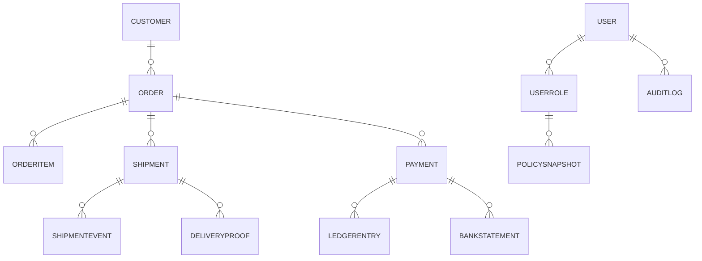
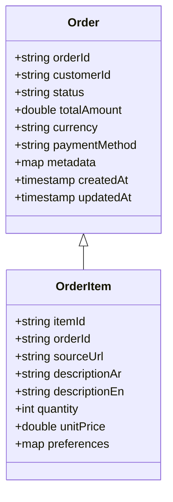
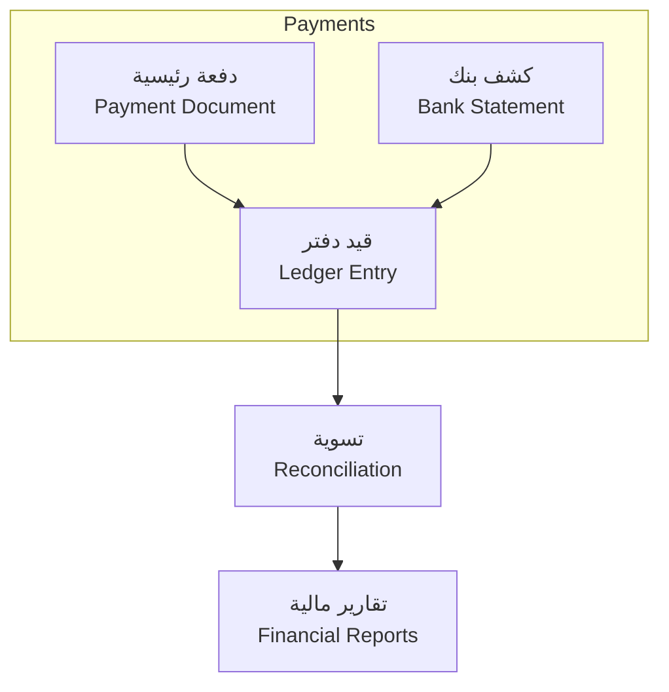

# 🗃️ نموذج البيانات

Data Model

---

> **المشروع:** منصة إدارة وساطة التسوق CA Admin  
> **Project:** CA Admin Shopping Mediation Platform  
> **التقنيات:** Flutter، Firebase (Firestore، Auth، Storage، Functions)  
> **Stack:** Flutter, Firebase (Firestore, Auth, Storage, Functions)  
> **الإصدار:** 0.1 (رؤية) - المالك: عبدالله الشائف - آخر تحديث: 2025-09-20  
> **Version:** 0.1 (Vision) - Owner: Abdullah Alshaif - Last Updated: 2025-09-20

**شرح مختصر:**
نموذج البيانات يحدد الكيانات والعلاقات الأساسية لضمان اتساق المعلومات ودعم العمليات.

**Summary:**
The data model defines core entities and relationships to ensure information consistency and support operations.

---

## 1. مقدمة

Introduction

---

### 1.1 نظرة بصرية

Visual Overview

**شرح مختصر:**
يوضح المخطط العلاقات بين الكيانات الرئيسية مثل العميل، الطلب، الشحن، المالية، والأمان.

**Summary:**
The diagram shows relationships between main entities: customer, order, shipment, finance, and security.

---

#### أهداف نموذج البيانات

- منظومة كيان-علاقة تغطي العملاء، الطلبات، الشحن، المالية، والأمان.
- تربط العمليات اليومية بمصادر بيانات موثوقة.
- تسهل الإبلاغ والتحليلات دون تضارب أو تكرار.

**Objectives:**

- Entity-relationship system covering customer, order, shipment, finance, and security domains.
- Connects daily operations with reliable data sources.
- Facilitates reporting and analytics without conflict or duplication.

#### توائم Firestore

- تنفيذ النموذج على هيكل مجموعات ووثائق مع فهارس داعمة.
- تحويل الجداول إلى مجموعات أساسية، فرعية، وسجلات فهرس.
- تمكن من أداء عالٍ وقراءة قابلة للتوسع.
- تقلل تكلفة الاستعلام وتسرع زمن الاستجابة.

**Firestore mapping:**

- Implement entities as collection/document structures with supportive indexes.
- Transform tables into root collections, subcollections, and index logs.
- Enables high performance and scalable reads.
- Reduces query cost and improves response time.

---

## 2. كيان العميل / Customer Entity

| 🇸🇦 الحقل        | 🇬🇧 Field        | 🇸🇦 النوع  | 🇬🇧 Type   | 🇸🇦 الوصف                 | 🇬🇧 Description               |
| --------------- | --------------- | --------- | --------- | ------------------------ | ---------------------------- |
| customerId      | customerId      | معرف نصي  | String ID | مفتاح أساسي يولده النظام | System-generated primary key |
| fullName        | fullName        | نص        | String    | الاسم الكامل باللغتين    | Full bilingual name          |
| phone           | phone           | نص        | String    | رقم اتصال معتمد          | Verified contact number      |
| preferredLocale | preferredLocale | نص        | String    | تفضيل اللغة (ar/en)      | Language preference (ar/en)  |
| loyaltyTier     | loyaltyTier     | نص        | String    | مستوى الولاء (فضي/ذهبي)  | Loyalty tier (Silver/Gold)   |
| createdAt       | createdAt       | طابع زمني | Timestamp | تاريخ إنشاء السجل        | Record creation date         |

**النطاق:** يدعم بيانات تعريف العملاء وسجلات التواصل.
**Scope:** Supports customer identity and communication records.
**ما هي:** وثيقة Firestore رئيسية مع حقول مفهرسة للبحث.
**What:** Root Firestore document with indexed search fields.
**وظيفتها:** تزوّد خدمة العملاء بسياق فوري أثناء إدخال الطلب.
**Function:** Provides customer service with instant context during order entry.
**فائدتها:** تحسن الدقة وتدعم الميزات الشخصية مثل التنبيهات.
**Benefit:** Improves accuracy and powers personalization features like alerts.

---

## 3. نموذج الطلب / Order Schema

**بنية الطلب:** تفصل بيانات رأس الطلب عن تفاصيل العناصر.
**Order structure:** Separates order header from item details.
**ما هي:** تصميم يعتمد على وثيقة رئيسية مع مجموعة عناصر فرعية.
**What:** Design using main document with nested item subcollection.
**وظيفتها:** يسمح بتحديثات مستقلة للعناصر دون تعديل الرأس.
**Function:** Allows independent item updates without touching the header.
**فائدتها:** يخفض النزاعات عند التحرير المتزامن ويزيد المرونة.
**Benefit:** Minimizes concurrent edit conflicts and boosts flexibility.

---

## 4. سجل الشحن / Shipment Ledger

| 🇸🇦 المجموعة    | 🇬🇧 Collection  | 🇸🇦 ما هي                             | 🇬🇧 What                                   | 🇸🇦 الوظيفة                         | 🇬🇧 Function                                   | 🇸🇦 الفائدة                            | 🇬🇧 Benefit                                            |
| -------------- | -------------- | ------------------------------------ | ----------------------------------------- | ---------------------------------- | --------------------------------------------- | ------------------------------------- | ----------------------------------------------------- |
| shipments      | shipments      | مجموعة رئيسية لكل شحنة مرتبطة بالطلب | Root collection per order shipment        | تتبع موقع الشحنة وحالتها الحالية   | Track shipment location and status            | توفر رؤية لحظية للعملاء والعمليات     | Provides live visibility for customers and operations |
| shipmentEvents | shipmentEvents | مجموعة فرعية تسجل الأحداث الزمنية    | Subcollection logging time-based events   | تسجل الانتقالات مثل "وصل مركز جدة" | Records transitions like "Arrived Jeddah hub" | تمكن من التحليلات الدقيقة ودعم الأدلة | Enables precise analytics and proof support           |
| deliveryProof  | deliveryProof  | مستودع للصور والمرفقات               | Storage bucket for images and attachments | يخزن صور التسليم وملاحظات العملاء  | Stores delivery images and customer notes     | يثبت الالتزام ويوثق نقاط الخلاف       | Proves compliance and documents disputes              |

**تصميم الأحداث المتسلسل:** كل حدث يحمل توقيتا ومسارا ومسؤولا.
**Sequential event design:** Each event carries timestamp, leg, and owner.
**ما هي:** هيكل يعتمد على append-only لمنع التعديل الخلفي.
**What:** Append-only structure preventing retroactive edits.
**وظيفتها:** يحافظ على سجل موثوق للأدلة.
**Function:** Maintains trustworthy audit trail.
**فائدتها:** يسهل الاستجابة للشكاوى والتحقيقات.
**Benefit:** Facilitates complaint handling and investigations.

---

## 5. دفتر الأستاذ المالي / Financial Ledger

**هيكل الدفعة:** وثيقة دفعة تحتوي على تفاصيل القناة والعملة والمصدر.
**Payment structure:** Payment document storing channel, currency, and source details.
**ما هي:** تصميم يجمع كل التحركات تحت معرف مرجعي واحد.
**What:** Design aggregating movements under a single reference id.
**وظيفتها:** يسمح بمطابقة تلقائية بين الطلبات والدفعات.
**Function:** Enables automatic matching between orders and payments.
**فائدتها:** يقلل الجهد اليدوي ويحسن اكتشاف الأخطاء.
**Benefit:** Cuts manual labor and improves error detection.

**قيود سلامة:** الدفعات المربوطة لا يمكن حذفها إلا بصلاحيات خاصة.
**Integrity constraints:** Linked payments cannot be deleted without special privilege.
**ما هي:** قاعدة أمان تمنع الكتابة فوق السجلات المرجعية.
**What:** Security rule preventing overwriting referenced records.
**وظيفتها:** تحمي الأثر المالي من التلاعب.
**Function:** Protects financial footprint from tampering.
**فائدتها:** تعزز ثقة المدققين والمستثمرين.
**Benefit:** Builds auditor and investor trust.

---

## 6. نموذج الأمان / Security Schema

| 🇸🇦 العنصر       | 🇬🇧 Element      | 🇸🇦 ما هي                                  | 🇬🇧 What                                        | 🇸🇦 الوظيفة                                     | 🇬🇧 Function                                          | 🇸🇦 الفائدة                               | 🇬🇧 Benefit                                              |
| --------------- | --------------- | ----------------------------------------- | ---------------------------------------------- | ---------------------------------------------- | ---------------------------------------------------- | ---------------------------------------- | ------------------------------------------------------- |
| userRoles       | userRoles       | مجموعة تحدد هوية الدور والسياسات المرتبطة | Collection defining role identity and policies | تربط المستخدمين بمصفوفة الصلاحيات في Firestore | Connects users to Firestore rules matrix             | تضمن تطبيق RBAC بدقة وجدولة مراجعات      | Ensures precise RBAC enforcement with scheduled reviews |
| auditLogs       | auditLogs       | سجل مركزي لكل عملية حساسة                 | Central log for sensitive operations           | يخزن من نفذ، ماذا تغير، ومتى                   | Stores who performed changes, what changed, and when | يوفر أثر تدقيق كامل ويكشف الأنماط الشاذة | Provides full audit trail and surfaces anomalies        |
| policySnapshots | policySnapshots | أرشيف للحالة السابقة للصلاحيات            | Archive of previous policy state               | يدعم مقارنة الفروقات والتراجع الآمن            | Supports diff comparisons and safe rollback          | يقلل أخطار انتشار صلاحيات غير مقصودة     | Reduces risk of unintended privilege drift              |

---

## 7. اعتبارات الأداء / Performance Considerations

- تقسيم المجموعات بحسب المنطقة: إنشاء مجموعات إقليمية للشحنات (KSA/Yemen).
- استراتيجية تقسيم أفقية لتقليل نقاط الضغط.
- تمنع تجاوز حدود Firestore على الوثائق الساخنة.
- تضمن أداء ثابتا مع تزايد الأوامر.

**Regional collection sharding:**

- Create regional shipment collections (KSA/Yemen).
- Horizontal sharding strategy to reduce hotspots.
- Prevents Firestore hot document limits from triggering.
- Keeps performance stable as orders grow.

- التخزين المؤقت المحلي: استخدام IndexedDB لتخزين بيانات الطلبات النشطة.
- طبقة وسيطة بين التطبيق وFirestore.
- تسمح بالعمل دون اتصال وتزامن لاحق.
- تدعم الفرق الميدانية في بيئات الاتصال المتقطع.

**Local caching:**

- Use IndexedDB to cache active orders.
- Middleware layer between app and Firestore.
- Enables offline operation with later sync.
- Supports field teams in intermittent connectivity.

---

## 8. خطة الحوكمة / Governance Plan

- مراجعة نصف سنوية للنموذج: تقييم تأثير النمو والتوسع على الهيكل.
- جلسة مشتركة تجمع المنتج والبيانات والهندسة.
- تضبط الأولويات وتحدد التعديلات اللازمة.
- تمنع التعقيد الزائد وتحافظ على الأداء.

**Semi-annual model review:**

- Assess growth and expansion impact on schema.
- Joint session with product, data, and engineering.
- Tunes priorities and plans required adjustments.
- Prevents unnecessary complexity and maintains performance.

- تنبيهات جودة البيانات: مؤشرات لمراقبة الحقول الفارغة أو القيم الشاذة.
- لوحات تحليلات تصدر إشعارات عند تجاوز الحدود.
- تكشف المشكلات مبكرا قبل تأثيرها على العملاء.
- تحسن الثقة الداخلية وخبرة المستخدم النهائي.

**Data quality alerts:**

- Metrics to monitor null fields or anomalous values.
- Analytics dashboards issuing alerts when thresholds are crossed.
- Detects issues early before impacting customers.
- Improves internal trust and end-user experience.

---
