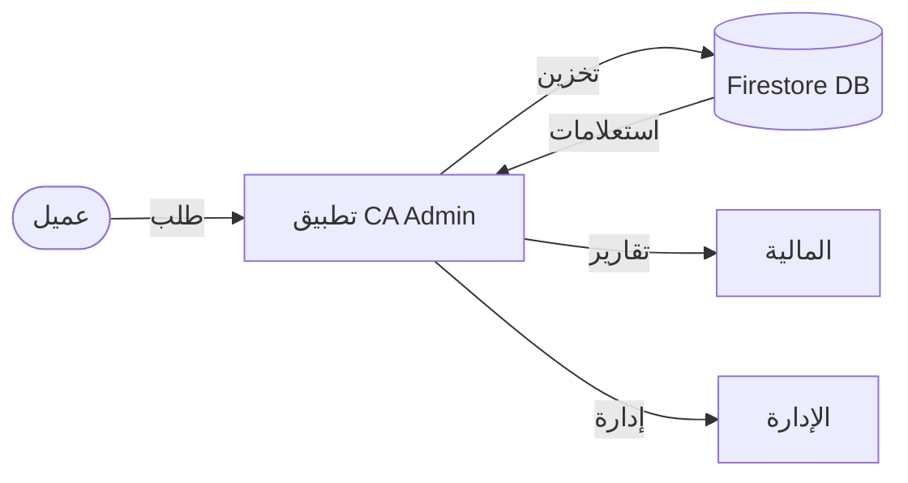
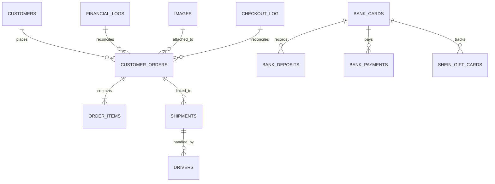

# 🗄️ Data Model / نموذج البيانات

> **Project:** CA Admin  
> **Version:** v0.1 — Owner: Abdullah Alshaif — Last Updated: YYYY-MM-DD

---

## 1. Introduction / المقدمة


**EN:**
The Data Model defines the entities, attributes, and relationships required to support the CA Admin system. It starts with a conceptual ERD and then maps into Firebase Firestore schema.

**AR:**
نموذج البيانات يعرّف الكيانات والخصائص والعلاقات المطلوبة لدعم نظام CA Admin. يبدأ بمخطط ERD تصوري ثم يتم تحويله إلى مخطط Firebase Firestore.

---

## 1.1 Visual Data Flow / التدفق البصري للبيانات



---

## 2. Conceptual ERD / المخطط التصوري للكيانات



**Entities / الكيانات:**

- **Customers / العملاء:** Customer info, contact details.
- **Customer Orders / طلبات العملاء:** Main orders linked to customers.
- **Order Items / عناصر الطلب:** Specific products (SKU, quantity, price).
- **Shipments / الشحنات:** Shipping records (status, date, driver).
- **Drivers / السائقون:** Couriers delivering shipments.
- **Financial Logs / السجلات المالية:** Global log of all financial activities.
- **Bank Cards / بطاقات البنك:** Cards used for payments/deposits.
- **Bank Deposits / Payments / الإيداعات والمدفوعات:** Incoming/outgoing transactions.
- **Shein Gift Cards / بطاقات هدايا شي إن:** Gift card usage & refunds.
- **Images / الصور:** Attachments (receipts, product images).
- **Checkout Log / سجل الإغلاق:** Closing summary for auditing.

---

---

---

## 3. Logical Data Model / النموذج المنطقي للبيانات

### Customers / العملاء

- `customerId` (string, unique)
- `name` (string)
- `phone` (string)
- `address` (string)
- `createdAt` (timestamp)

### Customer Orders / طلبات العملاء

- `orderId` (string, unique)
- `customerId` (ref → Customers)
- `orderNo` (string)
- `status` (enum: new, purchased, shipped, arrived, delivered)
- `totalSAR` (number)
- `exchangeRate` (number)
- `totalYER` (calc: totalSAR \* exchangeRate)
- `paid` (number)
- `remaining` (calc: totalYER - paid - cashOffice)
- `createdAt` (timestamp)

### Order Items / عناصر الطلب

- `itemId` (string)
- `orderId` (ref → Orders)
- `sku` (string)
- `productName` (string)
- `quantity` (int)
- `price` (number)
- `image` (string)

### Shipments / الشحنات

- `shipmentId` (string)
- `orderId` (ref → Orders)
- `status` (enum: in-transit, arrived-KSA, forwarded, arrived-Yemen, sorted, delivered)
- `driverId` (ref → Drivers)
- `boxes` (int)
- `createdAt` (timestamp)

### Drivers / السائقون

- `driverId` (string)
- `name` (string)
- `phone` (string)

### Financial Logs / السجلات المالية

- `logId` (string)
- `type` (enum: payment, deposit, deduction, refund)
- `amountUSD` (number)
- `currency` (string)
- `relatedId` (ref → Orders/BankCards/etc.)
- `createdAt` (timestamp)

### Bank Cards / بطاقات البنك

- `cardId` (string)
- `cardName` (string)
- `cardHolder` (string)
- `bankBalance` (number)

### Bank Deposits / الإيداعات البنكية

- `depositId` (string)
- `cardId` (ref → BankCards)
- `amount` (number)
- `createdAt` (timestamp)

### Bank Payments / المدفوعات البنكية

- `paymentId` (string)
- `cardId` (ref → BankCards)
- `paymentSource` (string)
- `amountPaid` (number)
- `createdAt` (timestamp)

### Shein Gift Cards / بطاقات هدايا شي إن

- `cardId` (string)
- `cardNumber` (string)
- `cardBalance` (number)
- `amountRefunded` (number)
- `giftCardDiscount` (number)

### Images / الصور

- `imageId` (string)
- `orderId` (ref → Orders)
- `url` (string)
- `type` (enum: product, receipt)

### Checkout Log / سجل الإغلاق

- `checkoutId` (string)
- `totalToPay` (number)
- `totalCash` (number)
- `remaining` (number)
- `note` (string)
- `createdAt` (timestamp)

---

## 4. Firestore Schema / مخطط Firestore

**Collections & Subcollections:**

```text
/customers/{customerId}
  name
  phone
  address
  createdAt
  /orders/{orderId}
    orderNo
    status
    totalSAR
    exchangeRate
    totalYER
    paid
    remaining
    createdAt
    /items/{itemId}
      sku
      productName
      quantity
      price
      image

/shipments/{shipmentId}
  orderId
  status
  driverId
  boxes
  createdAt

/drivers/{driverId}
  name
  phone

/financialLogs/{logId}
  type
  amountUSD
  relatedId
  createdAt

/bankCards/{cardId}
  cardName
  cardHolder
  bankBalance
  /deposits/{depositId}
    amount
    createdAt
  /payments/{paymentId}
    paymentSource
    amountPaid
    createdAt
  /giftCards/{giftCardId}
    cardNumber
    cardBalance
    amountRefunded
    giftCardDiscount

/images/{imageId}
  orderId
  url
  type

/checkoutLogs/{checkoutId}
  totalToPay
  totalCash
  remaining
  note
  createdAt
```

---

## 5. Indexes & Denormalization / الفهارس والتسوية

- The ERD shows conceptual relationships, while Firestore schema adapts them for NoSQL (denormalization & subcollections).
- Composite indexes are needed for queries like:
  - Orders by customer + status + date
  - Payments by card + date
- All changes must be reflected in [Indexes & Queries](../09-indexes-and-queries/09-indexes-and-queries.md).

---

## 6. Best Practices & FAQ / أفضل الممارسات وأسئلة شائعة

- Keep the data model updated as requirements evolve.
- Validate changes with both business and technical stakeholders.
- For complex queries, use denormalization and composite indexes.
- Use [Indexes & Queries](../09-indexes-and-queries/09-indexes-and-queries.md) for advanced search scenarios.

**Q: What is the difference between ERD and Firestore Schema?**

**A:**

- ERD shows conceptual relationships (like SQL), while Firestore schema adapts for NoSQL (denormalization, subcollections).
- Firestore is document-based, so some relations are embedded or split into subcollections for performance.

**Q: How do I add a new entity?**

**A:**

- Update the ERD diagram and entity list.
- Add the new collection/subcollection in the Firestore schema section.
- Review indexes and queries for new access patterns.

---

## 7. Example Scenario / سيناريو عملي

**EN:**

> Customer Ahmed places an order with 2 items. The system creates a new order, links items, and generates a shipment. Payment is logged, and all records are linked for easy tracking.

**AR:**

> يقوم العميل أحمد بإنشاء طلب يحتوي على منتجين. ينشئ النظام طلبًا جديدًا، ويربط العناصر، ويولّد شحنة. يتم تسجيل الدفعة، وترتبط جميع السجلات لتسهيل التتبع.

---

---
