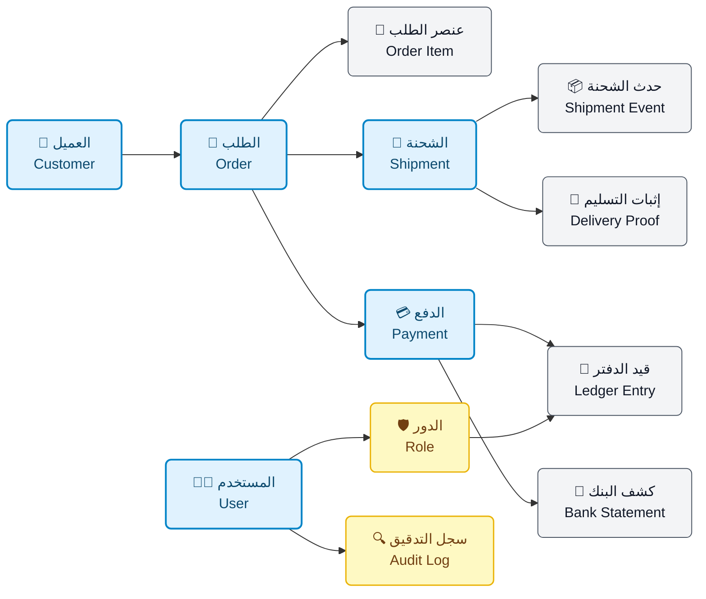
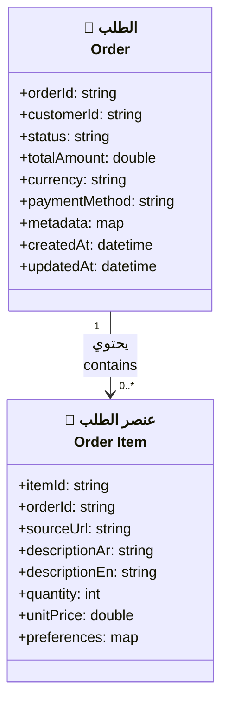
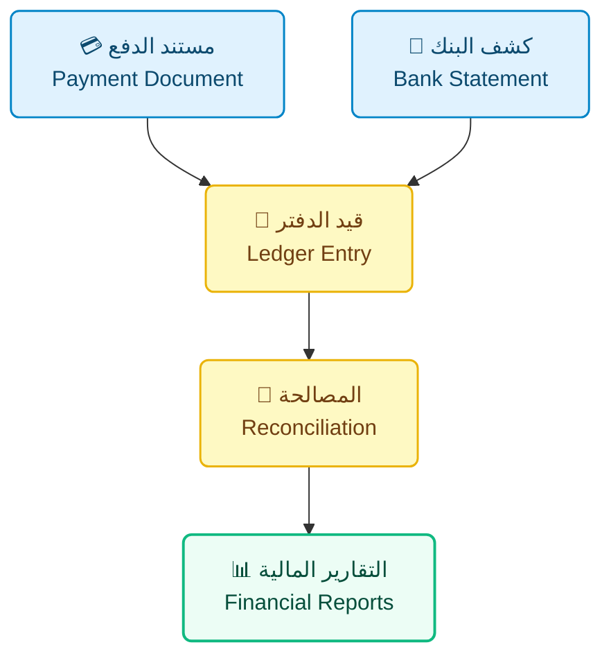

# 🧬 نموذج البيانات | Data Model

> **🧩 المنتج | Product**  
> منصة وساطة التسوق **CA Admin**  
> CA Admin Shopping Mediation Platform
>
> **📅 الإصدار | Version**  
> الإصدار **0.2** — آخر تحديث: **2025-09-21** — المالك: **عبدالله الشايف**  
> Version **0.2** — Last updated: **2025-09-21** — Owner: **Abdullah Alshaif**
>
> **🧰 التقنيات | Tech Stack**
>
> - Flutter
> - Firebase (Firestore, Auth, Storage, Functions)
>
> **🔗 مراجع مرتبطة | References**
>
> - `docs/01-vision/01-vision.md`
> - `docs/03-stories/03-stories.md`
> - `docs/10-nfr-and-quality/10-nfr-and-quality.md`

---

## 📌 نظرة سريعة | Quick Glance

- يربط هذا المرجع العمليات اليومية بطبقات البيانات لضمان الدقة وتفادي التعارض وتمكين التحليلات الفورية.  
  This reference links day-to-day operations to their data layers to guarantee accuracy, avoid conflicts, and enable real-time analytics.

---

## 🧭 1. نظرة عامة | Overview

- 📍 يغطي نطاق النموذج رحلة الطلب من استقبال العميل حتى المصالحة المالية النهائية مع تحديد نقاط التحكم الحرجة.
  📍 The model spans the order journey from customer intake to final financial reconciliation, highlighting critical control points.
- 🎯 يوضح الأهداف التشغيلية بتحويل سلوك الممثلين إلى عناصر بيانات قابلة للقياس ولوحات متابعة واضحة.
  🎯 It clarifies operational goals by translating actor behaviour into measurable data elements and actionable dashboards.
- 🧱 يوفر مخرجات قابلة للاستخدام في التحليل والتصميم والاختبارات مع سياق حوكمة مضبوط لكل جزء من النموذج.
  🧱 It delivers outputs ready for analysis, design, and testing with disciplined governance context for every model segment.

---

## 🗺️ 1.1 مخطط نظرة عامة على النظام | System Overview Diagram

- 🛰️ يوضح المخطط التالي الكيانات الأساسية وروابطها لضمان مصدر واحد للحقيقة عبر المنصة.
  🛰️ The diagram maps key entities and their connections to sustain a single source of truth across the platform.

> 🧠 **رؤية:** يضمن الربط بين الكيانات التشغيلية والمالية بقاء البيانات متزامنة مع كل تحديث.
> 🧠 **Insight:** Interconnecting operational and financial entities keeps data harmonised with every update.

## 🧩 1.2 مبادئ نموذج البيانات | Data Model Principles

- 🧠 يجمع كيانات العميل والطلب والشحن والمالية والأمان لتكوين رؤية شمولية قابلة للتوسع.
  🧠 It fuses customer, order, shipment, finance, and security entities to build a scalable, holistic perspective.
- 🔁 يربط الأنشطة اليومية بمصادر بيانات موثوقة ويمنع التكرار أو التضارب في السجلات الحساسة.
  🔁 It ties daily actions to trusted sources and removes duplication or conflict in sensitive records.
- 📊 يفصل بين بيانات التشغيل والتحليلات مما يجعل بناء مؤشرات الأداء عملية مباشرة وواضحة.
  📊 It separates operational data from analytics, making KPI construction straightforward and transparent.
- ⚙️ يراعي هيكلة Firestore والتقسيم والفهارس للحفاظ على الأداء وثبات زمن الاستجابة.
  ⚙️ It embeds Firestore structure, sharding, and indexing practices to preserve performance and response time stability.

---

## 🧑2. كيان العميل | Customer Entity

> 🪪 يلتقط هذا الكيان هوية العميل ووسائل التواصل وتهيئة التجارب الشخصية مع فهارس جاهزة للاستعلام السريع.
> 🪪 This entity captures customer identity, contact channels, and personalisation settings with indexes tuned for fast lookups.

## 👥 جدول تعريف العميل | Customer Definition Table

<table style="border-collapse: collapse; width: 100%; font-family: Tahoma, Arial, sans-serif; font-size: 14px;">
  <thead>
    <tr style="background-color:#f3f4f6; text-align:center;">
      <th style="padding: 8px; border: 1px solid #d1d5db;">🔑 الحقل / Field</th>
      <th style="padding: 8px; border: 1px solid #d1d5db;">🧾 النوع / Type</th>
      <th style="padding: 8px; border: 1px solid #d1d5db;">📖 الوصف / Description</th>
    </tr>
  </thead>
  <tbody>
    <tr style="background-color: #ffffff;">
      <td style="padding: 8px; border: 1px solid #d1d5db;"><b>🆔 customerId</b></td>
      <td style="padding: 8px; border: 1px solid #d1d5db;"><code>string</code></td>
      <td style="padding: 8px; border: 1px solid #d1d5db;">
        معرّف نصي يولَّد من النظام لضمان تتبع فريد لكل عميل. 
        System-generated string identifier that keeps customer tracking unique.
      </td>
    </tr>
    <tr style="background-color: #f9fafb;">
      <td style="padding: 8px; border: 1px solid #d1d5db;"><b>👤 fullName</b></td>
      <td style="padding: 8px; border: 1px solid #d1d5db;"><code>string (ar/en)</code></td>
      <td style="padding: 8px; border: 1px solid #d1d5db;">
        اسم ثنائي اللغة يحترم تفضيل العميل في العرض والتخاطب. 
        Bilingual full name preserving the customer’s preferred display.
      </td>
    </tr>
    <tr style="background-color: #ffffff;">
      <td style="padding: 8px; border: 1px solid #d1d5db;"><b>📱 phone</b></td>
      <td style="padding: 8px; border: 1px solid #d1d5db;"><code>string (E.164), verified</code></td>
      <td style="padding: 8px; border: 1px solid #d1d5db;">
        رقم تم التحقق منه يستخدم للمصادقة والتنبيهات الفورية وتأكيد التسليم. 
        Verified phone number used for authentication, instant alerts, and delivery confirmation.
      </td>
    </tr>
    <tr style="background-color: #f9fafb;">
      <td style="padding: 8px; border: 1px solid #d1d5db;"><b>🌍 preferredLocale</b></td>
      <td style="padding: 8px; border: 1px solid #d1d5db;"><code>string (ar/en)</code></td>
      <td style="padding: 8px; border: 1px solid #d1d5db;">
        رمز لغة (ar/en) يحدد رسائل القوالب والتنبيهات بواجهة صحيحة. 
        Locale flag (ar/en) guiding template rendering and notification language.
      </td>
    </tr>
    <tr style="background-color: #ffffff;">
      <td style="padding: 8px; border: 1px solid #d1d5db;"><b>🏅 loyaltyTier</b></td>
      <td style="padding: 8px; border: 1px solid #d1d5db;"><code>enum (Silver/Gold/Platinum)</code></td>
      <td style="padding: 8px; border: 1px solid #d1d5db;">
        طبقة الولاء (Silver/Gold/Platinum) التي تغذي الحوافز ومسارات الأولوية. 
        Loyalty tier (Silver/Gold/Platinum) powering incentives and priority routing.
      </td>
    </tr>
    <tr style="background-color: #f9fafb;">
      <td style="padding: 8px; border: 1px solid #d1d5db;"><b>🕒 createdAt</b></td>
      <td style="padding: 8px; border: 1px solid #d1d5db;"><code>datetime (ISO 8601)</code></td>
      <td style="padding: 8px; border: 1px solid #d1d5db;">
        طابع زمني معتمد لحساب عمر العميل وإعداد تقارير النمو. 
        Authoritative timestamp for lifetime metrics and growth reporting.
      </td>
    </tr>
  </tbody>
</table>

- 🔍 يضمن توحيد ملفات العملاء وجود تاريخ متسق عبر القنوات لدعم خدمة أسرع.
  🔍 Harmonised profiles deliver consistent cross-channel history, enabling faster service.
- ⚡ تدعم الفهارس المسبقة الاستعلام الفوري ما يخفض زمن الرد في سيناريوهات الدعم.
  ⚡ Pre-wired indexes power instant queries, reducing response time in support scenarios.

---

## 🧾 3. مخطط الطلب | Order Schema

> 🗃️ يفصل المخطط بين رأس الطلب وبنوده للحد من تعارض التعديلات وتحسين أداء Firestore في السيناريوهات المتزامنة.
> 🗃️ The schema separates order headers from line items to reduce edit collisions and improve Firestore performance under concurrency.

## 📦 جدول خصائص الطلب | Order Attributes Table

<table style="border-collapse: collapse; width: 100%; font-family: Tahoma, Arial, sans-serif; font-size: 14px;">
  <thead>
    <tr style="background-color:#f3f4f6; text-align:center;">
      <th style="padding:10px; border:1px solid #d1d5db;">🔑 الحقل / Field</th>
      <th style="padding:10px; border:1px solid #d1d5db;">📖 الوصف / Description</th>
    </tr>
  </thead>
  <tbody>
    <tr style="background-color:#ffffff;">
      <td style="padding:10px; border:1px solid #e5e7eb;"><b>🎯 status</b></td>
      <td style="padding:10px; border:1px solid #e5e7eb;">
        دورة حالة الطلب (جديد، قيد المراجعة، مكتمل) التي تدير مسارات العمل والتصعيد. 
        <i>Order lifecycle (New, Under Review, Completed) directing workflows and escalations.</i>
      </td>
    </tr>
    <tr style="background-color:#f9fafb;">
      <td style="padding:10px; border:1px solid #e5e7eb;"><b>🗂️ metadata</b></td>
      <td style="padding:10px; border:1px solid #e5e7eb;">
        تفاصيل إضافية مثل قناة الطلب والوسيط المرجعي لدعم التحليلات. 
        <i>Additional details such as intake channel and mediator reference supporting analytics.</i>
      </td>
    </tr>
    <tr style="background-color:#ffffff;">
      <td style="padding:10px; border:1px solid #e5e7eb;"><b>⚙️ preferences</b></td>
      <td style="padding:10px; border:1px solid #e5e7eb;">
        تفضيلات عنصرية (لون، مقاس، ملاحظات التعبئة) تمكّن التخصيص والأتمتة. 
        <i>Line-level preferences (colour, size, packing notes) enabling personalisation and automation.</i>
      </td>
    </tr>
  </tbody>
</table>

- 🧮 يسمح فصل الرأس بحساب الرسوم بشكل مستقل أثناء الاستقبال دون المساس بعناصر الطلب.
  🧮 Header separation allows fee aggregation during intake without touching line items.
- 🔄 يدعم تحديث البنود بصورة مستقلة مع الحفاظ على سلامة رأس الطلب وتقليل قفل السجلات.
  🔄 It supports independent line-item updates while keeping the header intact and reducing record locking.

---

## 🚚 4. سجل الشحن | Shipment Ledger

> 🛰️ يتابع هذا السجل مسار الشحنة والأحداث الزمنية وأدلة التسليم لتقديم رؤية فورية وتقليل النزاعات.  
> 🛰️ The ledger tracks shipment path, time-stamped events, and delivery artefacts to provide live visibility and lower disputes.

<table style="border-collapse: collapse; width: 100%; font-family: Tahoma, Arial, sans-serif; font-size: 14px;">
  <thead>
    <tr style="background-color:#f3f4f6; text-align:center;">
      <th style="padding:10px; border:1px solid #d1d5db;">📦 المكوّن / Component</th>
      <th style="padding:10px; border:1px solid #d1d5db;">📖 التفاصيل / Details</th>
    </tr>
  </thead>
  <tbody>
    <tr style="background-color:#ffffff;">
      <td style="padding:10px; border:1px solid #e5e7eb;"><b>🚚 shipments</b></td>
      <td style="padding:10px; border:1px solid #e5e7eb;">
        مجموعة رئيسية لكل شحنة تحتوي على الحالة وخيارات المسار الأولية. 
        <i>Root collection per shipment storing status and initial routing options.</i>
      </td>
    </tr>
    <tr style="background-color:#f9fafb;">
      <td style="padding:10px; border:1px solid #e5e7eb;"><b>⏱️ shipmentEvents</b></td>
      <td style="padding:10px; border:1px solid #e5e7eb;">
        سجل متسلسل للأحداث مع الطابع الزمني والموقع وهوية المسؤول عن الحدث. 
        <i>Time-series log capturing timestamp, location, and handler for each checkpoint.</i>
      </td>
    </tr>
    <tr style="background-color:#ffffff;">
      <td style="padding:10px; border:1px solid #e5e7eb;"><b>📑 deliveryProof</b></td>
      <td style="padding:10px; border:1px solid #e5e7eb;">
        حافظة لمرفقات الصور والتوقيع في مساحة تخزين مؤمنة ومحددة الصلاحيات. 
        <i>Repository for image and signature attachments stored in a controlled bucket.</i>
      </td>
    </tr>
  </tbody>
</table>

- 🧾 يعتمد نمط الإضافة فقط للحفاظ على سلسلة تدقيق غير قابلة للعبث وتبسيط التحقيقات.
  🧾 Uses an append-only pattern to maintain an untampered audit chain and simplify investigations.
- 📍 يتيح تحليلات مكانية دقيقة وتقارير الميل الأخير لدعم التخطيط اللوجستي.
  📍 Enables granular geospatial analytics and last-mile reporting to support logistics planning.

---

## 💳 5. دفتر المالية | Financial Ledger

> 💼 يوحد هذا الجزء مستندات الدفع والقيود المحاسبية وكشوف البنك لأتمتة المصالحة وإنتاج التقارير الدقيقة.
> 💼 This section unifies payment documents, ledger entries, and bank statements to automate reconciliation and deliver accurate reporting.

<h3>🧾 المكونات المالية | Financial Components</h3>

<table style="border-collapse: collapse; width: 100%; font-family: Tahoma, Arial, sans-serif; font-size: 14px;">
  <thead>
    <tr style="background-color:#f3f4f6; text-align:center;">
      <th style="padding:10px; border:1px solid #d1d5db;">🧩 العنصر / Element</th>
      <th style="padding:10px; border:1px solid #d1d5db;">📖 الملاحظات / Notes</th>
    </tr>
  </thead>
  <tbody>
    <tr style="background-color:#ffffff;">
      <td style="padding:10px; border:1px solid #e5e7eb; text-align:center;"><b>📑 paymentDoc</b></td>
      <td style="padding:10px; border:1px solid #e5e7eb;">
        يخزن القناة والعملة والمرجع الموحد لكل طلب لدعم التتبع المالي. 
        <i>Stores channel, currency, and unified reference per order to support financial traceability.</i>
      </td>
    </tr>
    <tr style="background-color:#f9fafb;">
      <td style="padding:10px; border:1px solid #e5e7eb; text-align:center;"><b>📒 ledgerEntry</b></td>
      <td style="padding:10px; border:1px solid #e5e7eb;">
        يجمع الحركات المالية تحت معرف واحد لإطلاق قواعد المطابقة الآلية. 
        <i>Aggregates financial movements under one id to trigger automated matching rules.</i>
      </td>
    </tr>
    <tr style="background-color:#ffffff;">
      <td style="padding:10px; border:1px solid #e5e7eb; text-align:center;"><b>🔄 reconciliation</b></td>
      <td style="padding:10px; border:1px solid #e5e7eb;">
        ينتج حالات المصالحة (متطابق، جزئي، مفقود) مع روابط لمهام المتابعة. 
        <i>Outputs reconciliation statuses (Matched, Partial, Missing) with links to follow-up tasks.</i>
      </td>
    </tr>
  </tbody>
</table>

### 📌 ملاحظات إضافية | Additional Notes

- 🔒 يمنع حذف أو تعديل المدفوعات المرتبطة دون صلاحيات موثقة، ما يحمي السجلات.  
  🔒 Blocks deletion or editing of linked payments without documented elevated privileges, protecting records.

- 📈 يقلل العمل اليدوي ويعزز ثقة المدققين والمستثمرين في البيانات المالية المنشورة.  
  📈 Cuts manual workload and raises auditor and investor confidence in published financials.

---

## 🛡️ 6. مخطط الأمان | Security Schema

> 🧷 يحدد هذا المخطط صلاحيات الوصول وسجل التغييرات لتطبيق تحكم RBAC وتسريع التحقيقات متى ظهرت مخالفات.  
> 🧷 The schema defines access permissions and change history to enforce RBAC and accelerate investigations whenever anomalies surface.

<table style="border-collapse: collapse; width: 100%; font-family: Tahoma, Arial, sans-serif; font-size: 14px;">
  <thead>
    <tr style="background-color:#f3f4f6; text-align:center;">
      <th style="padding:10px; border:1px solid #d1d5db;">🧩 المكوّن / Component</th>
      <th style="padding:10px; border:1px solid #d1d5db;">📖 الوصف / Description</th>
      <th style="padding:10px; border:1px solid #d1d5db;">🎯 الفائدة / Benefit</th>
    </tr>
  </thead>
  <tbody>
    <tr style="background-color:#ffffff;">
      <td style="padding:10px; border:1px solid #e5e7eb; text-align:center;"><b>👥 userRoles</b></td>
      <td style="padding:10px; border:1px solid #e5e7eb;">
        مجموعة تحدد الأدوار المعتمدة وسياسات الوصول المرتبطة بها للمراجعة الدورية. 
        <i>Collection listing approved roles and their access policies for periodic review.</i>
      </td>
      <td style="padding:10px; border:1px solid #e5e7eb;">
        تضمن تطبيق RBAC بدقة وتبقي صلاحيات المستخدمين تحت المراقبة. 
        <i>Ensures precise RBAC enforcement and keeps user privileges under watch.</i>
      </td>
    </tr>
    <tr style="background-color:#f9fafb;">
      <td style="padding:10px; border:1px solid #e5e7eb; text-align:center;"><b>🔍 auditLogs</b></td>
      <td style="padding:10px; border:1px solid #e5e7eb;">
        سجل مركزي يوضح من غيّر ماذا ومتى مع تتبع المصدر والجلسة. 
        <i>Central log capturing who changed what and when, including origin and session.</i>
      </td>
      <td style="padding:10px; border:1px solid #e5e7eb;">
        يوفّر سلسلة تدقيق مكتملة ويكشف الأنماط غير المعتادة بسرعة. 
        <i>Provides a complete audit trail and surfaces unusual patterns quickly.</i>
      </td>
    </tr>
    <tr style="background-color:#ffffff;">
      <td style="padding:10px; border:1px solid #e5e7eb; text-align:center;"><b>🗂️ policySnapshots</b></td>
      <td style="padding:10px; border:1px solid #e5e7eb;">
        أرشيف لحالات السياسة السابقة لدعم المقارنة والاسترجاع الآمن عند الحاجة. 
        <i>Archive of prior policy states enabling comparison and safe rollback when required.</i>
      </td>
      <td style="padding:10px; border:1px solid #e5e7eb;">
        يقلل انجراف الصلاحيات ويحافظ على الامتثال التنظيمي المستمر. 
        <i>Reduces privilege drift and sustains continuous regulatory compliance.</i>
      </td>
    </tr>
  </tbody>
</table>

### 📝 ملاحظات أمان إضافية | Additional Security Notes

- 🧪 يدعم دمج أدوات المراقبة الخارجية عبر أحداث webhook موحدة لكل تغيير حساس.  
  🧪 Supports integration with external monitoring tools through unified webhook events for each sensitive change.

- 🕒 يضمن حفظ السجلات لمدة **400 يوم** لتلبية متطلبات التدقيق الداخلية والخارجية.  
  🕒 Guarantees record retention for **400 days** to satisfy internal and external audit expectations.

---

## ⚙️ 7. اعتبارات الأداء | Performance Considerations

1. 🌍 **التقسيم الإقليمي | Regional Sharding**

   - يعتمد التقسيم الإقليمي (السعودية/ اليمن) لتقليل النقاط الساخنة في Firestore وتوزيع الحمل.
   - Uses regional sharding (KSA/Yemen) to minimise Firestore hotspots and balance load.

2. 📈 **مراقبة الحصص | Write Quotas Monitoring**

   - يراقب حصص الكتابة وتدوير المعرّفات للحفاظ على ثبات الإنتاجية مع نمو الطلبات.
   - Monitors write quotas and id rotation to keep throughput stable as orders scale.

3. 📦 **التخزين المؤقت | Local Caching**

   - يفعّل التخزين المؤقت المحلي عبر IndexedDB لدعم العمل دون اتصال وخفض زمن القراءة.
   - Enables local caching through IndexedDB to support offline work and reduce read latency.

4. 🔄 **المزامنة التدريجية | Progressive Sync**
   - يستخدم مزامنة تدريجية بطوابير خلفية لمنع تضارب البيانات بعد استعادة الاتصال.
   - Employs progressive sync with background queues to prevent data clashes after reconnecting.

---

## 📅 8. خطة الحوكمة | Governance Plan

1. 🧑‍💼 **المراجعة الدورية | Periodic Review**

   - يعقد مراجعة نصف سنوية للنموذج مع فرق المنتج والبيانات والهندسة لضبطه وفق التوسع.
   - Conducts a semi-annual model review with product, data, and engineering teams to align with expansion.

2. 📊 **مراقبة جودة البيانات | Data Quality Monitoring**

   - تنبّه لوحات جودة البيانات إلى القيم الفارغة أو الشاذة قبل أن تؤثر على العملاء أو التقارير.
   - Data quality dashboards alert on null or anomalous values before they impact customers or reports.

3. 📘 **تحديث كتيبات التشغيل | Runbook Updates**

   - تحدّث كتيبات التشغيل فور أي تغيير في المخطط مع تسجيل الأثر والجهة المالكة.
   - Operational runbooks are refreshed immediately after schema changes with impact logs and owners.

4. 🛡️ **الامتثال والسياسات | Compliance Alignment**
   - تضمن مواءمة دورية مع سياسات الأمان والمالية للحفاظ على الثقة التنظيمية.
   - Performs periodic alignment with security and finance policies to preserve regulatory trust.

---

> 🧭 **تذكير تنفيذي | Executive Reminder**  
> حافظ على هذا النموذج كمرجع حي يُحدّث مع كل تغيير تشغيلي أو تنظيمي لضمان جودة البيانات.  
> Treat this model as a living reference and update it alongside every operational or regulatory change to sustain data quality.
