# 🗄️ Data Model / نموذج البيانات

> **Project:** CA Admin  
> **Version:** v0.1 — Owner: Abdullah Alshaif — Last Updated: YYYY-MM-DD

---

## 1. Introduction / المقدمة


**EN:**
The Data Model defines the entities, attributes, and relationships required to support the CA Admin system. It starts with a conceptual ERD and then maps into Firebase Firestore schema.

**AR:**
نموذج البيانات يعرّف الكيانات والخصائص والعلاقات المطلوبة لدعم نظام CA Admin. يبدأ بمخطط ERD تصوري ثم يتم تحويله إلى مخطط Firebase Firestore.

---

## 1.1 Visual Data Flow / التدفق البصري للبيانات

```mermaid
flowchart LR
  A([عميل]) -->|طلب| B[تطبيق CA Admin]
  B -->|تخزين| C[(Firestore DB)]
  B -->|تقارير| D[المالية]
  B -->|إدارة| E[الإدارة]
  C -->|استعلامات| B
```



---

## 2. Conceptual ERD / المخطط التصوري للكيانات


**Entities / الكيانات:**

- **Customers / العملاء:** Customer info, contact details.
- **Customer Orders / طلبات العملاء:** Main orders linked to customers.
- **Order Items / عناصر الطلب:** Specific products (SKU, quantity, price).
- **Shipments / الشحنات:** Shipping records (status, date, driver).
- **Drivers / السائقون:** Couriers delivering shipments.
- **Financial Logs / السجلات المالية:** Global log of all financial activities.
- **Bank Cards / بطاقات البنك:** Cards used for payments/deposits.
- **Bank Deposits / Payments / الإيداعات والمدفوعات:** Incoming/outgoing transactions.
- **Shein Gift Cards / بطاقات هدايا شي إن:** Gift card usage & refunds.
- **Images / الصور:** Attachments (receipts, product images).
- **Checkout Log / سجل الإغلاق:** Closing summary for auditing.

---

---

---

## 3. Logical Data Model / النموذج المنطقي للبيانات

### Customers / العملاء

- `customerId` (string, unique)
- `name` (string)
- `phone` (string)
- `address` (string)
- `createdAt` (timestamp)

### Customer Orders / طلبات العملاء

- `orderId` (string, unique)
- `customerId` (ref → Customers)
- `orderNo` (string)
- `status` (enum: new, purchased, shipped, arrived, delivered)
- `totalSAR` (number)
- `exchangeRate` (number)
- `totalYER` (calc: totalSAR \* exchangeRate)
- `paid` (number)
- `remaining` (calc: totalYER - paid - cashOffice)
- `createdAt` (timestamp)

### Order Items / عناصر الطلب

- `itemId` (string)
- `orderId` (ref → Orders)
- `sku` (string)
- `productName` (string)
- `quantity` (int)
- `price` (number)
- `image` (string)

### Shipments / الشحنات

- `shipmentId` (string)
- `orderId` (ref → Orders)
- `status` (enum: in-transit, arrived-KSA, forwarded, arrived-Yemen, sorted, delivered)
- `driverId` (ref → Drivers)
- `boxes` (int)
- `createdAt` (timestamp)

### Drivers / السائقون

- `driverId` (string)
- `name` (string)
- `phone` (string)

### Financial Logs / السجلات المالية

- `logId` (string)
- `type` (enum: payment, deposit, deduction, refund)
- `amountUSD` (number)
- `currency` (string)
- `relatedId` (ref → Orders/BankCards/etc.)
- `createdAt` (timestamp)

### Bank Cards / بطاقات البنك

- `cardId` (string)
- `cardName` (string)
- `cardHolder` (string)
- `bankBalance` (number)

### Bank Deposits / الإيداعات البنكية

- `depositId` (string)
- `cardId` (ref → BankCards)
- `amount` (number)
- `createdAt` (timestamp)

### Bank Payments / المدفوعات البنكية

- `paymentId` (string)
- `cardId` (ref → BankCards)
- `paymentSource` (string)
- `amountPaid` (number)
- `createdAt` (timestamp)

### Shein Gift Cards / بطاقات هدايا شي إن

- `cardId` (string)
- `cardNumber` (string)
- `cardBalance` (number)
- `amountRefunded` (number)
- `giftCardDiscount` (number)

### Images / الصور

- `imageId` (string)
- `orderId` (ref → Orders)
- `url` (string)
- `type` (enum: product, receipt)

### Checkout Log / سجل الإغلاق

- `checkoutId` (string)
- `totalToPay` (number)
- `totalCash` (number)
- `remaining` (number)
- `note` (string)
- `createdAt` (timestamp)

---

## 4. Firestore Schema / مخطط Firestore

**Collections & Subcollections:**

```text
/customers/{customerId}
  name
  phone
  address
  createdAt
  /orders/{orderId}
    orderNo
    status
    totalSAR
    exchangeRate
    totalYER
    paid
    remaining
    createdAt
    enteredByStaffId (ref → customerServiceStaff)
    processedByProcessorId (ref → orderProcessor)
    /items/{itemId}
      sku
      productName
      quantity
      price
      image

/customerServiceStaff/{staffId}
  name
  role
  createdAt

/orderProcessor/{processorId}
  name
  role
  createdAt

/shipments/{shipmentId}
  orderId
  status
  driverId
  boxes
  createdAt

/drivers/{driverId}
  name
  phone

/financialLogs/{logId}
  type
  amountUSD
  relatedId
  createdAt

/bankCards/{cardId}
  cardName
  cardHolder
  bankBalance
  /deposits/{depositId}
    amount
    createdAt
  /payments/{paymentId}
    paymentSource
    amountPaid
    createdAt
  /giftCards/{giftCardId}
    cardNumber
    cardBalance
    amountRefunded
    giftCardDiscount

/images/{imageId}
  orderId
  url
  type

/checkoutLogs/{checkoutId}
  totalToPay
  totalCash
  remaining
  note
  createdAt
```

---

## 5. Indexes & Denormalization / الفهارس والتسوية

- The ERD shows conceptual relationships, while Firestore schema adapts them for NoSQL (denormalization & subcollections).
- Composite indexes are needed for queries like:
  - Orders by customer + status + date
  - Payments by card + date
- All changes must be reflected in [Indexes & Queries](../09-indexes-and-queries/09-indexes-and-queries.md).

---

## 6. Best Practices & FAQ / أفضل الممارسات وأسئلة شائعة

- Keep the data model updated as requirements evolve.
- Validate changes with both business and technical stakeholders.
- For complex queries, use denormalization and composite indexes.
- Use [Indexes & Queries](../09-indexes-and-queries/09-indexes-and-queries.md) for advanced search scenarios.

**Q: What is the difference between ERD and Firestore Schema?**

**A:**

- ERD shows conceptual relationships (like SQL), while Firestore schema adapts for NoSQL (denormalization, subcollections).
- Firestore is document-based, so some relations are embedded or split into subcollections for performance.

**Q: How do I add a new entity?**

**A:**

- Update the ERD diagram and entity list.
- Add the new collection/subcollection in the Firestore schema section.
- Review indexes and queries for new access patterns.

---

## 7. Example Scenario / سيناريو عملي

**EN:**

> Customer Ahmed contacts Customer Service Staff Layla, who enters his order with 2 items. Order Processor Omar reviews, splits, and processes the order, creates invoices and tracking, and links all records for easy tracking. Payment is logged and all actions are auditable.

**AR:**

> يتواصل العميل أحمد مع موظفة خدمة العملاء ليلى، التي تدخل طلبه المكون من منتجين. يقوم منفذ الطلبات عمر بمراجعة الطلب وتقسيمه وتنفيذه، وينشئ الفواتير وحالات التتبع ويربط جميع السجلات لتسهيل التتبع. يتم تسجيل الدفعة وجميع العمليات قابلة للمراجعة.

---

## 8. Future Staff Expansion / التوسع المستقبلي للموظفين

**EN:**
The data model is designed to support future staff types (e.g., Quality Assurance, Logistics Coordinator) by adding new entities and linking them to orders, shipments, or other business objects. This ensures scalability and modularity as the business grows.

**AR:**
تم تصميم نموذج البيانات لدعم أنواع موظفين جديدة مستقبلاً (مثل موظف الجودة، منسق اللوجستيات) عبر إضافة كيانات وربطها بالطلبات أو الشحنات أو عناصر العمل الأخرى، لضمان قابلية التوسع والمرونة مع نمو العمل.

---

---

### Customer Service Staff / موظفو خدمة العملاء

- `staffId` (string, unique)
- `name` (string)
- `role` (enum: customer_service)
- `createdAt` (timestamp)

### Order Processor / منفذ الطلبات

- `processorId` (string, unique)
- `name` (string)
- `role` (enum: order_processor)
- `createdAt` (timestamp)
