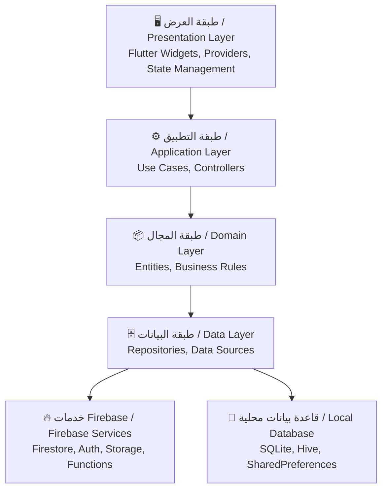
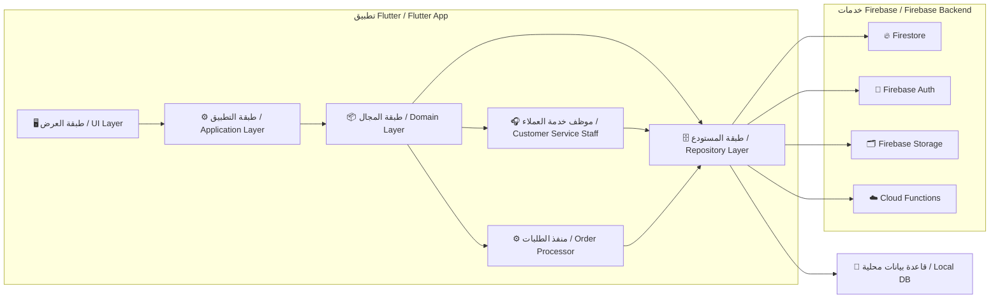

# 🏗️ بنية النظام

System Architecture

---

> **المشروع:** CA Admin  
> **Project:** CA Admin  
> **الإصدار:** v0.1 — المالك: عبدالله الشائف  
> **Version:** v0.1 — Owner: Abdullah Alshaif  
> **آخر تحديث:** 2025-09-08  
> **Last Updated:** 2025-09-08

**شرح مختصر:**
توضح هذه الوثيقة كيف تم بناء النظام لضمان التوسع، سهولة الاختبار، ودعم العمل دون إنترنت.

**Summary:**
This document explains how the system is built for scalability, testability, and offline-first support.

---

## 1. المقدمة

Introduction

النظام يعتمد على نمط التصميم Clean Architecture لسهولة التوسع والصيانة، ويربط بين Flutter (العميل) وFirebase (قاعدة البيانات، التوثيق، التخزين، الوظائف السحابية)، ويعمل دون إنترنت أولاً.

The system uses Clean Architecture for easy scaling and maintenance, connects Flutter (client) with Firebase (database, auth, storage, cloud functions), and is designed offline-first.

---

## 2. طبقات Clean Architecture

Clean Architecture Layers

**شرح مختصر:**
يوضح المخطط كيف تنتقل البيانات بين الطبقات من واجهة المستخدم حتى قواعد البيانات.

**Summary:**
The diagram shows how data flows between layers from UI to databases.

- **طبقة العرض (UI):** عناصر Flutter، دعم اللغتين، إدارة الحالة.
- **Presentation Layer (UI):** Flutter widgets, bilingual support, state management.
- **طبقة التطبيق:** حالات الاستخدام، منطق الأعمال، وحدات التحكم.
- **Application Layer:** Use cases, business logic, controllers.
- **طبقة المجال:** الكيانات والقواعد المستقلة عن التقنية.
- **Domain Layer:** Entities and rules independent of technology.
- **طبقة البيانات:** مستودعات البيانات، مصادر البيانات، خدمة المزامنة.
- **Data Layer:** Data repositories, sources, sync service.

---

## 3. خدمات Firebase

Firebase Services

- **Firestore:** قاعدة البيانات الرئيسية للعملاء، الطلبات، الشحنات، المالية.
- **Firestore:** Main database for customers, orders, shipments, finance.
- **Auth:** توثيق المستخدمين حسب الدور (مدير، مالي، موظف، سائق، عميل).
- **Auth:** Role-based authentication (Admin, Finance, Staff, Driver, Customer).
- **Storage:** تخزين الإيصالات، صور المنتجات، المرفقات.
- **Storage:** Store receipts, product images, attachments.
- **Cloud Functions:**
  - تعيين صلاحيات مخصصة (RBAC)
  - جدولة مهام (تقارير أسبوعية، تنظيف، إشعارات)
- **Cloud Functions:**
  - Assign Custom Claims for RBAC
  - Run scheduled jobs (weekly reports, cleanup, notifications)
- **Firebase Emulator Suite:** اختبار محلي لقاعدة البيانات والتوثيق والوظائف.
- **Firebase Emulator Suite:** Local testing of Firestore, Auth, Functions.

---

## 4. إستراتيجية المزامنة دون إنترنت

Offline-First Sync Strategy

- التخزين المحلي يحفظ عمليات المستخدم (طلبات، دفعات، تحديثات) عند انقطاع الإنترنت.
- Local cache stores user actions (orders, payments, updates) when offline.
- خدمة المزامنة ترسل العمليات إلى Firestore عند عودة الاتصال.
- A Sync Service pushes queued actions to Firestore once online.
- معالجة التعارض: آخر تعديل هو الفائز + سجل تدقيق للتتبع.
- Conflict resolution: last-write-wins + audit log for traceability.

---

## 5. قرارات التصميم

Architecture Decision Records (ADRs)

| ADR ID | القرار                                     | التبرير                          | الحالة   |
| ------ | ------------------------------------------ | -------------------------------- | -------- |
| ADR-01 | استخدام Firestore كقاعدة بيانات رئيسية     | مزامنة لحظية، قابلية التوسع      | مقبول    |
| ADR-01 | Use Firestore as main DB                   | Real-time sync, scalability      | Accepted |
| ADR-02 | تطبيق العمل دون إنترنت بقاعدة بيانات محلية | الإنترنت غير مستقر في اليمن      | مقبول    |
| ADR-02 | Implement Offline-first with local DB      | Internet is unreliable in Yemen  | Accepted |
| ADR-03 | اعتماد Clean Architecture                  | فصل الاهتمامات، قابلية الاختبار  | مقبول    |
| ADR-03 | Use Clean Architecture                     | Separation of concerns, testable | Accepted |
| ADR-04 | إدارة الحالة بـ Riverpod                   | البساطة والأداء                  | مقترح    |
| ADR-04 | State Management: Riverpod                 | Simplicity, performance          | Proposed |
| ADR-05 | التوثيق بصلاحيات مخصصة                     | التحكم في الوصول حسب الدور       | مقبول    |
| ADR-05 | Auth with Custom Claims                    | Role-based access control        | Accepted |

---

## 6. المخطط العام

High-Level Architecture Diagram

**شرح مختصر:**
يوضح المخطط كيف تتكامل طبقات التطبيق مع خدمات Firebase وقاعدة البيانات المحلية.

**Summary:**
The diagram shows how app layers integrate with Firebase services and local DB.

---

## 7. ملاحظات

Notes

- يدعم التصميم التوسع وإضافة ميزات جديدة دون التأثير على النظام الحالي.
- Architecture supports scalability and adding new features without breaking existing ones.
- الفصل بين الطبقات يسمح بتطوير متوازي بين فرق الواجهة والخلفية والمالية.
- Layer separation enables parallel development for UI, backend, and finance teams.
- يجب تحديث قرارات التصميم عند اتخاذ أي قرار معماري كبير.
- ADRs must be updated whenever a major architectural decision is made.
- المزامنة دون إنترنت ضرورية للمناطق ذات الاتصال غير المستقر.
- Offline-first sync is critical for regions with unreliable internet.
- تم نمذجة أدوار موظف خدمة العملاء ومنفذ الطلبات بشكل صريح في طبقات المجال والبيانات.
- Roles for Customer Service Staff and Order Processor are explicitly modeled in domain and data layers for clarity and future expansion.

---
