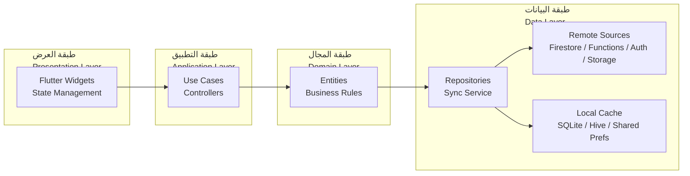
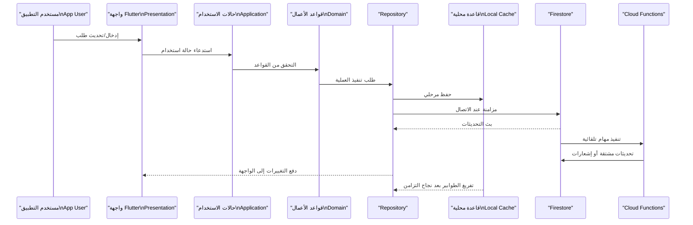
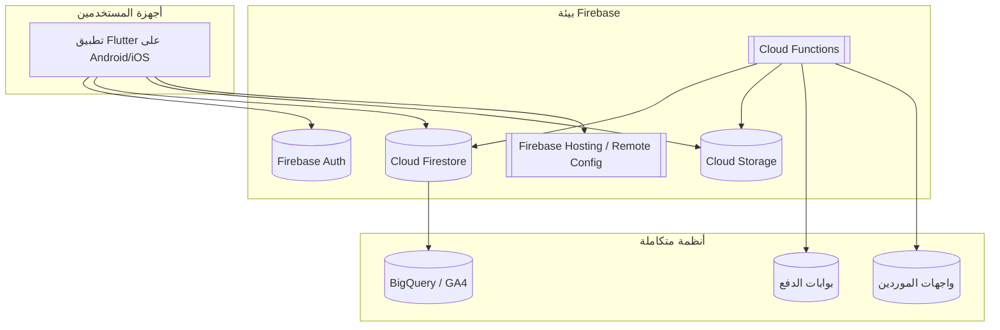

# 🏗️ بنية النظام | System Architecture

> 🏷️ **النظام / Product**
> منصة CA Admin لإدارة الوساطة الشرائية
>
> 🗓️ **الإصدار / Version**
> v0.1 — آخر تحديث 2025-09-08 بواسطة Abdullah Alshaif
>
> 🏗️ **الهدف المعماري / Architectural Goal**
> منصة قابلة للتوسع، قابلة للاختبار، تدعم العمل دون اتصال
>
> 🧰 **التقنية الرئيسة / Core Stack**
> Flutter (Mobile) + Firebase (Firestore, Auth, Storage, Cloud Functions) + Local Cache
>
> 📚 **وثائق مرتبطة / Related Docs** > `docs/01-vision/01-vision.md`, `docs/05-data-model/05-data-model.md`, `docs/10-nfr-and-quality/10-nfr-and-quality.md`

---

> 🧭 **لماذا تقرأ هذا المستند؟ | Why read this document?**
>
> - يشرح تطبيق مبادئ Clean Architecture لضمان فصل المسؤوليات وتطوير ميزات جديدة بثقة.
> - يوضح كيف تتكامل Flutter مع Firebase والذاكرة المحلية لتقديم تجربة سلسة حتى في الاتصال الضعيف.

---

## 1. مقدمة | Introduction

- 🧱 **ما الذي نبنيه؟ | What we build** — تطبيق Flutter (Android/iOS) يعمل بواجهات ثنائية اللغة ويتصل بخدمات Firebase مع تخزين محلي احتياطي.
- 🔁 **كيف نحافظ على المرونة؟ | How we stay adaptable** — اعتماد طبقات عرض/تطبيق/مجال/بيانات يقلل الترابط ويتيح الاختبار الآلي لكل وحدة.
- 👥 **من المستفيد؟ | Who benefits** — فرق العمليات، المالية، وخدمة العملاء يحصلون على خدمات مستقرة يمكن تطويرها بالتوازي مع بقاء تجربة العميل موحدة.

---

## 2. مبادئ التصميم | Core Design Principles

| الرمز | المبدأ / Principle                    | الوصف المختصر / Description                                            | الفائدة / Benefit                                     |
| ----- | ------------------------------------- | ---------------------------------------------------------------------- | ----------------------------------------------------- |
| 🧱    | طبقات نظيفة / Clean Layers            | Presentation → Application → Domain → Data بتدفق اعتماديات للداخل فقط. | يسهل استبدال أو تحديث أي طبقة دون تأثير جانبي كبير.   |
| 🌐    | دون اتصال أولاً / Offline First       | تخزين محلي (SQLite/Hive) مع مزامنة تدريجية نحو Firestore.              | استمرار معالجة الطلبات في المناطق ذات الاتصال الضعيف. |
| 🔐    | أمان قائم على الأدوار / RBAC Security | إدارة الصلاحيات عبر Firebase Auth + قواعد Firestore + وظائف سحابية.    | حماية البيانات الحساسة وتحديد الوصول بدقة.            |
| 📊    | قابلية الرصد / Observability          | سجلات مركزية وCloud Functions منظمة حسب المجال.                        | التعافي السريع من الأعطال ومتابعة مؤشرات الأداء.      |
| 🤝    | عقود واضحة / Explicit Contracts       | مستودعات وDTOs معرفة مسبقاً لكل تفاعل.                                 | يقلل التعارض بين فرق التطوير ويضمن اتساق البيانات.    |

---

## 3. منظور الطبقات | Layered View

- **طبقة العرض / Presentation:** Widgets، إدارة الحالة، التنقل، دعم العربية والإنجليزية.
- **طبقة التطبيق / Application:** حالات الاستخدام، orchestrators، معالجة أخطاء الواجهة.
- **طبقة المجال / Domain:** كيانات الطلب، الشحن، المالية، قواعد الأعمال المشتركة.
- **طبقة البيانات / Data:** مستودعات، طبقة مزامنة، موصلات إلى Firestore والتخزين المحلي.

---

## 4. خدمات Firebase والتكامل | Firebase Services & Integration

| الخدمة / Service        | الاستخدام الوظيفي                                                            | ضوابط الأمان                            | القيمة للمستخدم                            |
| ----------------------- | ---------------------------------------------------------------------------- | --------------------------------------- | ------------------------------------------ |
| Firestore               | قاعدة البيانات الرئيسة للطلبات، الشحنات، الفواتير، وسجلات المستودع.          | قواعد أمان حسب الدور + تدقيق زمني.      | بيانات لحظية وسجل تاريخي موحد.             |
| Firebase Auth           | إدارة تسجيل الدخول وتعيين الأدوار (Admin, Finance, Staff, Driver, Customer). | Claims مخصصة + قياسات فشل تسجيل الدخول. | تجربة دخول موحدة وآمنة.                    |
| Cloud Storage           | حفظ المرفقات (صور المنتجات، الفواتير، إثبات التسليم).                        | مسارات معزولة وتشفير على الخادم.        | مرجع مركزي للمستندات المهمة.               |
| Cloud Functions         | التسعير، إشعارات SLA، التحقق من الصلاحيات، تكاملات الدفع والموردين.          | مصادقة خدمة، سجلات مركزية، مراقبة نشر.  | منطق موحد يقلل الحمل على العميل.           |
| Remote Config & Hosting | نشر لوحة الإدارة وتفعيل الميزات عن بعد.                                      | حماية عبر Auth ومراجعة التغييرات.       | تحديثات سريعة بلا إعادة نشر لتطبيق الهاتف. |

> ⚙️ **قاعدة تشغيلية:** كل نقطة تكامل جديدة تُوثَّق في ADR ويُضاف لها اختبار وحدة أو تكامل قبل النشر.

---

## 5. استراتيجية العمل دون اتصال | Offline-First Strategy

| البند         | الشرح المختصر                                                 | الفائدة                                    |
| ------------- | ------------------------------------------------------------- | ------------------------------------------ |
| تخزين مرحلي   | تخزين كل عملية في قاعدة محلية قبل الرفع السحابي.              | حماية بيانات العميل عند انقطاع الشبكة.     |
| طوابير مزامنة | جدولة المهام لإعادة الإرسال مع كشف التضارب عبر الطابع الزمني. | يقلل فقدان المعاملات ويضمن تتابعاً واضحاً. |
| معالجات أخطاء | إعادة المحاولة المتدرجة + تنبيهات للمشغل عند تجاوز حد معين.   | تنبيه مبكر للفِرَق لضمان خدمة مستقرة.      |

---

## 6. سجلات قرارات معمارية | Architecture Decision Records

| ADR ID | القرار / Decision                       | المبرر / Justification              | الحالة / Status  |
| ------ | --------------------------------------- | ----------------------------------- | ---------------- |
| ADR-01 | استخدام Firestore كمخزن بيانات أساسي.   | مزامنة لحظية ودعم استعلامات مرنة.   | معتمد / Accepted |
| ADR-02 | اعتماد Flutter كتطبيق موحد للهواتف.     | قاعدة كود واحدة ودعم لغتين.         | معتمد / Accepted |
| ADR-03 | تطبيق Clean Architecture كامل الطبقات.  | سهولة الاختبار وإعادة الاستخدام.    | معتمد / Accepted |
| ADR-04 | اختيار Riverpod لإدارة الحالة.          | وضوح تدفق البيانات وسهولة الاختبار. | مقترح / Proposed |
| ADR-05 | تنفيذ RBAC عبر Claims وCloud Functions. | تلبية متطلبات الأمان والحوكمة.      | معتمد / Accepted |

---

## 7. تدفق البيانات الشامل | End-to-End Data Flow

> 🔔 **الإشعارات:** Functions ترسل FCM لفرق العمليات والدعم عند تجاوز SLA أو إنشاء فاتورة جديدة.

---

## 8. مشهد النشر والتكامل | Deployment & Integrations View

- 🔐 **قناة آمنة / Secure Channel:** كل الاتصالات عبر HTTPS مع OAuth 2.0 أو مفاتيح خدمة مدارة.
- 📈 **الرصد / Monitoring:** Firebase Crashlytics + Cloud Logging لمتابعة الأعطال والأداء.

---

## 9. الأدوار التشغيلية في المعمارية | Operational Roles in Architecture

| الدور / Role           | موقعه في المعمارية                  | المهام الأساسية                                          | الفائدة                                    |
| ---------------------- | ----------------------------------- | -------------------------------------------------------- | ------------------------------------------ |
| Customer Service Staff | Presentation + Application + Domain | متابعة الطلبات، إنشاء تذاكر الدعم، مراجعة بيانات العميل. | تقليل زمن الاستجابة وتحسين تجربة العميل.   |
| Order Processor        | Application + Domain + Data         | تدقيق الطلبات، تنسيق التوريد والشحن، معالجة الاستثناءات. | ضمان دقة التنفيذ وتقليل الأخطاء التشغيلية. |
| Finance Officer        | Domain + Data + Functions           | تسوية المدفوعات، إصدار التقارير، مراقبة الفروقات.        | حماية البيانات المالية وتعجيل الفوترة.     |
| Operations Lead        | Presentation + Functions            | مراقبة لوحات التحكم، التصعيد عند تجاوز SLA.              | اتخاذ قرارات سريعة بناءً على بيانات لحظية. |

---

## 10. الأمن والامتثال | Security & Compliance

- 🔐 **مصفوفة صلاحيات:** Claims مخصصة لكل دور مع اختبارات تلقائية على قواعد Firestore قبل النشر.
- 🧾 **سجلات تدقيق:** كل معاملة مالية تسجَّل في Collection موازٍ مع `auditTrailId` ويتم أرشفتها أسبوعيًا إلى BigQuery.
- 🛡️ **حماية الملفات الحساسة:** تشفير جانبي للمرفقات المالية وإصدار روابط منتهية الصلاحية للمشاركة الخارجية.
- 📄 **التوافق التنظيمي:** الرجوع إلى `docs/10-nfr-and-quality/10-nfr-and-quality.md` لضبط متطلبات النقل والضرائب وتحديث ADR عند أي تغيير تشريعي.

---

## 11. مواءمة خارطة الطريق | Roadmap Alignment

- 🚀 **قابلية التوسع:** توزيع وظائف Cloud Functions حسب المجال (طلبات، شحن، مالية) لتسهيل النشر المستقل وتقليل وقت التعطل.
- 🔄 **إدارة التغيير:** توثيق كل تعديل معماري في سجل ADR وربطه ببطاقات الـBacklog لضمان التتبع.
- 🧪 **تغطية الاختبارات:** هدف تغطية 80% لطبقة Domain و100% لحالات الاستخدام الحرجة في Application layer.
- 🌐 **تكاملات قادمة:** إضافة بوابات دفع وموردين جدد عبر توسيع موصلات Functions (انظر `Roadmap.md`).
- 📶 **مراقبة الطوابير:** تنبيهات تلقائية عند تجاوز الطوابير المحلية حدًا معينًا مع أدوات تشخيص داخل التطبيق.
- 🧯 **التعافي من الكوارث:** تصدير Firestore وفق جدول زمني، وإعادة تهيئة التطبيق تلقائيًا بعد ثلاث محاولات مزامنة فاشلة.

> ✅ **جداول المراجعة:** يتم مراجعة هذا المستند بعد كل إطلاق رئيسي أو تغيير جوهري في البنية التحتية لضمان توافقه مع الواقع التشغيلي.
