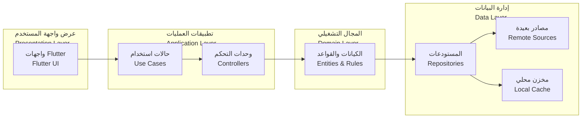
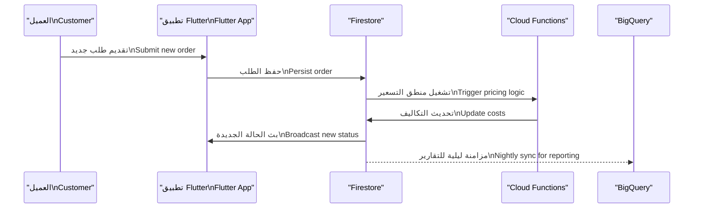
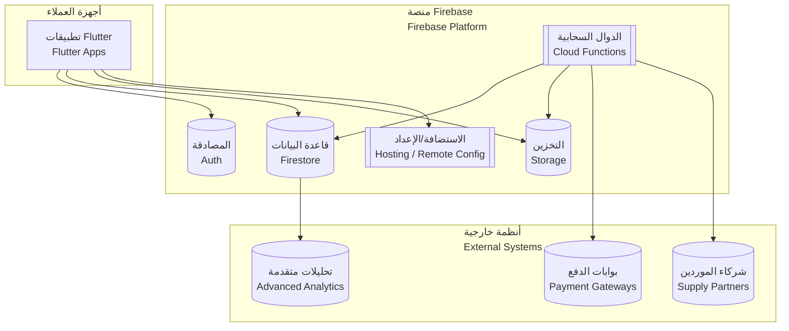

# 🏛️ بنية النظام | System Architecture

| العنصر         | التفاصيل                                                                                                                                                                                                                                       |
| -------------- | ---------------------------------------------------------------------------------------------------------------------------------------------------------------------------------------------------------------------------------------------- |
| المنتج         | منصة الوساطة الشرائية CA Admin CA Admin Shopping Mediation Platform                                                                                                                                                                         |
| الإصدار        | 0.1 – آخر تحديث 2025-09-08 – المالك: عبدالله الشائف Version 0.1 – Last updated 2025-09-08 – Owner: Abdullah Alshaif                                                                                                                         |
| الهدف المعماري | منصة مرنة، قابلة للتوسع، وآمنة تدعم التخصيص الإقليمي Resilient, scalable, and secure platform with regional customisation                                                                                                                   |
| المكدس الرئيس  | Flutter، Firebase (Firestore، Auth، Storage، Cloud Functions)، مخزن محلي Flutter, Firebase (Firestore, Auth, Storage, Cloud Functions), Local Cache                                                                                         |
| وثائق مرتبطة   | `docs/01-vision/01-vision.md`، `docs/05-data-model/05-data-model.md`، `docs/10-nfr-and-quality/10-nfr-and-quality.md` `docs/01-vision/01-vision.md`, `docs/05-data-model/05-data-model.md`, `docs/10-nfr-and-quality/10-nfr-and-quality.md` |

> 🔑 **لماذا تقرأ هذا المستند؟**
> 🔑 **Why read this document?**
>
> - 🧱 يستعرض تطبيق Clean Architecture على مكدس Flutter/Firebase لضمان فصل واضح بين الطبقات.
>   🧱 Demonstrates Clean Architecture on the Flutter/Firebase stack to keep layers decoupled.
> - 🔄 يوضح كيفية تكامل الخدمات والوظائف لتحقيق المرونة، المراقبة، والأمن.
>   🔄 Shows how services and functions integrate to deliver flexibility, observability, and security.

---

## 1. المقدمة | Introduction

- 🛠️ **ما نبنيه:** تطبيق Flutter يعمل على Android وiOS مع مزامنة آنية مع Firebase.
  🛠️ **What we build:** A Flutter application for Android/iOS synchronising in real time with Firebase.
- 🔄 **كيف نحافظ على المرونة:** طبقات قابلة للتعديل للفصل بين العرض، المجال، والبيانات.
  🔄 **How we stay adaptable:** Modular layers separating presentation, domain, and data concerns.
- 👥 **من يستفيد:** فرق العمليات، المالية، والدعم الذين يحتاجون إلى خدمة مستقرة وقابلة للتوسع.
  👥 **Who benefits:** Operations, finance, and support teams relying on stability and elasticity.

---

## 2. مبادئ التصميم الأساسية | Core Design Principles

| الأيقونة | المبدأ                                  | الوصف                                                                                                                            | الفائدة                                                                                                    |
| -------- | --------------------------------------- | -------------------------------------------------------------------------------------------------------------------------------- | ---------------------------------------------------------------------------------------------------------- |
| 🧱       | الطبقات النظيفة Clean Layers         | فصل العرض، التطبيق، المجال، والبيانات لتقليل التداخل. Separate presentation, application, domain, and data to limit coupling. | يسهل تغييرات الواجهة أو المنطق دون التأثير على البقية. Allows UI or logic changes without side effects. |
| 📡       | أولوية عدم الاتصال Offline First     | استخدام مخزن محلي ومزامنة لاحقة مع Firestore. Use local storage with background sync to Firestore.                            | يحافظ على تجربة المستخدم في ضعف الشبكة. Keeps UX stable under poor connectivity.                        |
| 🔐       | أمان مستند إلى الأدوار RBAC Security | مصادقة بـ Firebase Auth وسياسات Firestore مفصلة. Firebase Auth backed by granular Firestore rules.                            | يحمي البيانات ويمنع الوصول غير المصرح. Protects data and blocks unauthorised access.                    |
| 📈       | قابلية المراقبة Observability        | سجلات Cloud Functions وCrashlytics ولوحات أداء. Cloud Functions logs, Crashlytics, and performance dashboards.                | تكشف المشاكل قبل تأثيرها على المستخدم. Surfaces issues before they affect users.                        |
| 📃       | عقود واضحة Explicit Contracts        | اعتماد DTOs وواجهات محددة بين الطبقات. DTOs and explicit interfaces connecting layers.                                        | يقلل أخطاء التكامل ويسهل الاختبار. Reduces integration errors and simplifies testing.                   |

---

## 3. العرض الطبقي | Layered View

- 🧩 يوضح المخطط تسلسل تدفق البيانات من الواجهة إلى المصادر البعيدة والمحلية.
  🧩 Shows the flow from UI down to remote and local sources.
- 🧮 يمنح فرق الاختبار نقطة دخول واضحة لكل طبقة.
  🧮 Gives QA teams a clear entry point per layer for testing.

---

## 4. خدمات Firebase والتكامل | Firebase Services & Integration

| الخدمة                  | الاستخدام                                                                                                                  | الفائدة                                                                                                                      |
| ----------------------- | -------------------------------------------------------------------------------------------------------------------------- | ---------------------------------------------------------------------------------------------------------------------------- |
| Auth                    | إدارة الهوية، كلمات المرور أحادية الاستخدام، وSSO مع Google/Apple. Identity management, OTP, and SSO with Google/Apple. | تأمين جلسات الدخول وتشغيل RBAC بدقة. Secures login sessions and powers precise RBAC.                                      |
| Firestore               | تخزين البيانات التشغيلية، مؤشرات الحالة، وسجلات البحث. Stores operational records, state flags, and search views.       | تحديثات لحظية وشفافية للمستخدمين عبر المنصات. Realtime updates providing transparency across devices.                     |
| Storage                 | حفظ المرفقات، إثباتات الصور، والفواتير الصادرة. Stores attachments, images, and issued invoices.                        | مساحة آمنة مشفرة بمستويات صلاحيات مفصلة. Secure, encrypted space with fine-grained permissions.                           |
| Cloud Functions         | المهام الخلفية، حساب الرسوم، إرسال الإشعارات. Backend tasks, fee calculation, push notifications.                       | يحافظ على منطق الخوادم بعيدًا عن التطبيق ويقلل استهلاك الطاقة. Keeps server logic off the app and saves device resources. |
| Hosting & Remote Config | تهيئة ديناميكية للواجهات ورسائل الترحيب. Dynamic UI configuration and welcome messaging.                                | تمكين تغييرات دون نشر التطبيق مجددًا. Allows updates without re-deploying the app.                                        |

---

## 5. استراتيجية عدم الاتصال | Offline-First Strategy

- 💾 الاعتماد على مخزن محلي (SQLite/Hive) لسجلات الطلبات النشطة.
  💾 Use local stores (SQLite/Hive) to keep active orders in sync.
- 🔁 عملية مزامنة ثنائية الاتجاه مع طوابير موقوتة لتجنب تضارب السجلات.
  🔁 Bi-directional sync with queued jobs prevents conflicting updates.
- 🚨 مراقبة التزامن عبر علامات زمنية لمنع البيانات القديمة من الكتابة فوق الحديثة.
  🚨 Timestamp checks ensure stale data never overwrites recent entries.
- 📡 استعادة الاتصال تفعّل رفع الأنشطة المؤجلة وطلب إعادة المحاولة للمدفوعات.
  📡 On reconnect, queued actions flush and payment retries are triggered.

---

## 6. سجلات قرارات البنية | Architecture Decision Records

| الرقم  | القرار                                                      | المرحلة الزمنية | الحالة | ملاحظات                                          |
| ------ | ----------------------------------------------------------- | --------------- | ------ | ------------------------------------------------ |
| ADR-01 | اعتماد نمط MVVM مع Riverpod لإدارة الحالة                   | الربع 3 2025    | نشط    | يسهل اختبار الوحدات واستبدال الواجهات.           |
| ADR-02 | استخدام Firestore كقاعدة عمليات رئيسية مع BigQuery للتقارير | الربع 3 2025    | نشط    | يغطي احتياج القراءة السريعة والتحليلات المتقدمة. |
| ADR-03 | فرض RBAC عبر Firebase Auth + Claims Customization           | الربع 4 2025    | مخطط   | يربط الصلاحيات مع السياسات التنظيمية المتغيرة.   |

---

## 7. تدفق البيانات الشامل | End-to-End Data Flow

- 🔄 يضمن التدفق بقاء التطبيق محدثًا حتى بعد تنفيذ الوظائف الخلفية.
  🔄 Ensures the app stays up to date even after backend functions run.
- 📈 يوفر قناة رسمية لنسخ البيانات إلى BigQuery دون التأثير على الأداء اليومي.
  📈 Provides an official path to BigQuery without harming daily performance.

---

## 8. نشر النظام والتكاملات | Deployment & Integrations View

- 🔐 يعتمد الاتصال على HTTPS وOAuth2 لمنع التنصت وتأكيد الهوية.
  🔐 Uses HTTPS and OAuth2 to prevent eavesdropping and confirm identity.
- 🛰️ توجد مراقبة مستمرة عبر Crashlytics وCloud Logging مع تنبيهات فورية.
  🛰️ Continuous monitoring via Crashlytics and Cloud Logging with instant alerts.

---

## 9. الأدوار التشغيلية في البنية | Operational Roles in Architecture

| الدور                                       | طبقات المسؤولية                                             | وصف التفاعل                                                                                                                                                         | الفائدة                                                                                                       |
| ------------------------------------------- | ----------------------------------------------------------- | ------------------------------------------------------------------------------------------------------------------------------------------------------------------- | ------------------------------------------------------------------------------------------------------------- |
| فريق خدمة العملاء Customer Service Staff | العرض، التطبيق، المجال Presentation, Application, Domain | يتعامل مع واجهة Flutter لإدخال الطلبات والتحقق من البيانات باستخدام منطق التطبيق. Uses Flutter UI to capture orders and validate data through application logic. | يحافظ على جودة البيانات ويغلق الطلبات بسرعة. Keeps data quality high and closes requests quickly.          |
| معالج الطلبات Order Processor            | التطبيق، المجال، البيانات Application, Domain, Data      | يستخدم الأدوات الخلفية لمراجعة الطلبات وتحديث الشحنات والموردين. Back-office tools to review orders and update shipments/vendors.                                | يقصر زمن المعالجة ويحد من تكرار الأخطاء. Shortens processing time and reduces repeat errors.               |
| مسؤول المالية Finance Officer            | المجال، البيانات، الوظائف Domain, Data, Functions        | يشرف على التسويات ويشغل الوظائف الآلية لإصدار التقارير المالية. Oversees reconciliation and triggers functions for financial reporting.                          | يقلل الاعتماد على الجهد اليدوي ويزيد دقة التقارير. Reduces manual effort and increases report accuracy.    |
| قائد العمليات Operations Lead            | العرض، الوظائف Presentation, Functions                   | يتابع لوحات الأداء ويصدر قرارات تنبيه أو تصعيد عبر الوظائف السحابية. Monitors dashboards and issues alerts/escalations via cloud functions.                      | يحافظ على التزامات SLA ويقود التحسين المستمر. Maintains SLA commitments and drives continuous improvement. |

---

## 10. الأمن والامتثال | Security & Compliance

- 🔐 إدارة claims مخصصة في Firebase Auth لضبط الصلاحيات الديناميكية.
  🔐 Custom claims in Firebase Auth keep dynamic permissions aligned.
- 📜 تخزين auditTrailId داخل كل مستند مهم وربطه بتحليلات BigQuery.
  📜 Embed auditTrailId within critical documents and link it to BigQuery analytics.
- 🧾 سياسات الاحتفاظ بالبيانات تتبع المعايير السعودية واليمنية للبيانات المالية.
  🧾 Data retention policies follow Saudi and Yemeni financial regulations.
- 📘 توثيق NFR عبر `docs/10-nfr-and-quality/10-nfr-and-quality.md` وتحديث ADR عند أي تعديل جذري.
  📘 Document NFRs in `docs/10-nfr-and-quality/10-nfr-and-quality.md` and refresh ADRs upon major changes.

---

## 11. مواءمة خارطة الطريق | Roadmap Alignment

- 🏗️ تفعيل Cloud Functions المتخصصة (الفوترة، الشحن، الأمن) وفق الجدول المحدد.
  🏗️ Activate specialised Cloud Functions (billing, shipping, security) according to the roadmap. |
- 🧭 تحديث ADRs بالتزامن مع مراحل التنفيذ للحفاظ على أثر القرارات.
  🧭 Update ADRs in sync with delivery milestones to preserve decision traceability. |
- 📊 ضمان وصول 80٪ من قواعد المجال و100٪ من حالات الاستخدام إلى طبقة التطبيق بحلول الربع الرابع.
  📊 Ensure 80% of domain rules and 100% of use cases live inside the application layer by Q4. |
- 🤝 تكامل بوابات الدفع الخارجية وفق خطة `Roadmap.md` مع مراقبة الأثر الأمني.
  🤝 Integrate external payment gateways per `Roadmap.md` while monitoring security impact. |
- 🧪 إجراء مراجعات دورية للأداء والحوكمة للتأكد من التوافق مع النمو المتوقع.
  🧪 Run regular performance and governance reviews to stay aligned with expected growth. |

> 🧾 **خلاصة التنفيذ:** تُحدّث هذه الوثيقة بالتوازي مع قرارات البنية الكبرى وأي تغير تنظيمي لضمان تماسك المنصة.
> 🧾 **Execution Reminder:** Keep this document updated alongside major architectural decisions and regulatory changes to maintain platform cohesion.
