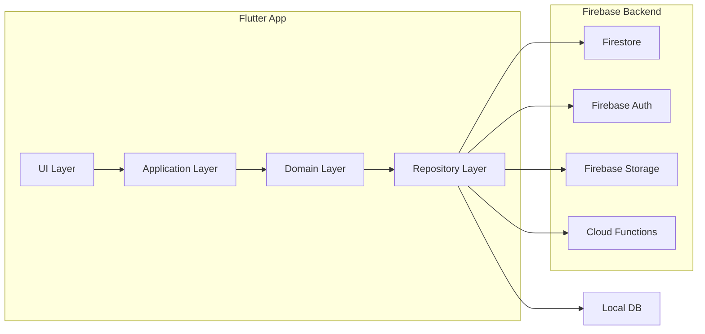

# 🏗️ System Architecture / بنية النظام

> **Project:** CA Admin  
> **Version:** v0.1 — Owner: Abdullah Alshaif  
> **Last Updated:** 2025-09-08

---

## 1. Introduction / المقدمة

<div align="center">
  
</div>

**EN:**
The CA Admin application is built using **Clean Architecture** for scalability, testability, and maintainability. It integrates **Flutter** (client) with **Firebase** (Firestore, Auth, Storage, Cloud Functions) and is designed as **offline-first**: users can work without internet, and data syncs automatically when online.

**AR:**
يعتمد تطبيق CA Admin على نمط التصميم **Clean Architecture** لضمان التوسع وسهولة الاختبار والصيانة. يربط بين **Flutter** (العميل) و **Firebase** (Firestore، Auth، Storage، Cloud Functions). النظام مصمم ليعمل **دون إنترنت أولاً** بحيث يستمر المستخدم بالعمل ويتم المزامنة تلقائيًا عند الاتصال.

---

## 2. Clean Architecture Layers / طبقات Clean Architecture

```mermaid
flowchart TD
  UI[Presentation Layer\n(Flutter Widgets, Providers, State Management)] --> APP[Application Layer\n(Use Cases, Controllers)]
  APP --> DOMAIN[Domain Layer\n(Entities, Business Rules)]
  DOMAIN --> DATA[Data Layer\n(Repositories, Data Sources)]
  DATA --> FIREBASE[(Firebase Services\nFirestore, Auth, Storage, Functions)]
  DATA --> LOCAL[(Local DB\nSQLite/Hive/SharedPreferences)]
```

**Layer Details / تفاصيل الطبقات:**

- **Presentation Layer (UI) / طبقة العرض:**
  - Flutter Widgets, Localization (Arabic/English, RTL/LTR), State Management (Riverpod/Bloc)
- **Application Layer / طبقة التطبيق:**
  - Use Cases (business workflows: Create Order, Update Shipment, Process Payment), Controllers/ViewModels
- **Domain Layer / طبقة المجال:**
  - Entities (Customer, Order, Shipment, Payment, Driver, BankCard, etc.), Business rules (independent of Flutter/Firebase)
- **Data Layer / طبقة البيانات:**
  - Repositories (abstract between domain/data sources), Data Sources (Firestore, Local DB), Sync Service (offline-first two-way sync)

---

## 3. Firebase Services / خدمات Firebase

- **Firestore:** Main database for customers, orders, shipments, finance
- **Auth:** Role-based authentication (Admin, Finance, Staff, Driver, Customer)
- **Storage:** Store receipts, product images, attachments
- **Cloud Functions:**
  - Assign Custom Claims for RBAC
  - Run scheduled jobs (weekly reports, cleanup, notifications)
- **Firebase Emulator Suite:** Local testing of Firestore, Auth, Functions

---

## 4. Offline-First Sync Strategy / إستراتيجية المزامنة دون إنترنت

**EN:**
- Local cache stores user actions (orders, payments, updates) when offline.
- A Sync Service pushes queued actions to Firestore once online.
- Conflict resolution: last-write-wins + audit log for traceability.

**AR:**
- التخزين المحلي يحفظ عمليات المستخدم (طلبات، دفعات، تحديثات) عند انقطاع الإنترنت.
- خدمة المزامنة ترسل العمليات إلى Firestore عند عودة الاتصال.
- معالجة التعارض: آخر تعديل هو الفائز + سجل تدقيق للتتبع.

---

## 5. Architecture Decision Records (ADRs) / قرارات التصميم

| ADR ID  | Decision                                 | Rationale                        | Status    |
|---------|------------------------------------------|-----------------------------------|-----------|
| ADR-01  | Use Firestore as main DB                 | Real-time sync, scalability       | Accepted  |
| ADR-02  | Implement Offline-first with local DB    | Internet is unreliable in Yemen   | Accepted  |
| ADR-03  | Use Clean Architecture                   | Separation of concerns, testable  | Accepted  |
| ADR-04  | State Management: Riverpod               | Simplicity, performance           | Proposed  |
| ADR-05  | Auth with Custom Claims                  | Role-based access control         | Accepted  |

---

## 6. High-Level Architecture Diagram / المخطط العام



---

## 7. Notes / ملاحظات

- This architecture supports scalability (adding new features without breaking existing ones).
- Clean separation ensures developers can work in parallel (UI vs Backend vs Finance modules).
- ADRs must be updated whenever a major architectural decision is made.
- Offline-first sync is critical for regions with unreliable internet.

---

🔹 بهذا الملف أصبح عندك:
- وصف كامل للمعمارية.
- مخططات Mermaid توضح Clean Architecture والـ Firebase Integration.
- إستراتيجية المزامنة دون إنترنت.
- **ADRs** توثق قرارات التصميم.

هل ترغب أن أتابع الآن إلى الملف السابع **`/docs/07-process-flows/07-process-flows.md`** لنوثق **BPMN + DFD** لتدفقات العمل (طلب → شراء → شحن → تسليم → دفع)؟
