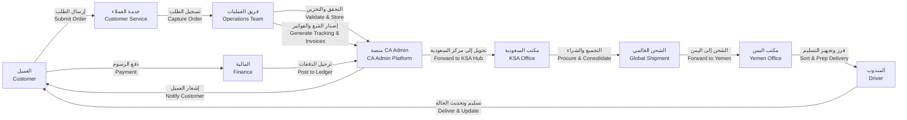
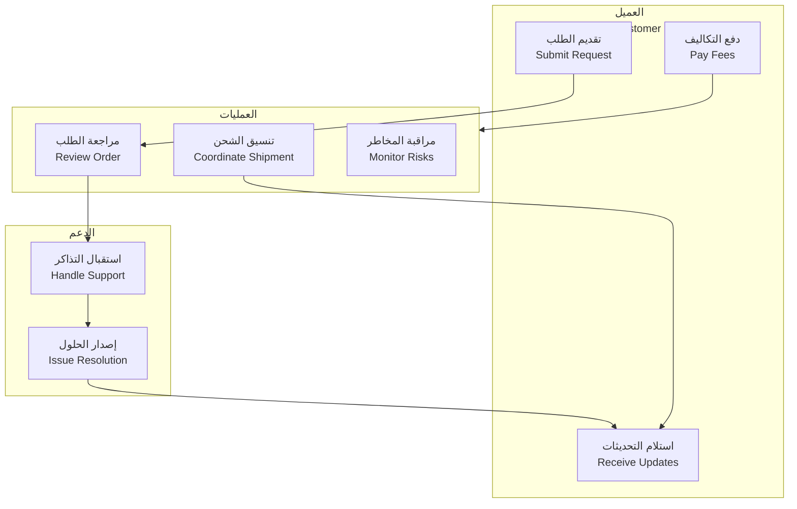
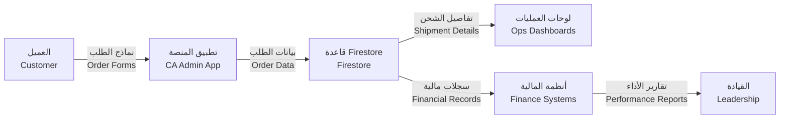
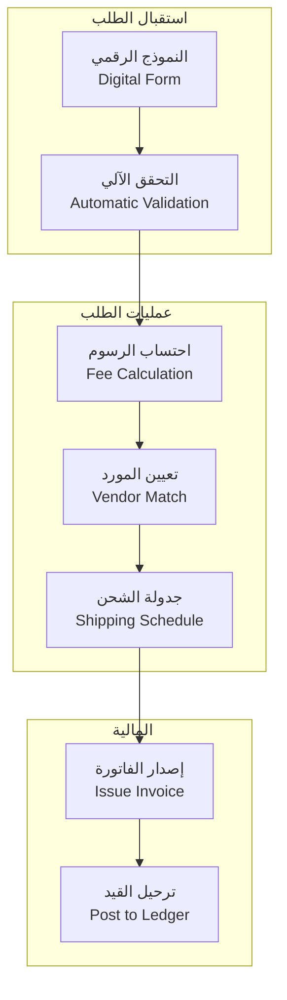
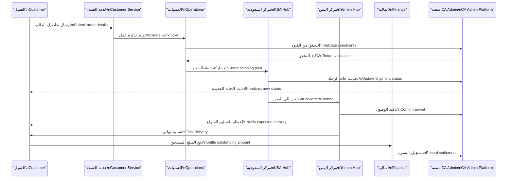

# 🔄 مخططات العمليات | Process Flows

| العنصر         | التفاصيل                                                                                                                                                                                                                                       |
| -------------- | ---------------------------------------------------------------------------------------------------------------------------------------------------------------------------------------------------------------------------------------------- |
| المنتج         | منصة الوساطة الشرائية CA Admin CA Admin Shopping Mediation Platform                                                                                                                                                                         |
| الإصدار        | 0.1 – آخر تحديث 2025-09-08 – المالك: عبدالله الشائف Version 0.1 – Last updated 2025-09-08 – Owner: Abdullah Alshaif                                                                                                                         |
| الهدف          | توحيد التدفقات التشغيلية وربطها بالحوكمة والجودة Unify operational flows with governance and quality alignment                                                                                                                              |
| المكدس المرجعي | Flutter، Firebase (Firestore، Auth، Storage، Cloud Functions)، مخزن محلي Flutter, Firebase (Firestore, Auth, Storage, Cloud Functions), Local cache                                                                                         |
| وثائق مرتبطة   | `docs/04-use-cases/04-use-cases.md`، `docs/05-data-model/05-data-model.md`، `docs/06-architecture/06-architecture.md` `docs/04-use-cases/04-use-cases.md`, `docs/05-data-model/05-data-model.md`, `docs/06-architecture/06-architecture.md` |

> 🔑 **الخلاصة السريعة:** تعرض هذه الوثيقة تدفقات الطلب من البداية حتى التقارير مع إبراز نقاط التحكم والحوكمة.
> 🔑 **Quick Glance:** Shows how orders flow from start to reporting while highlighting control and governance touchpoints.

---

## 1. نظرة عامة | Overview

- 🧭 يحدد المستند الرحلة التشغيلية من استقبال الطلب إلى التقارير الختامية.
  🧭 The document outlines the operational journey from order intake to final reporting.
- 🎯 يوضح الهدف من كل مخطط وكيف يدعم جودة الخدمة والامتثال.
  🎯 Explains the purpose of each diagram and how it supports service quality and compliance.
- 📌 يربط التدفقات مع حالات الاستخدام، نموذج البيانات، والمعمارية لضمان اتساق المرجع.
  📌 Connects flows with use cases, the data model, and architecture to keep references aligned.

---

## 2. مسار العملية الشامل | Process Journey Map

```mermaid
flowchart LR
  Start(["بداية الطلب\nOrder Start"]) --> Intake["خدمة العملاء\nCustomer Service"]
  Intake --> Processor["معالج الطلبات\nOrder Processor"]
  Processor --> Validation["التحقق والتخزين\nValidate & Store"]
  Validation --> Procurement["المشتريات والتجميع\nProcurement"]
  Procurement --> Shipment["الشحن عبر الحدود\nCross-Border Shipment"]
  Shipment --> Handover["التسليم المحلي\nLocal Delivery"]
  Handover --> Finance["التسوية المالية\nFinance Reconcile"]
  Finance --> Reports(["التقارير النهائية\nFinal Reports"])
```

> 🧠 يوفر المخطط نظرة شاملة للرحلة التشغيلية ويحدد التحولات الأساسية بين الفرق.
> 🧠 Gives a whole-process view and marks the key hand-offs between teams.

---

## 3. مخطط BPMN عالي المستوى | High-Level BPMN

- 🧾 يعكس تتابع المهام بين الأطراف البشرية والأنظمة المؤتمتة.
  🧾 Reflects task transitions between human actors and automated systems.
- 🕒 يساعد في ضبط معايير SLA لكل محور اعتمادًا على مسار الحواف.
  🕒 Helps calibrate SLAs per activity based on edge transitions.

---

## 4. تسلسل تشغيلي مختصر | Operational Sequence

| الخطوة                                         | الوصف                                                                                                                                         |
| ---------------------------------------------- | --------------------------------------------------------------------------------------------------------------------------------------------- |
| 🧾 استقبال الطلب Order Intake               | تسجيل الطلب والتحقق من بيانات العميل والقنوات المستخدمة. Record the request, validate customer data, and capture entry channel details.    |
| 🛠️ المعالجة الخلفية Back Office Processing  | فحص الطلب، اختيار المورد، وتحديد خطة الشحن الأولية. Review the request, pick suppliers, and define the initial shipping plan.              |
| 🛒 المشتريات والشحن Procurement & Shipping  | تأكيد التوفر، تجميع العناصر، وترتيب النقل بين المراكز. Confirm availability, consolidate items, and organise inter-hub transfers.          |
| 🤝 التسليم والمتابعة Delivery & Follow-up   | تنفيذ التسليم مع إثبات POD وتحديث الحالة للعملاء والأنظمة. Complete delivery with POD evidence and refresh status for clients and systems. |
| 💳 التسوية والتقارير Settlement & Reporting | مطابقة المدفوعات وإصدار التقارير التشغيلية والتنفيذية. Match payments and deliver operational and executive reports.                       |

---

## 5. مخطط سباحة الأدوار | Role Swimlane Snapshot

> 📋 يوضح توزيع المسؤوليات بين الأدوار الرئيسية وكيف يتنقل الحمل التشغيلي.
> 📋 Shows responsibility distribution across roles and how operational load shifts.

---

## 6. مخطط تدفق البيانات (مستوى 0) | Data Flow Diagram (Level 0)

> 📡 يعرض التدفق الأساسي للبيانات بين الواجهة والأنظمة الداعمة.
> 📡 Shows the primary data exchanges between the interface and supporting systems.

---

## 7. مخطط تدفق البيانات (مستوى 1 – الطلبات) | Data Flow Diagram (Level 1 – Orders)

> 🧾 يوفر مستوى تفصيليًا لتغير البيانات والمعالجات عند التعامل مع الطلبات.
> 🧾 Provides a detailed view of data transformations and processing within order handling.

---

## 8. مخطط التسلسل المتكامل | Integrated Sequence Diagram

> 🔁 يبرز التفاعل المتكامل بين المراكز المختلفة وكيف يعود الأثر إلى العميل والمالية.
> 🔁 Highlights integrated hub interactions and the feedback loop to the customer and finance.

---

## 9. حزمة الإرشاد التشغيلي | Operational Guidance Pack

| البند                                 | الإرشاد                                                                                                                                                                                                                           |
| ------------------------------------- | --------------------------------------------------------------------------------------------------------------------------------------------------------------------------------------------------------------------------------- |
| ⏱️ مستويات الخدمة SLA              | استجابة خدمة العملاء خلال ≤6 دقائق، مراجعة العمليات خلال ≤12 ساعة. Customer service response ≤6 minutes; operations review ≤12 hours.                                                                                          |
| 📣 التصعيد Escalation              | أي خرق لـ SLA يُرفع لقناة الطوارئ مع خطة معالجة واضحة. Escalate SLA breaches to the emergency channel with a defined mitigation plan.                                                                                          |
| 📝 إثبات التسليم Proof of Delivery | تحميل إثبات POD خلال ساعة من التسليم الفعلي. Upload POD evidence within one hour of actual delivery.                                                                                                                           |
| 💳 دورة المالية Finance Cycle      | نشر التسويات اليومية خلال 24 ساعة مع إشعار تلقائي عند الإتمام. Publish daily reconciliations within 24 hours and trigger automatic notifications.                                                                              |
| 🔗 مراجع داعمة Supporting Links    | الرجوع إلى `docs/04-use-cases/04-use-cases.md` و`docs/06-architecture/06-architecture.md` للتفاصيل الخلفية. Refer to `docs/04-use-cases/04-use-cases.md` and `docs/06-architecture/06-architecture.md` for background details. |

---

## 10. الأسئلة الشائعة | Frequently Asked Questions

- ❓ متى نستخدم BPMN بدلًا من DFD؟
  ❓ When should BPMN be used instead of DFD?
  - 🛠️ BPMN مناسب لتوثيق خطوات التشغيل والأدوار البشرية.
    🛠️ BPMN fits documenting operational steps and human roles.
  - 📊 DFD يوضح انتقال البيانات والتحولات التقنية بين الأنظمة.
    📊 DFD highlights data movements and technical transformations across systems.
- ❓ كيف نحافظ على تحديث المخططات؟
  ❓ How do we keep diagrams up to date?
  - 🧾 تُحدث المخططات مع أي تغيير في الخدمات أو الواجهات ويُسجل ذلك في سجل القرارات المعمارية.
    🧾 Update diagrams whenever services or interfaces change and record it in ADRs.

---

## 11. روابط مرجعية | Reference Links

- 🔁 [حالات الاستخدام](../04-use-cases/04-use-cases.md) تشرح السيناريوهات والغرض من كل تدفق.
  🔁 [Use Cases](../04-use-cases/04-use-cases.md) explain scenarios and intent behind each flow.
- 🧱 [نموذج البيانات](../05-data-model/05-data-model.md) يربط الكيانات بقواعد البيانات المرتبطة.
  🧱 [Data Model](../05-data-model/05-data-model.md) links entities to their backing stores.
- 🏛️ [البنية](../06-architecture/06-architecture.md) تشرح سياق الخدمات والتكاملات.
  🏛️ [Architecture](../06-architecture/06-architecture.md) explains service context and integrations.

> 🧾 **ملاحظة ختامية:** عد إلى هذه الوثيقة عند تحديث خطوط العمل أو مؤشرات الأداء لضمان تطابق المخططات مع الواقع.
> 🧾 **Closing Note:** Refer back to keep diagrams aligned with reality whenever workflows or KPIs change.
