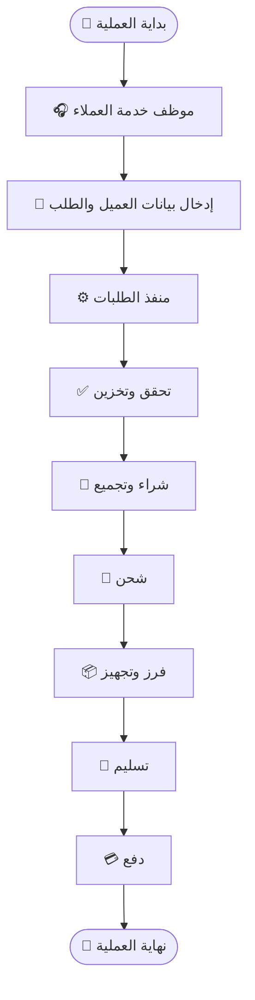
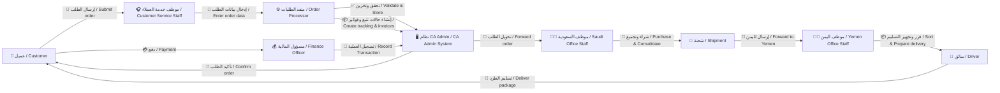
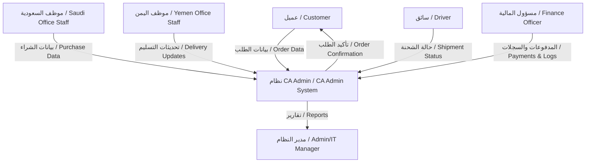
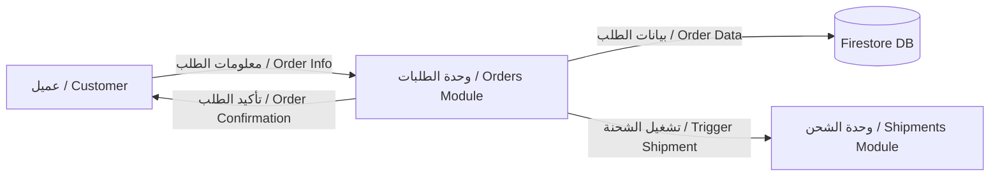

# 🔄 تدفقات العمليات

Process Flows

---

> **المشروع:** CA Admin  
> **Project:** CA Admin  
> **الإصدار:** v0.1 — المالك: عبدالله الشائف  
> **Version:** v0.1 — Owner: Abdullah Alshaif  
> **آخر تحديث:** 2025-09-08  
> **Last Updated:** 2025-09-08

**شرح مختصر:**
توضح هذه الوثيقة تسلسل الأنشطة في النظام باستخدام BPMN للأعمال وDFD لتدفق البيانات.

**Summary:**
This document describes the activity sequence in the system using BPMN for business and DFD for data flows.

---

## 🏁 ملخص بصري

Visual Summary

**شرح مختصر:**
يوضح المخطط مراحل العملية من البداية حتى الدفع النهائي.

**Summary:**
The diagram shows process stages from start to final payment.

---

## 1. المقدمة

Introduction

تصف تدفقات العمليات تسلسل الأنشطة في نظام CA Admin. نستخدم BPMN لتوضيح سير الأعمال وDFD لتوضيح تدفق البيانات.

Process flows describe the sequence of activities in the CA Admin system. We use BPMN (Business Process Model and Notation) for business flows and DFD (Data Flow Diagrams) for data movement.

---

## مخطط BPMN عام

High-Level BPMN

**شرح مختصر:**
يوضح المخطط كيف ينتقل الطلب بين الفرق من العميل حتى التسليم والدفع.

**Summary:**
The diagram shows how the order moves between teams from customer to delivery and payment.

1. Customer submits order → Customer Service Staff enters customer and order data.
2. Order Processor creates order number, links/splits orders, creates tracking states and invoices.
3. System validates and stores order, confirms to customer.
4. Saudi Office Staff purchase items from vendors.
5. Packages consolidated into a Shipment.
6. Shipment forwarded to Yemen Office Staff.
7. Yemen staff sort packages per customer.
8. Driver delivers to customer.
9. Finance Officer records payments, reconciles logs.
10. System generates reports.

---

## 4. Data Flow Diagram (DFD Level 0) / مخطط تدفق البيانات (المستوى 0)

---

## 5. Data Flow Diagram (DFD Level 1 - Orders) / مخطط تدفق البيانات (المستوى 1 - الطلبات)

---

## 6. Notes, Tips & FAQ / ملاحظات ونصائح وأسئلة شائعة

- **BPMN diagrams** show who does what (business roles).
- **DFD diagrams** show how data moves between modules.
- BPMN is best for business/approval flows, DFD for technical/data flows.
- Always align process flows with [Use Cases](../04-use-cases/04-use-cases.md) and [User Stories](../03-stories/03-stories.md).
- Updates in processes should be reflected here and in [Architecture](../06-architecture/06-architecture.md).

### Q: متى أستخدم BPMN ومتى أستخدم DFD؟

**A:**

- استخدم BPMN عندما تريد توضيح الأدوار البشرية أو خطوات الموافقة.
- استخدم DFD عندما تريد توضيح تدفق البيانات بين الأنظمة أو الوحدات.

#### Q: كيف أضيف تدفق جديد؟

**A:**

- أضف مخطط جديد (BPMN أو DFD) مع وصف نصي مختصر.
- اربطه بحالة استخدام أو قصة مستخدم ذات صلة.

---
