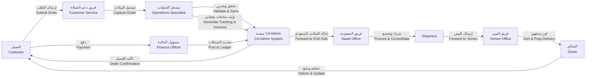
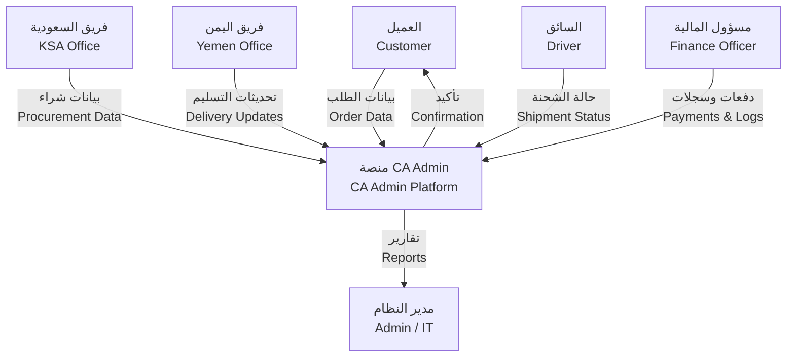
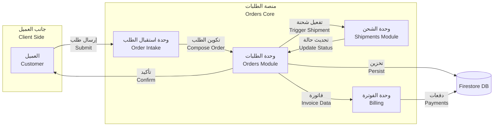
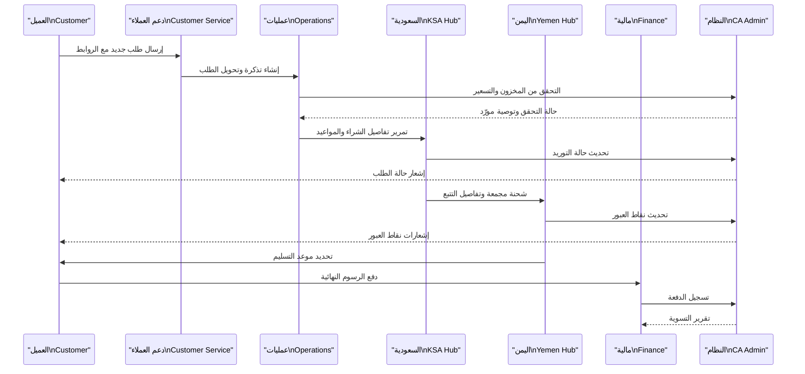

# تدفقات العمليات | Process Flows

> 🏷️ **المنتج / Product:** CA Admin Shopping Mediation Platform  
> 🗓️ **الإصدار / Version:** v0.1 — آخر تحديث 2025-09-08 بواسطة Abdullah Alshaif  
> 🧭 **الغرض / Purpose:** توثيق مسار الأعمال وحركة البيانات خطوة بخطوة لدعم التحليل، التطوير، والاختبار.

---

## لمحة سريعة | Quick Glance

- 🧱 **المنهجية / Methodology** — نستخدم مخططات BPMN لعرض أدوار الأعمال، ومخططات DFD لتوضيح حركة البيانات بين الأنظمة والفرق.
- 🔄 **النطاق / Scope** — يغطي رحلة الطلب من لحظة إنشائه وحتى إغلاق الحسابات المالية، مع إبراز نقاط المراقبة ومؤشرات SLA.
- 🎯 **القيمة / Value** — يمنح المطورين والمحللين رؤية متماسكة حول ما يجب بناؤه أو اختباره، ويساعد فرق العمليات على تحسين الكفاءة.

---

## 1. مقدمة | Introduction

- **لماذا؟** توحيد فهم الفرق لمسار الطلبات والشحنات والدفعات، وضمان توافقها مع حالات الاستخدام والقصص.
- **كيف؟** عبر سلسلة مخططات متكاملة: نظرة عامة، مخطط تفصيلي بالأدوار، ومستويات متعددة لحركة البيانات.
- **متى نحدّثها؟** عند أي تغيير في الإجراءات التشغيلية أو إضافة تكامل جديد؛ يجب مزامنة التغييرات مع وثائق المعمارية والاختبار.

---

## 2. خريطة رحلة العملية | Process Journey Map

> 🧩 **كيف نقرأ المخطط؟** كل عقدة تمثل مرحلة رئيسية، والأسهم توضّح الانتقال المنطقي بين الفرق حتى توليد التقارير المالية.

---

## 3. مخطط BPMN عالي المستوى | High-Level BPMN

### التسلسل التشغيلي | Operational Sequence

1. **دعم العملاء** يتأكد من بيانات العميل والمنتج، يفتح التذكرة، ويعين مشغلًا مسؤولاً.
2. **مشغل العمليات** يجزّئ الطلب (إن لزم)، يضبط تكاليف الشحن الأولية، ويتأكد من معلومات المخزون.
3. **المنصة** تتحقق من القيود (Limits & SLA) وتصدر رقم الطلب المرجعي ثم ترسل إشعارًا للعميل.
4. **المكتب السعودي** يتعامل مع الموردين، ويوثق الأسعار النهائية وجدول الاستلام.
5. **فريق اليمن** يستقبل الشحنة، يفرزها حسب المنطقة/العميل، ويراقب أية تأخيرات.
6. **السائق** ينسق التسليم النهائي ويرفع إثبات التسليم (POD).
7. **المالية** تطابق الدفعات مع الطلب وتصدر التقرير المالي الأسبوعي.

> 📌 **مؤشر نجاح أساسي:** اكتمال المراحل من 1 إلى 7 خلال SLA المستهدف (48 ساعة داخليًا + زمن الشحن الدولي).

---

## 4. مخطط السلم الوظيفي | Role Swimlane Snapshot

| المرحلة / Stage | دعم العملاء       | مشغل العمليات              | المكتب السعودي      | المكتب اليمني | السائق           | المالية                    | النظام              |
| --------------- | ----------------- | -------------------------- | ------------------- | ------------- | ---------------- | -------------------------- | ------------------- |
| إنشاء الطلب     | جمع بيانات العميل | —                          | —                   | —             | —                | —                          | إنشاء سجل ابتدائي   |
| تدقيق التفاصيل  | متابعة التذكرة    | تدقيق البيانات وربط المورد | —                   | —             | —                | —                          | التحقق من القيود    |
| التوريد         | —                 | إصدار أوامر الشراء         | شراء وتجميع         | —             | —                | —                          | تحديث حالة المخزون  |
| الشحن           | —                 | تجهيز المستندات            | تسليم للمسار الدولي | استلام الشحنة | —                | —                          | تحديث التتبع        |
| التسليم المحلي  | —                 | —                          | —                   | فرز وتوزيع    | تسليم وإثبات POD | —                          | إغلاق التذكرة       |
| التسوية المالية | —                 | —                          | —                   | —             | —                | مطابقة دفعات وإصدار تقارير | أرشفة ونهاء العملية |

> 🧾 **ملاحظة تنظيمية:** يجب أن يمتلك كل فريق لوحة مراقبة تعرض الخطوة الحالية والمهام المتأخرة.

---

## 5. مخطط تدفق البيانات (DFD المستوى 0) | Data Flow Diagram (Level 0)

---

## 6. مخطط تدفق البيانات (DFD المستوى 1 – الطلبات) | Data Flow Diagram (Level 1 – Orders)

> 🧪 **اختبارات موصى بها:** تغطية حالات النجاح والفشل لمسارات التخزين، تكوين الفاتورة، والتزامن مع الشحن.

---

## 7. مخطط تسلسل تكاملي | Integrated Sequence Diagram

---

## 8. حزمة الإرشادات التشغيلية | Operational Guidance Pack

- ⏱️ **مؤقتات SLA:** يجب ضبط إنذار عند تجاوز الطلب 6 ساعات في مرحلة التدقيق أو 12 ساعة في مرحلة التوريد.
- 🔁 **إدارة الاستثناءات:** أي تأخير يتجاوز SLA يولّد تذكرة دعم تلقائية مع تصعيد إلى قائد العمليات.
- 🧪 **تحقق الجودة:** تُراجع نماذج التسليم (POD) أسبوعيًا للتأكد من توثيق كل عمليات التسليم.
- 📈 **مؤشرات الأداء:** معدل اكتمال رحلة الطلب، متوسط زمن التوريد، ومعدل الدفعات المؤكدة خلال 24 ساعة.
- 🧾 **التوثيق المتقاطع:** أي تعديل هنا يجب أن ينعكس في `docs/04-use-cases/04-use-cases.md` و`docs/06-architecture/06-architecture.md` لضمان الاتساق.

---

## 9. الأسئلة الشائعة | FAQ

> ❓ **متى نستخدم BPMN ومتى نلجأ إلى DFD؟**
>
> - نستخدم **BPMN** عندما نهتم بمن يقوم بالخطوة (أدوار بشرية أو فرق) وكيف تنتقل الموافقات.
> - نستخدم **DFD** عندما نهتم بما ينتقل من بيانات بين الأنظمة والوحدات، ومعرفة مصادر البيانات وأوجه استخدامها.
>   ❓ **كيف نضمن أن المخططات تعكس الواقع الحالي؟**
> - عقد مراجعة شهرية مع الفرق التشغيلية للمقارنة بين الواقع والوثائق.
> - ربط كل تغيير في العمليات بتذكرة واضحة وتحديث المخططات خلال نفس السبرينت.

---

## 10. روابط مرجعية | Reference Links

- [حالات الاستخدام](../04-use-cases/04-use-cases.md) — السيناريوهات المفصلة لكل دور.
- [قصص المستخدم](../03-stories/03-stories.md) — تقسيم المتطلبات إلى قصص قابلة للتنفيذ.
- [المعمارية](../06-architecture/06-architecture.md) — كيفية تطبيق هذه العمليات على مستوى الطبقات والبيانات.

> ✅ **جاهزية الوثيقة:** بعد كل تحديث، تحقق من أن جميع المخططات تُعرض دون أخطاء Mermaid وأن النصوص ثنائية اللغة واضحة للمراجعين.
