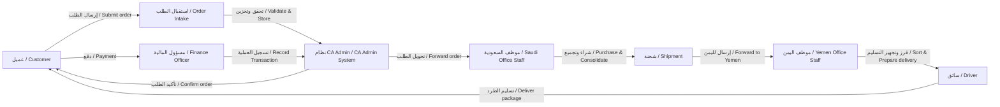
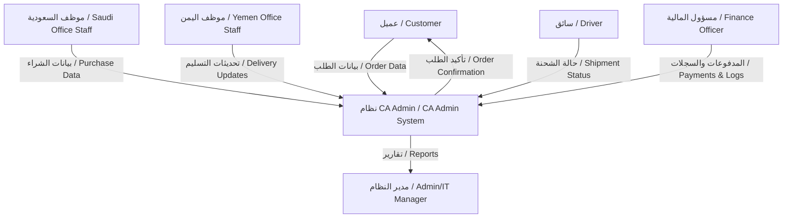
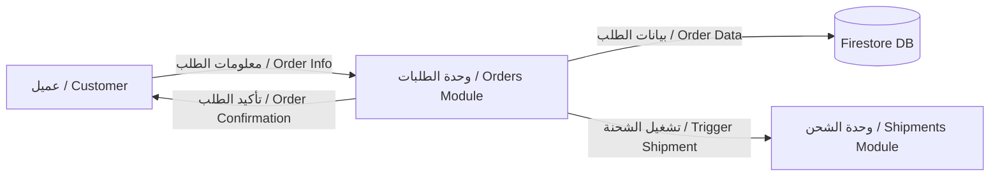

# 🔄 Process Flows / تدفقات العمليات

> **Project:** CA Admin  
> **Version:** v0.1 — Owner: Abdullah Alshaif  
> **Last Updated:** 2025-09-08

---

## 1. Introduction / المقدمة

  

**EN:**
Process flows describe the sequence of activities in the CA Admin system. We use **BPMN (Business Process Model and Notation)** for business flows and **DFD (Data Flow Diagrams)** for data movement.

**AR:**
تصف تدفقات العمليات تسلسل الأنشطة في نظام CA Admin. نستخدم **BPMN** لتوضيح سير الأعمال و **DFD** لتوضيح تدفق البيانات.

---

## 2. High-Level BPMN / مخطط BPMN عام

---

## 3. Detailed BPMN Steps / خطوات BPMN بالتفصيل

1. Customer submits order → System generates OrderNo.
2. Saudi Office Staff purchase items from vendors.
3. Packages consolidated into a Shipment.
4. Shipment forwarded to Yemen Office Staff.
5. Yemen staff sort packages per customer.
6. Driver delivers to customer.
7. Finance Officer records payments, reconciles logs.
8. System generates reports.

---

## 4. Data Flow Diagram (DFD Level 0) / مخطط تدفق البيانات (المستوى 0)

---

## 5. Data Flow Diagram (DFD Level 1 - Orders) / مخطط تدفق البيانات (المستوى 1 - الطلبات)

---

## 6. Notes / ملاحظات

- **BPMN diagrams** show who does what (business roles).
- **DFD diagrams** show how data moves between modules.
- These flows must align with Use Cases and User Stories.
- Updates in processes should be reflected here and in [Architecture](../06-architecture/06-architecture.md).

---

🔹 الآن عندك:
- **BPMN عام** يوضح رحلة الطلب من العميل حتى الدفع.
- **DFD Level 0 & Level 1** يوضح تدفق البيانات الأساسي وتدفق الطلبات.
- ربط واضح مع Use Cases والـ Architecture.

هل ترغب أن ننتقل الآن إلى الملف الثامن **`/docs/08-security-and-roles/08-security-and-roles.md`** لتوثيق **RBAC + Firebase Security Rules**؟
