# 🔄 Process Flows / تدفقات العمليات

> **Project:** CA Admin
> **Version:** v0.1 — Owner: Abdullah Alshaif
> **Last Updated:** 2025-09-08

---

## 🏁 Visual Summary / ملخص بصري

```mermaid
flowchart TD
  Start([بداية العملية]) --> CS[موظف خدمة العملاء]
  CS --> Order[إدخال بيانات العميل والطلب]
  Order --> OP[منفذ الطلبات]
  OP --> Validate[تحقق وتخزين]
  Validate --> Purchase[شراء وتجميع]
  Purchase --> Shipment[شحن]
  Shipment --> Sort[فرز وتجهيز]
  Sort --> Delivery[تسليم]
  Delivery --> Payment[دفع]
  Payment --> End([نهاية العملية])
```

---

## 1. Introduction / المقدمة

**EN:**
Process flows describe the sequence of activities in the CA Admin system. We use **BPMN (Business Process Model and Notation)** for business flows and **DFD (Data Flow Diagrams)** for data movement.

**AR:**
تصف تدفقات العمليات تسلسل الأنشطة في نظام CA Admin. نستخدم **BPMN** لتوضيح سير الأعمال و **DFD** لتوضيح تدفق البيانات.

---

## 2. High-Level BPMN / مخطط BPMN عام

```mermaid
flowchart LR
  C[عميل / Customer] -->|إرسال الطلب / Submit order| CS[موظف خدمة العملاء / Customer Service Staff]
  CS -->|إدخال بيانات الطلب / Enter order data| OP[منفذ الطلبات / Order Processor]
  OP -->|تحقق وتخزين / Validate & Store| SYS[نظام CA Admin / CA Admin System]
  SYS -->|تأكيد الطلب / Confirm order| C
  OP -->|إنشاء حالات تتبع وفواتير / Create tracking & invoices| SYS
  SYS -->|تحويل الطلب / Forward order| SO[موظف السعودية / Saudi Office Staff]
  SO -->|شراء وتجميع / Purchase & Consolidate| SH[شحنة / Shipment]
  SH -->|إرسال لليمن / Forward to Yemen| YO[موظف اليمن / Yemen Office Staff]
  YO -->|فرز وتجهيز التسليم / Sort & Prepare delivery| D[سائق / Driver]
  D -->|تسليم الطرد / Deliver package| C
  C -->|دفع / Payment| F[مسؤول المالية / Finance Officer]
  F -->|تسجيل العملية / Record Transaction| SYS
```

---

## 3. Detailed BPMN Steps / خطوات BPMN بالتفصيل

1. Customer submits order → Customer Service Staff enters customer and order data.
2. Order Processor creates order number, links/splits orders, creates tracking states and invoices.
3. System validates and stores order, confirms to customer.
4. Saudi Office Staff purchase items from vendors.
5. Packages consolidated into a Shipment.
6. Shipment forwarded to Yemen Office Staff.
7. Yemen staff sort packages per customer.
8. Driver delivers to customer.
9. Finance Officer records payments, reconciles logs.
10. System generates reports.

---

## 4. Data Flow Diagram (DFD Level 0) / مخطط تدفق البيانات (المستوى 0)

```mermaid
flowchart TD
  C[عميل / Customer] -->|بيانات الطلب / Order Data| SYS[نظام CA Admin / CA Admin System]
  SYS -->|تأكيد الطلب / Order Confirmation| C
  SO[موظف السعودية / Saudi Office Staff] -->|بيانات الشراء / Purchase Data| SYS
  YO[موظف اليمن / Yemen Office Staff] -->|تحديثات التسليم / Delivery Updates| SYS
  D[سائق / Driver] -->|حالة الشحنة / Shipment Status| SYS
  F[مسؤول المالية / Finance Officer] -->|المدفوعات والسجلات / Payments & Logs| SYS
  SYS -->|تقارير / Reports| A[مدير النظام / Admin/IT Manager]
```

---

## 5. Data Flow Diagram (DFD Level 1 - Orders) / مخطط تدفق البيانات (المستوى 1 - الطلبات)

```mermaid
flowchart LR
  C[عميل / Customer] -->|معلومات الطلب / Order Info| ORD[وحدة الطلبات / Orders Module]
  ORD -->|تأكيد الطلب / Order Confirmation| C
  ORD -->|بيانات الطلب / Order Data| DB[(Firestore DB)]
  ORD -->|تشغيل الشحنة / Trigger Shipment| SHIP[وحدة الشحن / Shipments Module]
```

---

## 6. Notes, Tips & FAQ / ملاحظات ونصائح وأسئلة شائعة

- **BPMN diagrams** show who does what (business roles).
- **DFD diagrams** show how data moves between modules.
- BPMN is best for business/approval flows, DFD for technical/data flows.
- Always align process flows with [Use Cases](../04-use-cases/04-use-cases.md) and [User Stories](../03-stories/03-stories.md).
- Updates in processes should be reflected here and in [Architecture](../06-architecture/06-architecture.md).

### Q: متى أستخدم BPMN ومتى أستخدم DFD؟

**A:**

- استخدم BPMN عندما تريد توضيح الأدوار البشرية أو خطوات الموافقة.
- استخدم DFD عندما تريد توضيح تدفق البيانات بين الأنظمة أو الوحدات.

#### Q: كيف أضيف تدفق جديد؟

**A:**

- أضف مخطط جديد (BPMN أو DFD) مع وصف نصي مختصر.
- اربطه بحالة استخدام أو قصة مستخدم ذات صلة.

---
