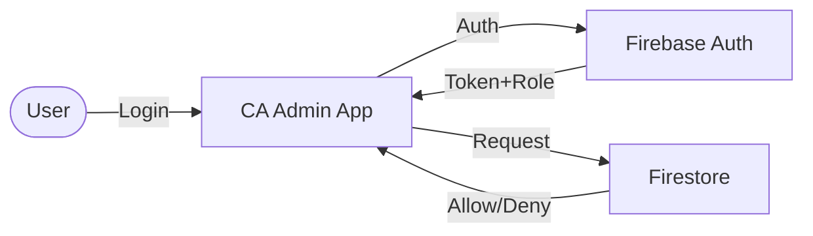

# 🔐 Security & Roles / الأمان والأدوار

> **Project:** CA Admin
> **Version:** v0.1 — Owner: Abdullah Alshaif
> **Last Updated:** 2025-09-08

---

## 8. RBAC vs Other Access Control Models / مقارنة RBAC مع نماذج التحكم الأخرى

**RBAC (Role-Based Access Control):**

- Access is based on user roles (recommended for most business apps).

**ABAC (Attribute-Based Access Control):**

- Access is based on user, resource, and environment attributes (more flexible, more complex).

**MAC (Mandatory Access Control):**

- Access is based on strict policies set by the system (used in high-security environments).

**DAC (Discretionary Access Control):**

- Access is controlled by resource owners (less common in business apps).

---

## 9. Advanced Security Tips / نصائح متقدمة للأمان

- راجع الأدوار والصلاحيات كل 3 أشهر على الأقل.
- استخدم مراجعة الأمان التلقائية (Security Review Automation) إن أمكن.
- اربط كل دور بمتطلبات العمل الفعلية، وتجنب الأدوار العامة غير المحددة.

---

## 10. Example Scenario / سيناريو عملي

---

## 11. Advanced Scenarios for Staff Roles / سيناريوهات متقدمة للموظفين

**EN:**

- Customer Service Staff can only access customer and order libraries, and all their actions (add/edit) are logged for audit.
- Order Processor can view, edit, split, and link orders, create tracking states and invoices, and link invoices to gift cards. All changes are tracked in the audit log.
- Admin can review staff activity logs and restrict access if suspicious activity is detected.

**AR:**

- موظف خدمة العملاء يمكنه فقط الوصول لمكتبة العملاء والطلبيات، وجميع العمليات (إضافة/تعديل) يتم تسجيلها للمراجعة.
- منفذ الطلبات يمكنه استعراض وتعديل وربط وتقسيم الطلبيات، وإنشاء حالات تتبع وفواتير وربطها ببطاقات الهدايا، وجميع التغييرات يتم تسجيلها في سجل التدقيق.
- المدير يمكنه مراجعة سجلات نشاط الموظفين وتقييد الصلاحيات عند اكتشاف نشاط مشبوه.

---

## 12. FAQ for Staff Roles / الأسئلة الشائعة حول أنواع الموظفين

**Q: هل يمكن إضافة أنواع موظفين جديدة مستقبلاً؟**

نعم، يمكن إضافة أنواع جديدة حسب توسع النظام، مع تحديد صلاحيات واضحة لكل نوع.

**Q: كيف يتم مراقبة نشاط الموظفين؟**

كل عملية يقوم بها الموظف يتم تسجيلها في سجل التدقيق ويمكن مراجعتها من قبل المدير أو المدقق.

**Q: هل يمكن للموظف تنفيذ عمليات خارج صلاحياته؟**

لا، يتم تطبيق قواعد Firestore الأمنية ومراجعة الصلاحيات بشكل دوري لضمان الالتزام.

---

**EN:**

> The Admin creates a new user for the Finance team. The Admin assigns the `finance` role using a Cloud Function. The user logs in, receives a token with the `finance` claim, and can now access financial logs and reports, but not admin settings.

**AR:**

> يقوم المدير بإنشاء مستخدم جديد لفريق المالية. يعيّن المدير دور `finance` باستخدام Cloud Function. عند تسجيل دخول المستخدم، يحصل على رمز دخول يحمل صلاحية `finance` ويمكنه الوصول لسجلات المالية والتقارير فقط، ولا يمكنه الوصول لإعدادات المدير.

---

## 🛡️ Visual Security Overview / ملخص بصري للأمان



---

## 1. Introduction / المقدمة


**EN:**
Security in CA Admin is managed via **Role-Based Access Control (RBAC)**. Roles are assigned using **Firebase Authentication** and **Custom Claims**, while access rules are enforced with **Firestore Security Rules**.

**AR:**
يتم إدارة الأمان في نظام CA Admin عبر **التحكم في الوصول المبني على الأدوار (RBAC)**. تُمنح الأدوار من خلال **Firebase Authentication** باستخدام **Custom Claims**، ويتم تطبيق قواعد الوصول عبر **Firestore Security Rules**.

---

## 2. User Roles & RBAC Matrix / أدوار المستخدمين ومصفوفة الصلاحيات

| Role (EN)                  | الدور (AR)        | Description / الوصف                                           | Permissions / الصلاحيات                                                                                                |
| -------------------------- | ----------------- | ------------------------------------------------------------- | ---------------------------------------------------------------------------------------------------------------------- |
| **Admin**                  | المدير            | Full system access, manage roles, audit logs                  | CRUD on all modules, manage users, configure system                                                                    |
| **Finance**                | المالي            | Handle invoices, payments, reports                            | Create/update financial logs, view orders, generate reports                                                            |
| **Customer Service Staff** | موظف خدمة العملاء | Enter customer names and orders                               | Add/edit customer data, add/edit customer orders                                                                       |
| **Order Processor**        | منفذ الطلبات      | Process, edit, split, and link orders, tracking, and invoices | Create/edit orders, link/split orders, create tracking states, create invoices, link invoices to orders and gift cards |
| **Staff (KSA)**            | موظف السعودية     | Process purchases, register shipments                         | Create/update orders, shipments, attach images                                                                         |
| **Staff (Yemen)**          | موظف اليمن        | Handle local deliveries                                       | Update delivery status, assign to drivers                                                                              |
| **Driver**                 | السائق            | Transport shipments, update status                            | Update shipment status only                                                                                            |
| **Customer**               | العميل            | Submit and track orders                                       | Create orders, view their own orders & balances                                                                        |

---

## 3. Authentication vs Authorization / الفرق بين المصادقة والصلاحيات

**Authentication (المصادقة):**

- Verifies user identity (login via Firebase Auth).

**Authorization (الصلاحيات):**

- Determines what the user can access (based on role claims & security rules).

---

## 4. Firebase Security Rules / قواعد Firestore الأمنية

**Sample (simplified):**

```js
rules_version = '2';
service cloud.firestore {
  match /databases/{database}/documents {
    // Customers can only read/write their own orders
    match /customers/{customerId}/orders/{orderId} {
      allow read, write: if request.auth != null && request.auth.uid == customerId;
    }
    // Finance role can manage financialLogs
    match /financialLogs/{logId} {
      allow read, write: if request.auth.token.role == 'finance' || request.auth.token.role == 'admin';
    }
    // Admin full access
    match /{document=**} {
      allow read, write: if request.auth.token.role == 'admin';
    }
  }
}
```

---

## 5. Role Assignment (Custom Claims) / تعيين الأدوار

Admin assigns roles via Cloud Function:

```js
const admin = require("firebase-admin");

exports.setUserRole = functions.https.onCall((data, context) => {
  if (context.auth.token.role !== "admin") {
    throw new functions.https.HttpsError("permission-denied");
  }
  return admin.auth().setCustomUserClaims(data.uid, { role: data.role });
});
```

**Example roles:** `admin`, `finance`, `staff-ksa`, `staff-yemen`, `driver`, `customer`

---

## 6. Security Tips & Best Practices / نصائح وممارسات الأمان

**EN:**

- Enforce least privilege principle (give minimum required permissions).
- Use Firestore Security Rules Simulator before production.
- Enable Firestore logging for auditing.
- Use audit logs to track changes.

**AR:**

- تطبيق مبدأ أقل صلاحية (إعطاء الحد الأدنى من الصلاحيات).
- اختبار القواعد عبر المحاكي قبل الإطلاق.
- تفعيل سجلات Firestore للمراجعة.
- استخدام سجل تدقيق لمتابعة جميع التغييرات.
- سيتم إضافة أنواع موظفين وصلاحيات جديدة مستقبلاً حسب توسع النظام.

---

---

## 7. FAQ & Notes / أسئلة شائعة وملاحظات

- Roles defined here must stay synchronized with [Stakeholders](../02-stakeholders/02-stakeholders.md) and [User Stories](../03-stories/03-stories.md).
- Changes in business roles must be updated in Security Rules immediately.
- Admin role is powerful; access should be tightly controlled.

**Q: How do I add a new role?**

**A:**

- Add the role to the RBAC matrix and update security rules.
- Update Cloud Functions for role assignment if needed.

**Q: What if a user needs multiple roles?**

**A:**

- Use an array of roles in custom claims and check with `request.auth.token.roles` in rules.

---
