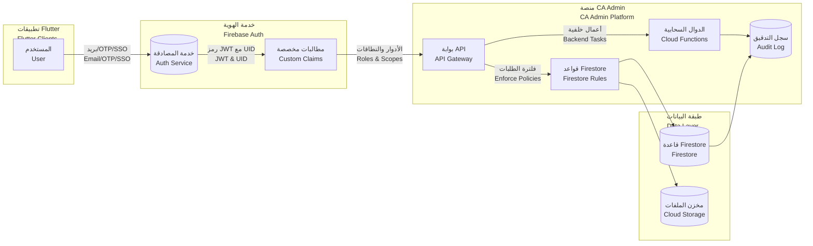
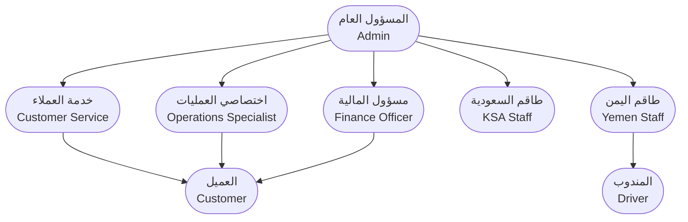
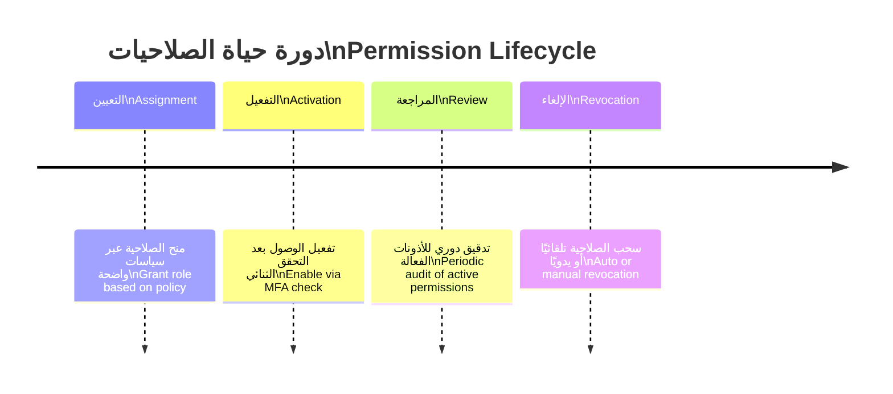

# 🛡️ الأمن والأدوار | Security & Roles

| العنصر        | التفاصيل                                                                                                                                                                                                                                                       |
| ------------- | -------------------------------------------------------------------------------------------------------------------------------------------------------------------------------------------------------------------------------------------------------------- |
| المنتج        | منصة الوساطة الشرائية CA Admin<br>CA Admin Shopping Mediation Platform                                                                                                                                                                                         |
| الإصدار       | 0.1 – آخر تحديث 2025-09-08 – المالك: عبدالله الشائف<br>Version 0.1 – Last Updated 2025-09-08 – Owner: Abdullah Alshaif                                                                                                                                         |
| الهدف         | حماية البيانات وتحديد الصلاحيات بدقة عبر الأدوار المتخصصة<br>Protect data and define privileges precisely through specialised roles                                                                                                                            |
| المكدس الأمني | Firebase Auth، Firestore Security Rules، Cloud Functions، Custom Claims<br>Firebase Auth, Firestore Security Rules, Cloud Functions, Custom Claims                                                                                                             |
| مستندات متصلة | `docs/05-data-model/05-data-model.md`، `docs/06-architecture/06-architecture.md`، `docs/07-process-flows/07-process-flows.md`<br>`docs/05-data-model/05-data-model.md`, `docs/06-architecture/06-architecture.md`, `docs/07-process-flows/07-process-flows.md` |

> 🔑 **الملخص السريع:** يوضح هذا المستند كيف نحمي النظام من خلال طبقات الهوية، الصلاحيات، والتدقيق، ويعرّف أدوار المستخدمين ونطاقاتهم التنفيذية.
> 🔑 **Quick Summary:** Explains how identity, privilege, and audit layers protect the platform, and defines user roles with their execution scope.

---

## 1. نظرة على بنية الأمن | Security Architecture Overview



> 🧭 يبين الرسم كيف تتفاعل الهوية، البوابة، والدوال لتطبيق الصلاحيات وتسجيل الأحداث.
> 🧭 Diagram shows how identity, gateway, and functions collaborate to enforce privileges and log events.

---

## 2. مشهد الأدوار | Role Landscape



---

## 3. مصفوفة القدرات للأدوار | Role Capability Matrix

| الدور Role                                   | الصلاحيات الأساسية Core Permissions                                                                         | أدوات العمل Tooling                                                          | حمل المراجعة Review Load                                           | صلاحيات البيانات Data Scope                                                                    |
| -------------------------------------------- | ----------------------------------------------------------------------------------------------------------- | ---------------------------------------------------------------------------- | ------------------------------------------------------------------ | ---------------------------------------------------------------------------------------------- |
| 🛡️ المسؤول العام<br>Admin                    | إدارة المستخدمين، ضبط السياسات، قبول التغييرات الكبرى<br>User provisioning, policy updates, major approvals | وحدة التحكم الإدارية، لوحات المراقبة<br>Admin console, monitoring dashboards | مراجعة أسبوعية للولوج والتقارير<br>Weekly access and report review | وصول شامل مع توثيق كامل للأحداث<br>Full access with complete audit capture                     |
| 💳 مسؤول المالية<br>Finance Officer          | إدارة الدفعات، التسويات، التقارير المصرفية<br>Handle payments, reconciliations, banking reports             | لوحات المالية، تقارير التدقيق<br>Finance dashboards, audit reports           | مراجعة يومية للمعاملات<br>Daily transaction checks                 | الوصول إلى سجلات المالية فقط<br>Finance records only                                           |
| ⚙️ اختصاصي العمليات<br>Operations Specialist | إدارة الطلبات، تتبع الشحنات، التواصل مع الموردين<br>Order handling, shipment tracking, vendor coordination  | أدوات العمليات، سجل الشحن<br>Ops tools, shipment log                         | مراجعة كل مناوبة<br>Per-shift review                               | بيانات الطلب والشحن بدون تفاصيل مالية<br>Order and shipment data without finance               |
| 💬 خدمة العملاء<br>Customer Service          | تسجيل الطلبات، متابعة التذاكر، تحديث الحالة<br>Record orders, follow tickets, update status                 | واجهات الدعم، قواعد المعرفة<br>Support dashboards, knowledge base            | مراجعة نصف يومية<br>Twice daily checks                             | بيانات العميل والطلب بدون معلومات مالية حساسة<br>Customer/order data without sensitive finance |
| 🏢 طاقم السعودية<br>KSA Staff                | عمليات المستودع، تجهيز التسليم، مهام التصدير<br>Warehouse ops, delivery prep, export tasks                  | بوابة المستودع، نظام التفتيش<br>Warehouse portal, checkpoint app             | مراجعة نهاية اليوم<br>End-of-day review                            | بيانات الشحن داخل نطاق المنطقة فقط<br>Shipment data within regional scope                      |
| 🏢 طاقم اليمن<br>Yemen Staff                 | الاستلام، الفرز، التسليم المحلي<br>Receiving, sorting, local delivery                                       | تطبيق الميل الأخير، سجل POD<br>Last-mile app, POD log                        | مراجعة نهاية اليوم<br>End-of-day review                            | بيانات التسليم ضمن اليمن فقط<br>Delivery data within Yemen only                                |
| 🚚 المندوب<br>Driver                         | استلام جداول التسليم، رفع إثبات POD<br>Receive delivery schedule, upload POD                                | تطبيق التوزيع المحمول<br>Mobile delivery app                                 | مراجعة أسبوعية مع المشرف<br>Weekly check-in with lead              | بيانات الطلب المحدد المسند إليه فقط<br>Only assigned order data                                |
| 👤 العميل<br>Customer                        | متابعة الطلب، تحديث معلومات الاتصال، إرسال المدفوعات<br>Track orders, update contact info, submit payments  | تطبيق العميل، البريد، الإشعارات<br>Customer app, email, notifications        | مراجعة ذاتية عند الحاجة<br>Self-review on demand                   | بياناته الخاصة والمؤشرات العامة<br>Their data and public indicators                            |

---

## 4. نماذج التحكم بالوصول | Access Control Models

- 🔐 **RBAC** يعتمد على الأدوار الرئيسية المحددة في مصفوفة القدرات.
  🔐 RBAC relies on the primary roles defined in the capability matrix.
- 📌 **ABAC** يستخدم سمات إضافية (المنطقة، نوع العميل) لتقييد الوصول.
  📌 ABAC adds attributes (region, customer tier) to tighten access.
- 🪪 **Just-in-Time Access** يمنح صلاحيات مؤقتة عند الحالات الحرجة عبر طلبات موثقة.
  🪪 Grants temporary privileges during critical events through documented requests.

---

## 5. دورة حياة الصلاحيات | Permission Lifecycle



- 📆 مراجعات ربع سنوية للأدوار الحساسة للتحقق من استمرار الحاجة.
  📆 Quarterly reviews for sensitive roles to confirm ongoing necessity.
- 🔄 تسجيل كل تعديلات الصلاحيات في سجل التدقيق وربطها بالت チ يتات.
  🔄 Log every permission change in audit trail and attach to tickets.

---

## 6. الضوابط الأمنية الأساسية | Core Security Controls

| التحكم                                           | الوصف                                                                                                                | القيمة                                                                                            |
| ------------------------------------------------ | -------------------------------------------------------------------------------------------------------------------- | ------------------------------------------------------------------------------------------------- |
| 🔐 المصادقة متعددة العوامل<br>MFA                | إلزام الإداريين والمالية بمصادقة ثنائية.<br>Require MFA for admins and finance roles.                                | يقلل خطر الاستحواذ على الحسابات.<br>Mitigates account takeover risk.                              |
| 🧾 السجل التدقيقي<br>Audit Trail                 | تسجيل كل عمليات CRUD الحساسة مع معرف المستخدم والزمن.<br>Log sensitive CRUD events with user id and timestamp.       | يمكّن التحقيقات السريعة والإثباتات الرسمية.<br>Enables rapid investigation and official evidence. |
| 🛡️ حماية البيانات أثناء النقل<br>Data in Transit | إلزام HTTPS وTLS 1.2 لجميع القنوات الداخلية والخارجية.<br>Force HTTPS and TLS 1.2 on all channels.                   | يمنع التنصت ويضمن سلامة البيانات.<br>Prevents eavesdropping and data tampering.                   |
| 🗄️ الفصل الإقليمي<br>Regional Segregation        | فصل قواعد البيانات والمخازن بين السعودية واليمن عند الحاجة.<br>Separate data stores for KSA and Yemen when required. | يدعم الامتثال المحلي ويقلل مخاطر التسريب.<br>Supports local compliance and lowers leakage risk.   |

---

## 7. نطاقات الأذونات النموذجية | Sample Permission Scopes

| العملية                                     | Admin | Finance | Operations | Support |
| ------------------------------------------- | ----- | ------- | ---------- | ------- |
| عرض البيانات الحساسة<br>View sensitive data | ✅    | ✅      | ⛔         | ⛔      |
| تحرير الطلبات<br>Edit orders                | ✅    | ⛔      | ✅         | ⛔      |
| معالجة المدفوعات<br>Process payments        | ✅    | ✅      | ⛔         | ⛔      |
| إدارة المستخدمين<br>Manage users            | ✅    | ⛔      | ⛔         | ⛔      |
| التعامل مع التذاكر<br>Handle tickets        | ✅    | ⛔      | ✅         | ✅      |

> 📋 يمكن توسيع الجدول لتغطية فرق KSA/Yemen بنفس النمط مع التحقق الإقليمي.
> 📋 The matrix can be extended for KSA/Yemen teams with regional enforcement.

---

## 8. قواعد Firestore ومطالبات الأدوار | Firestore Rules & Custom Claims

```js
rules_version = '2';
service cloud.firestore {
  match /databases/{database}/documents {
    match /customers/{customerId}/orders/{orderId} {
      allow read, write: if request.auth != null && request.auth.uid == customerId;
    }
    match /financialLogs/{logId} {
      allow read, write: if request.auth.token.roles.hasAny(['finance', 'admin']);
    }
    match /{document=**} {
      allow read, write: if request.auth.token.roles.hasAny(['admin']);
    }
  }
}
```

```js
exports.setUserRoles = functions.https.onCall((data, context) => {
  if (!context.auth || !context.auth.token.roles?.includes("admin")) {
    throw new functions.https.HttpsError("permission-denied");
  }
  const roles = data.roles || [];
  return admin.auth().setCustomUserClaims(data.uid, { roles });
});
```

> 🧪 يضمن التحقق من المطالبات تخصيص الوصول بدقة وربطه بتذاكر المراجعة.<br>🧪 Claim validation ensures precise access allocation tied to review tickets.

---

## 9. خطة الاستجابة للحوادث | Incident Response Snapshot

1. 🚨 التنبيه: مراقبة Firebase Alerts وCloud Logging لأي نشاط غير معتاد.
   🚨 Alerts: Watch Firebase Alerts and Cloud Logging for unusual activity.
1. 🔄 الاحتواء: إيقاف الجلسات عبر `revokeRefreshTokens` وتعطيل الحساب مؤقتًا.
   🔄 Contain: Revoke sessions and temporarily disable compromised accounts.
1. 🔍 التحقيق: مراجعة السجل التدقيقي وربطه بالسجلات الخارجية إن لزم.
   🔍 Investigate: Review audit logs and correlate with external records if needed.
1. 🧪 التصحيح: إصلاح السبب الجذري وتحديث الضوابط والسياسات.
   🧪 Remediate: Fix root cause and update guards and policies.
1. 🧾 التقارير: إعداد تقرير ما بعد الحادث وتحديث ADR وRunbook.
   🧾 Report: Produce post-incident report and update ADR & runbooks.

---

## 10. الأسئلة الشائعة | FAQ

- ❓ كيف تُنشأ صلاحيات جديدة؟  
  ❓ How do we create new permissions?
  - 🛠️ تقديم طلب رسمي، تحديث `custom claims`, ثم تعديل قواعد Firestore قبل النشر.
    🛠️ Submit a formal request, update custom claims, and adjust Firestore rules before rollout.
- ❓ كيف نتحقق من المستخدمين المشتبه بهم؟  
  ❓ How do we investigate suspicious users?
  - 🔍 استخدام `listUsers`, مراجعة سجلات `Audit`, وتعليق الجلسات مؤقتًا حتى انتهاء التحقيق.
    🔍 Use `listUsers`, review `Audit` logs, and suspend sessions until investigation completes.

---

## 11. نصائح وممارسات أمنية | Security Tips & Best Practices

- 🔑 مراجعة دورية للأدوار العالية الحساسية وتوثيق نتائج التدقيق.
  🔑 Perform periodic reviews for high-sensitivity roles and document findings.
- 🧪 اختبار قواعد Firestore باستخدام الـ Emulator قبل النشر.
  🧪 Test Firestore rules with the Emulator before release.
- 📊 تصدير تقارير Auth وFirestore إلى BigQuery للمراقبة المتقدمة.
  📊 Export Auth and Firestore reports to BigQuery for advanced monitoring.
- 🔐 تفعيل مزودات الهوية الخارجية (SSO) للمستخدمين الداخليين.
  🔐 Enable external identity providers (SSO) for internal users.
- 🧭 تحديث ADR عندما يتغير أي جانب من سياسة الوصول أو الأدوات الأمنية.
  🧭 Update ADR whenever access policies or security tools change.

> 🧾 **ملاحظة ختامية:** حدِّث هذه الوثيقة فور أي تعديل على الصلاحيات أو السياسات ليتوافق الأمن مع الواقع التشغيلي.
> 🧾 **Closing Note:** Refresh this document whenever privileges or policies change to keep security aligned with operations.
