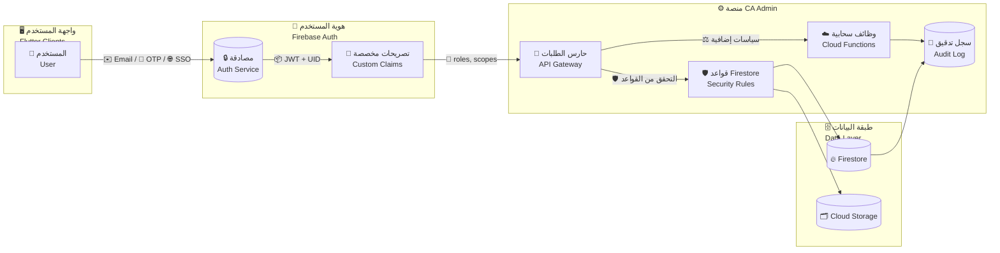
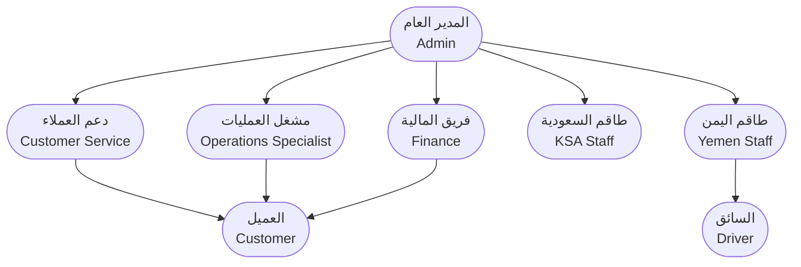
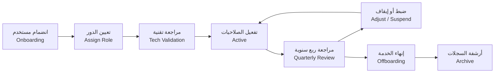

# الأمن والأدوار | Security & Roles

> 🏷️ **المنتج / Product:** CA Admin Shopping Mediation Platform  
> 🗓️ **الإصدار / Version:** v0.1 — آخر تحديث 2025-09-08 بواسطة Abdullah Alshaif  
> 🧭 **الغرض / Purpose:** تأمين المنصة وتوزيع الصلاحيات بطريقة تحقق الامتثال، المرونة، وسهولة الإدارة لجميع الفرق.

---

## لمحة سريعة | Quick Glance

- 🛡️ **طبقات الحماية / Defense Layers** — مصادقة Firebase، تصريحات `custom claims`، قواعد Firestore، وظائف Cloud، وسجلات تدقيق مركزية.
- 👥 **مصفوفة الأدوار / Role Matrix** — أدوار واضحة (Admin, Finance, Operations, Customer Service, KSA/Yemen Staff, Driver, Customer) مع دعم الجمع بين الأدوار عند الحاجة.
- 🔄 **دورة الحياة / Lifecycle** — انضمام المستخدم، تفعيل الدور، مراجعات ربع سنوية، وتعطيل فوري في حال الاشتباه.
- 📈 **القيمة / Value** — مرجع موحد للمبرمج، محلل الأعمال، وقيادة العمليات لضمان تناسق المتطلبات الأمنية عبر الوثائق الأخرى.

---

## 1. نظرة معمارية للأمان | Security Architecture Overview



> 🧩 **كيفية القراءة:** المستخدم يصادق عبر Auth، تُحقن الأدوار في `custom claims`، وتتحقق البوابة وقواعد Firestore من كل طلب قبل لمس البيانات.

---

## 2. مشهد الأدوار | Role Landscape



### مصفوفة القدرات | Role Capability Matrix

| الدور / Role                 | الوصول إلى البيانات                           | العمليات المسموحة                                       | متطلبات التدقيق                              | القيمة التشغيلية             |
| ---------------------------- | --------------------------------------------- | ------------------------------------------------------- | -------------------------------------------- | ---------------------------- |
| 👑 **Admin**                 | جميع المجموعات، لوحات التحكم، سجلات التدقيق   | إدارة الأدوار، تعطيل المستخدمين، ضبط السياسات           | مراجعة لكل تغيير، موافقة ثنائية على السياسات | التحكم العام وضمان الامتثال  |
| 💳 **Finance Officer**       | أوامر الفوترة، دفعات العملاء، مستندات التسوية | إنشاء/إغلاق الفواتير، مطابقة الدفعات، تصدير التقارير    | تتبع كامل لكل عملية مالية + أرشفة 5 سنوات    | حماية الإيرادات ودقة السجلات |
| 🛠️ **Operations Specialist** | الطلبات، الشحنات، روابط الموردين              | تدقيق الطلب، تعديل الشحنة، إنشاء تتبع، تقسيم الطلبات    | ختم زمني على كل تعديل + لقطات قبل/بعد        | الحفاظ على انسياب العمليات   |
| 🎧 **Customer Service**      | بيانات العملاء، التذاكر، سجل الطلب            | إنشاء طلب، تحديث الحالة، تسجيل الملاحظات، إغلاق التذكرة | تسجيل محادثات العملاء وإرفاق الأدلة          | تجربة عملاء موحدة وسريعة     |
| 🕌 **KSA Staff**             | أوامر الشراء الداخلية، جدول الاستلام          | تحديث حالة التوريد، تحميل فواتير المورد                 | إلزام برفع مستند المورد خلال 4 ساعات         | دقة التوريد والتجميع         |
| 🕌 **Yemen Staff**           | قوائم الشحن، خطط التسليم                      | فرز الشحنات، جدولة التسليم، رفع POD                     | إرفاق إثبات التسليم خلال 2 ساعة              | إتمام الميل الأخير بلا فجوات |
| 🚚 **Driver**                | طلبات التسليم المخصصة، بيانات الاتصال         | تأكيد الاستلام، رفع صورة POD، تحديث الموقع              | تسجيل توقيت وموقع التسليم تلقائيًا           | شفافية التسليم النهائي       |
| 🙋 **Customer**              | لوحة تتبع الطلب والفواتير الخاصة              | عرض الحالة، رفع استفسار، دفع آمن                        | موافقة على سياسة الخصوصية                    | تجربة شراء موثوقة            |

---

## 3. نماذج التحكم بالوصول | Access Control Models

| النموذج              | الوصف المختصر                           | نقاط القوة                            | التحديات                         | مناسب لـ                              |
| -------------------- | --------------------------------------- | ------------------------------------- | -------------------------------- | ------------------------------------- |
| **RBAC**             | الصلاحيات مبنية على الدور الوظيفي       | سهل الفهم، بسيط الإدارة، يدعم التدقيق | يحتاج تحديث يدوي عند تغير المهام | فرق العمليات الثابتة                  |
| **ABAC**             | يعتمد على السمات (دور، موقع، وقت، سياق) | مرونة عالية، يقيّد الوصول ديناميكيًا  | أعقد في البناء والاختبار         | سيناريوهات الامتثال المتقدم           |
| **ReBAC**            | يربط الصلاحيات بالعلاقات بين الكيانات   | مثالي للشركاء والموردين               | تصميم العلاقة حساس ومعقّد        | شبكة متعددة الأطراف                   |
| **Hybrid (موصى به)** | دمج RBAC + ABAC                         | يوازن بين البساطة ومرونة السياق       | يحتاج منصة لإدارة السياسات       | CA Admin حيث تتغير المهام حسب المرحلة |

> ✅ **قرار المنصة:** اتباع RBAC كقاعدة مع تطبيق شروط ABAC إضافية (الموقع، وقت العمل، حالة التذكرة) عبر Cloud Functions وFirestore Rules.

---

## 4. دورة حياة الصلاحيات | Permission Lifecycle



- 👣 **Onboarding:** Cloud Function `assignDefaultRole` تضيف `customer` أو الدور الأولي وتُرسل إرشادات السياسات.
- 🔍 **Tech Validation:** اختبار قواعد Firestore باستخدام الـSimulator قبل فتح الوصول الفعلي.
- 📆 **Quarterly Review:** مقارنة نشاط المستخدم بمصفوفة الأدوار ونزع الصلاحيات غير المستخدمة.
- 🚨 **Adjust/Suspend:** استخدام `revokeRefreshTokens` وتعطيل المستخدم عند الاشتباه.
- 📦 **Offboarding:** نقل الملكيات، إيقاف الوصول، والاحتفاظ بالسجلات لخمس سنوات لأغراض القانون والامتثال.

---

## 5. ضوابط الأمان الأساسية | Core Security Controls

| التحكم                  | الوصف                                       | الأدوات المستخدمة                | النتيجة                               |
| ----------------------- | ------------------------------------------- | -------------------------------- | ------------------------------------- |
| مصادقة متعددة العوامل   | فرض MFA ومحاولات محدودة لتسجيل الدخول       | Firebase Auth, Cloud Functions   | تقليل احتمالات الاستيلاء على الحسابات |
| قواعد Firestore الدقيقة | سياسات لكل مجموعة/وثيقة حسب الدور والسمات   | Firestore Rules, Emulator        | منع الوصول غير المصرح به              |
| فصل الواجبات            | توزيع المهام بين المالية والعمليات والدعم   | مصفوفة الأدوار، مراجعات الامتثال | تقليل مخاطر الاحتيال الداخلي          |
| سجلات تدقيق مركزية      | تسجيل كل عملية CRUD حرجة مع بيانات المستخدم | Cloud Logging, BigQuery Export   | تمكين التحقيق والاستجابة السريعة      |
| حماية الملفات الحساسة   | تشفير المستندات واستخدام روابط مؤقتة        | Cloud Storage KMS, Signed URLs   | حماية فواتير ومرفقات العملاء          |
| رصد الحوادث             | تنبيهات فورية للنشاط غير الاعتيادي          | Firebase Alerts, PagerDuty       | استجابة استباقية لأي اختراق           |

---

## 6. نطاقات الأذونات النموذجية | Sample Permission Scopes

| العملية / Action          | Customer Service | Operations           | Finance          | Admin    |
| ------------------------- | ---------------- | -------------------- | ---------------- | -------- |
| إنشاء طلب جديد            | ✔️ إنشاء وتعديل  | ✳️ تدقيق بعد الإنشاء | ❌               | ✔️ إشراف |
| تعديل بيانات الشحنة       | 👁️‍🗨️ عرض فقط       | ✔️ تعديل كامل        | ❌               | ✔️       |
| تحميل إثبات التسليم (POD) | ❌               | ✳️ تفويض             | ✔️ مراجعة وإغلاق | ✔️       |
| إصدار فاتورة              | ❌               | ✳️ توصية             | ✔️ إنشاء وإرسال  | ✔️       |
| إيقاف مستخدم              | ❌               | ❌                   | ❌               | ✔️ حصري  |

> ✳️ **تفويض / Delegated:** يمكنه بدء العملية لكن يحتاج موافقة إضافية من الدور المحدد (مثل Admin أو Finance).

---

## 7. إعدادات Firestore وClaims | Firestore Rules & Custom Claims

```js
// firestore.rules
rules_version = '2';
service cloud.firestore {
  match /databases/{database}/documents {

    // وصول العميل لطلباته
    match /customers/{customerId}/orders/{orderId} {
      allow read, write: if request.auth != null && request.auth.uid == customerId;
    }

    // سجلات مالية — Finance أو Admin فقط
    match /financialLogs/{logId} {
      allow read, write: if request.auth.token.roles.hasAny(['finance', 'admin']);
    }

    // افتراضي: Admin فقط
    match /{document=**} {
      allow read, write: if request.auth.token.roles.hasAny(['admin']);
    }
  }
}
```

```js
// functions/assignRole.js
const admin = require("firebase-admin");

exports.setUserRoles = functions.https.onCall((data, context) => {
  if (!context.auth || !context.auth.token.roles?.includes("admin")) {
    throw new functions.https.HttpsError("permission-denied");
  }
  const roles = data.roles || [];
  return admin.auth().setCustomUserClaims(data.uid, { roles });
});
```

> 🛠️ **ممارسات تطبيقية:** بعد تعيين الأدوار، نفّذ `listUsers` لمراجعة الصلاحيات وشغّل اختبارات تكامل للتحقق من القواعد.

---

## 8. خطة الاستجابة للحوادث | Incident Response Snapshot

1. 🚨 **كشف مبكر:** مراقبة Firebase Alerts وCloud Logging لأي نشاط غير اعتيادي (طلبات إدخال خاطئة متكررة، تغير صلاحيات مفاجئ).
2. 🛑 **الاحتواء:** إيقاف الرموز (`revokeRefreshTokens`) وتعطيل الحساب في Auth Console.
3. 🔍 **التحليل:** جمع السجلات، مقارنة مع تغييرات الأدوار، وتحديد مدى انتشار الحادث.
4. 🧹 **الاستعادة:** إعادة تعيين كلمات المرور، مراجعة القواعد، وإبلاغ الفرق/العملاء إذا تأثرت بياناتهم.
5. 📚 **التعلم:** إضافة الدروس المستفادة إلى سجل ADR وتحديث الوثائق ذات الصلة (Security, Architecture, Release & DevOps).

---

## 9. الأسئلة الشائعة | FAQ

> ❓ **كيف أضيف دورًا جديدًا؟**
>
> 1. حدّث هذا المستند ومصفوفة الأدوار.
> 2. أضف الدور إلى `custom claims` عبر Cloud Function.
> 3. عدّل قواعد Firestore وواجهات Flutter للتحقق من الدور.
> 4. أضف اختبارًا تكامليًا للتأكد من صلاحيات الدور الجديد.

---

> ❓ **ماذا لو احتاج المستخدم أكثر من دور؟**
>
> - استخدم مصفوفة أدوار في claims مثل `roles: ['ops','finance']`.
> - في القواعد استخدم `request.auth.token.roles.hasAny(['ops','finance'])`.
> - في الواجهة اختر الدور الفعّال لتجنّب التعارض.

---

> ❓ **كيف يرتبط هذا مع الوثائق الأخرى؟**
>
> - تأكد من التوافق مع [أصحاب المصلحة](../02-stakeholders/02-stakeholders.md) و[قصص المستخدم](../03-stories/03-stories.md).
> - أي تعديل تنظيمي يجب أن يُسجل في ADR داخل `docs/12-release-and-devops/12-release-and-devops.md`.

---

## 10. نصائح الأمان وأفضل الممارسات | Security Tips & Best Practices

- 🔒 التزم بمبدأ أقل امتياز ومنح الصلاحيات على قدر الحاجة فقط.
- 🧪 اختبر قواعد Firestore دوريًا باستخدام الـEmulator قبل أي إطلاق.
- 📝 فعّل تصدير سجلات Auth وFirestore إلى BigQuery لأغراض الامتثال والتحليلات.
- 🆔 ادعم تسجيل الدخول الموحد (SSO) للمستخدمين الداخليين وحدّث سياسات كلمات المرور بانتظام.
- 🧯 في حالة تحديث السياسة الأمنية، وثّق القرار في ADR وأبلغ الفرق الفنية والتشغيلية.

> ✅ **جاهزية الوثيقة:** بعد كل إطلاق رئيسي، تأكد من ظهور مخططات Mermaid بشكل صحيح ومن وضوح النصوص عربية/إنجليزية للمراجعين.
