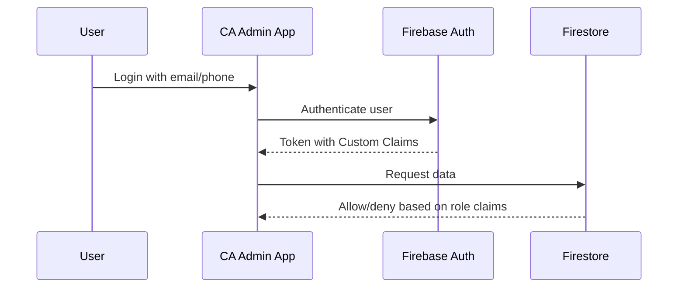

# 🔐 Security & Roles / الأمان والأدوار

> Project: **CA Admin**  
> Version: v0.1 — Owner: Abdullah Alshaif  
> Last Updated: YYYY-MM-DD

---

## 1) Introduction / المقدمة
**EN:**  
Security in CA Admin is managed via **Role-Based Access Control (RBAC)**.  
Roles are assigned using **Firebase Authentication** and **Custom Claims**, while access rules are enforced with **Firestore Security Rules**.

      allow read, write: if request.auth.token.role == 'finance' || request.auth.token.role == 'admin';
6) Security Considerations / اعتبارات الأمان

# 🔐 Security & Roles / الأمان والأدوار

> **Project:** CA Admin  
> **Version:** v0.1 — Owner: Abdullah Alshaif  
> **Last Updated:** 2025-09-08

---

## 1. Introduction / المقدمة

<div align="center">
  
</div>

**EN:**
Security in CA Admin is managed via **Role-Based Access Control (RBAC)**. Roles are assigned using **Firebase Authentication** and **Custom Claims**, while access rules are enforced with **Firestore Security Rules**.

**AR:**
يتم إدارة الأمان في نظام CA Admin عبر **التحكم في الوصول المبني على الأدوار (RBAC)**. تُمنح الأدوار من خلال **Firebase Authentication** باستخدام **Custom Claims**، ويتم تطبيق قواعد الوصول عبر **Firestore Security Rules**.

---

## 2. User Roles & RBAC Matrix / أدوار المستخدمين ومصفوفة الصلاحيات

| Role (EN)      | الدور (AR)     | Description / الوصف | Permissions / الصلاحيات |
|---------------|----------------|---------------------|------------------------|
| **Admin**     | المدير         | Full system access, manage roles, audit logs | CRUD on all modules, manage users, configure system |
| **Finance**   | المالي         | Handle invoices, payments, reports | Create/update financial logs, view orders, generate reports |
| **Staff (KSA)**| موظف السعودية | Process purchases, register shipments | Create/update orders, shipments, attach images |
| **Staff (Yemen)** | موظف اليمن  | Handle local deliveries | Update delivery status, assign to drivers |
| **Driver**    | السائق         | Transport shipments, update status | Update shipment status only |
| **Customer**  | العميل         | Submit and track orders | Create orders, view their own orders & balances |

---

## 3. Authentication & Authorization Flow / تدفق المصادقة والصلاحيات



---

## 4. Firebase Security Rules / قواعد Firestore الأمنية

**Sample (simplified):**

```js
rules_version = '2';
service cloud.firestore {
  match /databases/{database}/documents {
    // Customers can only read/write their own orders
    match /customers/{customerId}/orders/{orderId} {
      allow read, write: if request.auth != null && request.auth.uid == customerId;
    }
    // Finance role can manage financialLogs
    match /financialLogs/{logId} {
      allow read, write: if request.auth.token.role == 'finance' || request.auth.token.role == 'admin';
    }
    // Admin full access
    match /{document=**} {
      allow read, write: if request.auth.token.role == 'admin';
    }
  }
}
```

---

## 5. Role Assignment (Custom Claims) / تعيين الأدوار

Admin assigns roles via Cloud Function:

```js
const admin = require("firebase-admin");

exports.setUserRole = functions.https.onCall((data, context) => {
  if (context.auth.token.role !== 'admin') {
    throw new functions.https.HttpsError('permission-denied');
  }
  return admin.auth().setCustomUserClaims(data.uid, { role: data.role });
});
```

**Example roles:** `admin`, `finance`, `staff-ksa`, `staff-yemen`, `driver`, `customer`

---

## 6. Security Considerations / اعتبارات الأمان

**EN:**
- Enforce least privilege principle (give minimum required permissions).
- Use Firestore Security Rules Simulator before production.
- Enable Firestore logging for auditing.
- Use audit logs to track changes.

**AR:**
- تطبيق مبدأ أقل صلاحية (إعطاء الحد الأدنى من الصلاحيات).
- اختبار القواعد عبر المحاكي قبل الإطلاق.
- تفعيل سجلات Firestore للمراجعة.
- استخدام سجل تدقيق لمتابعة جميع التغييرات.

---

## 7. Notes / ملاحظات

- Roles defined here must stay synchronized with [Stakeholders](../02-stakeholders/02-stakeholders.md) and [User Stories](../03-stories/03-stories.md).
- Changes in business roles must be updated in Security Rules immediately.
- Admin role is powerful; access should be tightly controlled.

---

