# �️ الأمان والأدوار

Security & Roles

---

> **المشروع:** CA Admin
> **Project:** CA Admin
> **الإصدار:** v0.1 — المالك: عبدالله الشائف
> **Version:** v0.1 — Owner: Abdullah Alshaif
> **آخر تحديث:** 2025-09-08
> **Last Updated:** 2025-09-08

**شرح مختصر:**
يهدف هذا القسم إلى توضيح كيف يتم حماية النظام وتوزيع الصلاحيات بين المستخدمين لضمان أمان البيانات وسهولة الإدارة.

**Summary:**
This section explains how the system is protected and how permissions are distributed to ensure data security and easy management.

---

## ملخص بصري للأمان

Visual Security Overview

**شرح مختصر:**
يوضح المخطط كيف يتم التحقق من هوية المستخدم وتوزيع الصلاحيات عبر Firebase وFirestore.

**Summary:**
The diagram shows how user identity is verified and permissions are distributed via Firebase and Firestore.

```mermaid
flowchart LR
  U([👤 مستخدم]) -->|🔑 تسجيل الدخول| APP[تطبيق CA Admin]
  APP -->|🛡️ مصادقة| AUTH[مصادقة Firebase]
  AUTH -->|🎫 رمز + دور| APP
  APP -->|📄 طلب| DB[قاعدة بيانات Firestore]
  DB -->|✅ سماح/رفض| APP
```



---

## مقارنة نماذج التحكم في الوصول

RBAC vs Other Access Control Models

**شرح مختصر:**
يوضح الجدول الفرق بين أشهر نماذج التحكم في الوصول، مع مميزات وعيوب كل نموذج.

**Summary:**
The table shows the difference between popular access control models, with pros and cons for each.

| النموذج | شرح مختصر         | مميزات                     | عيوب              |
| ------- | ----------------- | -------------------------- | ----------------- |
| RBAC    | التحكم حسب الدور  | سهل التطبيق، مناسب للأعمال | محدود المرونة     |
| ABAC    | التحكم حسب الصفات | مرن جداً                   | معقد في التنفيذ   |
| MAC     | التحكم الإجباري   | أمان عالي                  | صعب التخصيص       |
| DAC     | التحكم التقديري   | مرونة للمالك               | غير مناسب للأعمال |

---

## نصائح وممارسات الأمان

Security Tips & Best Practices

**شرح مختصر:**
نصائح عملية لضمان أمان النظام وتحديث الصلاحيات بشكل دوري.

**Summary:**
Practical tips to ensure system security and regularly update permissions.

- راجع الأدوار والصلاحيات كل 3 أشهر على الأقل.
- استخدم مراجعة الأمان التلقائية إن أمكن.
- اربط كل دور بمتطلبات العمل الفعلية وتجنب الأدوار العامة.
- طبّق مبدأ أقل صلاحية.
- اختبر القواعد عبر المحاكي قبل الإطلاق.
- فعّل سجلات Firestore للمراجعة.
- استخدم سجل تدقيق لمتابعة جميع التغييرات.
- أضف أنواع موظفين وصلاحيات جديدة حسب توسع النظام.

---

## المقدمة

Introduction


يتم إدارة الأمان في نظام CA Admin عبر التحكم في الوصول المبني على الأدوار (RBAC). تُمنح الأدوار من خلال Firebase Authentication باستخدام Custom Claims، ويتم تطبيق قواعد الوصول عبر Firestore Security Rules.

Security in CA Admin is managed via Role-Based Access Control (RBAC). Roles are assigned using Firebase Authentication and Custom Claims, while access rules are enforced with Firestore Security Rules.

---

## أدوار المستخدمين ومصفوفة الصلاحيات

User Roles & RBAC Matrix

**شرح مختصر:**
يوضح الجدول التالي صلاحيات كل دور في النظام.

**Summary:**
The table below shows the permissions for each role in the system.

| الدور (AR)        | Role (EN)                  | الوصف / Description                             | الصلاحيات / Permissions                                                                          |
| ----------------- | -------------------------- | ----------------------------------------------- | ------------------------------------------------------------------------------------------------ |
| المدير            | **Admin**                  | وصول كامل للنظام، إدارة الأدوار، مراجعة السجلات | CRUD على جميع الوحدات، إدارة المستخدمين، إعداد النظام                                            |
| المالي            | **Finance**                | إدارة الفواتير والمدفوعات والتقارير             | إنشاء/تحديث سجلات مالية، عرض الطلبات، إنشاء تقارير                                               |
| موظف خدمة العملاء | **Customer Service Staff** | إدخال بيانات العملاء والطلبات                   | إضافة/تعديل بيانات العملاء والطلبات                                                              |
| منفذ الطلبات      | **Order Processor**        | معالجة وتعديل وربط وتقسيم الطلبات، تتبع وفواتير | إنشاء/تعديل الطلبات، ربط/تقسيم الطلبات، إنشاء حالات تتبع وفواتير وربطها بالطلبات وبطاقات الهدايا |
| موظف السعودية     | **Staff (KSA)**            | معالجة المشتريات وتسجيل الشحنات                 | إنشاء/تحديث الطلبات والشحنات وإرفاق الصور                                                        |
| موظف اليمن        | **Staff (Yemen)**          | إدارة التسليم المحلي                            | تحديث حالة التسليم وتعيين السائقين                                                               |
| السائق            | **Driver**                 | نقل الشحنات وتحديث الحالة                       | تحديث حالة الشحنة فقط                                                                            |
| العميل            | **Customer**               | تقديم ومتابعة الطلبات                           | إنشاء الطلبات، عرض الطلبات والأرصدة الخاصة به                                                    |

---

## الفرق بين المصادقة والصلاحيات

Authentication vs Authorization

**شرح مختصر:**
المصادقة تتحقق من هوية المستخدم، بينما الصلاحيات تحدد ما يمكنه الوصول إليه.

**Summary:**
Authentication verifies user identity, while authorization determines what the user can access.

- المصادقة: التحقق من الهوية (تسجيل الدخول عبر Firebase Auth).
- الصلاحيات: تحديد ما يمكن للمستخدم الوصول إليه (حسب الدور وقواعد الأمان).

---

## قواعد Firestore الأمنية

Firebase Security Rules

**شرح مختصر:**
أمثلة على كيفية حماية البيانات حسب الدور.

**Summary:**
Examples of how to protect data based on user role.

```js
rules_version = '2';
service cloud.firestore {
  match /databases/{database}/documents {
    // العملاء يمكنهم فقط قراءة/كتابة طلباتهم
    match /customers/{customerId}/orders/{orderId} {
      allow read, write: if request.auth != null && request.auth.uid == customerId;
    }
    // دور المالية يمكنه إدارة السجلات المالية
    match /financialLogs/{logId} {
      allow read, write: if request.auth.token.role == 'finance' || request.auth.token.role == 'admin';
    }
    // المدير وصول كامل
    match /{document=**} {
      allow read, write: if request.auth.token.role == 'admin';
    }
  }
}
```

---

## تعيين الأدوار (Custom Claims)

Role Assignment (Custom Claims)

**شرح مختصر:**
كيف يقوم المدير بتعيين دور جديد للمستخدم.

**Summary:**
How the admin assigns a new role to a user.

```js
const admin = require("firebase-admin");

exports.setUserRole = functions.https.onCall((data, context) => {
  if (context.auth.token.role !== "admin") {
    throw new functions.https.HttpsError("permission-denied");
  }
  return admin.auth().setCustomUserClaims(data.uid, { role: data.role });
});
```

أمثلة للأدوار: `admin`, `finance`, `staff-ksa`, `staff-yemen`, `driver`, `customer`

---

## سيناريو عملي للأدوار

Example Scenario for Roles

**شرح مختصر:**
يوضح كيف يتم تعيين دور المالية لمستخدم جديد.

**Summary:**
Shows how the finance role is assigned to a new user.

يقوم المدير بإنشاء مستخدم جديد لفريق المالية، ويعيّن له دور `finance` باستخدام Cloud Function. عند تسجيل دخول المستخدم، يحصل على رمز دخول يحمل صلاحية `finance` ويمكنه الوصول لسجلات المالية والتقارير فقط، ولا يمكنه الوصول لإعدادات المدير.

The Admin creates a new user for the Finance team, assigns the `finance` role using a Cloud Function. The user logs in, receives a token with the `finance` claim, and can now access financial logs and reports, but not admin settings.

---

## سيناريوهات متقدمة للموظفين

Advanced Scenarios for Staff Roles

**شرح مختصر:**
أمثلة على صلاحيات الموظفين في النظام.

**Summary:**
Examples of staff permissions in the system.

- موظف خدمة العملاء يمكنه فقط الوصول لمكتبة العملاء والطلبات، وجميع العمليات (إضافة/تعديل) يتم تسجيلها للمراجعة.
- منفذ الطلبات يمكنه استعراض وتعديل وربط وتقسيم الطلبات، وإنشاء حالات تتبع وفواتير وربطها ببطاقات الهدايا، وجميع التغييرات يتم تسجيلها في سجل التدقيق.
- المدير يمكنه مراجعة سجلات نشاط الموظفين وتقييد الصلاحيات عند اكتشاف نشاط مشبوه.

- Customer Service Staff can only access customer and order libraries, and all their actions (add/edit) are logged for audit.
- Order Processor can view, edit, split, and link orders, create tracking states and invoices, and link invoices to gift cards. All changes are tracked in the audit log.
- Admin can review staff activity logs and restrict access if suspicious activity is detected.

---

## الأسئلة الشائعة وملاحظات

FAQ & Notes

**شرح مختصر:**
إجابات على الأسئلة المتكررة حول الأدوار والصلاحيات.

**Summary:**
Answers to common questions about roles and permissions.

- يجب أن تبقى الأدوار متوافقة مع [المعنيين](../02-stakeholders/02-stakeholders.md) و[القصص](../03-stories/03-stories.md).
- أي تغيير في الأدوار يجب تحديثه فورًا في قواعد الأمان.
- دور المدير قوي جدًا ويجب التحكم فيه بدقة.

### س: كيف أضيف دور جديد؟

- أضف الدور إلى مصفوفة RBAC وحدّث قواعد الأمان.
- حدّث Cloud Functions لتعيين الدور إذا لزم الأمر.

### س: ماذا لو احتاج المستخدم أكثر من دور؟

- استخدم مصفوفة أدوار في Custom Claims وتحقق منها في القواعد.

Roles defined here must stay synchronized with [Stakeholders](../02-stakeholders/02-stakeholders.md) and [User Stories](../03-stories/03-stories.md).
Changes in business roles must be updated in Security Rules immediately.
Admin role is powerful; access should be tightly controlled.

**Q: How do I add a new role?**

- Add the role to the RBAC matrix and update security rules.
- Update Cloud Functions for role assignment if needed.

**Q: What if a user needs multiple roles?**

- Use an array of roles in custom claims and check with `request.auth.token.roles` in rules.

---

---

## 🛡️ Visual Security Overview / ملخص بصري للأمان


---

## 1. Introduction / المقدمة


**EN:**
Security in CA Admin is managed via **Role-Based Access Control (RBAC)**. Roles are assigned using **Firebase Authentication** and **Custom Claims**, while access rules are enforced with **Firestore Security Rules**.

**AR:**
يتم إدارة الأمان في نظام CA Admin عبر **التحكم في الوصول المبني على الأدوار (RBAC)**. تُمنح الأدوار من خلال **Firebase Authentication** باستخدام **Custom Claims**، ويتم تطبيق قواعد الوصول عبر **Firestore Security Rules**.

---

## 2. User Roles & RBAC Matrix / أدوار المستخدمين ومصفوفة الصلاحيات

| Role (EN)                  | الدور (AR)        | Description / الوصف                                           | Permissions / الصلاحيات                                                                                                |
| -------------------------- | ----------------- | ------------------------------------------------------------- | ---------------------------------------------------------------------------------------------------------------------- |
| **Admin**                  | المدير            | Full system access, manage roles, audit logs                  | CRUD on all modules, manage users, configure system                                                                    |
| **Finance**                | المالي            | Handle invoices, payments, reports                            | Create/update financial logs, view orders, generate reports                                                            |
| **Customer Service Staff** | موظف خدمة العملاء | Enter customer names and orders                               | Add/edit customer data, add/edit customer orders                                                                       |
| **Order Processor**        | منفذ الطلبات      | Process, edit, split, and link orders, tracking, and invoices | Create/edit orders, link/split orders, create tracking states, create invoices, link invoices to orders and gift cards |
| **Staff (KSA)**            | موظف السعودية     | Process purchases, register shipments                         | Create/update orders, shipments, attach images                                                                         |
| **Staff (Yemen)**          | موظف اليمن        | Handle local deliveries                                       | Update delivery status, assign to drivers                                                                              |
| **Driver**                 | السائق            | Transport shipments, update status                            | Update shipment status only                                                                                            |
| **Customer**               | العميل            | Submit and track orders                                       | Create orders, view their own orders & balances                                                                        |

---

## 3. Authentication vs Authorization / الفرق بين المصادقة والصلاحيات

**Authentication (المصادقة):**

- Verifies user identity (login via Firebase Auth).

**Authorization (الصلاحيات):**

- Determines what the user can access (based on role claims & security rules).

---

## 4. Firebase Security Rules / قواعد Firestore الأمنية

**Sample (simplified):**

```js
rules_version = '2';
service cloud.firestore {
  match /databases/{database}/documents {
    // Customers can only read/write their own orders
    match /customers/{customerId}/orders/{orderId} {
      allow read, write: if request.auth != null && request.auth.uid == customerId;
    }
    // Finance role can manage financialLogs
    match /financialLogs/{logId} {
      allow read, write: if request.auth.token.role == 'finance' || request.auth.token.role == 'admin';
    }
    // Admin full access
    match /{document=**} {
      allow read, write: if request.auth.token.role == 'admin';
    }
  }
}
```

---

## 5. Role Assignment (Custom Claims) / تعيين الأدوار

Admin assigns roles via Cloud Function:

```js
const admin = require("firebase-admin");

exports.setUserRole = functions.https.onCall((data, context) => {
  if (context.auth.token.role !== "admin") {
    throw new functions.https.HttpsError("permission-denied");
  }
  return admin.auth().setCustomUserClaims(data.uid, { role: data.role });
});
```

**Example roles:** `admin`, `finance`, `staff-ksa`, `staff-yemen`, `driver`, `customer`

---

## 6. Security Tips & Best Practices / نصائح وممارسات الأمان

**EN:**

- Enforce least privilege principle (give minimum required permissions).
- Use Firestore Security Rules Simulator before production.
- Enable Firestore logging for auditing.
- Use audit logs to track changes.

**AR:**

- تطبيق مبدأ أقل صلاحية (إعطاء الحد الأدنى من الصلاحيات).
- اختبار القواعد عبر المحاكي قبل الإطلاق.
- تفعيل سجلات Firestore للمراجعة.
- استخدام سجل تدقيق لمتابعة جميع التغييرات.
- سيتم إضافة أنواع موظفين وصلاحيات جديدة مستقبلاً حسب توسع النظام.

---

---

## 7. FAQ & Notes / أسئلة شائعة وملاحظات

- Roles defined here must stay synchronized with [Stakeholders](../02-stakeholders/02-stakeholders.md) and [User Stories](../03-stories/03-stories.md).
- Changes in business roles must be updated in Security Rules immediately.
- Admin role is powerful; access should be tightly controlled.

**Q: How do I add a new role?**

**A:**

- Add the role to the RBAC matrix and update security rules.
- Update Cloud Functions for role assignment if needed.

**Q: What if a user needs multiple roles?**

**A:**

- Use an array of roles in custom claims and check with `request.auth.token.roles` in rules.

---
