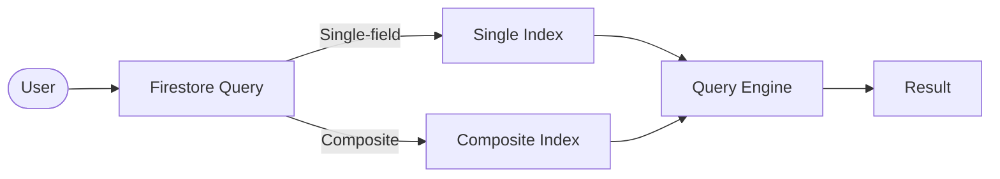

# 📊 Indexes & Queries / الفهارس والاستعلامات

> **Project:** CA Admin
> **Version:** v0.1 — Owner: Abdullah Alshaif
> **Last Updated:** 2025-09-08

---

## 1. Introduction / المقدمة


**EN:**
Indexes and queries in Firestore are critical for performance. Firestore automatically creates single-field indexes but requires **composite indexes** for multi-field queries.

**AR:**
الفهارس والاستعلامات في Firestore ضرورية لتحسين الأداء. يقوم Firestore بإنشاء فهارس أحادية الحقل تلقائيًا، لكن يحتاج إلى **فهارس مركبة** عند وجود استعلامات متعددة الحقول.

---

## 2. Visual Query Flow / ملخص بصري لتدفق الاستعلام



---

## 3. Index Types / أنواع الفهارس

- **Single-field Index:** Automatically created for each field. Fast for simple queries.
- **Composite Index:** Needed for queries with multiple where/orderBy clauses. Must be defined manually.
- **No Index:** Collection scan (not recommended, slow and costly).

---

## 4. Index Type Comparison / مقارنة أنواع الفهارس

| Type               | Use Case                                      | Pros               | Cons                        |
| ------------------ | --------------------------------------------- | ------------------ | --------------------------- |
| Single-field Index | Simple queries on one field                   | Auto-created, fast | Not for multi-field queries |
| Composite Index    | Multi-field queries (where/orderBy > 1 field) | Powerful, flexible | Must be created manually    |
| No Index           | Collection scan (not recommended)             | No setup           | Slow, costly                |

---

## 5. Common Queries / الاستعلامات الشائعة

### Orders / الطلبات

- Get all orders by **customerId**
- Get all orders by **status** and **date range**
- Get unpaid orders (remaining > 0)

### Shipments / الشحنات

- Get shipments by **status** (in-transit, delivered)
- Get shipments assigned to a specific **driverId**

### Finance / المالية

- Get all transactions for a specific **orderId**
- Get payments/deposits by **cardId** and **date range**
- Generate weekly/monthly reports

### Customers / العملاء

- Search by **phone number** or **name**
- List all active customers with open balances

---

## 6. Composite Indexes / الفهارس المركبة

| Collection      | Fields Indexed                    | Purpose / الغرض                            |
| --------------- | --------------------------------- | ------------------------------------------ |
| `orders`        | `customerId + status + createdAt` | Filter by customer, order status, and date |
| `orders`        | `status + createdAt`              | Get all orders in a time range by status   |
| `shipments`     | `status + driverId`               | Query shipments per driver by status       |
| `financialLogs` | `type + createdAt`                | Filter logs by type and time               |
| `bankPayments`  | `cardId + createdAt`              | Payments per card within a date range      |
| `bankDeposits`  | `cardId + createdAt`              | Deposits per card within a date range      |
| `customers`     | `phone + name`                    | Search customers by phone/name             |

---

## 7. Example Firestore Queries / أمثلة استعلامات Firestore

**Dart (FlutterFire):**

```dart
// Get all unpaid orders for a customer
final unpaidOrders = await FirebaseFirestore.instance
  .collection('customers')
  .doc(customerId)
  .collection('orders')
  .where('remaining', isGreaterThan: 0)
  .get();

// Get shipments for a specific driver
final driverShipments = await FirebaseFirestore.instance
  .collection('shipments')
  .where('driverId', isEqualTo: driverId)
  .where('status', isEqualTo: 'in-transit')
  .get();

// Get financial logs by type and date range
final logs = await FirebaseFirestore.instance
  .collection('financialLogs')
  .where('type', isEqualTo: 'payment')
  .where('createdAt', isGreaterThanOrEqualTo: startDate)
  .where('createdAt', isLessThanOrEqualTo: endDate)
  .get();
```

---

## 8. Best Practices & Advanced Tips / أفضل الممارسات ونصائح متقدمة

**EN:**

- Always define composite indexes for frequent multi-field queries.
- Use pagination (startAfter, limit) for large result sets.
- Use cursors instead of offset to optimize performance.
- Avoid queries with != or NOT_IN unless necessary.
- Regularly check Firestore Index Suggestions from Firebase Console.

**AR:**

- أنشئ دائمًا فهارس مركبة للاستعلامات متعددة الحقول.
- استخدم التقسيم (pagination) مع startAfter, limit للنتائج الكبيرة.
- اعتمد على المؤشرات (cursors) بدلًا من offset لتقليل التكلفة.
- تجنّب استخدام != أو NOT_IN إلا عند الحاجة.
- راجع بانتظام اقتراحات الفهارس من Firebase Console.

**Advanced Tips / نصائح متقدمة:**

- راقب أداء الاستعلامات عبر Firebase Console Analytics.
- احذف الفهارس غير المستخدمة لتقليل التكلفة.
- اختبر الاستعلامات المعقدة على بيانات حقيقية قبل الإنتاج.

---

## 9. FAQ & Example / أسئلة شائعة وسيناريو عملي

### Q: متى أحتاج Composite Index؟

**A:**

- عندما تستخدم أكثر من شرط (where) أو ترتيب (orderBy) في نفس الاستعلام.

#### Q: كيف أعرف الفهارس المطلوبة؟

**A:**

- Firebase Console سيعرض رسالة خطأ مع رابط لإنشاء الفهرس المطلوب تلقائيًا عند تنفيذ استعلام غير مدعوم.

**Example Scenario / سيناريو عملي:**

> The finance officer wants all payments for a specific card in August. The query uses `cardId` and `createdAt`, so a composite index is required. After adding the index, the query returns results instantly.

---

---

## 10. Notes / ملاحظات

- Indexes must be updated when the [Data Model](../05-data-model/05-data-model.md) changes.
- Queries here must align with [Use Cases](../04-use-cases/04-use-cases.md).
- Index performance impacts cost (billing). Monitor via Firebase Console.

---
