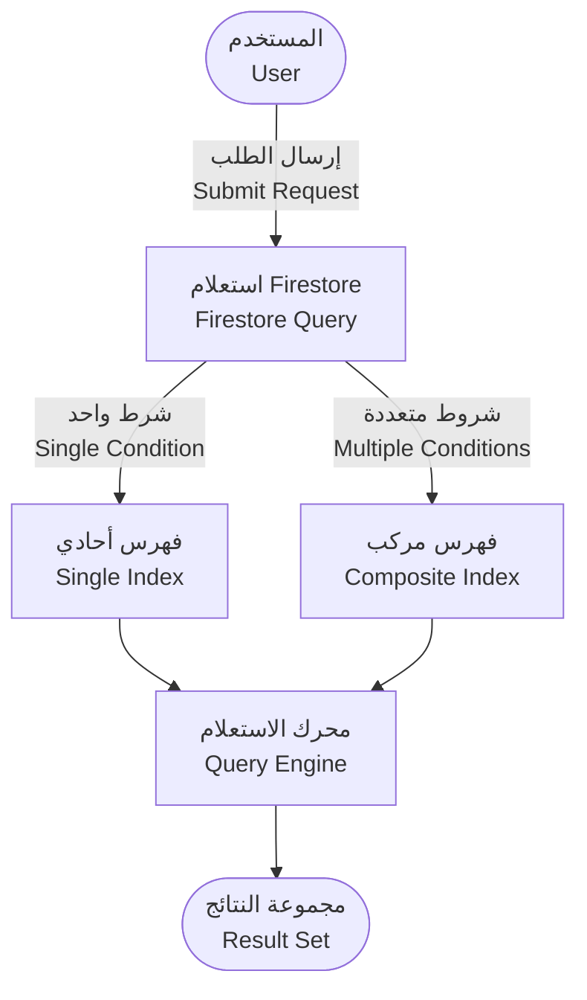
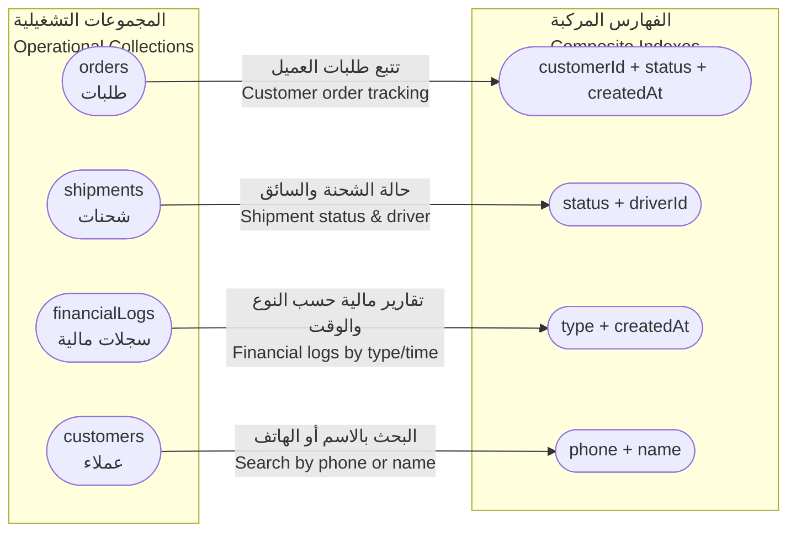
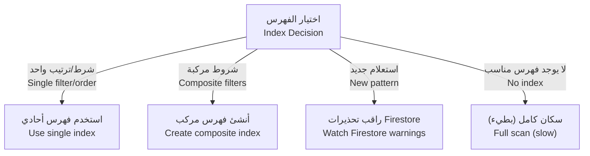

# 🗂️ الفهارس والاستعلامات | Indexes & Queries

| العنصر         | التفاصيل                                                                                                                                                                                                                                           |
| -------------- | -------------------------------------------------------------------------------------------------------------------------------------------------------------------------------------------------------------------------------------------------- |
| المنتج         | منصة الوساطة الشرائية CA Admin<br>CA Admin Shopping Mediation Platform                                                                                                                                                                             |
| الإصدار        | 0.1 – آخر تحديث 2025-09-08 – المالك: عبدالله الشائف<br>Version 0.1 – Last Updated 2025-09-08 – Owner: Abdullah Alshaif                                                                                                                             |
| الهدف          | ربط الفهارس بالاستعلامات لضمان سرعة الأداء، جودة التجربة، وضبط التكلفة<br>Connect indexes to queries to guarantee speed, UX quality, and cost control                                                                                              |
| المكدس         | Firebase Firestore، Cloud Functions، Flutter Client SDKs<br>Firebase Firestore, Cloud Functions, Flutter Client SDKs                                                                                                                               |
| مستندات مرتبطة | `docs/05-data-model/05-data-model.md`، `docs/04-use-cases/04-use-cases.md`، `docs/07-process-flows/07-process-flows.md`<br>`docs/05-data-model/05-data-model.md`, `docs/04-use-cases/04-use-cases.md`, `docs/07-process-flows/07-process-flows.md` |

> 🔑 **الخلاصة:** يوضّح هذا الدليل كيف تدعم الفهارس سيناريوهات العمل الرئيسية، وكيف تكشف أخطاء الاستعلام وتمنع عمليات المسح المكلفة.
> 🔑 **Summary:** Shows how indexes sustain critical business scenarios, surface query issues, and block expensive scans.

---

## 1. المقدمة | Introduction

- 🧭 يشرح نطاق العمل لتأمين استعلامات سريعة عبر بنية Firestore.
  🧭 Defines the scope of keeping Firestore queries fast across the platform.
- 🎯 يبرز هدف المواءمة مع نموذج البيانات وحالات الاستخدام.
  🎯 Aligns indexes with the data model and documented use cases.
- 🧩 يقدم ملاحظات هندسية مختصرة حول إنشاء الفهارس وإدارتها.
  🧩 Provides engineering notes on building and maintaining indexes.

---

## 2. الغرض وملاحظات هندسية | Purpose & Engineering Notes

| ⚙️ الغرض                                                                     | ⚙️ Purpose                                                             |
| ---------------------------------------------------------------------------- | ---------------------------------------------------------------------- |
| ضمان دعم الاستعلامات الحيوية بفهرسة مناسبة، وتحسين الاستجابة لتزايد البيانات | Ensure high-value queries have the right indexing and scale gracefully |

| 🧠 ملاحظات هندسية                                                               | 🧠 Engineering Notes                                                                  |
| ------------------------------------------------------------------------------- | ------------------------------------------------------------------------------------- |
| Firestore ينشئ فهارس أحادية تلقائيًا، لكن الاستعلامات المركبة تحتاج فهارس مخصصة | Firestore auto-creates single-field indexes; composite queries require manual indexes |
| سجل الأخطاء في Firebase Console يعرض روابط جاهزة لإنشاء الفهرس الناقص           | Firebase Console error logs provide direct links to create missing indexes            |
| اختبر الفهارس على بيئة staging لتأكيد الأداء وقواعد الأمان قبل النشر            | Test indexes in staging to validate performance and security rules before release     |

---

## 3. تدفق الاستعلام | Query Flow



> 🔍 يوضح المخطط مسار الاستعلام من الطلب وحتى النتيجة مع تمييز الفهارس المستخدمة.
> 🔍 Highlights the journey from request to result while flagging which index type is used.

---

## 4. ربط الفهارس بالكيانات | Indexes Mapped to Entities



> 🧭 يظهر الرسم ارتباط كل فهرس بمسار أعمال محدد لتسهيل المتابعة والتحديث.
> 🧭 Shows how each index powers a specific business flow for easy upkeep.

---

## 5. دليل اختيار الفهرس | Index Selection Guide



> 🧠 يوفر مخطط القرار علامة واضحة لوقت إضافة فهرس جديد أو إعادة استخدام القائم.
> 🧠 Decision flow tells you when to add a new index versus reusing existing ones.

---

## 6. أنواع الفهارس | Index Types

| النوع                                           | الشرح المختصر                                             | الفائدة                                          |
| ----------------------------------------------- | --------------------------------------------------------- | ------------------------------------------------ |
| 🗂️ الفهرس الأحادي<br>Single-field Index         | يُنشأ تلقائيًا لكل حقل ويدعم الاستعلامات المباشرة         | يبقي عمليات البحث البسيطة سريعة دون تكلفة إضافية |
| 🧩 الفهرس المركب<br>Composite Index             | معرف يدويًا لدمج أكثر من شرط أو ترتيب                     | يمكّن الاستعلامات المعقدة مع الحفاظ على الأداء   |
| 🧠 الفهرس المحسوب<br>Computed Index             | إنشاء حقول مشتقة (مثل حاله الطلب المجتمعة) لتقليل الفهارس | يختصر عدد الفهارس المطلوبة ويقلل تكاليف القراءة  |
| 🔍 الإشارات الجزئية<br>Partial Index Surrogates | استخدام حقول Boolean للتقسيم بدل إنشاء فهرس مركب جديد     | يقلل الحمل على الفهارس المركبة عند تكرار الأنماط |

---

## 7. أمثلة عمليات وفهارس مطابقة | Operational Queries & Index Matches

| السيناريو                 | استعلام مثالي                                                                      | الفهرس المطلوب           | ملاحظات                                 |
| ------------------------- | ---------------------------------------------------------------------------------- | ------------------------ | --------------------------------------- |
| 🧾 طلبات العميل خلال فترة | `where('customerId'==x).where('createdAt','>=',start).where('createdAt','<=',end)` | `customerId + createdAt` | يدعم تقارير العمليات والمالية معًا      |
| 🚚 شحنات السائق الحالية   | `where('driverId'==x).where('status'=='in-transit')`                               | `driverId + status`      | يسرّع تطبيق المندوب ولوحات العمليات     |
| 💳 حركات مالية لنوع محدد  | `where('type'=='payment').orderBy('createdAt')`                                    | `type + createdAt`       | يوفر صفحات مالية دقيقة للبنوك والمدققين |
| 🧾 البحث السريع عن العميل | `where('phone'==x).limit(1)`                                                       | فهرس أحادي على `phone`   | يتكامل مع تدفق تسجيل الطلبات من الهاتف  |

---

## 8. أمثلة Flutter/Firestore | Sample Flutter Firestore Snippets

```dart
final unpaidOrders = await FirebaseFirestore.instance
    .collection('customers')
    .doc(customerId)
    .collection('orders')
    .where('remaining', isGreaterThan: 0)
    .orderBy('createdAt', descending: true)
    .limit(20)
    .get();

final driverShipments = await FirebaseFirestore.instance
    .collection('shipments')
    .where('driverId', isEqualTo: driverId)
    .where('status', isEqualTo: 'in-transit')
    .orderBy('updatedAt', descending: true)
    .get();

final paymentLogs = await FirebaseFirestore.instance
    .collection('financialLogs')
    .where('type', isEqualTo: 'payment')
    .where('createdAt', isGreaterThanOrEqualTo: startDate)
    .where('createdAt', isLessThanOrEqualTo: endDate)
    .orderBy('createdAt')
    .get();
```

> 🧪 استخدم `orderBy` مع الفهرس المناسب لتقليل القراءة وتحسين ترتيب النتائج.
> 🧪 Pair `orderBy` with the matching index to reduce reads and keep results sorted.

---

## 9. أفضل الممارسات والنصائح المتقدمة | Best Practices & Advanced Tips

- 🛠️ أنشئ الفهرس فور تعريف استعلام جديد لتجنب أخطاء زمن التشغيل.
  🛠️ Create the index as soon as a new query shape appears to avoid runtime errors.
- 🔁 استخدم `limit` مع `startAfter` بدل `offset` للحصول على ترقيم صفحات فعال.
  🔁 Prefer `limit + startAfter` over `offset` for efficient pagination.
- 🧮 راقب مؤشرات Firebase Console لتحليل تأثير الفهارس على التكلفة.
  🧮 Monitor Firestore index metrics and billing dashboards for cost awareness.
- 🧬 دمج الاستعلامات المتشابهة يقلل عدد الفهارس ويحسن التعقّب.
  🧬 Consolidate similar query patterns to keep index counts manageable.
- 🧭 حدّث الفهارس عندما يتغير نموذج البيانات أو تتوسع حالات الاستخدام.
  🧭 Refresh indexes whenever the data model or use cases evolve.
- 🧪 استخدم بيئة Staging للتحقق من الأداء وقواعد الأمان قبل الإنتاج.
  🧪 Use staging environments to validate performance and security rules pre-production.

---

## 10. الأسئلة الشائعة والسيناريوهات | FAQ & Scenarios

| السؤال                                                                      | الإجابة                                                                                                                                                    |
| --------------------------------------------------------------------------- | ---------------------------------------------------------------------------------------------------------------------------------------------------------- |
| ❓ متى أحتاج فهرسًا مركبًا؟<br>When do I need a composite index?            | عند دمج أكثر من شرط `where` أو استخدام `orderBy` مع حقل مختلف.<br>Whenever you combine multiple `where` clauses or mix `where` with a different `orderBy`. |
| ❓ كيف أكتشف الفهرس الناقص؟<br>How do I spot a missing index?               | راقب تحذيرات Firebase Console التي توفر رابط إنشاء الفهرس مباشرة.<br>Watch Firebase Console warnings—they include a direct link to generate the index.     |
| ❓ ما أفضل طريقة لتحديث الفهارس؟<br>What is the best way to update indexes? | اجمع الاستعلامات الجديدة، حدّث الفهرس، واختبر النتائج على بيئة تجريبية.<br>Collect new queries, update the index, and test the results in staging.         |

> 📝 سيناريو: يحتاج مسؤول المالية إلى معاملات شهرية حسب نوع البطاقة، فندعم الاستعلام بفهرس `cardId + createdAt` ليصبح التحميل فوريًا.
> 📝 Scenario: Finance officer requests monthly transactions per card; add `cardId + createdAt` index so results load instantly.

---

## 11. ملاحظات ختامية | Final Notes

- 📚 تأكد من تطابق الفهارس مع آخر تحديث لنموذج البيانات.
  📚 Keep indexes aligned with the latest data model revisions.
- 🧾 راجع فواتير Firebase بانتظام للتأكد من عائد الاستثمار لكل فهرس.
  🧾 Review Firebase billing often to validate ROI for each index.
- 🔁 حافظ على هذه الوثيقة كمرجع حي واتبعها مع أي تغييرات جديدة.
  🔁 Maintain this document as a living reference and update alongside new changes.

> 🧾 **تنبيه:** إذا تغيّر أي استعلام أو حالة استخدام، حدّث الفهارس والجداول هنا فورًا.
> 🧾 **Reminder:** Update indexes and this catalogue whenever queries or use cases evolve.
