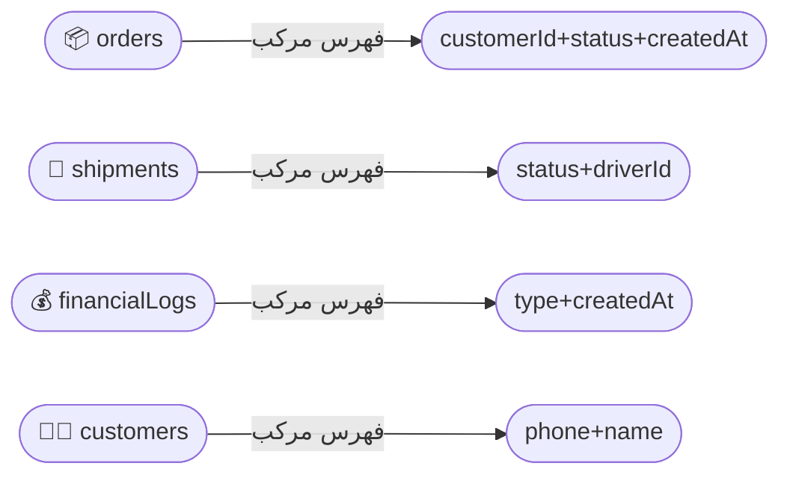

# 📊 الفهارس والاستعلامات | Indexes & Queries

---

> **المشروع:** CA Admin | **Project:** CA Admin
> **الإصدار:** v0.1 — المالك: عبدالله الشائف | **Version:** v0.1 — Owner: Abdullah Alshaif
> **آخر تحديث:** 2025-09-08 | **Last Updated:** 2025-09-08

**شرح مختصر:**
هذا القسم يوضح أهمية الفهارس والاستعلامات لتحسين أداء النظام وسرعة الوصول للبيانات، مع ربطها بنموذج البيانات وحالات الاستخدام، وتوضيح كيف تؤثر على تجربة المستخدم والتكلفة.
**Summary:**
This section explains the importance of indexes and queries for system performance and fast data access, linking them to the data model and use cases, and clarifying their impact on user experience and cost.

---

## 🗄️ المقدمة | Introduction

**شرح مختصر:**
الفهارس والاستعلامات هي الأساس في سرعة النظام وكفاءة البحث عن البيانات، وتؤثر مباشرة على تجربة المستخدم وتكلفة التشغيل.
**Summary:**
Indexes and queries are the foundation for system speed and data search efficiency, directly impacting user experience and operational cost.

- الفهارس والاستعلامات في Firestore ضرورية لتحسين الأداء. يقوم Firestore بإنشاء فهارس أحادية الحقل تلقائيًا، لكن يحتاج إلى فهارس مركبة عند وجود استعلامات متعددة الحقول.
- Indexes and queries in Firestore are critical for performance. Firestore automatically creates single-field indexes but requires composite indexes for multi-field queries.

---

---

## 🖼️ ملخص بصري لتدفق الاستعلام | Visual Query Flow

**شرح مختصر:**
يوضح المخطط كيف ينتقل الاستعلام من المستخدم إلى قاعدة البيانات عبر الفهارس، مع إبراز دور كل نوع فهرس.
**Summary:**
The diagram shows how a query moves from the user to the database through indexes, highlighting the role of each index type.

```mermaid
flowchart TD
  User([👤 مستخدم | User]) -->|يكتب استعلام| Query[🔎 استعلام Firestore | Firestore Query]
  Query -->|🟦 إذا كان الاستعلام بسيط| SIDX[📄 فهرس أحادي | Single Index]
  Query -->|🟧 إذا كان الاستعلام مركب| CIDX[📑 فهرس مركب | Composite Index]
  SIDX --> Engine[⚙️ محرك الاستعلام | Query Engine]
  CIDX --> Engine
  Engine -->|يعالج| Result[📊 النتيجة | Result]
```

---

---

## 🗺️ رسم توضيحي لعلاقة الفهارس بنموذج البيانات | Indexes & Data Model Visual

**شرح مختصر:**
مخطط يوضح كيف ترتبط الفهارس بمجموعات البيانات الرئيسية في النظام، ليسهل على المطور والمحلل فهم العلاقة بين الاستعلامات ونموذج البيانات.
**Summary:**
Diagram showing how indexes are linked to main data collections in the system, making it easier for developers and analysts to understand the relationship between queries and the data model.



---

---

## 🗂️ أنواع الفهارس | Index Types

**شرح مختصر:**
أنواع الفهارس المتاحة في Firestore ومتى يستخدم كل نوع، مع أمثلة عملية لكل نوع.
**Summary:**
Types of indexes available in Firestore and when to use each, with practical examples for each type.

- فهرس أحادي الحقل: يُنشأ تلقائيًا لكل حقل. سريع للاستعلامات البسيطة (مثال: البحث عن عميل برقم الهاتف).
- فهرس مركب: مطلوب للاستعلامات متعددة الحقول. يجب تعريفه يدويًا (مثال: جلب الطلبات حسب الحالة والتاريخ).
- بدون فهرس: فحص كامل للمجموعة (غير مستحب، بطيء ومكلف).
- Single-field index: Automatically created for each field. Fast for simple queries (e.g., search customer by phone).
- Composite index: Required for multi-field queries. Must be defined manually (e.g., get orders by status and date).
- No index: Full collection scan (not recommended, slow and costly).

---

---

---

---

## 📊 مقارنة أنواع الفهارس | Index Type Comparison

**شرح مختصر:**
جدول يوضح مميزات وعيوب كل نوع فهرس، ليسهل اختيار الأنسب للمطور والمحلل.
**Summary:**
Table showing pros and cons of each index type, to help developers and analysts choose the best fit.

| النوع      | الحالة                       | المميزات       | العيوب                            |
| ---------- | ---------------------------- | -------------- | --------------------------------- |
| فهرس أحادي | استعلامات بسيطة على حقل واحد | تلقائي، سريع   | لا يدعم الاستعلامات متعددة الحقول |
| فهرس مركب  | استعلامات متعددة الحقول      | قوي ومرن       | يجب إنشاؤه يدويًا                 |
| بدون فهرس  | فحص كامل للمجموعة            | لا يحتاج إعداد | بطيء ومكلف                        |

---

---

---

---

## الاستعلامات الشائعة

Common Queries

**شرح مختصر:**
أمثلة على الاستعلامات الأكثر استخدامًا في النظام.

**Summary:**
Examples of the most used queries in the system.

### الطلبات

Orders

- جلب جميع الطلبات حسب معرف العميل
- جلب جميع الطلبات حسب الحالة ونطاق التاريخ
- جلب الطلبات غير المدفوعة (remaining > 0)

- Get all orders by customerId
- Get all orders by status and date range
- Get unpaid orders (remaining > 0)

### الشحنات

Shipments

- جلب الشحنات حسب الحالة (قيد النقل، تم التسليم)
- جلب الشحنات المخصصة لسائق معين

- Get shipments by status (in-transit, delivered)
- Get shipments assigned to a specific driverId

### المالية

Finance

- جلب جميع العمليات المالية حسب معرف الطلب
- جلب المدفوعات/الإيداعات حسب معرف البطاقة ونطاق التاريخ
- إنشاء تقارير أسبوعية/شهرية

- Get all transactions for a specific orderId
- Get payments/deposits by cardId and date range
- Generate weekly/monthly reports

### العملاء

Customers

- البحث حسب رقم الهاتف أو الاسم
- عرض جميع العملاء النشطين ذوي الأرصدة المفتوحة

- Search by phone number or name
- List all active customers with open balances

---

## الفهارس المركبة

Composite Indexes

**شرح مختصر:**
جدول يوضح الفهارس المركبة المطلوبة للاستعلامات المتقدمة.

**Summary:**
Table showing composite indexes required for advanced queries.

| المجموعة      | الحقول المفهرسة                 | الغرض                                |
| ------------- | ------------------------------- | ------------------------------------ |
| orders        | customerId + status + createdAt | تصفية حسب العميل والحالة والتاريخ    |
| orders        | status + createdAt              | جلب الطلبات حسب الحالة ونطاق التاريخ |
| shipments     | status + driverId               | جلب الشحنات لكل سائق حسب الحالة      |
| financialLogs | type + createdAt                | تصفية السجلات حسب النوع والزمن       |
| bankPayments  | cardId + createdAt              | المدفوعات لكل بطاقة في فترة زمنية    |
| bankDeposits  | cardId + createdAt              | الإيداعات لكل بطاقة في فترة زمنية    |
| customers     | phone + name                    | البحث عن العملاء حسب الهاتف/الاسم    |

---

## أمثلة استعلامات Firestore

Example Firestore Queries

**شرح مختصر:**
أمثلة عملية على استعلامات Firestore باستخدام Dart (FlutterFire).

**Summary:**
Practical examples of Firestore queries using Dart (FlutterFire).

```dart
// جلب جميع الطلبات غير المدفوعة لعميل معين
final unpaidOrders = await FirebaseFirestore.instance
  .collection('customers')
  .doc(customerId)
  .collection('orders')
  .where('remaining', isGreaterThan: 0)
  .get();

// جلب الشحنات لسائق معين
final driverShipments = await FirebaseFirestore.instance
  .collection('shipments')
  .where('driverId', isEqualTo: driverId)
  .where('status', isEqualTo: 'in-transit')
  .get();

// جلب السجلات المالية حسب النوع ونطاق التاريخ
final logs = await FirebaseFirestore.instance
  .collection('financialLogs')
  .where('type', isEqualTo: 'payment')
  .where('createdAt', isGreaterThanOrEqualTo: startDate)
  .where('createdAt', isLessThanOrEqualTo: endDate)
  .get();
```

---

## أفضل الممارسات ونصائح متقدمة

Best Practices & Advanced Tips

**شرح مختصر:**
نصائح عملية لتحسين أداء الاستعلامات وتقليل التكلفة.

**Summary:**
Practical tips to improve query performance and reduce cost.

- أنشئ دائمًا فهارس مركبة للاستعلامات متعددة الحقول.
- استخدم التقسيم (pagination) مع startAfter, limit للنتائج الكبيرة.
- اعتمد على المؤشرات (cursors) بدلًا من offset لتقليل التكلفة.
- تجنّب استخدام != أو NOT_IN إلا عند الحاجة.
- راجع بانتظام اقتراحات الفهارس من Firebase Console.
- راقب أداء الاستعلامات عبر Firebase Console Analytics.
- احذف الفهارس غير المستخدمة لتقليل التكلفة.
- اختبر الاستعلامات المعقدة على بيانات حقيقية قبل الإنتاج.

---

## الأسئلة الشائعة وسيناريو عملي

FAQ & Example

**شرح مختصر:**
إجابات على الأسئلة المتكررة وسيناريو عملي حول الفهارس.

**Summary:**
Answers to common questions and a practical scenario about indexes.

### متى أحتاج فهرس مركب؟

When do I need a composite index?

- عندما تستخدم أكثر من شرط (where) أو ترتيب (orderBy) في نفس الاستعلام.
- When you use more than one where or orderBy in the same query.

### كيف أعرف الفهارس المطلوبة؟

How do I know which indexes are needed?

- Firebase Console سيعرض رسالة خطأ مع رابط لإنشاء الفهرس المطلوب تلقائيًا عند تنفيذ استعلام غير مدعوم.
- Firebase Console will show an error message with a link to create the required index automatically when running an unsupported query.

**سيناريو عملي:**

Example Scenario:

يريد مسؤول المالية جميع المدفوعات لبطاقة معينة في شهر أغسطس. يستخدم الاستعلام `cardId` و`createdAt`، لذا يحتاج إلى فهرس مركب. بعد إضافة الفهرس تظهر النتائج فورًا.

The finance officer wants all payments for a specific card in August. The query uses `cardId` and `createdAt`, so a composite index is required. After adding the index, the query returns results instantly.

---

## ملاحظات

Notes

**شرح مختصر:**
نقاط مهمة حول تحديث الفهارس وربطها بنموذج البيانات وحالات الاستخدام.

**Summary:**
Important notes about updating indexes and linking them to the data model and use cases.

- يجب تحديث الفهارس عند تغيير [نموذج البيانات](../05-data-model/05-data-model.md).
- يجب أن تتوافق الاستعلامات هنا مع [حالات الاستخدام](../04-use-cases/04-use-cases.md).
- أداء الفهارس يؤثر على التكلفة (الفواتير). راقب ذلك عبر Firebase Console.

Indexes must be updated when the [Data Model](../05-data-model/05-data-model.md) changes.
Queries here must align with [Use Cases](../04-use-cases/04-use-cases.md).
Index performance impacts cost (billing). Monitor via Firebase Console.

---
