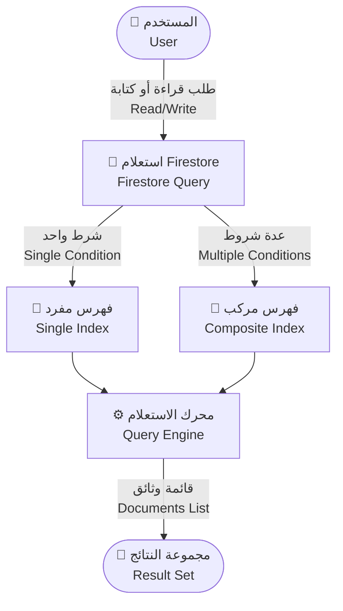
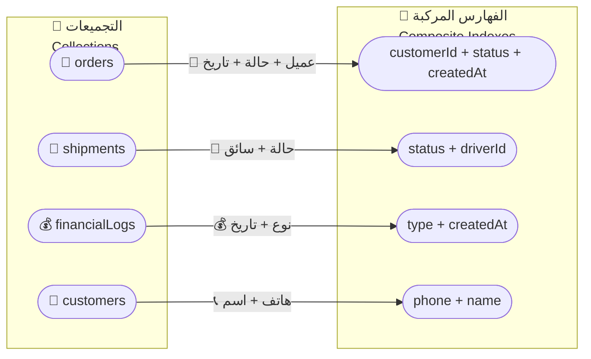
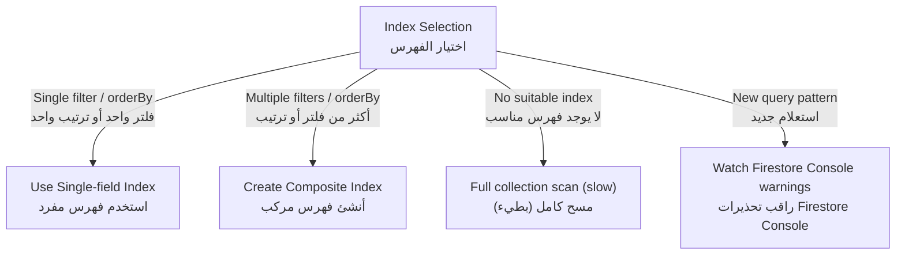

# 🧭 الفهارس والاستعلامات | Indexes & Queries

> **📂 المشروع | Project:** CA Admin • **👤 المالك | Owner:** Abdullah Alshaif • **🆚 الإصدار | Version:** v0.1 • **🗓️ آخر تحديث | Last Updated:** 2025-09-08

**🇸🇦 نظرة عامة:** توضح هذه الوثيقة كيف تدعم الفهارس والاستعلامات أداء النظام، وترتبط بنموذج البيانات وحالات الاستخدام، وتساهم في تحسين تجربة المستخدم وتقليل التكاليف.
**🇬🇧 Overview:** This document links indexes and queries to the data model and use cases, showing how they protect performance, user experience, and cost.

---

## 🚀 مقدمة | Introduction

### 🎯 الهدف | Purpose

- 🇸🇦 تُعد الفهارس والاستعلامات في Firestore حجر الأساس لسرعة المنصة، إذ تمنع عمليات المسح الكاملة المكلفة وتضمن استجابة شبه فورية للمستخدم.
- 🇬🇧 Firestore indexes and queries underpin platform speed by replacing full collection scans with optimized lookups, keeping response times low.

### ⚙️ ملاحظات هندسية | Engineering Notes

- 🇸🇦 ينشئ Firestore فهارس أحادية الحقل لكل خاصية تلقائيًا، لكن الاستعلامات متعددة الشروط أو الترتيب تحتاج فهرسًا مركبًا يُعرّف يدويًا.
- 🇬🇧 Firestore auto-creates single-field indexes, but any query combining multiple `where` clauses or `orderBy` requires a manually defined composite index.

---

## 🔄 تدفق الاستعلام | Visual Query Flow

> **🇸🇦 ملخص:** يوضح المخطط كيف يتحرك الاستعلام من واجهة المستخدم إلى قاعدة البيانات مرورًا بأنواع الفهارس المختلفة.
> **🇬🇧 Summary:** The flow illustrates how a query travels from the user to the database through each index type.



---

## 🗂️ ربط الفهارس بنموذج البيانات | Indexes & Data Model Map

> **🇸🇦 ملخص:** يربط المخطط التجميعات الرئيسية بالفهارس الضرورية لتمكين استعلامات العمل الحرجة.  
> **🇬🇧 Summary:** The diagram maps core collections to the indexes that keep critical business queries fast.



---

## 🧭 اختيار الفهرس المناسب | Index Selection Guide (Flowchart Fallback)



---

## 🧳 أنواع الفهارس | Index Types

- 🪪 **فهرس حقول مفردة | Single-field Index**
  - 🇸🇦 يُنشأ تلقائيًا لكل حقل ويدعم استعلامات البحث المباشرة مثل إيجاد عميل برقم هاتفه.
  - 🇬🇧 Auto-created for every field and perfect for simple lookups (e.g., find a customer by phone).
- 🧩 **فهرس مركب | Composite Index**
  - 🇸🇦 يُبنى يدويًا لدعم الاستعلامات متعددة الشروط مثل جلب الطلبات بحالة وتاريخ محددين.
  - 🇬🇧 Manually defined to combine filters/orderings (e.g., fetch orders by status within a date range).
- ⚠️ **بدون فهرس | No Index (Collection Scan)**
  - 🇸🇦 يؤدي إلى قراءة كل الوثائق ويُعتبر مكلفًا وبطيئًا ولا يُنصح به إلا للتحقق المؤقت.
  - 🇬🇧 Forces a full scan, which is slow and expensive, and should be avoided except for temporary troubleshooting.

---

## 📊 مقارنة أنواع الفهارس | Index Type Comparison

| النوع Type                        | الاستخدام Usage                                                          | الفوائد Benefits                                                                        | القيود Constraints                                                                          |
| --------------------------------- | ------------------------------------------------------------------------ | --------------------------------------------------------------------------------------- | ------------------------------------------------------------------------------------------- |
| 🪪 فهرس مفرد<br>Single-field Index | 🇸🇦 بحث بحقل واحد (مثل الهاتف).<br>🇬🇧 Single filter or ordering.          | 🇸🇦 إنشاء تلقائي وسريع التنفيذ.<br>🇬🇧 Zero maintenance, low latency.                     | 🇸🇦 لا يدعم دمج شروط متعددة.<br>🇬🇧 Fails when multiple filters/orderBy coexist.              |
| 🧩 فهرس مركب<br>Composite Index   | 🇸🇦 أكثر من شرط where أو orderBy مستمر.<br>🇬🇧 Multi-filter/order queries. | 🇸🇦 يدعم تقارير وتحليلات معقدة بسرعة.<br>🇬🇧 Unlocks advanced queries while staying fast. | 🇸🇦 يحتاج تعريفًا يدويًا ومتابعة للتغييرات.<br>🇬🇧 Must be created/updated as queries evolve. |
| ⚠️ بدون فهرس<br>No Index (Scan)   | 🇸🇦 حالات تجريبية أو طارئة فقط.<br>🇬🇧 Rare diagnostic scenarios.          | 🇸🇦 لا يحتاج إعدادًا.<br>🇬🇧 Works without configuration.                                 | 🇸🇦 مكلف وبطيء وغير مناسب للإنتاج.<br>🇬🇧 Slow, costly, unsafe for production.                |

---

## 🔍 الاستعلامات الشائعة | Common Queries

### 🛒 الطلبات | Orders

- 🇸🇦 جلب جميع الطلبات لعميل محدد (`customerId`).
- 🇸🇦 تصفية الطلبات حسب الحالة والنطاق الزمني (`status + createdAt`).
- 🇸🇦 استخراج الطلبات غير المسددة (`remaining > 0`).
- 🇬🇧 Fetch all orders for a customer ID.
- 🇬🇧 Filter orders by status within a date window.
- 🇬🇧 List unpaid orders where `remaining > 0`.

### 🚚 الشحنات | Shipments

- 🇸🇦 إظهار الشحنات حسب الحالة (in-transit، delivered).
- 🇸🇦 حصر الشحنات المسندة إلى سائق محدد (`driverId`).
- 🇬🇧 Show shipments grouped by status (in-transit, delivered).
- 🇬🇧 Retrieve shipments assigned to a specific driver.

### 💰 المالية | Finance

- 🇸🇦 استخراج كل الحركات المالية لطلب معين (`orderId`).
- 🇸🇦 تصفية المدفوعات/الإيداعات حسب البطاقة والتاريخ (`cardId + createdAt`).
- 🇸🇦 إنشاء تقارير أسبوعية أو شهرية.
- 🇬🇧 List all financial transactions for an order.
- 🇬🇧 Filter payments/deposits by card and date range.
- 🇬🇧 Generate weekly or monthly aggregates.

### 👥 العملاء | Customers

- 🇸🇦 البحث باستخدام رقم الهاتف أو الاسم.
- 🇸🇦 عرض العملاء النشطين ذوي الأرصدة المفتوحة.
- 🇬🇧 Search by phone number or name.
- 🇬🇧 List active customers who still have outstanding balances.

---

## 🧾 سجل الفهارس المركبة | Composite Index Catalog

| التجميعة Collection | الحقول Fields                   | السبب Purpose                                                                                         |
| ------------------- | ------------------------------- | ----------------------------------------------------------------------------------------------------- |
| orders              | customerId + status + createdAt | 🇸🇦 تقارير حالة الطلب لكل عميل.<br>🇬🇧 Customer status timeline reporting.                              |
| orders              | status + createdAt              | 🇸🇦 لوحات المتابعة حسب حالة الطلب والزمن.<br>🇬🇧 Status dashboards by time.                             |
| shipments           | status + driverId               | 🇸🇦 تتبع أداء السائقين وحالة الشحنات.<br>🇬🇧 Driver workload and shipment status tracking.              |
| financialLogs       | type + createdAt                | 🇸🇦 تحليلات المدفوعات والإيرادات حسب النوع والتاريخ.<br>🇬🇧 Payment and revenue analytics by type/date. |
| bankPayments        | cardId + createdAt              | 🇸🇦 مطالبة المدفوعات لكل بطاقة خلال فترة محددة.<br>🇬🇧 Retrieve card payments for a date range.         |
| bankDeposits        | cardId + createdAt              | 🇸🇦 مطابقة الإيداعات مع البطاقات والتواريخ.<br>🇬🇧 Match deposits with cards and periods.               |
| customers           | phone + name                    | 🇸🇦 تسهيل البحث المزدوج بالهاتف والاسم.<br>🇬🇧 Dual search by phone and name.                           |

---

## 💡 أمثلة استعلامات Firestore | Example Firestore Queries

> **📘 المكدس | Stack:** Dart + FlutterFire

```dart
// 🇸🇦 جلب الطلبات غير المسددة لعميل محدد
// 🇬🇧 Fetch unpaid orders for a specific customer
final unpaidOrders = await FirebaseFirestore.instance
    .collection('customers')
    .doc(customerId)
    .collection('orders')
    .where('remaining', isGreaterThan: 0)
    .get();

// 🇸🇦 استعلام عن الشحنات المُسندة لسائق وفي حالة transit
// 🇬🇧 Get shipments assigned to a driver and in-transit
final driverShipments = await FirebaseFirestore.instance
    .collection('shipments')
    .where('driverId', isEqualTo: driverId)
    .where('status', isEqualTo: 'in-transit')
    .get();

// 🇸🇦 استرجاع السجلات المالية لنوع معيّن داخل نطاق زمني
// 🇬🇧 Retrieve financial logs of type payment between two dates
final logs = await FirebaseFirestore.instance
    .collection('financialLogs')
    .where('type', isEqualTo: 'payment')
    .where('createdAt', isGreaterThanOrEqualTo: startDate)
    .where('createdAt', isLessThanOrEqualTo: endDate)
    .get();
```

---

## 🧠 أفضل الممارسات والنصائح المتقدمة | Best Practices & Advanced Tips

- 📌 🇸🇦 أنشئ الفهارس بمجرد تعريف الاستعلام في الكود لتفادي أخطاء الإنتاج.<br>🇬🇧 Create indexes alongside new queries to prevent production errors.
- 📄 🇸🇦 استخدم `limit` مع `startAfter` أو `startAt` بدلاً من `offset` لتحسين الذاكرة والزمن.<br>🇬🇧 Prefer `limit + startAfter/startAt` over `offset` for efficient pagination.
- 🎯 🇸🇦 اعتمد المؤشرات (cursors) بدل `!=` أو `NOT_IN` عندما يكون ذلك ممكنًا لتقليل تكلفة القراءة.<br>🇬🇧 Replace `!=`/`NOT_IN` with cursor-friendly filters when feasible to reduce read cost.
- 🧪 🇸🇦 راقب لوحة الأخطاء في Firebase Console لإنشاء الفهارس المقترحة بنقرة واحدة.<br>🇬🇧 Use Firebase Console error prompts to generate suggested indexes instantly.
- 📈 🇸🇦 تتبع استهلاك الفهارس والأداء عبر Firebase Analytics ولوحة التكلفة.<br>🇬🇧 Monitor index usage and cost via Firebase Analytics and billing dashboards.
- 🔄 🇸🇦 حدّث الفهارس مع كل تعديل على نموذج البيانات أو حالات الاستخدام المتصلة بها.<br>🇬🇧 Refresh indexes whenever the underlying data model or use cases change.
- 🧮 🇸🇦 اجمع الاستعلامات المتشابهة لتقليل عدد الفهارس واستفد من القيم المحسوبة مسبقًا عند الحاجة.<br>🇬🇧 Consolidate similar queries to limit index count and leverage precomputed values when needed.
- 🛡️ 🇸🇦 اختبر الاستعلامات والقهارس في بيئة التطوير قبل شحنها للإنتاج لضمان الامتثال للصلاحيات (Security Rules).<br>🇬🇧 Test queries and indexes in staging to validate performance and security rule alignment.

---

## ❓ أسئلة شائعة وسيناريو تطبيقي | FAQ & Example Scenario

**س: متى أحتاج فهرسًا مركبًا؟ | Q: When do I need a composite index?**

- 🇸🇦 عند استخدام أكثر من شرط `where` أو عند الجمع بين `where` و`orderBy` في الاستعلام نفسه.
- 🇬🇧 Whenever a query stacks multiple `where` clauses or mixes `where` with `orderBy` on different fields.

**س: كيف أعرف الفهارس المطلوبة؟ | Q: How do I discover required indexes?**

- 🇸🇦 يعرض Firebase Console رسالة خطأ تتضمن رابطًا لإنشاء الفهرس المطلوب عند تشغيل استعلام غير مدعوم.
- 🇬🇧 Firebase Console throws an error with a direct link to build the missing index whenever a query lacks support.

### 📌 سيناريو عملي | Example Scenario

- 🇸🇦 طلب موظف المالية جميع المدفوعات لبطاقة محددة خلال أغسطس (`cardId + createdAt`). بعد إنشاء الفهرس المركب استجاب الاستعلام فورًا.
- 🇬🇧 The finance officer requests August payments for a given card (`cardId + createdAt`). Once the composite index is added, the query returns instantly.

---

## 📝 ملاحظات مرتبطة | Notes

- 🔗 🇸🇦 يجب مواءمة الفهارس مع تحديثات [نموذج البيانات](../05-data-model/05-data-model.md).<br>🇬🇧 Keep indexes aligned with the latest [Data Model](../05-data-model/05-data-model.md).
- 🔗 🇸🇦 تأكد من تطابق الاستعلامات هنا مع [حالات الاستخدام](../04-use-cases/04-use-cases.md).<br>🇬🇧 Ensure queries stay consistent with documented [Use Cases](../04-use-cases/04-use-cases.md).
- 💰 🇸🇦 مراقبة أداء الفهارس والتكلفة عبر Firebase Console لتجنب مفاجآت الفواتير.<br>🇬🇧 Watch index performance and cost inside Firebase Console to avoid billing surprises.

---
