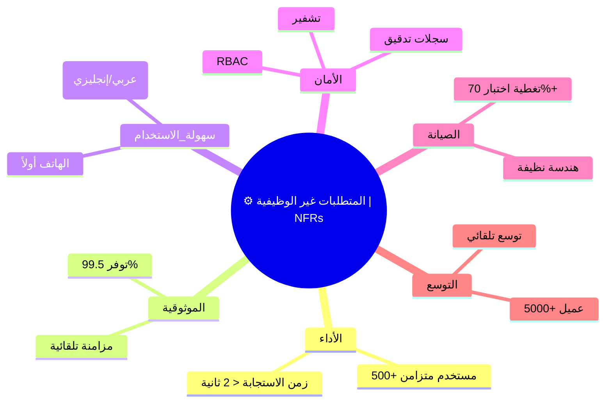

# ⚙️ المتطلبات غير الوظيفية والجودة | Non-Functional Requirements & Quality

---

> **المشروع:** CA Admin
> **Project:** CA Admin
> **الإصدار:** v0.1 — المالك: عبدالله الشائف
> **Version:** v0.1 — Owner: Abdullah Alshaif
> **آخر تحديث:** 2025-09-08
> **Last Updated:** 2025-09-08

**شرح مختصر:**
يوضح هذا القسم كيف تضمن المتطلبات غير الوظيفية جودة النظام واستقراره وسهولة استخدامه لجميع الأطراف (المستخدم، المطور، الإدارة).
**Summary:**
This section explains how NFRs ensure system quality, stability, and usability for all stakeholders (user, developer, management).

---

## المقدمة | Introduction


المتطلبات غير الوظيفية تحدد سمات الجودة لنظام CA Admin مثل الأداء، الموثوقية، سهولة الاستخدام، الأمان، وقابلية الصيانة. وهي تضمن أن يكون النظام عمليًا ومستقرًا وسهل الاستخدام لجميع الأطراف.
Non-functional requirements (NFRs) define the quality attributes of the CA Admin system, including performance, reliability, usability, security, and maintainability. These ensure the system is practical, stable, and user-friendly for all stakeholders.

---

## 👁️ نظرة جودة بصرية | Visual Quality Overview

**شرح مختصر:**
يوضح المخطط كيف ترتبط سمات الجودة الرئيسية بالمتطلبات غير الوظيفية، ليسهل فهم العلاقة بين كل سمة وتأثيرها على النظام.
**Summary:**
The diagram shows how main quality attributes relate to NFRs, making it easier to understand each attribute's impact on the system.

```mermaid
flowchart TD
  NFRs((⚙️ المتطلبات غير الوظيفية | NFRs))
  NFRs --> الأداء((⚡ الأداء | Performance))
  NFRs --> الموثوقية((🔒 الموثوقية | Reliability))
  NFRs --> سهولة_الاستخدام((🖐️ سهولة الاستخدام | Usability))
  NFRs --> الأمان((🛡️ الأمان | Security))
  NFRs --> الصيانة((🛠️ الصيانة | Maintainability))
  NFRs --> التوسع((📈 التوسع | Scalability))
  NFRs --> التوافقية((🔗 التوافقية | Compatibility))
  NFRs --> النقل((🚚 قابلية النقل | Portability))
```

---

## 🧠 خريطة ذهنية للمتطلبات غير الوظيفية | NFR Mindmap

**شرح مختصر:**
خريطة ذهنية تلخص أهم سمات الجودة المطلوبة للنظام، مع أمثلة عملية لكل سمة.
**Summary:**
Mindmap summarizing the main quality attributes required for the system, with practical examples for each attribute.



---

## 🔄 الفرق بين المتطلبات غير الوظيفية والمتطلبات الوظيفية | NFRs vs Functional Requirements

**شرح مختصر:**
جدول يوضح الفرق بين المتطلبات الوظيفية (ماذا يفعل النظام) وغير الوظيفية (كيف يجب أن يكون النظام)، ليسهل على القارئ التمييز بينهما.
**Summary:**
Table showing the difference between functional (what the system does) and non-functional requirements (how the system should be), making it easy for the reader to distinguish between them.

| 📝 الجانب | ✅ المتطلبات الوظيفية                   | ⚙️ المتطلبات غير الوظيفية                         |
| --------- | --------------------------------------- | ------------------------------------------------- |
| التعريف   | ماذا يفعل النظام (ميزات، حالات استخدام) | كيف يجب أن يكون النظام (جودة، أداء، أمان)         |
| مثال      | إنشاء طلب، توليد تقرير                  | استجابة < 2 ثانية، توفر 99.5%، واجهة ثنائية اللغة |
| التحقق    | اختبارات قبول المستخدم، عروض الميزات    | اختبارات الأداء، المراقبة، ملاحظات المستخدمين     |

---

## ♻️ دورة مراجعة الجودة | Quality Review Cycle

**شرح مختصر:**
مخطط يوضح دورة مراجعة الجودة الدورية للنظام، لضمان التحسين المستمر.
**Summary:**
Diagram showing the periodic quality review cycle for the system, ensuring continuous improvement.

```mermaid
flowchart LR
  البداية([🚦 بداية | Start]) --> تعريف([📝 تعريف المتطلبات غير الوظيفية | Define NFRs])
  تعريف --> تنفيذ([⚙️ تنفيذ | Implement])
  تنفيذ --> اختبار([🧪 اختبار ومراقبة | Test & Monitor])
  اختبار --> مراجعة([🔄 مراجعة ربع سنوية | Quarterly Review])
  مراجعة --> تحديث([📝 تحديث المتطلبات | Update NFRs])
  تحديث --> تنفيذ
```

---

## ⚡ الأداء | Performance

- **EN:** System must handle at least **500 concurrent users** with < 2s response time.
- **AR:** يجب أن يدعم النظام **500 مستخدم متزامن** بزمن استجابة أقل من ثانيتين.
- **EN:** Firestore queries should return results within **500ms** for indexed fields.
- **AR:** يجب أن تعود استعلامات Firestore بالنتائج خلال **500 مللي ثانية** للحقول المفهرسة.

---

## 🔒 الموثوقية والتوافر | Reliability & Availability

- **EN:** System uptime target: **99.5%**.
- **AR:** الهدف أن يكون النظام متاحًا بنسبة **99.5%**.
- **EN:** Automatic sync and conflict resolution ensures no data loss during outages.
- **AR:** المزامنة التلقائية وحل التعارض يضمنان عدم فقدان البيانات أثناء الانقطاعات.

---

## 🖐️ سهولة الاستخدام | Usability

- **EN:** Support **Arabic & English** with automatic **RTL/LTR** switching.
- **AR:** دعم **العربية والإنجليزية** مع التبديل التلقائي بين **RTL/LTR**.
- **EN:** Mobile-first design optimized for Android/iOS mid-range devices.
- **AR:** تصميم يعتمد **الهاتف أولاً** ومناسب لأجهزة Android/iOS المتوسطة.
- **EN:** Max 3 steps to complete main workflows (place order, track shipment, record payment).
- **AR:** لا تزيد الخطوات الرئيسية (إنشاء طلب، تتبع شحنة، تسجيل دفعة) عن 3 خطوات.

---

## 🛡️ الأمان | Security

- **EN:** Role-Based Access Control (RBAC) with Firebase Custom Claims.
- **AR:** تحكم في الصلاحيات عبر **RBAC** باستخدام Firebase Custom Claims.
- **EN:** All data encrypted in transit (TLS 1.2+) and at rest.
- **AR:** تشفير جميع البيانات أثناء النقل (TLS 1.2+) وأثناء التخزين.
- **EN:** Audit logs maintained for all financial and role-related actions.
- **AR:** الاحتفاظ بسجلات تدقيق لجميع العمليات المالية والمتعلقة بالصلاحيات.

---

## 🛠️ قابلية الصيانة | Maintainability

- **EN:** Codebase follows **Clean Architecture** with layered separation.
- **AR:** يعتمد الكود على **Clean Architecture** مع فصل الطبقات.
- **EN:** Unit and integration tests must cover **≥ 70%** of business logic.
- **AR:** يجب أن تغطي اختبارات الوحدة والتكامل **70% على الأقل** من منطق الأعمال.
- **EN:** All APIs and modules documented in `/docs`.
- **AR:** توثيق جميع الـ APIs والوحدات في مجلد `/docs`.

---

## 📈 القابلية للتوسع | Scalability

- **EN:** System should support scaling to **5000+ active customers** without redesign.
- **AR:** يجب أن يدعم النظام **5000+ عميل نشط** دون الحاجة لإعادة تصميم.
- **EN:** Use Firebase auto-scaling for Firestore and Functions.
- **AR:** استخدام خاصية **التوسع التلقائي** في Firestore و Functions.

---

## 🏅 سمات الجودة (ISO/IEC 25010) | ISO/IEC 25010 Quality Attributes

| Attribute (EN)         | الصفة (AR)        | Target / الهدف                         |
| ---------------------- | ----------------- | -------------------------------------- |
| Functional Suitability | الملاءمة الوظيفية | Cover 100% of documented use cases     |
| Performance Efficiency | كفاءة الأداء      | < 2s response time                     |
| Compatibility          | التوافقية         | Android/iOS, future Web/Desktop        |
| Usability              | سهولة الاستخدام   | Bilingual UI, intuitive design         |
| Reliability            | الموثوقية         | 99.5% uptime                           |
| Security               | الأمان            | RBAC + encryption                      |
| Maintainability        | قابلية الصيانة    | Clean Architecture + 70% test coverage |
| Portability            | قابلية النقل      | Flutter cross-platform                 |

---

## 💡 أفضل الممارسات وأسئلة شائعة | Best Practices & FAQ

- Document NFRs early and review them with all stakeholders.
- Validate NFRs during [Test Plan](../11-test-plan/11-test-plan.md) execution.
- Monitor system metrics (performance, uptime, errors) continuously.
- Update NFRs if [Architecture](../06-architecture/06-architecture.md) changes.
- Review NFRs and quality targets quarterly.

### ❓ ما الفرق بين المتطلبات الوظيفية وغير الوظيفية؟

**A:**

- المتطلبات الوظيفية تصف ماذا يفعل النظام (features, use cases).
- المتطلبات غير الوظيفية تصف كيف يجب أن يعمل النظام (جودة، أداء، أمان).

### ❓ كيف أتحقق من تحقيق NFRs؟

**A:**

- عبر اختبارات الأداء، مراجعة السجلات، واستبيانات المستخدمين.

---

## 📝 سيناريو عملي | Example Scenario

**EN:**

> During UAT, the team tests the app with 500 simulated users. All main workflows complete in <2s, and the system remains stable. The NFRs for performance and reliability are validated.

**AR:**

> أثناء اختبار القبول، يتم اختبار التطبيق مع 500 مستخدم افتراضي. جميع العمليات الأساسية تكتمل في أقل من ثانيتين ويبقى النظام مستقرًا، ما يؤكد تحقق متطلبات الأداء والموثوقية.

---

## 🚀 نصائح جودة متقدمة | Advanced Quality Tips

- استخدم أدوات مراقبة الأداء (Performance Monitoring) من Firebase أو Google Cloud.
- أنشئ تقارير جودة دورية وشاركها مع فريق العمل.
- اربط كل NFR بمؤشر أداء (KPI) واضح.
- راجع نتائج اختبارات الأداء بعد كل تحديث رئيسي.

---
